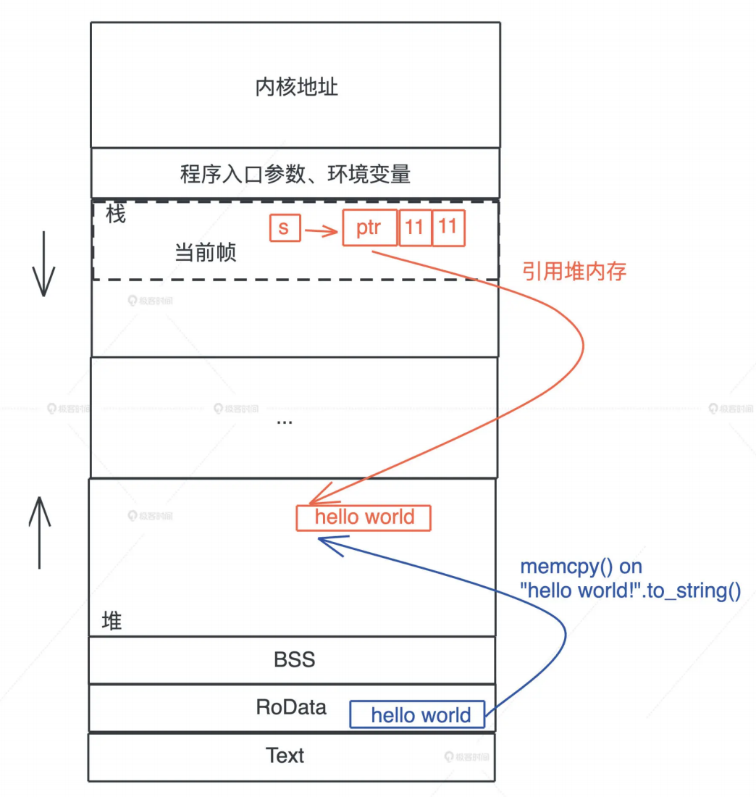
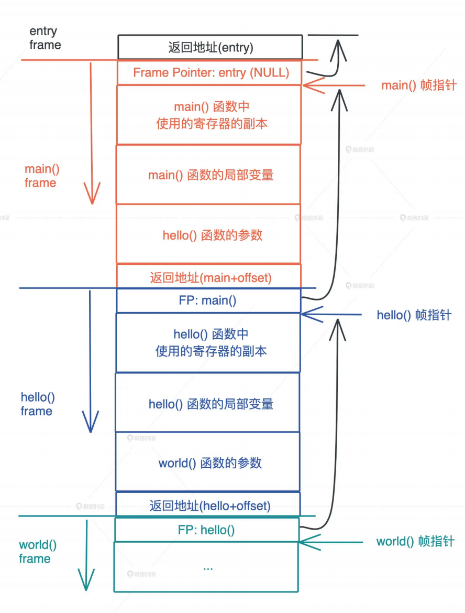
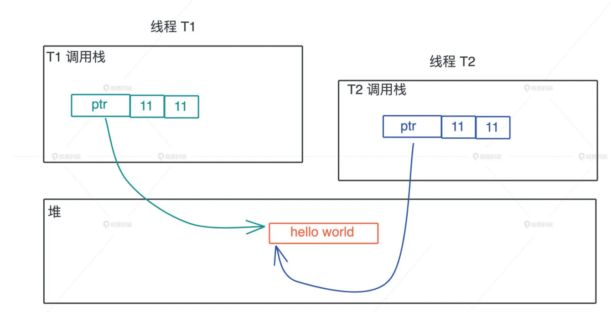

# 内存: 值放在堆上还是放在栈上?

代码中最基本的概念就是变量和值, 而存放它们的地方是内存, 所以我们从内存开始

## 内存

我们的程序无时无刻都在跟内存打交道, 在下面的代码中, 我们把`Hello World`字符串赋值给s的简单语句中, 就跟只读数据段(RODATA), 堆, 栈分别有深度交互

```rust
let s = "Hello World".to_string();
```

首先`Hello World.to_string()`时, 在堆上, 一块新的内存被分配出来, 并把这个字符串字面量逐个字节的拷贝进去

当我们把堆上的数据赋值给s的时候, s作为分配在栈上的一个变量, 它需要知道堆上的内存地址, 另外由于堆上的数据大小不确定且可以增长, 我们还需要知道它的长度以及它现在有多大

最终我们为了表述字符串, 我们使用了三个word: 第一个表示指针, 第二个表示字符串的当前长度, 第三个表示这片内存的容量, 在64位操作系统中三个word是24个字节



刚才提到字符串的内存在堆上, 而指向字符串的指针等信息在栈上, 那数据什么时候可以放在栈上, 什么时候需要放在堆上呢?

- 基本类型放在栈上, 对象存储在堆上
- 少量数据存储在栈上, 大量数据存储在堆上

这些虽然对, 但是没有抓到实质, 我们先来看看堆和栈的设计原理, 看看它们是怎么工作的

## 栈

栈是程序中运行的基础, 每当一个函数被调用的时候, 一块连续的内存就会在栈顶被分配出来, 这块内存被称为帧(frame)

我们知道, 栈是自顶向下增长的, 一个程序的调用栈最底部, 除去入口帧(entry frame), 就是main函数对应的帧, 而随着main函数一层层调用, 栈会一层层拓展, 调用结束, 栈又会一层层回溯, 把内存释放回去

在调用过程中, 一个新的帧会分配给足够的空间寄存器的上下文, 在函数里使用到的通用寄存器会在栈保存一个副本, 当这个函数调用结束, 通过副本, 可以恢复出原本的寄存器的上下文, 就好像什么也没有经历一样, 此外函数中使用到的局部变量, 也都会在帧分配的时候被预留出来



那么一个函数运行时, 怎么确定需要多大的帧呢?

这要归功于编译器, 在编译并优化代码的时候, 一个函数就是一个最小的编译单元

在这个函数里, 编译器得知道要用到哪些寄存器, 栈上要放哪些局部变量, 而这些都要在编译时确定, 所以编译器就需要明确每个局部变量的大小, 以便于预留空间

这下我们就明白了: 在编译时, 一切无法确定大小或者大小可以改变的数据, 都无法安全的放在栈上, 最好放在堆上, 比如一个函数, 参数是字符串

```rust
fn say_name(name: String) {}

// 调用
say_name("Lindsey".to_string());
say_name("Rosie".to_string());
```

字符串的数据结构, 在编译时大小不确定, 运行时执行到具体的代码才知道大小, 比如上面的代码中, 两个字符串的长度不一样, `say_name`函数只有在运行时才知道参数的具体长度

所以我们无法把字符串本身放在栈上, 只能先将其放在堆上, 然后在栈上分配对应的指针, 引用堆上的内存

## 放在栈上问题

从刚才的图中我们也可以直观的看到, 栈上的内存分配是非常高效的, 只需要改动栈指针就可以预留出相应的空间, 把栈指针改动回来, 预留的空间又会比释放掉, 预留和释放只是动动寄存器, 不涉及额外的计算, 不涉及系统调用, 因而效率很高

所以理论上来说, 只要可能, 我们应该把变量都分配在栈上, 这样可以达到更好的运行效率

那么为什么实际工作中, 我们又要避免把大量的数据分配在栈上呢?

这主要是考虑到调用栈的大小, 避免栈溢出, 一旦当前程序的调用栈超出了系统允许的最大栈空间 ,无法创建新的栈帧, 来运行下一个要执行的函数, 就会发生栈溢出, 这时程序会被系统终止, 产生崩溃信息

过大的栈内存分配是导致栈溢出的原因之一, 更广为人知的原因是递归函数没有妥善终止, 一个递归函数不断调用自己, 每次调用都会形成一个新的帧, 如果递归函数无法终止, 最终就会导致栈溢出

## 堆

栈虽然使用起来很高效, 但是它的局限性很明显, 当我们需要动态大小的内存时, 只能使用堆, 比如可变长度的数组, 列表, 哈希表, 字典, 它们都分配在堆上

堆上分配内存时, 一般都会预留一些空间, 这是最佳实践

比如你创建一个列表, 并往里面添加两个值

```rust
let mut arr = Vec::new();
arr.push(1);
arr.push(2);
```

这个列表实际预留的大小是4, 并不等于其长度2, 这是因为堆上内存的分配会使用libc提供的malloc函数, 其内部会请求操作系统调用, 来分配内存, 系统调用的代价是昂贵的, 所以我们要避免频繁的malloc

对上面代码来说, 如果我们需要多少就分配多少, 那列表每次新增值, 都要重新分配一大块内存, 先拷贝已有的数据, 再把新的值添加进去, 最后释放旧的值, 这样效率太低, 所以在堆内存分配的手, 预留的空间大小4会大于实际大小2

除了动态大小的内存需要分配在堆上以外, 动态生命周期的内存也需要分配到堆上

上文中我们讲到, 栈上的内存在函数调用结束, 所使用的帧被回收, 相关变量对应的内存也都被回收待用, 所以栈上内存的生命周期是不受开发者控制的, 并且局限在当前调用栈

而堆上分配出来的每一块内存需要显式的释放, 这就使堆上内存有更加灵活的生命周期, 可以在不同的调用栈之间共享数据



## 放在堆上的问题

然而堆内存的这种灵活性也给内存管理带来很多挑战

如果手动管理堆内存的话, 堆上分配的内存后忘记释放, 就会造成内存泄漏, 一旦有内存泄漏, 程序运行的越久, 就越吃内存, 最终会因为占满内存而被操作系统终止运行

如果堆上内存被多个线程的调用栈引用, 该内存的改动要特别小心, 需要加锁以独占访问, 来避免潜在的问题, 比如说, 一个线程在遍历列表, 而另一个线程在释放列表中的某一项, 就可能访问野指针, 导致堆越界, 而堆越界是第一大内存安全问题

如果堆上内存被释放, 但栈上指向堆上内存的相应指针没有被清空, 就有可能发生使用已经释放内存的情况, 程序轻则崩溃, 重则隐含安全隐患, 这是第二大内存安全问题

## GC和ARC如何解决

为了方便堆内存手动管理造成的这些问题, 以Java为首的一系列编程语言, 采用了追踪式垃圾回收(Tracing GC)的方法, 来自动管理堆内存, 这种方式通过定期标记(mark)找出不再引用的对象, 然后将其清理(sweep)掉, 来自动管理内存, 减轻开发者的负担

而ObjC和Swift则走另外一条路: 自动引用计数(Automatic Reference Counting), 在编译时, 它为每个函数插入retain/release语句来自动维护堆上对象的引用计数, 当引用计数为零的时候, release语句就释放对象

我们来对比一下这两种方案:

从效率上来说, GC在内存分配和释放上无需额外的操作, 而ARC添加了大量的额外代码处理引用计数, 所以GC效率更高, 有吞吐量更大

但是GC释放内存的时机是不确定的, 释放时会引发的STW(Stop The Wrold), 也会导致代码执行的延迟(latency)不确定, 所以一般携带GC的编程语言, 不适合左嵌入式系统或者实时系统, 当前Erlang VM是个例外, 它把GC的粒度下放到每个process, 最大程度上解决了STW的问题

我们使用Android手机偶尔感觉卡顿, 而IOS手机却运行丝滑, 大多数就是这个原因, 而且做后端服务时, API或者服务响应时间的p99也会受到GC SWT的影响而表现不佳

说句题外话, 上面说的GC性能和我们常说的性能, 涵义不太一样, 常说的性能是吞吐量和延迟的总体感知, 和实际性能是有差异的, GC和ARC就是典型的例子, GC分配和释放内存的效率和吞吐量要比ARC高, 但因为偶尔的高延迟, 导致被感知的性能比较差, 所以会给人一种GC不如ARC性能好的感觉

## 小结

我们今天分析了栈和堆的特点:

对于存入栈上的值, 它的大小在编译器就需要确定, 栈上存储的变量生命周期在当前调用栈的作用域内, 无法夸作用域调用栈引用

堆可以存储大小位置或者动态伸缩的数据类型, 堆上存储的变量, 其生命周期从分配后开始, 一直到释放时才结束, 因此堆上的变量允许在多个调用栈之间引用, 但也导致了变量的管理变得非常复杂, 手动管理会引发很多安全问题, 而自动管理, 无论是GC还是ARC, 都有性能损耗和其他问题

一句话对比总结就是: 栈上存放的数据是静态的, 静态大小, 静态生命周期; 堆上存放的数据是动态的, 动态大小, 动态生命周期

## 思考题

1. 如果有一个数据结构需要再多个线程中访问, 可以帮他放在栈上吗? 为什么?

   ```
   不可以, 每个线程都拥有自己的栈, 栈上数据无法跨线程访问
   ```

1. 可以使用指针引用栈上的某个变量吗? 如果可以, 在什么情况下可以这么做?

   ```
   可以引用栈上的变量, 只要你的引用比指针活得久就可以了
   ```

   