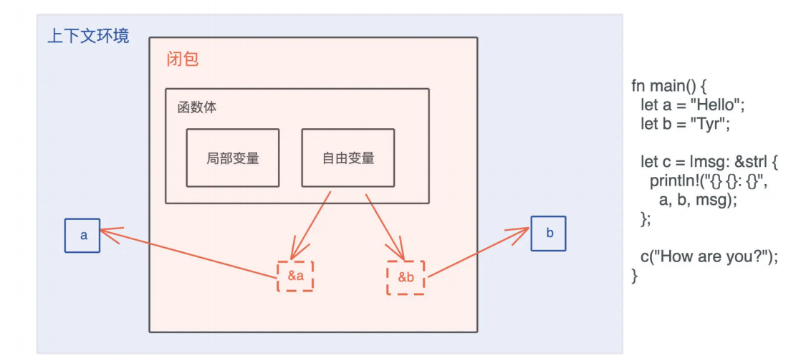
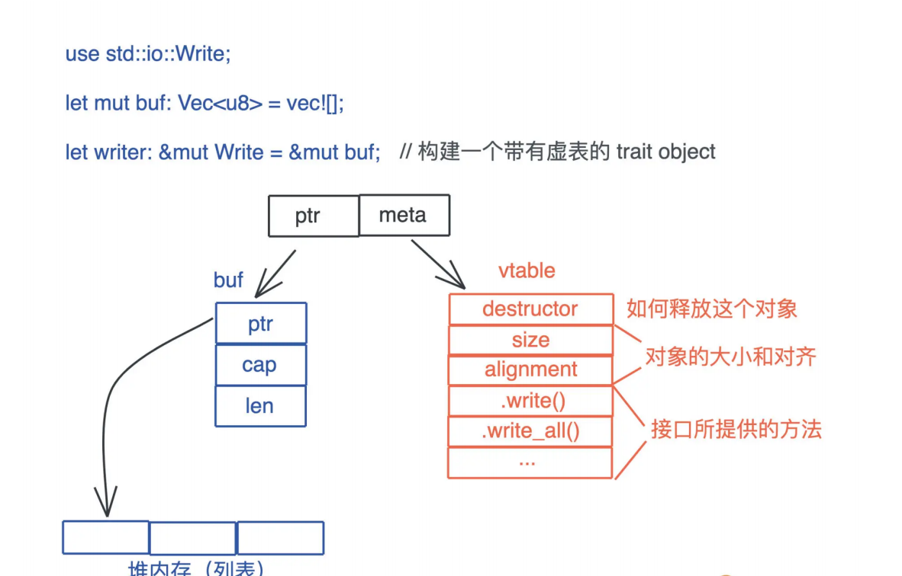
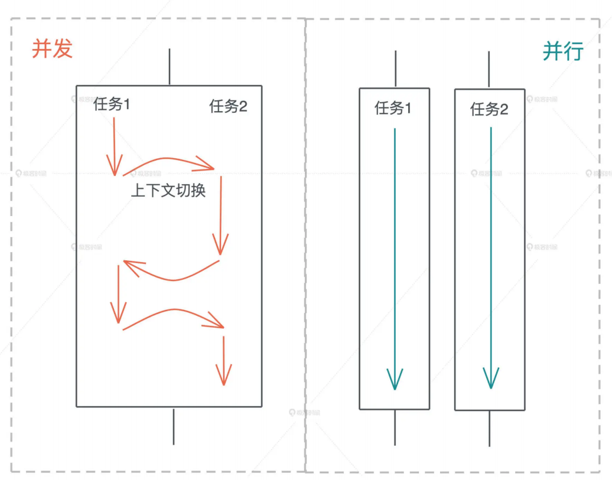
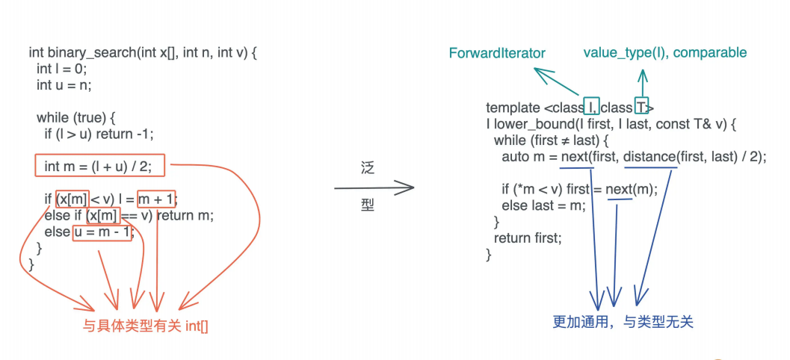

# 编程开发中需要掌握的基本概念

上一节我们了解了内存的基本运作方式: 栈上存放的数据是静态的, 静态大小, 静态生命周期; 堆上存放的数据是动态的, 动态大小, 动态生命周期

我们这一节来了解一下编程开发中经常接触到的其他基础概念, 我们分为四大类: 数据(值和类型, 指针和引用), 代码(函数, 方法, 闭包, 接口和虚表), 运行方式(并发并行, 同步异步和Promise/async/await), 以及编程范式(泛型编程)

## 数据

数据是程序操作的对象, 不进行数据处理的程序是没有意义的, 我们先来重温和数据有关的概念, 包括值和类型, 指针和引用

### 值和类型

严谨的说, 类型是对值的区分, 它包含了值在内存中的长度, 对齐以及值可以进行的操作等信息, 一个值是符合一个特定类型的数据的某个实体, 比如说`64_u8`, 它是`u8`类型, 存储在内存中的表现形式是`0x40`, 或者是`0b0100 0000`

这里你要注意, 值是无法脱离具体类型讨论的, 同样是内存中的一个字节`0x40`, 如果其类型是`ASCII char`, 那么其含义就不是`64`, 而是`@`符号

不管是强类型的语言还是弱类型的语言, 语言内部都有其类型的具体表述, 一般而言, 编程语言的类型可以分为原生类型和组合类型两大类

原生类型(primitive type)是编程语言提供的最基础的数据类型, 比如字符, 整数, 浮点数, 布尔值, 数组, 元组, 指针, 引用, 函数, 闭包等, 所有的原生类型大小都是固定的, 因此他们可以被分配到栈上

组合类型(composite type)或者说复合类型, 是指由一组原生类型和其他类型组合而成的类型, 组合类型也可以细分为两类:

- 结构体(structure type): 多个类型组合在一起共同表达一个值的复杂数据类型
- 标签联合(tagged union): 也叫不相交并集(disjoint union), 可以存储一组不同但固定类型中的某个类型的对象, 具体是哪个类型由其标签决定

另外不少语言不支持标签联合, 支取其标签部分, 提供了枚举类型(enumerate), 枚举类型是标签联合的字类型, 但功能较弱, 无法表达复杂的结构


### 指针和引用

在内存中, 一个值被存储到内存中的某个位置, 这个位置对应一个内存地址, 而指针是一个持有内存地址的值, 而且通过解引用(deference)来访问指向的内存地址, 理论上可以解引用到任意数据类型

引用(reference)和指针类似, 不同的是, 引用的解引用访问是受限的, 它只能解引用到它引用的数据类型, 不能用作其他, 比如指向`42_u8`这个值的一个引用, 它解引用的时候只能使用`u8`数据类型

所以指针的使用更少, 但也会带来更多的危害, 如果没有用正确的类型解引用一个指针, 那么会引起各种各样的内存问题, 造成系统崩溃或者潜在的安全漏洞

刚刚讲过, 指针和引用是原生类型, 它们可以分配在栈上

根据指向数据的不同, 某些引用除了需要一个指针指向内存地址之外, 还需要内存地址的长度和其他信息, 就如同上一节讲到的`Hello World`字符串的指针, 还包含字符串长度和字符串的容量, 一个使用了3个word, 在64位操作系统下占用24个字节, 这样比正常指针携带更多信息的指针, 我们称之为胖指针(fat pointer), 很多数据结构的引用, 内部都是由胖指针实现的

## 代码

数据是程序操作的对象, 而代码是程序运行的主体, 也是我们开发者把物理世界中的需求转换成数字世界中逻辑的载体, 我们会讨论函数和闭包, 接口和虚表

### 函数和方法与闭包

函数是编程语言的基本要素, 它是对完成某个功能的一组相关语句和表达式的封装, 函数也是对代码行为的抽象, 在现代编程语言中, 函数往往是一等公民, 这意味着函数可以作为参数传递, 或者作为返回值返回, 也可以作为复合类型的一个组成部分

在面向对象的编程语言中, 在类或者对象中定义的函数, 被称为方法(method), 方法往往和对象的指针发生关系, 比如Python对象的self引用, 或者Java对象的this引用

而闭包是将函数, 或者说代码和其环境一起存储的一种数据结构, 闭包引用的上下文中的自由变量, 会被捕获到闭包的结构中, 成为闭包类型的一部分

一般来说, 如果一门编程语言, 其函数是一等公民, 那么它必然会支持闭包(closure), 因为函数作为返回值往往需要一个闭包



### 接口和虚表

接口是一个软件系统开发的核心部分, 它反应了系统的设计者对系统的抽象理解, 作为一个抽象层, 接口将使用方和实现方隔离开来, 使两者不直接存在依赖关系, 大大提高了复用性和拓展性

很多编程语言都有接口的概念, 允许开发者面向接口设计, 比如Java的interface和Rust的trait等

比如说在HTTP中, Request/Response的服务处理模型其实就是一个典型的接口, 我们只需要按照服务接口定义出不同输入下, 从Request到Response具体该如何映射, 通过这个接口, 系统就可以在合适的场景下, 把符合要求的Request分派给我们的服务

面向接口的设计是软件开发中的重要能力, 而Rust尤其重视接口的能力, 在后面想到Trait的章节, 我们会详细的介绍

当我们在运行期使用接口来引用具体的类型的时候, 代码就具备了很多运行时多态的能力, 但是, 在运行时, 一旦使用了关于接口的引用, 变量原本的类型被出去, 我们无法单纯从一个指针分析出这个引用具备什么样的能力

因此, 在生成这个引用的时候, 我们需要构建胖指针, 除了指向数据本身之外, 还需要指向一张涵盖了这个接口所支持方法的列表, 这个列表就是我们熟知的虚表(Virtual table)



由于虚表记录了数据能够执行的接口, 所以在运行期, 我们想对一个接口有不同的实现, 可以根据上下文动态分派

比如我们想为编辑器的Formatter接口实现不同语言的格式化工具, 我们可以在编辑器加载时, 把所有支持的语言和其格式化更具放入一个哈希表中, 哈希表的key作为语言类型, value为每种格式化更具Formatter接口的引用, 这样, 当用户在编辑器打开某个文件的时候, 我们可以根据文件类型, 找到对应Formatter的引用, 来进行格式化操作

## 运行方式

程序在加载后, 代码以何种方式运行, 往往决定着程序的执行效率, 所以我们接下来讨论的并发, 并行, 同步以及异步中的几个重要概念Promise/async/await

### 并发(concurreny)与并行(parallel)

并发和并行是软件开发中经常遇到的概念

并发是同时与多件事情打交道的能力, 比如系统可以在任务1做到一定程序后, 保存该任务的上下文, 挂起并切换到任务2, 然后过段时间在切换会任务1

并行是同时处理多件事情的手段, 也就是说, 任务1和任务2可以在同一个时间片下工作, 无需上下文切换



并发是一种能力, 而并行是一种手段, 打你个我们的系统拥有了并发的能力后, 代码如果跑在多核CPU上, 就可以并行运行, 所以我们我们平时都谈论高并发处理, 而不会说高并行处理

很多拥有高并发处理能力的编程语言, 会在用户程序中嵌入一个M:N调度器, 把M个并发任务, 合理的分配在N个CUP core上并行运行, 让程序的吞吐量达到最大

### 同步和异步

同步是指一个任务开始执行, 后续的操作会阻塞, 直到这个任务结束, 在软件中, 我们大部分的代码都是同步操作, 比如CPU, 只有流水线中的前一条指令执行完成, 才会执行下一条指令, 一个函数A先调用B和C, 也会执行B才会执行C

同步执行保证了代码的因果关系, 是程序正确性的保证

然而在遭遇I/O处理时, 高效的CPU指令和低效的I/O之间的巨大鸿沟, 成为软件性能的杀手, 下图对比了CPU, 内存, I/O设备, 和网络的延迟


我们可以看出和内存访问相比, I/O操作的访问速度低了两个数量级, 一旦遇到I/O操作, CPU就只能闲置来等待I/O设备运行完毕, 因此操作系统为程序提供了异步I/O, 让应用可以再当前I/O处理完毕之前, 将CPU时间用作其他任务的处理

所以, 异步是指一个任务开始执行后, 与它没有因果关系的其他任务可以正常运行, 不必等待前一个任务结束

在异步操作中, 异步处理完成后的结果, 一般用Promsie来保存, 它是一个对象, 用来描述未来的某个时刻才能获得的结果的值, 一般存在三个状态:

- 初始状态, Promise还未运行
- 等待(pending)状态, Promise已运行, 但还未结束
- 结束状态, Promise成功解析出一个值, 或者执行失败

一般而言, async定义了一个可以并发执行的任务, 而await则触发这个任务的并发执行

大多数语言中, async/await是一个语法糖, 它使用状态机将Promsie包裹起来, 让异步调用的使用感觉和同步调用非常相似, 也让代码更容易阅读

## 编程范式

为了在不断迭代时, 更好的维护代码, 我们还会引入各种各样的编程范式, 来提升代码的质量, 所以最后来谈谈泛型编程

### 数据结构的泛型

首先是数据结构的泛型, 它也往往被称为参数化类型或者参数多态, 比如下面这个数据结构:

```rust
struct Connection<S> {
    io: S,
    state: State,
}
```

它有一个参数S, 其内部的io的类型是S, S具体的类型只有在使用Connection的上下文中才得到绑定

你可以把参数化数据结构理解成一个产生类型的函数, 在调用时, 它接受若干个使用了具体类型的参数, 返回携带这些类型的类型, 比如我们为S提供TcpStream这个类型, 那么就产生Connection这个类型, 其中io的类型是TcpStream

这里你可能感到很疑惑, 如果S可以是任意类型, 那我们怎么知道S有什么行为? 如果我们要调用`io.send`发送数据, 编译器怎么知道S包含这个方法?

这个时候我们需要用接口对S进行约束, 我们经常看到, 支持泛型编程语言, 会提供强大的接口编程能力, 在后续我们讲解Rust中的trait的时候再细说

数据结构的泛型是一种高级抽象, 就像我们人类用数字抽象具体事物的数量, 有发明了代数来进一步抽象具体的数字一样, 它带来的好处是我们可以延迟绑定, 让数据结构的通用性更强, 使用场合更广阔; 也大大减少了代码的重复, 提高了可维护性

### 代码的泛型化

泛型编程的另一个层面是使用泛型结构后代码的泛型化, 当我们使用泛型编写代码时, 相关的代码也需要额外的冲选个

这里用我们虚席的二分查找有关的例子解释一下:



左边用C撰写的二分超找, 标记的基础操作隐含着和`int[]`有关, 所以如果对不同的数据类型做二分查找, 实现也要跟着改变, 右边C++的实现, 对这些地方做了抽象, 让我们可以用同一套代码二分查找迭代器(Iterator)的数据类型

同样这样的代码可以在更广阔的场合使用, 更简洁容易维护

## 小结

本节我们讨论了四大类基础概念: 数据, 代码, 运行方式, 编程范式

值无法离开类型单独讨论, 类型一般分为原生类型和组合类型, 指针和引用都指向值的内存地址, 只不过二者在解引用的时的行为不一样, 引用只能解引用到原来的数据类型, 而指针没有这个限制, 然而不受约束的指针解引用会带来内存安全方面的问题

函数是代码中重复行为的抽象, 方法是对象内部定义的函数, 而闭包是一种特殊的函数, 它会捕获函数体内使用到上下文中的自由变量, 作为闭包成员的一部分

而接口将调用者和实现者隔离开, 大大促进了代码的复用性和拓展性, 面向接口编程可以让系统更加灵活, 当使用接口去引用具体的类型的时候, 我们就需要虚表来辅助运行时代码的执行, 有了虚表, 我们可以很方便的进行动态分派, 它是运行时多态的基础

在代码的运行方式中, 并发是并行的基础, 是同时与多个任务打交道的能力; 并行是并发的体现, 是同时处理多件事情的手段, 同步阻塞后续操作, 异步允许后续操作, 被广泛用于异步操作的Promsie代表未来某个时刻会得到结果, async/await是Promsie的封装, 一般用状态机来实现

泛型编程通过参数化让数据结构向函数一样延迟绑定, 提升其通用性, 类型的参数可以用接口约束, 使类型满足一定的行为, 同时在使用泛型结构时, 我们的代码也需要更高的抽象度

这些基础概念, 这对于后续理解Rust的很多概念至关重要

