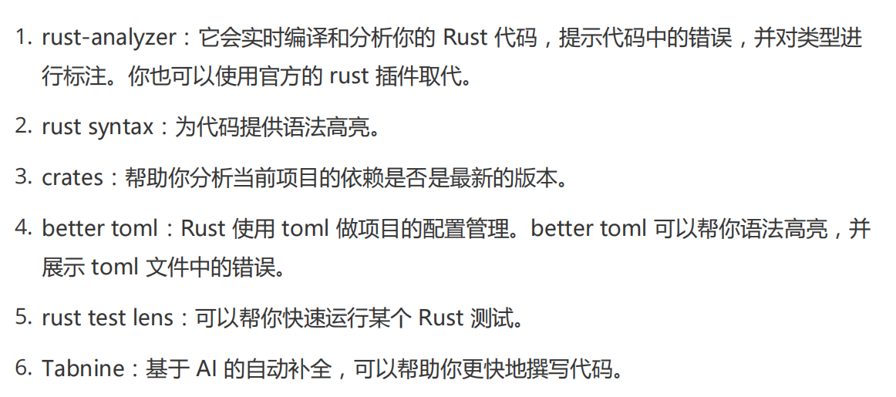
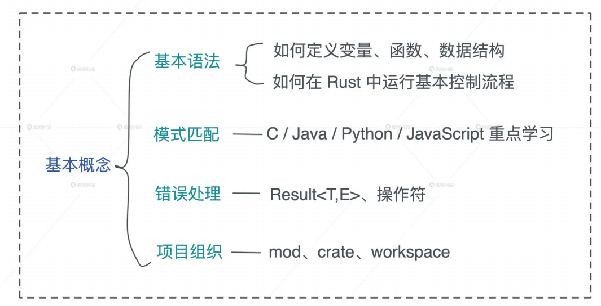
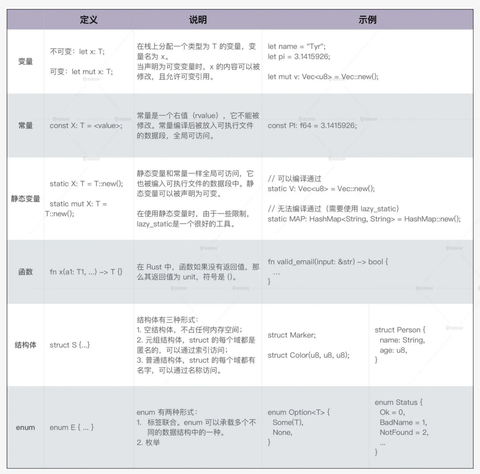
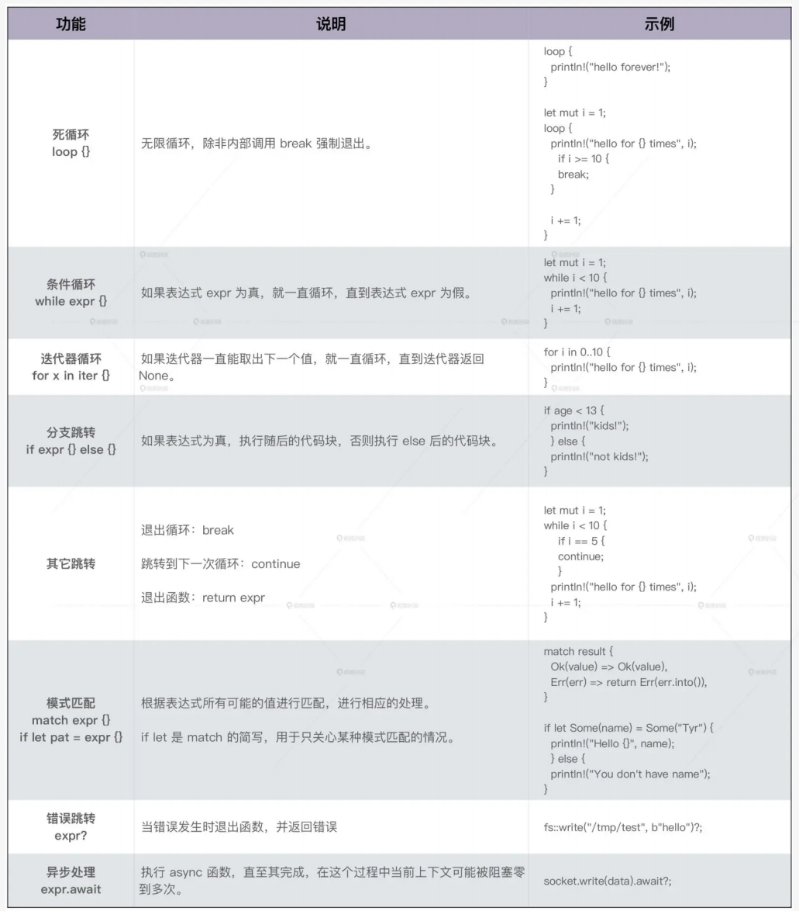
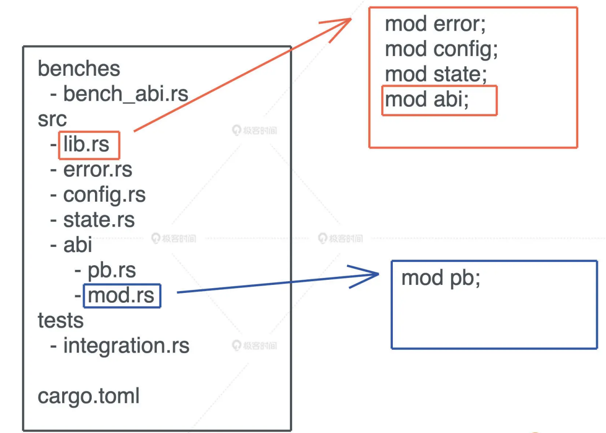
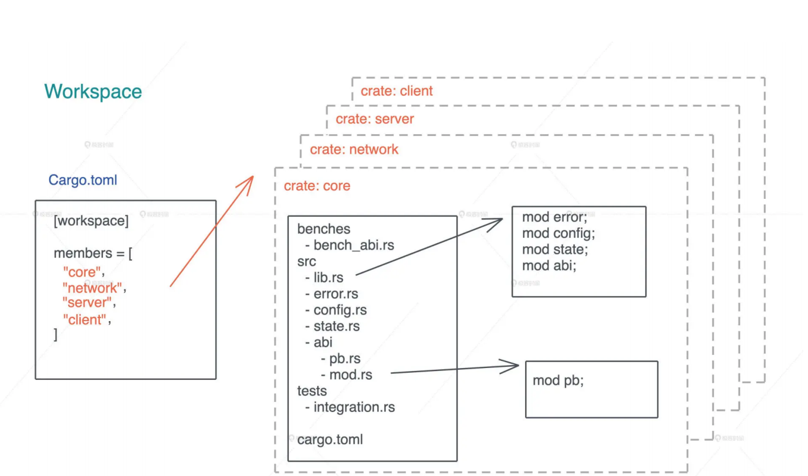
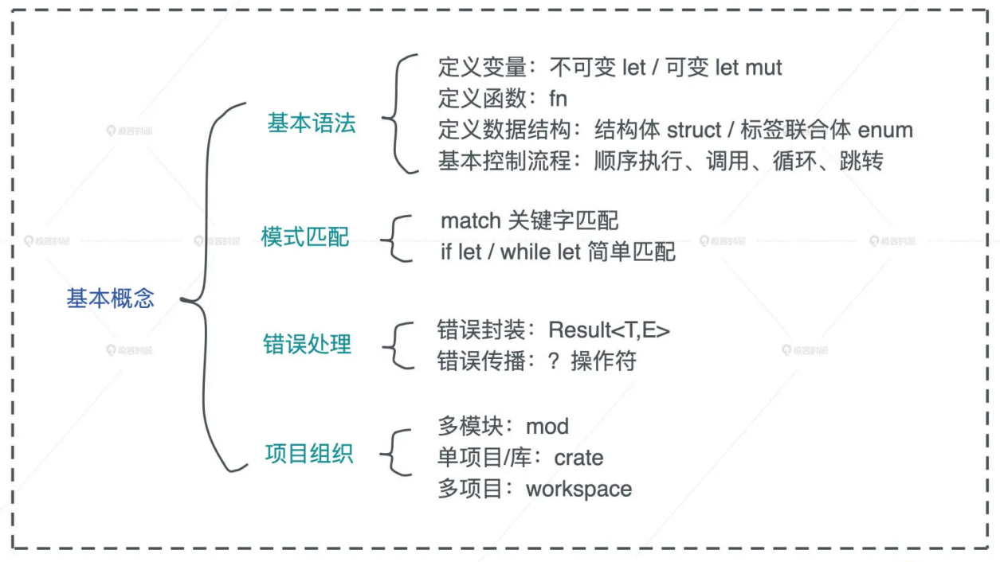

# 初窥门径: 从你的第一个Rust程序开始!

Rust安装起来非常方便, 你可以使用https://rustup.rs/中给出的方法安装

这会在你系统上安装了Rust工具链, 之后, 你就可以在本地用`cargo new`新建Rust项目, 尝试Rust功能

你可以使用任何编辑器来撰写Rust代码, 推荐VSCode, 我们还可以安装一些插件



## 第一个实用的Rust程序

现在你已经有了工具和环境了, 尽管我们还没有学习Rust语法, 但不妨碍我们写一个稍微有用的Rust程序, 跑一边后, 你对Rust的基本功能, 关键语法和生态系统就基本心中有数了, 我们再来详细分析

这个程序的需求很简单, 通过HTTP服务请求Rust的官网首页, 然后把获得HTML转换成Markdown保存起来

首先我们用`cargo new _01_scrape_url`生成一个项目, 默认情况下, 这条命令会生成一个可执行的项目, 入口在`src/main.rs`, 我们在`Cargo.toml`文件中, 加入如下依赖

```toml
[package]
name = "_01_scrape_url"
version = "0.1.0"
edition = "2021"

[dependencies]
reqwest = { version = "0.12", features = ["blocking"] }
html2md = "0.2.14"
```

`Cargo.toml`是Rust项目中的配置管理文件, 它符合`toml`的语法, 我们为这个项目中添加了两个依赖: `reqwest`和`html2md`, `reqwest`是一个HTTP客户端, 它的使用方式和Python的`request`库类似; `html2md`顾名思义, 把HTML转换为Markdown

接下来, 我们在`src/main.rs`中, 我们为main函数添加以下的代码:

```rust
use std::fs;

fn main() {
    let url = "https://www.rust-lang.org";
    let output = "rust.md";

    println!("Fetching url: {url}");

    let body = reqwest::blocking::get(url).unwrap().text().unwrap();

    println!("Converting html to markdown...");

    let md = html2md::parse_html(&body);

    fs::write(output, md.as_bytes()).unwrap();

    println!("Saved markdown to file: {output}");
}
```

保存后, 在命令行下, 进入这个项目的根目录, 运行`cargo run`, 在一段略微漫长的编译下, 程序开始运行, 在命令行输出:

```bash
Fetching url: https://www.rust-lang.org
Converting html to markdown...
Saved markdown to file: rust.md
```

并且在当前目录下, 一个`rust.md`文件被创建出来, 打开已开, 其内容就是Rust官网主页的额内容

从这段不长的代码中, 我们可以感受到Rust的一些基本特点:

首先Rust使用名为cargo的工具来管理项目, 它类似npm, pip, 用来做依赖管理以及开发过程中的任务管理, 比如编译, 运行, 测试, 代码格式化等等

其次, Rust的整体语法篇C/C++风格, 函数整体用花括号包裹, 表达式之间使用分号分隔, 访问结构体的成员或者变量使用点运算符, 而访问命名空间或者对象的关联函数使用爽冒号运算符, 如果要简化命名空间内部的函数或者数据类型的引用, 可以使用use关键字, 可执行文件的入口函数是main函数

另外, 你也可以看到, Rust虽然是一门强类型的语言, 但编辑器支持类型推导, 这使得些代码时的至关感受和写脚本语言差不多

很多不习惯类型推到的开发者金额, 觉得这会降低代码的可读性, 因为可能需要根据上下文才知道当前变量是什么类型, 不过没有关系, 如果你在编辑器中使用了`rust-analyzer`插件, 变量类型会自动提示出来

最后, Rust支持宏开发, 很多基础的功能比如`println!`都被封装成了一个宏, 便于开发者写出更简洁的代码

这里的例子没有展现出来, 但Rust还具备其他特点:

> Rust的变量默认是不可变的, 如果想要修改变量的值, 需要显式的使用mut关键字
>
> 除了let/static/const/fn等少数语句外, Rust绝大多数代码都是表达式(expression), 所以if/while/for/loop都会返回一个值, 函数最后一个表达式是函数的返回值, 这和函数式编程语言一致
>
> Rust支持面向接口编程和泛型编程
>
> Rust有丰富的数据类型和强大的标准库
>
> Rust有非常丰富的控制流程, 包括模式匹配(pattern match)

## 快速入门

接下来为了快速入门Rust, 我们一起来梳理Rust开发的基本内容



### 基本语法和基础数据类型

首先我们来看在Rust中, 我们如何定义变量, 函数和数据结构

#### 变量和函数

前面说到, Rust支持类型推导, 在编译器能够推导类型的情况下, 变量类型一般可以省略, 但常量(const)和静态变量(static)必须声明类型

定义变量的时候, 根据需要, 你可以添加mut关键字让变量具备不可变性, 默认变量不可变是一个很重要的特性, 它符合最小权限原则, 有助于我们写出健壮的代码, 当你使用mut却没有修改变量的时候, Rust编译器会友好的报警, 提示你要移除不必要的mut

在Rust中, 函数是一等公民, 可以作为参数或者返回值, 我们啦一看一个函数作为参数的例子:

```rust
// 函数作为参数

fn apply(value: i32, f: fn(i32) -> i32) -> i32 {
    f(value)
}

fn square(value: i32) -> i32 {
    value * value
}

fn cube(value: i32) -> i32 {
    value * value * value
}

fn main() {
    println!("apply square: {}", apply(2, square));
    println!("apply cube: {}", apply(2, cube));
}
```

这里`fn(i32) -> i32`是apply函数的第二个参数的类型, 它表明接受一个函数作为参数, 这个传入的函数必须是: 参数只有一个, 且类型为`i32`, 返回值类型也是`i32`

Rust函数参数的类型和返回值类型都必须显式定义, 如果没有返回值可以省略, 返回`unit`, 函数内部如果需要提前返回, 使用`return`关键字, 否则最后一个表达式就是其返回值, 如果最后一个表达式后面添加了分号, 隐含其返回值为`unit`

#### 数据结构

了解了函数如何定义后, 我们来看看Rust如何定义数据结构

数据结构是程序的核心组成部分, 在对复杂的问题进行建模时, 我们就要自定义数据结构, Rust非常强大, 可以用`struct`关键字定义结构体, 用`enum`定义标签联合体(tagged union), 还可以像Python一样随手定义元组(tuple)类型

比兔我们可以这样定义一个聊天服务的数据结构:

```rust
/* 聊天服务数据结构 */

#[derive(Debug)]
enum Gender {
    Unspecified = 0,
    Female = 1,
    Male = 2,
}

#[derive(Debug, Copy, Clone)]
struct UserId(u64);

#[derive(Debug, Copy, Clone)]
struct TopicId(u64);

#[derive(Debug)]
struct User {
    id: UserId,
    name: String,
    gender: Gender,
}

#[derive(Debug)]
struct Topic {
    id: TopicId,
    name: String,
    owner: UserId,
}

// 定义聊天室可能发生的事件
#[derive(Debug)]
enum Event {
    Join((UserId, TopicId)),
    Leave((UserId, TopicId)),
    Message((UserId, TopicId, String)),
}

fn main() {
    let alice = User {
        id: UserId(1),
        name: "Alice".into(),
        gender: Gender::Female,
    };
    let bob = User {
        id: UserId(2),
        name: "bob".into(),
        gender: Gender::Male,
    };

    let topic = Topic {
        id: TopicId(1),
        name: "rust".into(),
        owner: UserId(1),
    };

    let event1 = Event::Join((alice.id, topic.id));
    let event2 = Event::Join((bob.id, topic.id));
    let event3 = Event::Message((alice.id, topic.id, "Hello World!".into()));

    println!(
        "event1: {:?}, event2: {:?}, event3: {:?}",
        event1, event2, event3
    )
}
```

简单解释一下;

1. Gender: 一个枚举类型, 在Rust下, 使用enum可以定义类似C的枚举类型
2. UserId/TopicId: struct的特殊形式, 称为元组结构体, 它的域都是匿名的, 可以用索引进行访问, 适用于简单的结构体
3. User/Topic: 标准的结构体, 可以把任何类型组合在结构体中
4. Event: 标准的标签联合体: 它定义了三种事件: Join, Leave, Message, 每种数据都有自己的数据结构

在定义数据结构的时候, 我们一般会加入修饰, 为数据结构引入一些额外的行为, 在Rust中, 数据的行为通过trait来定义, 后续我们会详细的介绍trait, 你现在可以暂时认为trait定义了数据结构中可以实现的接口, 类似Java中的interface

一般我们用`impl`关键字为数据结构实现trait, 但Rust贴心的提供了派生宏(derive macro), 可以大大简化一些标准接口的定义, 比如`#[derive(Debug)]`为数据结构实现了`Debug trait`, 提供了debug的能力, 这样可以通过`{:?}`用`println!`打印出来

在定义UserId/TopicId时候我们还用了到`Copy/Clone`两个派生宏, `Clone`让数据结构可以被复制, 而`Copy`则让数据结构可以在参数传递的时候按字节拷贝

简单总结一下Rust定义变量, 函数和结构数据:



### 控制流程

程序的基本控制流程分为以下几种, 我们应该很熟悉了, 重点是看他们如何在Rust中运行

顺序执行就是一行行代码往下执行, 在执行的过程中, 遇到函数, 会发生函数调用, 函数调用是代码在执行过程中, 调用另一个函数, 跳入其上下文执行, 直到返回

Rust的循环和大部分语言都一致, 支持死循环`loop`, 条件循环`while`, 以及对迭代器的循环`for`, 循环可以通过`break`提前终止, 或者`continue`来调到下一轮循环

满足某个条件时会跳转, Rust支持分支跳转, 模式匹配, 错误跳转和异步跳转

分支跳转就是我们熟悉的`if/else`

Rust的模式匹配可以通过匹配表达式或者值的某部分的内容, 来进行分支跳转

在错误条换中, 当调用的函数返回错误的时候, Rust会提前终止当前函数的执行, 向上一层返回错误

在Rust的异步跳转中, 当async函数执行await时, 程序当前上下文可能被阻塞, 执行流程会跳转到另一个异步任务执行, 直到await不再阻塞

我们通过斐波那契数列, 使用if和loop/while/for这几种循环, 来实现基本的控制流程

```rust
/* 斐波那契数列 */

fn fib_loop(n: i32) -> i32 {
    if n <= 1 {
        return n;
    }

    let mut a = 0;
    let mut b = 1;
    let mut i = 2;

    loop {
        let temp: i32 = a + b;
        a = b;
        b = temp;
        i += 1;

        if i >= n {
            return temp;
        }
    }
}

fn fib(n: i128) -> i128 {
    if n <= 1 {
        return n;
    }

    let mut a = 0;
    let mut b = 1;
    let mut temp = 0;

    for _i in 2..n {
        temp = a + b;
        a = b;
        b = temp;
    }

    return temp;
}

fn main() {
    println!("n = 10: {}", fib_loop(10));
    println!("n = 10: {}", fib(10));
}
```

这里需要指出的的是, Rust的for循环可以用于实现了`IntoIterator trait`的数据结构

在执行过程中, `IntoIterator`会生成一个迭代器, for循环不断从迭代器中取值, 直到迭代器返回None为止, 因而, for循环实际上只是一个语法糖, 编译器会将其展开使用loop循环对迭代器循环访问, 直至返回None

下表是一个Rust主要控制流程的一个总结: 



### 模式匹配

Rust的模式匹配吸取了函数式编程语言的优点, 强大优雅且效率很高, 它可以用于`struct/enum`中匹配部分或者全部内容, 比如上文中我们设计的数据结构Event, 可以这样匹配:

```rust
fn process_event(event: &Event) {
    match event {
        Event::Join((uid, _tid)) => ..,
        Event::Leave((uid, _tid)) => ..,
        Event::Message((_, _, msg)) => ..,
    }
}
```

从代码中我们可以看到, 可以直接对enum内层的数据进行匹配并赋值, 这比很多只支持简单模式匹配的语言, 可以省出很多行代码

除了使用match关键字做模式匹配的话, 我们还可以用`if let/while let`做简单匹配, 如果上面的代码我们只关心Event::Message, 可以这么写:

```rust
fn process_message(event: &Event) {
    lf let Event::Message((_, _, msg)) = event {
        // ...
    }
}
```

Rust的模式匹配是一个很重要的特性, 被广泛应用在状态机处理, 消息处理和错误处理中

### 错误处理

Rust没有沿用C++/Java等语言使用的异常处理方式, 而是借鉴Haskell, 把错误封装在`Result<T. E>`类型中, 同时提供了`?`操作符来传播错误, 方便开发, `Result<T, E>`类型是一个泛型数据结构, `T`代表成功执行返回的结果类型, `E`代表错误类型

我们今天书写的`_01_scrape_url`项目中, 其实里面很多使用了`Result<T, E>`类型, 不过我们在里面使用了unwrap方法, 只关心成功的返回结果, 如果出错, 整个程序会停止

如果想让错误传播, 可以把所有的unwrap方法换成`?`, 并让main函数返回一个`Result<T, E>`

### Rust项目的组织

当Rust代码规模越来越大时, 我们就无法用单一文件承载代码了, 需要多个文件甚至多个目录协同工作, 这时我们可以用`mod`来组织代码

具体做法是: 在项目的入口文件`lib.rs/main.rs`中, 用mod来声明要加载的其他代码文件, 如果模块内容比较多, 可以放在一个目录下, 在该目录下放一个`mod.rs`引入该模块的其他文件, 这个文件, 和Python的`__init__.py`有异曲同工之妙, 这样处理后, 就可以使用mod+目录名来引入这个模块了



在Rust中, 一个项目也被成为一个crate, crate可以是可执行项目, 也可以是一个库, 我们使用`cargo new <name> --lib`创建一个库, 当crate里代码改变时, 这个crate需要重新编译

在一个crate下, 除了项目的源代码, 单元测试和集成测试的代码也会放在crate里

Rust的单元测试一般放在和被测试代码相同的文件中, 使用条件编译`#[cfg(test)]`来确保测试代码只在测试环境下编译

集成测试一般放在tests目录下, 和src平级, 和单元测试不同, 集成测试只能测试crate下的公开接口, 编译时编译成单独的可执行文件

在crate下, 如果要运行测试用例, 可以使用`cargo test`

当代码规模继续增长, 把所有代码放在一个crate里就不是一个好注意了, 因为任何代码的修改都会导致这个crate重新编译, 这样效率不高, 我们可以使用workspace

一个workspace可以包含一个到多个crates, 当代码发生改变时, 只有涉及的crates才需要重新编译, 当我们要构建一个workspace时, 需要先在摸个目录下生成一个如图所示的`Cargo.toml`, 包含workspace里所有的crates, 然后可以`cargo new`生成对应的crates:



## 小结

我们简单梳理了Rust中的基本概念, 通过`let/let mut`定义变量, 用fn定义函数, 用`struct/enum`定义复杂的数据类型, 也学习了Rust的基本的控制流程, 了解了模式匹配如何运作, 知道如何处理错误

最后考虑到代码规模的问题, 介绍了如何使用mod, crate和workspace来组织Rust代码:



