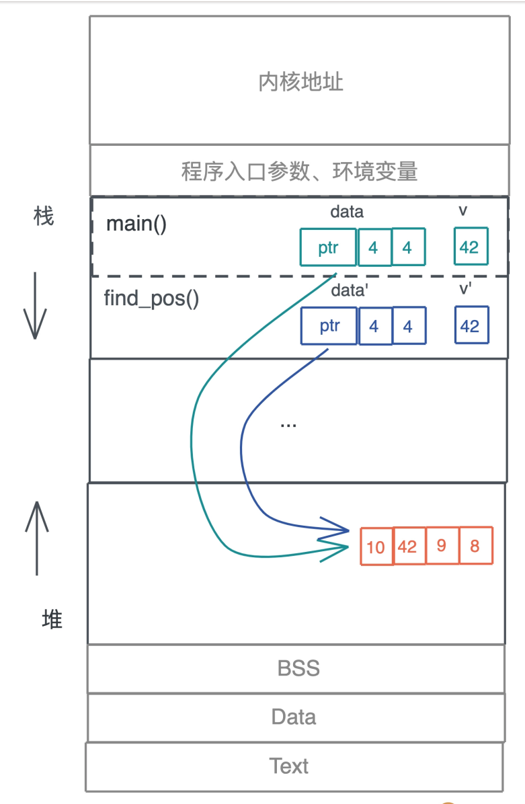
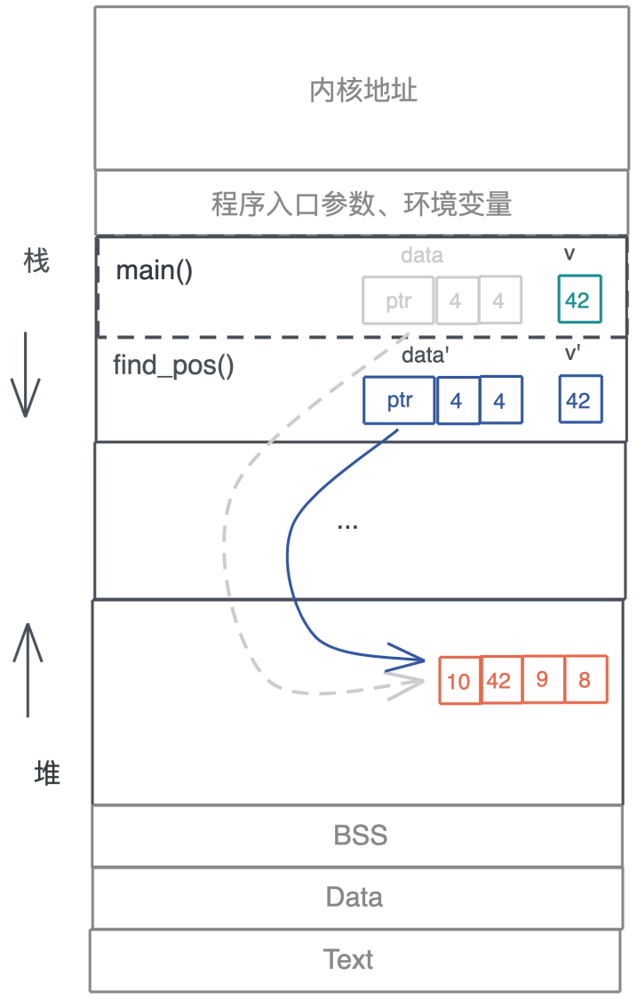
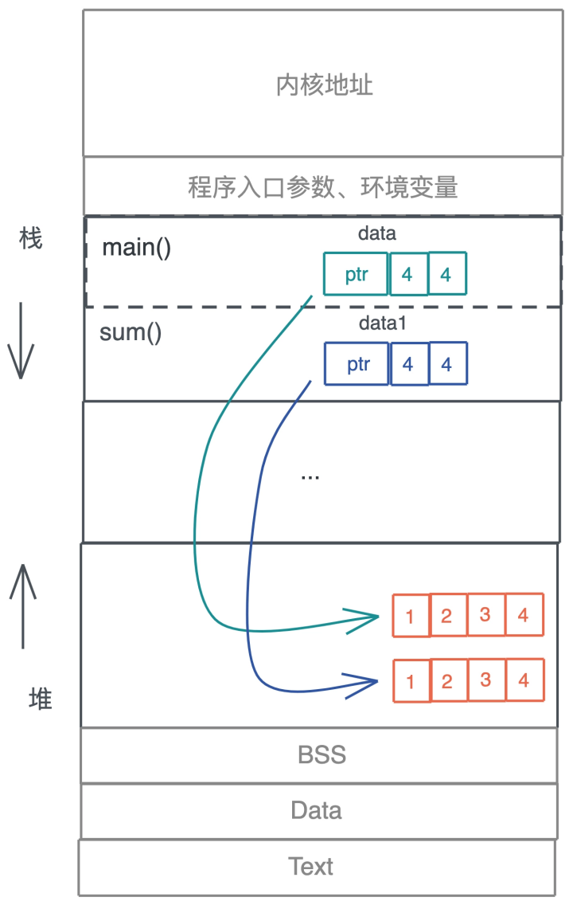
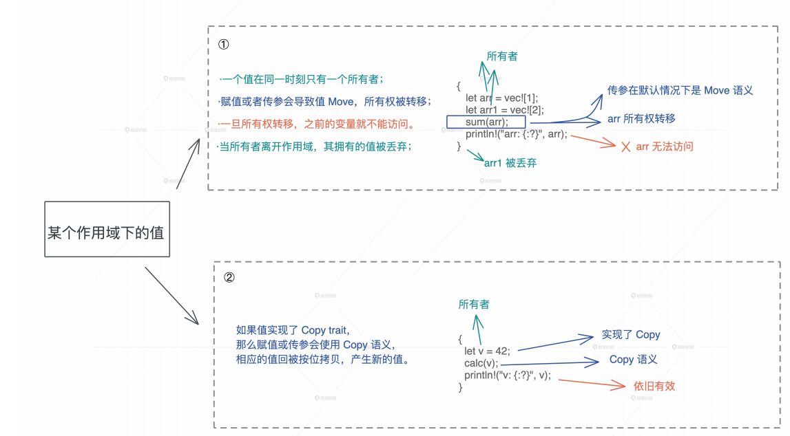

# 所有权: 值的生杀大权到底在谁手上?

今天我们一起来研究Rust学习过程中最难啃的硬骨头: 所有权和生命周期, 为什么要从这个知识点爱是呢? 因为所有权和生命周期是Rust和其它编程语言的主要区别, 也是Rust其它知识点的基础

我们从一个变量使用堆栈的行为开始, 探究Rust设计所有权和生命周期的用意, 帮你从根上解决这些编译问题

## 变量在函数调用时发生了什么

首先, 我们来看一看, 在我们熟悉的大多数编程语言中, 变量在函数调用的时候究竟会发生什么, 存在什么问题

看这段代码, main函数中定义了一个动态数组data和一个值v, 然后将其传递给函数find_pos, 在data中查找v是否存在, 存在则返回data中的下标, 不存在返回None

```rust
fn mian() {
    let data = vec![10, 42, 9, 8];
    let v = 42;
    if let Some(pos) = find_pos(data, v) {
        println!("Found {v} at {pos}");
    }
}

fn find_pos(data: Vec(u32), v: u32 -> Option<usize>) {
    for (pos, item) in data.iter,enumerate() {
        if *item == v {
            return Some(pos);
        }
    }
    
    None
}
```

这段代码不难理解, 要在强调一下的是, 动态数组因为大小在编译期无法确定, 所以放在堆上, 并且在栈上有一个包含长度和容量的胖指针指向堆上的内存

在调用find_pos时, main函数汇总的局部变量data和v作为参数传递给了find_pos, 所以它们会放在find_pos的参数区:



按照大多数语言的做法, 现在堆上的内存就有了两个引用, 不光如此, 我们每把data作为参数传递一次, 堆上的内存就会多一次引用

但是, 这些引用究竟会做什么操作, 我们就不得而知了, 也无从限制, 而且堆上的内存究竟什么时候能够释放, 尤其在多个调用栈引用的时候, 很难理清楚, 取决于最后一个引用什么时候结束, 所以, 这样一个看似简单的函数调用, 却给内存带来了极大麻烦

对于堆内存多次引用的问题, 我们先来看大多数语言的方案:

> C/C++要求开发者手工处理, 非常不便, 这需要我们在写代码的时候高度自律, 按照前人总结的最佳实践来操作, 但人必然会犯错, 一个不小心就会导致内存安全问题, 要么内存泄露, 要么使用已释放内存, 导致程序崩溃
>
> Java等语言使用追踪式GC, 通过定期扫描堆上数据还没有没有人引用, 来替开发者管理堆内存, 不失为一种解决之道, 但GC带来的STW问题让语言的使用场景受限, 性能损耗也不小
>
> ObjC/Swift使用自动引用计数(ARC), 在编译时自动添加维护引用计数的代码, 减轻快发这维护堆内存的负担, 但同样的, 它也会有不小的运行时性能损耗

现存方案都是管理引用角度思考的, 各有利弊, 我们回顾刚才梳理的函数调用过程, 从源头来看, 本质问题是堆上内存会被随意引用, 那么换个角度, 我们是不是可以限制引用行为本身呢?

## Rust的解决思路

Rust就是这样另辟蹊径的

在Rust以前, 引用是一种随意的, 可以隐式产生的, 对权限没有界定的行为, 比如C里导出乱飞的指针, Java中随处可见的按引用传参, 它们可读可写, 权限极大, 而Rust决定限制开发者随意引用的行为

其实作为开发者, 我们在工作中常常能体会到, 恰好的限制, 反而会释放无穷的创意和生产力, 最典型的就是各种开发框架, 比如React, Ruby on Rails等, 它们限制了开发者使用语言的行为, 且极大的提升了生产力

思路我们有了, 具体怎么实现来限制数据的引用行为呢?

要回答这个问题, 我们需要先来回答: 谁真正拥有数据或者说值的生杀大权, 这种权利可以共享还是需要独占?

## 所有权和Move语义

对于值的生杀大权可以共享还是需要独占这一问题, 我们大概都会觉得, 一个值最好只有一个拥有者, 因为所有权共享, 势必会带来使用和释放上的不明确, 走回追踪式GC或者ARC的老路

那么如何保证独占呢? 具体实现其实是有些困难的, 因为大多数情况需要考虑, 比如说一个变量被赋给另外一个变量, 作为参数传递给另一个函数, 或者作为返回值从函数返回, 都可能造成这个变量的拥有者不唯一, 怎么办?

对比, Rust给出了如下规则:

- 一个值只能被一个变量所拥有, 这个变量被称为所有者
- 一个值同一时刻只能有一个所有者,也就是说不能有两个变量拥有相同的值, 所以对应刚才说的变量赋值, 参数传递, 函数返回等行为, 旧的所有者会把值的所有权转移给新的所有者, 以便保证单一所有者的约束
- 当所有者离开作用域, 其拥有的值被丢弃, 内存得到释放

这三条规则其实很好理解, 核心就是保证单一所有权, 其中第二条规则将的所有权转移是Move语义, Rust从C++哪里学习借鉴了这个概念

第三条规则中的作用域scope是一个新概念, 简单说明一下, 它是指一个代码块(block), 在Rust中, 一对花括号括起来的代码区就是一个作用域, 举个例子, 如果一个变量被定义在if内, 那么if语句结束, 这个变量作用域就结束了, 其值会被丢弃, 同样的, 函数里定义的变量, 在离开函数时会被丢弃

在这三条规则约束下, 我们看开头的引用问题是如何解决的:



原先n函数中的data, 被移动到find_pos后, 就失效了, 编译器会保证main函数随后的代码无法访问这个变量, 这样, 就确保了堆上内存依旧只有唯一的引用

看这个图, 你可能会有一个小小的疑问: main函数传递给find_pos函数的另一个参数v也会被移动把? 为什么图上没有标灰? 暂且将这个疑问放到一边, 稍后解答

现在, 我们来写段代码加深一下对所有权的理解

在这段代码中, 先创建了一个不可变数据data, 然后将data赋值给data1, 按照所有权的规则, 在赋值之后, data指向的值被移动给了data1, 它自己便不可访问了, 而随后, data1作为参数传递给函数sum, 在main函数下, data1也不可访问了:

但是后续的代码依旧视试图访问data1和data, 所以, 这段代码会有两处错误:

```rust
fn main() {
    let data = vec![1, 2, 3];
    let data1 = data;
    println!("sum of data1: {}", sum(data1));
    println!("data1: {:?}", data1);
    println!("sum of data: {}", sum(data));
}

fn sum(data: Vec<u32> -> u32) {
    data.iter().fold(0, |acc, x| acc + x)
}
```

运行时, 编译器也确实捕获到这两个错误, 并清除的告诉我们不能使用已经移动过的变量

我们我们把data1传递给sum, 同时还想manin能够访问data, 该怎么办?

我们可以调用`data.clone`把data复制一份出来data1, 这样, 在堆上就有`vec![1,2,3]`两步相互影响且可以独立释放的副本



可以看到, 所有权规则, 解决了谁整整拥有数据的生啥大全的问题, 让堆上数据的多重引用不复存在, 这是它最大的优势

但是, 这也会让代码变得复杂, 尤其是一些只存储在栈上的简单数据, 如果要避免所有权的转移之后可能访问的情况, 我们就需要手动复制, 会变得麻烦,  效率也不高

Rust考虑到这一点: 提供了两种方案: 

- 如果你不希望所有权转移, 在Move语义之外, Rust提供了Copy语义, 如果一个数据类型实现了Copy trait, 那么它就会使用Copy 语义, 这样, 在你赋值或者传参时, 值会自动按位拷贝
- 如果你不希望值的所有权被转移, 又无法使用Copy语义, 那你可以借用数据, 我们后面会详细讲解解饿用

## Copy语义和Copy trait

符合Copy语义的类型, 在赋值或者传参时, 值会按位拷贝吗这句话不难理解, 那在Rust是具体怎么实现的呢?

我们在仔细看看刚才代码给出的错误, 你会发现, 它抱怨data的类型`Vec<u32>`没有实现Copy trait, 在赋值或者函数调用的时候无法Copy, 于是就按照默认使用Move语义, 而Move之后, 原先的变量data无法访问, 所以报错

换句话说, 当你要移动一个值, 如果值的类型实现了Copy trait, 就会自动使用Copy语义进行拷贝, 否则使用Move语义进行移动

讲到这里, 在学习Rust的时候, 你可以根据编译器详细的错误说明来尝试修改代码, 使编译通过, 在这个过程中, 你可以搜索错误信息, 进一步学习自己不了解的错误信息, 非常建议你根据上图中的错误代码, 使用`rustc --explain xxx`探索更详细的信息

回归正文, 那在Rust中, 什么数据结构实现了Copt trait呢? 你可以通过下面的代码快速验证一个数据结构是否实现了Copy trait

```rust
fn is_copy<T: Copy>() {}
fn types_impl_copy_trait() {
    is_copy::<bool>();
    is_copy::<char>();
    // all iXX and uXX, usize/isize, fXX implement Copy trait
    is_copy::<i8>();
    is_copy::<u64>();
    is_copy::<i64>();
    is_copy::<usize>();
    // function (actually a pointer) is Copy
    is_copy::<fn()>();
    // raw pointer is Copy
    is_copy::<*const String>();
    is_copy::<*mut String>();
    // immutable reference is Copy
    is_copy::<&[Vec<u8>]>();
    is_copy::<&String>();
    // array/tuple with values which is Copy is Copy
    is_copy::<[u8; 4]>();
    is_copy::<(&str, &str)>();
}
fn types_not_impl_copy_trait() {
    // unsized or dynamic sized type is not Copy
    is_copy::<str>();
    is_copy::<[u8]>();
    is_copy::<Vec<u8>>();
    is_copy::<String>();
    // mutable reference is not Copy
    is_copy::<&mut String>();
    // array / tuple with values that not Copy is not Copy
    is_copy::<[Vec<u8>; 4]>();
    is_copy::<(String, u32)>();
}
fn main() {
    types_impl_copy_trait();
    types_not_impl_copy_trait();
}
```

- 原生类型, 包括函数, 不可变引用裸指针都实现了Copy
- 数组和元组, 如果其内部的数据实现了Copy, 那么它们也实现了Copy
- 可变引用没有实现Copy
- 非固定大小数据结构, 没有实现Copy;

另外, 官方文档介绍Copy trait的页面, 包含了Rust标准库中实现Copy trait的所有数据结构, 你也可以在访问某个数据结构的时候, 查看其文档的Trait implementation部分, 看看他们是否实现了Copy trait

## 小结

我们今天学习了Rust的单一所有权模式, Move语义, Copy语义:

- 所有权: 一个值只能被一个变量所拥有, 且同一时刻只有有一个所有者, 当所有者离开作用域, 其拥有的值将被抛弃 , 内存得到释放
- Move语义: 赋值或者传参会导致Move, 所有权被转移, 一旦所有权被转移, 之前的变量就不能被访问
- Copy语义: 如果值实现了Copy trait, 那么赋值或者传参会使用Copy语义, 相应的值会被按位拷贝(浅拷贝), 产生新的值



通过单一所有权模式, Rust解决了堆内存过于灵活, 不容易安全高效的释放问题, 不过所有权模型也引入了很多新的概念, 比如今天讲的Move/Copy语义

由于是全新概念, 我们学习起来有一定的难度, 但是你只要抓住了核心点: Rust通过单一所有权来限制任意引用的行为, 就不难理解这些新概念背后设计的意义

## 思考题

1. 在Rust下, 分配在堆上的数据可以引用栈上的数据吗? 为什么?

   > Rust中堆上的数据可以引用栈上的数据, 不过这样出于一个前提, 栈上数据的生命周期一定大于等于堆上数据

2. main函数传递给find_pos函数的另一个参数v, 也会被移动吧? 为什么图后三个没有将其标灰?

   > 因为参数v是简单类型, 实现了Copy trait, 所以在传参的时候, 会按位复制, 产生新的值, 本身所有权并不会被移动

