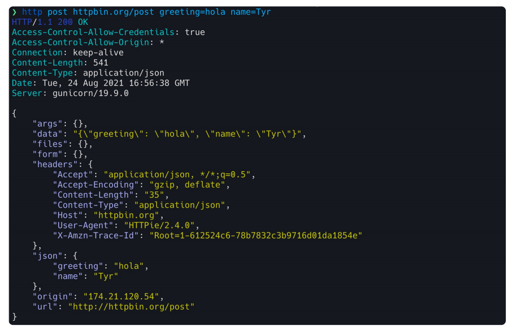
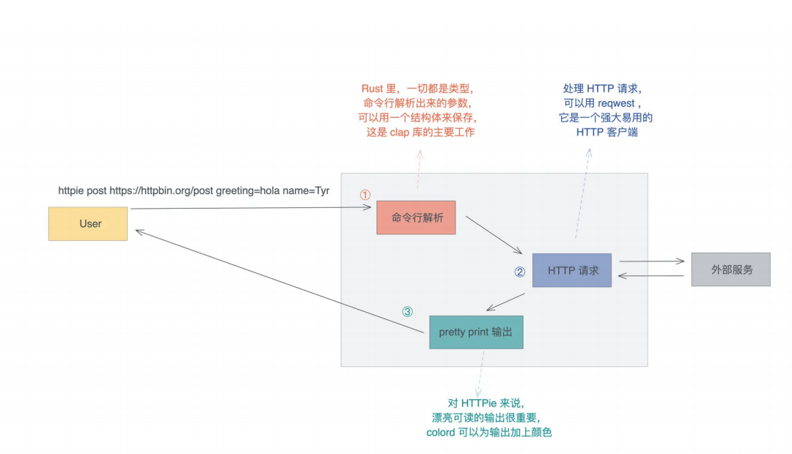

# 来写一个实用的CLI小工具

## HTTPie

我们就以实现HTTPie为例, 看看用Rust怎么做CLI, HTTPie是用Python开发的, 一个类似cURL但对用户更加友善的命令行工具, 它可以帮助我们更好的诊断HTTP服务

下图是用HTTP发送一个post请求的界面, 你可以看到, 相比cURL, 它在可用性上做了很多工作, 包括对不同信息的语法高亮显示:



## 功能分析

要做一个HTTPie这样的工具, 我们先来梳理一下要实现那些主要的功能:

> 首先是做命令行解析, 处理子命令和各种参数, 验证用户输入, 并且将这些输入转换成我们内部能理解的参数
>
> 之后根据解析好的参数, 发送一个HTTP请求, 获得响应
>
> 最后用对用户友好的方式来输出响应

这个流程你可以看看下图:



我们来看看要实现这些功能对应需要用到哪些库:

> 对于命令行解析, Rust有许多库可以满足我们的需求, 我们今天使用官方比较推荐的clap
>
> 对于HTTP客户端, 我们使用reqwest, 只不过我们使用它的一部接口
>
> 对于格式化输出, 我们可以以引入一个命令行终端多彩显示的库, 我们使用colored
>
> 除此之外, 我们还需要一些额外的库: 用anyhow做错误处理, 用jsonxf格式化JSON响应, 用mime处理mime类型, 以及引入tokio做异步处理

## CLI处理

我们来新建一个项目, 名字就叫httpie

```bash
cargo new http_ie
cd httpie
```

编辑`Cargo.toml`添加所需要的依赖:

```toml
[package]
name = "_03_httpie"
version = "0.1.0"
edition = "2021"

[dependencies]
anyhow = "1.0.93"
clap = "4.5.21"
colored = "2.1.0"
jsonxf = "1.1.1"
mime = "0.3.17"
reqwest = { version = "0.12.9", features = ["json"] }
tokio = { version = "1.41.1", features = ["full"] }
```

我们先在main.rs函数中处理CLI相关的代码:

```rust
use clap::Parser;

#[derive(Debug, Parser)]
#[command(version, about, author, long_about = None)]
struct Opts {
    #[command(subcommand)]
    subcmd: SubCommand,
}

#[derive(Debug, Parser)]
enum SubCommand {
    Get(Get),
    Post(Post),
}

#[derive(Debug, Parser)]
struct Get {
    #[arg(short, long)]
    url: String,
}

#[derive(Debug, Parser)]
struct Post {
    #[arg(short, long)]
    url: String,

    #[arg(short, long)]
    body: Vec<String>,
}

fn main() {
    let opts = Opts::parse();

    println!("opts: {:?}", opts);
}
```

代码中用到clap提供的宏来让CLI定义变得简单, 这个宏能够生成一些额外的代码帮助我们处理CLI的解析, 通过clap, 我们只需要先用一个数据结构`T`描述CLI都会捕获什么数据, 之后通过`T::parser`就可以解析出各种命令参数了, `parser`这个命令我们并没有定义, 它是`#[derive(Parser)]`自动生成的

目前我们定义了两个子命令, 在Rust中子命令可以通过enum定义, 每个子命令的参数又由他们各自的数据结构Get和Post来定义

我们来运行一下:

```rust
cargo run post -u http://www.baidu.com -b a=1 -b b=2 -b c=3
```

## 加入验证

然而, 现在我们还未对用户输入做任何验证, 我们不能相信用户的任何输入

所以我们需要加入验证, 输入项有两项, 就要做两个验证, 一个是验证URL, 另一个是验证body

```rust
#[derive(Debug, Parser)]
struct Get {
    #[arg(short, long, value_parser = validate_url)]
    url: String,
}

#[derive(Debug, Parser)]
struct Post {
    #[arg(short, long, value_parser = validate_url)]
    url: String,

    #[arg(short, long, value_parser = validate_body)]
    body: String,
}

fn validate_url(url: &str) -> anyhow::Result<String> {
    let u = Url::parse(url)?;
    Ok(u.into())
}

fn validate_body(body: &str) -> anyhow::Result<String> {
    Ok(body.into())
}
```

### HTTP请求

我们在main函数里添加处理子命令的流程:

```rust
#[tokio::main]
async fn main() -> anyhow::Result<()> {
    let opts = Opts::parse();

    println!("opts: {:?}", opts);

    let clint = Client::new();

    let result = match opts.subcmd {
        SubCommand::Get(args) => get(clint, &args).await?,
        SubCommand::Post(args) => post(clint, &args).await?,
    };

    Ok(result)
}
```

注意看我们把main函数变成了`async fn`, 它代表异步函数, 对于`async fn`, 我们需要使用`#[tokio::main]`来自动添加异步的运行时

然后在main函数内部, 根据子命令的类型, 我们分别调用了get和post函数做具体处理

```rust
async fn get(client: Client, args: &Get) -> anyhow::Result<()> {
    let resp = client.get(&args.url).send().await?;
    println!("Get: {:?}", resp.text().await?);
    Ok(())
}

async fn post(client: Client, args: &Post) -> anyhow::Result<()> {
    let mut body = HashMap::new();
    body.insert("key".to_string(), &args.body);
    let resp = client.post(&args.url).json(&body).send().await?;
    println!("Post: {:?}", resp.text().await?);
    Ok(())
}
```

