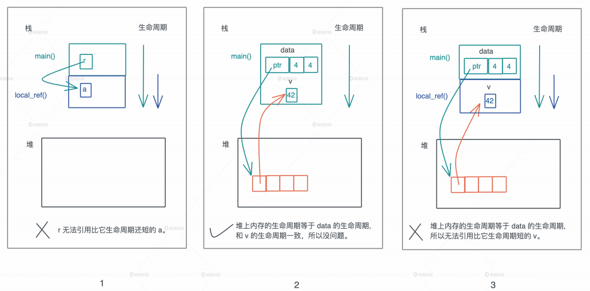

# 所有权: 值的借用是如何工作的?

上一节我们学习了RUst所有权的基本规则, 在Rust下, 值有单一所有者

的那个我们进行变量赋值, 传参和函数返回时, 如果设计的数据结构没有实现Copy trait, 就会默认使用Move语义转移所有权, 失去所有权的变量将无法继续访问原来的数据; 如果数据结构实现了Copy trait, 就会使用Copy语义, 自动把值复制一份, 原有的变量还能继续访问

虽然, 单一所有权解决了其他语言中值被任意共享带来的问题, 但也引发了一些不便, 我们上一讲提到: 的那个你不希望所有权被转移, 又因为没有实现Copy trait而无法使用Copy语义, 怎么办? 你可以借用数据, 也就是我们要继续介绍的Borrow语义

## Borrow语义

顾名思义, Borrow语义允许一个值的所有权, 在不发生转移的情况下, 被其他上下文使用, 就好像住酒店或者租房那样, 旅客/租客只有房间的临时使用权, 但没有它的所有权, 另外Borrow语义通过引用语法(&或者&mut)来实现

看到这里, 你是不是有点迷惑了, 怎么引入了一个借用的新概念, 但是有些引用语法呢?

其实在Rust中借用和引用是一个概念, 只不过在其他语言中引用的意义和Rust不同, 所以Rust提出了新概念借用, 便于区分

在其他语言中, 引用是一种别名, 你可以简单理解成鲁迅至于周树人, 多个引用拥有对值的无差别访问权限, 本质上是共享了所有权; 而在Rust下, 所有的引用都是借用了临时使用权, 它并不破坏值的单一所有权约束

因此, 默认情况下, Rust的借用都是易制毒的, 就好像住酒店, 退房的时候要完好无损, 但有些情况下, 我们也需要可变借用, 就像租房, 可以对房屋进行必要的装饰, 这一点待会会详细的讲

所以, 如果我们想要避免Copy或者Move, 可以使用借用, 或者说引用

## 只读借用/引用

本质上, 引用是一个受控指针, 指向某个特定的类型, 在学习其他语言的时候, 你会注意到函数传参有两种方式: 传值(pass-by-value)和传引用(pass-by-reference)


以Java为例, 给函数传一个整数, 这是传值, 和Rust里的Copy语义一致; 而给函数传一个对象, 或者任何堆上的数据结构, Java都会自动隐式的传引用, 刚才说过, Java的引用是对象的别名, 这也导致随着程序的执行, 同一块内存的引用到处都是, 不得不依赖GC进行内存回收

但Rust没有传引用的概念, Rust所有的参数传递都是传值, 不管是Copy还是Move, 所以在Rust中, 你必须显式的把某个数据的引用, 传给另一个函数

Rust的引用实现了Copy trait, 所以按照Copy语义, 这个引用会被复制一份交给要调用的函数, 对这个函数来说, 它并不拥有数据本身, 数据只是临时借给它使用, 所有权还在原来的拥有者哪里

在Rust里, 引用是一等公民, 和其他数据类型地位相等

还是用上一节中有两处错误的代码来演示:

```rust
fn main() {
    let data = vec![1, 2, 3];
    let data1 = data;
    println!("sum of data1: {}", sum(data1));
    println!("data1: {:?}", data1);
    println!("sum of data: {}", sum(data));
}

fn sum(data: Vec<u32> -> u32) {
    data.iter().fold(0, |acc, x| acc + x)
}
```

我们代码稍微改变一下, 通过添加引用, 让编译通过, 并查看值和引用的地址:

```rust
fn main() {
    let data = vec![1, 2, 3, 4];
    let data1 = &data;
    // 值的地址是什么？引用的地址又是什么？
    println!(
        "addr of value: {:p}({:p}), addr of data {:p}, data1: {:p}",
        &data, data1, &&data, &data1
    );
    println!("sum of data1: {}", sum(data1));
    // 堆上数据的地址是什么？
    println!(
        "addr of items: [{:p}, {:p}, {:p}, {:p}]",
        &data[0], &data[1], &data[2], &data[3]
    );
}
fn sum(data: &Vec<u32>) -> u32 {
    // 值的地址会改变么？引用的地址会改变么？
    println!("addr of value: {:p}, addr of ref: {:p}", data, &data);
    data.iter().fold(0, |acc, x| acc + x)
}
```

在运行这段代码之前, 你可以先考虑一下, data对应的地址是否保持不变, 而data1引用的地址, 在传给sum函数之后, 是否还指向同一个地址

如果你有想法了, 可以在运行代码验证一下是你是否正确, 我们再看下图分析:


`data1`, `&data`和传到sum函数里的`data1`都指向data本身, 这个值地址是固定的, 但是它们引用的地址都是不同的, 这印证了我们讲Copy trait的时候, 介绍过只读引用实现了Copy trait, 也就意味着引用的赋值, 传参都会产生新的浅拷贝

虽然data有很多只读的引用指向它, 但堆上的数据依旧data一个所有者, 所以值的任意多个引用并不会影响所有权的唯一性

但我们马上就发现了新问题: 一旦data离开了作用域被释放, 如果还有引用指向data, 岂不是造成了我们想极力避免的使用已释放内存这样的内存安全问题? 怎么办呢?

## 借用的生命周期及其约束

所以, 我们对值的引用也要有约束, 这个约束是: 借用不能超过值的生存期

这个约束很直观, 也很好理解, 在上面的代码中, sum函数处在main函数下一层调用栈中, 它结束之后main函数还会继续执行, 所以在main函数中定义的data生命周期要比data引用要长, 这员工不会有有任何问题

但如果是这样的代码呢?

```rust
fn main() {
    let r = local_ref();
    println!("r: {:p}", r);
}
fn local_ref<'a>() -> &'a i32 {
    let a = 42;
    &a
}
```

显然, 生命周期更长的main函数变量r, 引用了生命周期更短的local_ref函数中的局部变量, 这违背了有关引用的约束, 所以Rust不允许这样的代码编译通过

那么, 如果我们在堆内存中, 使用栈内存的引用, 可以吗?

根据过去的开发经验, 你也许会觉得不可以, 因为堆内存的生命周期显然要比占内存要更长更灵活, 这样做内存也不安全

我们写段带代码来试试看, 把一个本地变量的引用存入一个可变数组中, 从基础知识的学习中我们知道, 可变数组存放在堆上, 栈上只有一个胖指针指向它, 所以这是一个典型的栈上变量引用存在堆上的例子:

```rust
fn main() {
    let mut data = Vec::new();
    let v = 42;
    data.push(&v);
    println!("data: {:?}", data);
}
```

竟然编译通过了, 则呢么回事, 那我们在变换一下, 看看还能编译不, 有无法通过了!

```rust
fn main() {
    let mut data: Vec<&u32> = Vec::new();
    push_local_ref(&mut data);
    println!("data: {:?}", data);
}
fn push_local_ref(data: &mut Vec<&u32>) {
    let v = 42;
    data.push(&v);
}
```

到这里, 你是不是优点迷糊了, 这三中情况, 为什么同样是对栈内存的引用, 则呢么编译结果都不一样?

这三段代码看似错综复杂, 但如果抓住一个狠心要素, 在同一个作用域下, 同一时刻, 一个值只能有一个所有者, 你会发现, 其实很简单

堆变量的生命周期不具备任意长短的灵活性, 因为堆上内存的生死存亡, 跟栈上的所有者姥姥绑定, 而栈上内存的生命周期, 又跟栈的生命周期相关, 所以我们的核心只需要关心调用栈的生命周期

现在你是不是可以轻易判断出, 为什么情况1和情况3的代码无法编译通过了, 因为它们引用了生命周期更短的值, 而情况2的代码虽然在堆内存里引用栈内存, 但生命周期是相同的, 所以没有问题



好到这里, 默认情况下, Rust的只读借用就讲完了, 借用着不能修改被借用的值, 简单类比就像住酒店, 只有使用权

但之前也提到, 有些情况下, 我们需要可变借用, 想在借用的过程中修改值的内容, 就像租房, 需要对房屋进行必要的装饰

## 可变借用/引用

在没有引入可变借用之前, 因为一个值同一时刻只有一个所有者, 所以要修改这个值, 只能通过唯一的所有者进行, 但是如果借用改变本身, 会带来新的问题

我们先来看第一种情况, 存在多个可变借用:

```rust
fn main() {
    let mut data = vec![1, 2, 3];
    for item in data.iter_mut() {
        data.push(*item + 1);
    }
}
```

这段代码在遍历可变数组data的过程中, 还往data里添加新的数据, 这是很危险的动作, 因为它破坏了循环的不变性, 容易导致死循环甚至系统崩溃, 所以, 在同一个作用域下有多个可变引用, 是不安全的

由于Rust编译器阻止了这种情况, 上述代码会编译出错

同一个上下文中多个可变引用是不安全的, 那如果同时又一个可变引用和若干个只读引用, 会有问题吗?

```rust
fn main() {
    let mut data = vec![1, 2, 3];
    let data1 = vec![&data[0]];
    println!("data[0]: {:p}", &data[0]);
    for i in 0..100 {
        data.push(i);
    }
    println!("data[0]: {:p}", &data[0]);
    println!("boxed: {:p}", &data1);
}
```

这段代码中, 不可变数组data1引用了可变数组data中的一个元素, 这是个只读引用, 后续我们往data中添加了100个元素, 在调用`data.push`时, 我们访问了data的可变引用

这段代码中, data的只读引用和可变引用共存, 似乎没有什么影响, 因为data1引用的元素并没有任何改动

如果你仔细推敲, 就会发现这里有内存不安全的潜在操作: 如果继续添加元素, 堆上的数据预留的空间不够了, 就会重新分配一块足够大的内存, 把之前的内存拷过来, 然后释放掉旧的内存, 这样就会让data1中保存的`&data[0]`失效, 导致内存安全问题

## Rust的限制

多个可变引用共存, 可变引用和只读引用共存这两种问题, 通过GC等自动内存管理方案可以避免第二种, 但是第一个问题GC也无济于事

所以为了保证内存安全, Rust对可变引用也做了严格的约束:

- 在一个作用域内, 仅允许一个活跃的可变引用, 所谓活跃, 及时真正被使用来修改数据的可变引用, 如果只是定义了, 却没有使用或者当做只读引用使用, 不算活跃
- 在一个作用域内, 活跃的可变引用和只读引用是互斥的, 不能同时存在

这个约束你是不是觉得看上去似曾相识? 它和数据在并发下的读写访问规则非常类似

从可变引用的约束来看, Rust不光解决了GC可以解决的内存安全问题, 还解决了GC无法解决的问题, 在编写代码的时候, Rust编译器就像你的良师益友, 不断敦促你采用最佳实践来撰写安全的代码


其实我们拨开表层的众多所有权规则, 一层层深究下去, 触及最基础的概念, 搞清楚堆或者栈中值到底是如何存放的, 在内存中值是如何访问的,然后从这些概念出发, 或者拓展其外延, 或者限制其使用, 从根本是上寻找解决之道, 这才是我们处理复杂问题的最佳手段, 也是Rust的设计思路

## 小结

今天我们学习了Borrow语义, 搞清楚了只读引用和可变引用的原理, 结合Move/Copy语义, Rust编译器会通过检查, 来确保没有违背这一系列的规则:

1. 一个值在同一时刻只有一个所有者, 当所有者离开作用域, 其拥有的值会被抛弃, 赋值或者传参会导致值Move, 所有权被移动, 一旦所有权被移动, 之前的变量就不能访问
2. 如果值实现了Copy trait, 那么赋值或者传参会使用Copy语义, 相应的值会被按位拷贝, 产生新的值
3. 一个值可以有多个只读引用
4. 一个值可以拥有唯一一个活跃的可变引用, 可变引用和只读引用是互斥的
5. 引用的生命周期不能超出值的生命周期


## 思考题

1. 上一节我们讲Copy trait时说到, 可变引用没有实现Copy trait, 为什么?

   > 为了确保数据的唯一性和安全性, 可变引用不应该是Copy trait