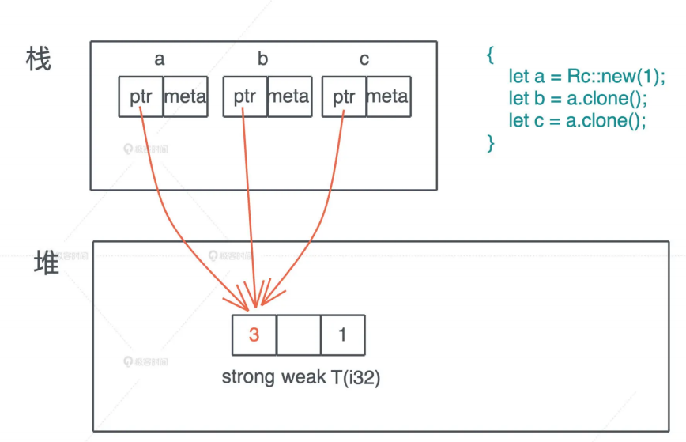
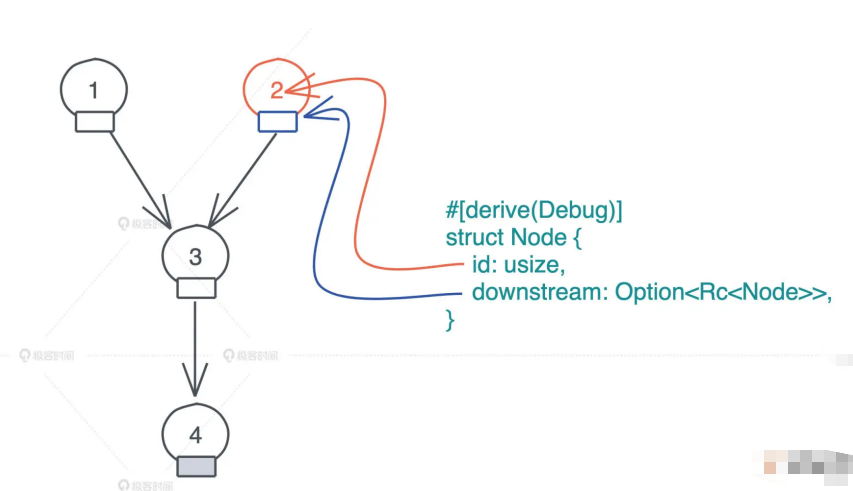
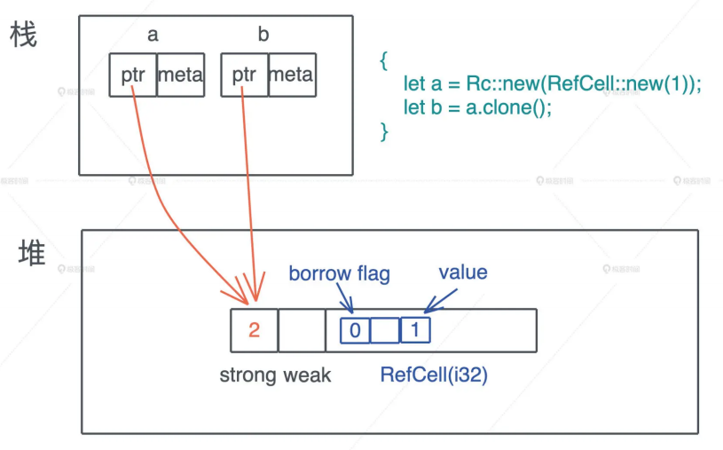
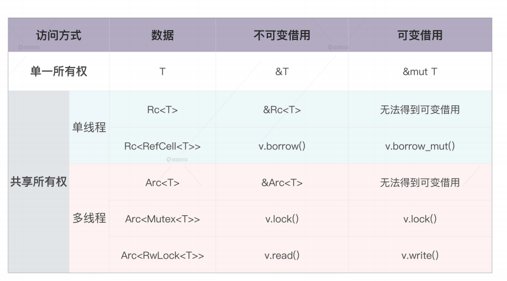

# 所有权: 一个值可以有多个所有者么?

之前介绍的单一所有权规则, 能满足我们大部分场景中分配和使用内存的需求, 而且在编译的时候, 通过Rust借用检查器就能完成静态检查, 不会影响运行时效率

但是规则总会有例外, 在日常工作中有些特殊情况该如何处理呢?

- 一个有向图(DAG)中, 某个节点可能有两个以上的节点指向它, 这个按照所有权模型怎么表述?
- 多个线程要访问同一块共享内存, 怎么办?

我们知道, 这些问题在程序运行过程中才会遇到, 在编译期, 所有权的静态检查无法处理它们, 所以为了更好的灵活性, Rust提供了运行时的动态检查, 来满足特殊场景下的需求

这也是Rust处理很多问题的思路; 编译时, 处理大部分的使用场景, 保证安全性和效率; 运行时, 处理我发在编译时处理的场景, 会牺牲一部分效率, 提高灵活性, 后续讲到静态分发和动态分发的时候也会有体现, 这个思路很值得我们借鉴

那具体如何在运行时做动态检查呢? 运行时的动态检查又如何与编译时的静态检查自洽呢?

Rust的答案是使用引用计数的智能指针: Rc(Reference counter)和Arc(Atomic reference counter), 这里要特别说明一下, Arc和ObjC/Swift里的ARC(Automatic Reference Counting)不是一个意思, 不过它们解决问题的手段类似, 都是通过引用计数完成的

## Rc

我们先看Rc, 对某个数据结构T, 我们可以创建引用计数Rc, 使其有多个所有者, Rc把对应的数据结构创建在堆上, 我们之前讲过, 堆是唯一可以让动态创建的数据被到处使用的内存

```rust
use std::rc::Rc;

fn main() {
    let a = Rc::new(1);
}
```

之后, 如果想对数据创建更多的所有者, 我们可以通过clone来完成

对一个Rc结构进行clone, 不会将其内部的数据赋值, 只会增加引用计数, 而当一个Rc结构离开作用域被drop的时候, 也只会减少引用计数, 直到引用计数为零, 才会真正的清除对应的内存

```rust
use std::rc::Rc;

fn main() {
    let a = Rc::new(1);
    let b = a.clone();
    let c = a.clone();
}
```

上面的代码我们创建了三个Rc, 分别是a, b, c, 它们共同指向堆上相同的数据, 也就是说, 堆上的数据有了三个共享的所有者, 在这段代码结束时, c先drop, 引用计数变成2, 然后b在drop, a在drop引用计数归零, 堆上内存被释放



你也许会有疑问: 为什么我们生成了对同一块内存的多个所有者, 但是编译器不抱怨所有权冲突呢?

仔细看这段代码: 首先a是`Rc::new(1)`的所有者, 这毋庸置疑; 然后b和c调用了`a.clone`分别得到了一个新的Rc, 所以从编译器的角度, abc都各自拥有一个Rc, 我们来看看Rc的clone函数实现

```rust
fn clone(&self) -> Rc<T> {
    // 增加引用计数
    self.inner().inc_strong();
    // 通过self.ptr生成一个新的Rc结构
    Self::from_inner(self.ptr);
}
```

所以Rc的clone正如我们刚才说的, 不复制实际数据, 只是一个引用计数的增加

你可以还有疑惑: Rc是怎么产生在堆上的? 并且为什么这段堆内存不受栈内存生命周期的控制呢?

## Box::leak()机制

上一节我们讲到, 在所有权模型下, 堆内存的生命周期, 和创建它的栈内存的生命周期保持一致, 所以Rc的实现似乎与此格格不入, 的确, 如果按照上一节的单一所有权模型, Rust是无法处理Rc这样的引用计数的

Rust必须提供一种机制, 让代码可以像C/C++那样, 创建不受栈内存控制的堆内存, 从而绕过编译时的所有权规则, Rust提供的方式是`Box::leak()`

Box是Rust下的智能指针, 它可以强制把任何数据结构创建在堆上, 然后在栈上方一个指针指向这个数据结构, 但此时对内存的生命周期仍然是受控的, 跟栈上的指针一致, 我们后续讲到智能指针时会详细介绍Box

`Box::leak()`顾名思义, 它创建的对象, 从堆内存上泄露出去, 不受栈内存控制, 是一个自由的, 生命周期可以大到和整个进行的生命周期一致的对象


所以相当于主动撕开一个口子, 允许内存泄露, 注意在C/C++下, 其实你通过malloc分配的每一片堆内存, 都类似Rust下的`Box::leak()`, 我很喜欢Rust这样的设计, 它符合最小权限原则, 最大程度帮助开发者撰写安全的代码

有了`Box::leak()`, 我们就可以跳出Rust编译器的静态检查, 保证Rc指向的堆内存, 有最大的生命周期, 然后我们在通过引用计数, 在合适的时机, 结束这段内存的生命周期

在学习语言的过程中, 不要因为觉得自己的自己是一个初学者, 就不敢翻阅标准的源码, 相反遇到不懂的地方, 如果你去看对应的源码, 得到的是第一手的知识, 一旦搞明白, 就会学的非常扎实, 受益无穷

搞明白Rc, 我们就进一步理解Rust是如何进行所有权的静态检查和动态检查了:

- 静态检查, 靠编译器保证代码符合所有权规则
- 动态检查, 通过`Box::leak`让堆内存拥有不受限的生命周期, 然后在运行过程中, 通过对引用计数的检查, 保证这样的堆内存最终会得到释放

## 实现DAG(有向无环图)

现在我们用Rc来实现之前无法实现的DAG

假设Node就只包含id和指向下游(downstream)的指针, 因为DAG中的一个节点可能被多个其他节点指向, 所以哦我们使用`Rc<Node>`来表述它; 一个节点可能没有下游节点, 我们用`Option<Rc<Node>>`来表述它



要创建这样一个DAG, 我们需要为Node提供以下方法:

- new: 创建一个新的Node
- update_downstream: 设置Node的downstream
- get_downstream: clone一份Node里的downstream

有了这些方法, 我们就可以创建出拥有上图关系的DAG了:

```rust
use std::rc::Rc;

/// 有向无环图

#[derive(Debug)]
struct Node {
    id: usize,
    downstream: Option<Rc<Node>>,
}

impl Node {
    pub fn new(id: usize) -> Self {
        Self {
            id,
            downstream: None,
        }
    }

    pub fn update_downstream(&mut self, downstream: Rc<Node>) {
        self.downstream = Some(downstream);
    }

    pub fn get_downstream(&self) -> Option<Rc<Node>> {
        self.downstream.as_ref().map(|v| v.clone())
    }
}

fn main() {
    let mut node1 = Node::new(1);
    let mut node2 = Node::new(2);
    let mut node3 = Node::new(3);
    let node4 = Node::new(4);
    node3.update_downstream(Rc::new(node4));
    node1.update_downstream(Rc::new(node3));
    node2.update_downstream(node1.get_downstream().unwrap());
    println!("node1: {:?}, node2: {:?}", node1, node2);
}
```

## RefCell

在运行上述代码的时候, 细心的你也许会疑惑: 整个DAG在创建完成后还能修改吗

按最简单的写法, 我么你在上面的代码的main函数的后, 加入下面这段代码, 来修改Node3使其指向一个新的节点Node5:

```rust
let node5 = Node::new(5);
let node3 = node1.get_downstream().unwrap();
node3.update_downstream(Rc::new(node5));
println!("node1: {:#?}, node2: {:#?}", node1, node2);
```

然而, 它无法编译通过, 编译器会告诉你`node3 cannot borrow as mutable`

这是因为Rc是一个只读的引用计数器, 你无法拿到Rc结构内部的可变引用来修改这个数据, 这可怎么办?

这里, 我们需要使用RefCell

和Rc类似, RefCell也绕过了编译器的静态检查, 允许我们在运行时, 对某个只读数据进行可变借用, 这就是设计Rust另一个比价独特且有点难理解的概念: 内部可变性(interior mutability)

## 内部可变性

有内部可变性, 自然能联想到外部可变性, 所以我们先来看这个更简单的定义

当我们用`let mut`显式的声明一个可变的值, 或者用`&mut`声明一个可变的引用时, 编译器可以在编译时进行严格的检查, 保证只有可变的值或者可变引用, 才能修改值内部的数据, 这被称为外部可变性(exterior mutability), 外部可变性通过mut关键字声明

然而, 这不够灵活, 有时候, 我们希望能够绕开这个编译时的检查,  并未对未声明成mut的值或者引用, 也想进行修改, 也就是说, 在编译器眼里, 值是只读的, 但是在运行时, 这个值可以得到可变借用, 从而修改内部的数据, 这就是RefCell的用武之地

我们看一个简单的例子:

```rust
use std::cell::RefCell;

fn main() {
    let data = RefCell::new(1);
    {
        // 获得RefCell内部数据的可变借用
        let mut v = data.borrow_mut();
        *v += 1;
    }
    println!("data: {:?}", data.borrow());
}
```

在这个例子中, data是一个RefCell, 其初始值为1, 可以看到, 我们并未将data声明为可变变量, 之后我们可以通过使用RefCell的borrow_mut方法, 来获得一个可变的内部引用, 然后对它做进行加1操作, 最后我们通过RefCell的borrow方法, 获得一个不可变的内部引用, 因为加了1, 此时它的值为2

你也许有些奇怪, 这里为什么要把获取和操作可变借用这两句代码, 用花括号分装到一个作用域下?

因为根据所有权规则, 在同一个作用域下, 我们不同同时有活跃的可变借用和不可变借用, 通过这对花括号, 我们明确的缩小了可变借用的生命周期, 不至于和后续的不可变借用起冲突

这里在想一步, 如果没有这对花括号, 这段代码是无法编译通过还是出错?

```rust
use std::cell::RefCell;

fn main() {
    let data = RefCell::new(1);
    // 获得RefCell内部数据的可变借用
    let mut v = data.borrow_mut();
    *v += 1;
    println!("data: {:?}", data.borrow());
}
```

如果你运行代码, 发现编译没有任何问题, 但是运行到println出, 会得到`already mutably borrowed: BorrowError`这样的错误, 可以看到, 所有权的借用规则在此依旧有效, 只不过它在运行时检查

这就是外部可变性和内部可变性的重要却别, 我们用下表来总结一下:


## 实现可修改的DAG

现在我们对RefCell有一个直观的印象, 看看如何使用它和Rc来让之前的DAG变得可修改

首先数据结构的downstream需要Rc内部嵌套一个RefCell, 这样就可以利用RefCell的内部可变性, 来获得数据的可变借用, 同时Rc还允许值有多个所有者



```rust
/// 有向无环图
use std::{
    cell::RefCell,
    rc::{self, Rc},
};

#[derive(Debug)]
struct Node {
    id: usize,
    downstream: Option<Rc<RefCell<Node>>>,
}

impl Node {
    pub fn new(id: usize) -> Self {
        Self {
            id,
            downstream: None,
        }
    }

    pub fn update_downstream(&mut self, downstream: Rc<RefCell<Node>>) {
        self.downstream = Some(downstream);
    }

    pub fn get_downstream(&self) -> Option<Rc<RefCell<Node>>> {
        self.downstream.as_ref().map(|v| v.clone())
    }
}

fn main() {
    let mut node1 = Node::new(1);
    let mut node2 = Node::new(2);
    let mut node3 = Node::new(3);
    let node4 = Node::new(4);
    node3.update_downstream(Rc::new(RefCell::new(node4)));
    node1.update_downstream(Rc::new(RefCell::new(node3)));
    node2.update_downstream(node1.get_downstream().unwrap());
    println!("node1: {:#?}, node2: {:#?}", node1, node2);

    let node5 = Node::new(5);
    let node3 = node1.get_downstream().unwrap();
    // node3.update_downstream(Rc::new(RefCell::new(node5)));
    node3.borrow_mut().downstream = Some(Rc::new(RefCell::new(node5)));
    println!("node1: {:#?}, node2: {:#?}", node1, node2);
}
```

可以看到, 通过使用`Rc<RefCell<T>>`这样的嵌套结构, 我们的DAG也可以正常修改了

## Arc和Mutex/RwLock

我们用Rc和RefCell解决DAG的问题, 那么, 开头提到的多个线程访问同一块内存的问题, 是否也可以使用Rc来处理呢?

是不可以的, 因为Rc为了性能, 使用的不是线程安全的引用计数器, 因此, 我们需要另一个引用计数的智能指针: Arc, 它实现了线程安全的引用计数器

Arc内部的引用计数使用了Atomic Usize, 而非普通的usize, 从名称上也可以感觉出来, Atomic Usize是size的原子类型, 它使用了CPU的特殊指令, 来保证多线程下安全, 如果你对原子类型感兴趣, 可以看`std::sync::atomic`的文档

同样的, RefCell也不是线程安全的, 如果我们要在多线程中, 使用内不可变性, Rust提供了Mutex和RwLock

这两个数据结构你应该不陌生, Mutex是互斥量, 获得互斥量的线程对数据独占访问, RwLock是读写锁, 获得写锁的线程对数据独占访问, 但当没有写锁的时候, 允许有多个读锁, 读写锁规则和Rust的借用规则非常类似, 我们可以类比者学

Mutex和RwLock都用在多线程环境下, 对共享数据访问的保护上, 刚才中我们构建的DAG如果要用在多线程环境下, 需要把`Rc<RefCell<T>>`替换成`Arc<Mutex<T>>`或者`Arc<RwLock<T>>`, 更多信息我们在并发时会讲到

## 小结

我们对所有权有了更深入的了解, 掌握了Rc/Arc, RefCell/Mutex/RwLock这些数据结构的用法

如果向绕过一个值只有一个所有者的限制, 我们可以使用Rc/Arc这样带引用计数的智能指针, 其中Rc效率非常高, 但只能使用在单线程的环境下; Arc使用了原子结构, 效率略低, 但可以安全使用在多线程环境下

然而, Rc/Arc是不可变的, 如果想要修改内部额数据, 需要引入内部可变性, 在单线程环境下, 可以在Rc内部使用RefCell; 在多线程环境下, 可以使用Arc嵌套Mutex或者RwLock的方法

你可以看下表快速回顾:



## 思考题

1. 运行下面代码, 查看错误, 并阅读`std::thread::spawn`的文档, 找到问题的原因后, 修改代码使其编译通过

   ```rust
   fn main() {
       let arr = vec![1];
       std::thread::spawn(|| {
           println!("{:?}", arr);
       });
   }
   ```

   ```rust
   fn main() {
       let arr = vec![1];
       std::thread::spawn(move || {
           println!("{:?}", arr);
       });
   }
   ```

2. 你可以写一段代码, 在main函数里生成一个字符串, 然后通过`std::thread::spawn`创建一个线程, 让main函数所在的主线程和新的线程共享这个字符串吗? 提示: 使用`std::sync::Arc`

   ```rust
   use std::sync::Arc;
   
   fn main() {
       let s = Arc::new("hello");
       let s1 = s.clone();
       std::thread::spawn(move || {
           println!("{}", s1);
       });
   
       println!("s: {s}");
   }
   ```

3. 我们看到Rc的clone方法的实现, 你哟没有注意到, 这个传入的参数是`&self`, 是不可变引用, 然而它调用了`self.inner.inc_strong`, 光看函数名字, 它用来增加self的引用结束, 可以为什么这里对self的不可变引用可以改变self的内部数据呢?

   ```rust
   // 使用Cell内部可变性
   struct RcBox<T: ?Sized> {
       strong: Cell<usize>,
       weak: Cell<usize>,
       value: T,
   }
   ```

   