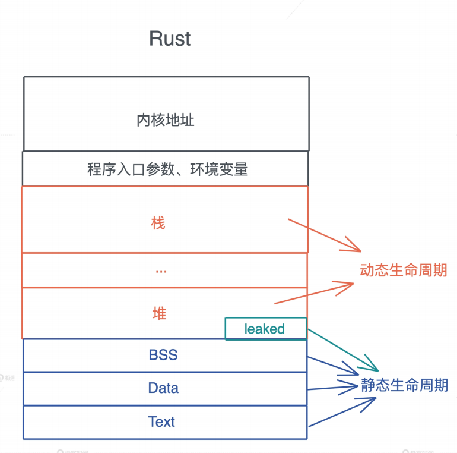
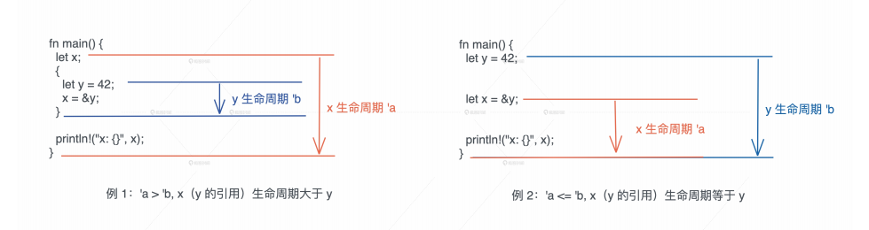
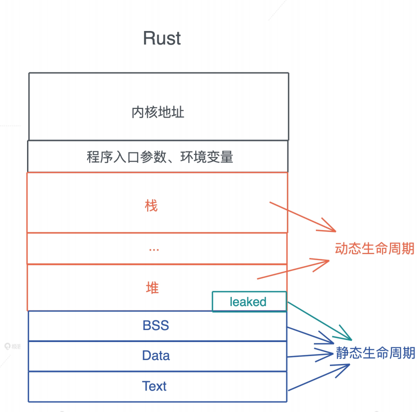

# 生命周期: 你创建的值究竟能活多久?

之前提到过, 在任何语言中, 栈上只都有自己的生命周期, 它和帧的生命周期一致, 而Rust, 进一步明确这个概念, 并且为堆内存页引入了生命周期

我们知道, 在其他语言中, 堆聂村的生命周期是不确定的, 或者是未定义的, 因此, 要么手工维护, 要么在运行时做额外的检查, 而在Rust中, 除非显式的做`Box::leak()`/`Box::into_raw()`/`ManualDrop`等动作, 一般来说, 堆内存的生命周期, 会默认和其栈内存的生命周期绑定在一起

所以在这种默认情况下, 在每个函数的作用域中, 编译器就可以对比值和其引用的生命周期, 来确保引用的生命周期不超出值的生命周期

那你有没有想过, Rust编译器是如何做到这一点的?

## 值的生命周期

在进一步讨论之前, 我们先给值可能的生命周期下个定义

如果一个值的生命周期贯穿整个进程的生命周期, 那么我们就可以成这个生命周期为静态生命周期,

当值拥有静态生命周期, 其引用也具有静态生命周期, 我们在表述这种引用的时候, 可以用`'static`比如`&'static str`代表这是一个具有静态生命周期的字符串引用

一般来说, 全局变量, 静态变量, 字符串字面量等, 都具有静态生命周期, 我们上一节提到的堆内存使用`Box::leak`后也具有静态生命周期

如果一个值是在某个作用域中定义的, 也就是说它被创建在栈上或者堆上, 那么其生命周期是动态的

当这个值的作用域结束时, 值的生命周期也随之结束, 对于动态生命周期, 我们约定用`'a`表示这种小写字符或者字符串表示, `'`后面具体是什么名字不重要, 它代表每一段动态生命周期, 起哄`'a str`和`&'b str`表示这两个字符串引用的生命周期可能不一致

我们通过图总结一下:



分配在堆和栈上的内存有其各自的作用域, 它们的生命周期是动态的

全局变量, 静态变量, 字符串字面量, 代码等内容, 在编译时, 会被编译到可执行文件中的BSS/Data/RoData/Text段, 然后在加载时, 装入内存, 因而它们的生命周期和进程的生命周期一致, 所以是静态的

所以, 函数指针的生命周期也是静态的, 因为函数在Text段中, 只要进程活着, 其内存一致存在

明白这些基本概念后, 哦我们来看看对于值和引用, 编译器是如何识别其生命周期的

## 编译器如何识别生命周期

我们先从两个最简单的例子开始:

做图x引用了内层作用域中创建出来的y, 由于变量从开始到作用域结束的这段时间, 是它的生命周期, 所以x的声明周期`'a`大于y的生命周期`'b`, 当x引用y时, 编译器报错

右图y和x处在同一个作用域下, x引用了y, 我们可以看到x的生命周期和y的生命周期几乎同时节水, 或者说`'a`小于`'b`, 所以x引用y可行的



这两个例子很好理解, 我们看一个稍微复杂一点的

示例代码在main函数里创建两个Sting, 然后将其传入max函数比较大小, max函数接受两个字符串引用, 返回其中较大的那个字符串引用:

```rust
fn main() {
    let s1 = String::from("Lindsey");
    let s2 = String::from("Rosie");
    
    let result = max(&s1, &s2);
    
    println!("bigger one: {}", result);
}

fn max(s1: &str, s2: &str) -> &str {
    if s1 > s2 {
        s1
    } else {
        s2
    }
}
```

这段代码是无法编译通过的, 它会报错`missing lifetime specifier`, 也就是说, 编译器在编译max函数的时候, 无法判断s1和s2和返回值的生命周期

你是不是很疑惑, 站在我们开发者的角度来说, 这个代码理解起来非常直观, 在main函数里s1和s2两个的生命周期一致, 它们的引用传给mx函数之后, 无论谁的被返回, 生命周期都不会超过s1或者s2, 所以这应该是一段正确的代码啊?

为什么编译器报错了, 不允许它编译通过? 我们把这段代码稍微拓展一下, 你就能明白编译器的困惑了

在刚才的代码示例中, 我们创建一个新的函数get_max, 它接受一个字符串引用, 然后和Cynthia这个字符串字面量比较大小, 之前我们提到过, 字符串字面量的生命周期是静态的, 而s1是动态的, 它们的生命周期不一致

```rust
fn main() {
    let s1 = String::from("Lindsey");
    let s2 = String::from("Rosie");
    
    let result = max(&s1, &s2);
    
    println!("bigger one: {}", result);
}

fn get_max(s1: &str) -> &str {
    max(s1, "Cynthia")
}

fn max(s1: &str, s2: &str) -> &str {
    if s1 > s2 {
        s1
    } else {
        s2
    }
}
```

当出现多个参数, 它们的生命周期不一致时, 返回值的生命周期就不好确定了, 编译器在编译某个函数的时候, 并不知道这个函数有谁调用, 怎么调用, 函数本身携带的信息, 就是编译器在编译时使用的全部信息

根据这一点, 我们在看示例代码, 在编译max函数的时候, 参数s1和s2的生命周期是什么关系, 返回值和参数的生命周期是什么关系, 编译器是无法确定的

此时, 就需要我们在函数签名中提供生命周期的信息, 也就是生命周期标注(lifetime specifier), 在生命周期标注时, 使用的参数叫生命周期参数(lifetime parameter), 通过生命周期的标注, 我们告诉编译器这些引用间的生命周期的约束

生命周期参数的描述方式和泛型参数一致, 不过只使用小写字母, 这里, 两个入参s1和s2以及返回值都使用`'a`来约束, 生命周期参数, 描述的是参数和参数之间, 参数和返回值之间的关系, 并不改变原有的生命周期

在我们添加了生命周期参数后, s1和s2的生命周期只要大于等于`'a`就符合参数的约束, 而返回值的生命之气同理, 也需要大于等于`'a`

在你运行上述示例代码的时候, 编译器已经提示你, 可以这么修改max函数:

```rust
fn max(s1: &'a str, s2: &'a str) -> &'a str {
    if s1 > s2 {
        s1
    } else {
        s2
    }
}
```

当main函数调用max函数时, s1和s2拥有相同的生命周期`'a`, 所以它满足约束, 当get_max函数调用max的时候, Cynthia是静态生命周期, 大于s1的生命周期`'a`, 所以它满足max的约束需求

## 你的引用需要额外标注吗

学到这里, 你可能会有困惑了: 为什么我之前写的代码, 很多函数的函数或者返回值都使用了引用, 编译器却没有提示我需要额外标注生命周期呢?

这是因为编译器希望尽可能的减轻开发者的负担, 其实所有使用了引用的函数, 都需要生命周期的标注, 只不过编译器会自动做这件事, 省却了很多麻烦

比如这个例子, first函数接收一个字符串引用, 找到其中的第一个单词并返回                                                                                                                                      

```rust
fn main() {
    let s1 = "Hello World";
    
    println!("first word of s1: {}", first(&s1));
}

fn first(s: &str) -> &str {
    let trimmed = s.trim();
    match trimmed.find(' ') {
        None => "",
        Some(pos) => &timmed[..pos]
    }
}
```

虽然我们没有做任何生命周期标注, 但编译器会通过一些简答的规则为函数自动添加标注:

1. 所有引用类型都有独立的生命周期参数
2. 如果只有一个引用型输入, 它的生命周期会赋给所有输出
3. 如果有多个引用类型参数, 其中一个是self. 那么它的生命周期会赋给输出

规则3适用于trait或者自定义数据类型, 我们先放在以便, 以后遇到会详细讲的, 例子中first函数通过规则1和2, 可以得到一个带生命周期的版本

```rust
fn first(s: &'a str) -> &'a str {
    let trimmed = s.trim();
    match trimmed.find(' ') {
        None => "",
        Some(pos) => &timmed[..pos]
    }
}
```

你可以看到, 所有引用都能正常标注, 没有什么长途, 那么对比之前返回较大的字符换的示例代码, max函数为什么编译无法吹呢

按照规则, 我们可以对max函数参数s1和s2分别标注`'a`和`'b`, 但是返回值如何标注呢, 这里的冲突, 编译器无能为力:

```rust
fn max<'a, 'b>(s1: &'a str, s2: &'b str) -> &'??? str {}
```

所以, 只有明白了代码逻辑, 才能正确标注参数和返回值的约束关系, 顺利编译通过

## 引用标注小练习

Rust的生命周期这个知识点我们就讲完了, 接下来我们来尝试一个字符串分割函数strtok, 即使练习一下, 如何添加引用标注

相信有过C/C++经验的开发者都接触过这个strtok函数, 它会把字符串按照分割符(delimiter)切成一个token并返回, 然后将传入的字符串引用指向后续的token

用Rust实现并不难, 由于传入的s需要可变借用, 所以它是一个指向字符串引用的可变引用`&mut &str`

```rust
pub fn strtok(s: &mut &str, delimiter: char) -> &str {
    if let Some(i) = s.find(delimiter) {
        let prefix = &s[..i];
        let suffix = &s[(i + delimiter.len_utf8())..];
        *s = suffix;
        prefix
    } else {
        let prefix = *s;
        *s = "";
        prefix
    }
}

fn main() {
    let s = "hello world".to_owned();
    let mut s1 = s.as_str();
    let hello = strtok(&mut s1, ' ');
    println!("hello is: {}, s1: {}, s: {}", hello, s1, s);
}
```

当我们尝试运行这段代码的时候, 会遇到生命周期相关的编译错误, 类似刚才讲的示例代码, 是因为按照编译器的规则, `&mut &str`添加生命周期后编程`&'b mut &'a str`, 导致返回的`&'str`无法选择一个合适的生命周期

要解决这个问题, 我们首先要思考一下: 返回值和谁的生命周期有关? 是指向字符串引用的可变引用`&mut`, 还是字符串引用`&str`本身?

显然是后者, 所以我们可以为strtok添加生命周期标注:

```rust
pub fn strtok<'a, 'b>(s: &'b mut &'a str, delimiter: char) -> &'a str {
    if let Some(i) = s.find(delimiter) {
        let prefix = &s[..i];
        let suffix = &s[(i + delimiter.len_utf8())..];
        *s = suffix;
        prefix
    } else {
        let prefix = *s;
        *s = "";
        prefix
    }
}
```

因为生命周期跟字符串引用有关, 我们职位这部分的约束添加标注就可以了, 剩下的可以交给编译器自动添加, 所以代码可以简化成如下这样, 让编译器将其拓展成上面的形式:

```rust
pub fn strtok<'a>(s: &mut &'a str, delimiter: char) -> &'a str {
    if let Some(i) = s.find(delimiter) {
        let prefix = &s[..i];
        let suffix = &s[(i + delimiter.len_utf8())..];
        *s = suffix;
        prefix
    } else {
        let prefix = *s;
        *s = "";
        prefix
    }
}
```

为了帮助你更好理解这个函数的生命周期关系, 我将每个堆上和栈上变量的关系画了个关系图供你参考:

在处理生命周期的时候, 编译器会根据一定规则自动添加生命周期的标注, 然而当自动标注产生冲突的时候, 需要我们手工标注

生命周期标注的目的是, 在参数和返回值之间建立联系或者约束, 调用函数的时候, 传入的参数需要大于等于标注的生命周期

当每个函数都添加好生命周期标注后, 编译器, 就可以从函数调用的上下文中分析出, 在传参时, 引用的生命周期, 是否和函数签名中要求的生命周期匹配, 如果不匹配, 就未被了引用的生命周期不能超出值的生命周期, 编译器就会报错

如果你搞懂了函数的生命周期标注, 那么数据结构的生命周期标注也是类似, 比如下面的例子, Employee的name和title是两个字符串引用, Employee的生命周期不能大于它们, 否则会访问失效的内存, 因而我们需要妥善标注

```rust
struct Employee<'a, 'b> {
    name: &'a str,
    title: &'b str,
    age: u8,
}
```

使用数据结构时, 数据结构自身的生命周期, 需要小于等于其内部字段的所有引用的生命周期

## 小结

今天我们介绍了静态生命周期和动态生命周期的概念, 以及编译器如何识别值和引用的生命周期



根据所有权规则, 值的生命周期可以确认, 它可以一致存活到所有者离开作用域; 而引用的生命周期不能超过值的生命周期, 在同一个作用域下; 这是显而易见的, 然而, 当发生函数调用的时, 编译器需要通过函数的签名来确定, 参数和返回值之间生命周期的约束

大多数情况下, 编译器可以通过上下文中的规则, 自动添加生命周期约束, 如果无法自动添加, 则需要开发者手工来添加约束, 一般, 我们只需要确定好返回值和那个参数的生命周期相关就可以了, 而对于数据结构, 当内部有引用时, 我们需要为引用标注生命周期

## 思考题

1. 如果我们把stroke函数的签名写成这样, 会发生什么问题? 为什么它会发生这个问题, 你可以试着编译一下看看

   ```rust
   pub fn strtok<'a>(s: &'a mut &str, delimiter: char) -> &'a str {...}
   ```

   > 如果按照上述的生命周期标注, 则可变借用的生命周期和返回值的生命周期变成一样的, 然后在最后, 又调用了不可变借用, 违背了可变引用和不可变引用的互斥原则, 所以编译器会报错