# 内存管理: 从创建到消亡, 值都经历了什么?

从初探Rust以来, 我们一直学习有关所有权的和生命周期的内容, 相比现在, 你对Rust内存管理的核心思想已经有足够理解了

通过单一所有权模式, Rust解决了堆内存过于灵活, 不容易安全高效的释放内存的问题, 即避免了手动释放内存带来的巨大心智负担和潜在错误; 又避免了全局引入追踪式GC或者ARC这样的额外机制带来的效率问题

不过所有权模型也引入了许多新概念, 从Move/Copy/Borrow语义到生命周期管理, 所以学起来有些难度

但是你发现了吗, q其实大部分新引入的概念, 包括Copy语义和值的生命周期, 在其他语言中都是隐式隐式存在的, 只不过Rust把他们定义的更清晰, 更明确的界定了使用的范围而已

今天我们沿着之前的思路, 先梳理和总结Rust内存管理的基本内容, 然后从一个值的奇幻之旅讲起, 看看内存中一个值, 从创建到消亡都经历了什么, 把之前讲的融会贯通

内存管理是任何编程语言的核心, 重要性就像武学中的内功, 只有当我们把数据在内存中如何创建, 如何存放, 如何销毁弄明白, 之后的阅读代码, 分析问题才会有一种游刃有余的感觉

## 内存管理

我们在之前说过堆和栈, 它们是代码中使用内存的主要场合

栈内存分配和释放都很功效, 在编译器就确定好了, 因而它无法安全承载动态大小或者生命周期超出帧存活范围外的值, 所以, 我们需要运行时可以自由操作的内存, 也就是堆内存, 来弥补栈的缺点

堆内存足够灵活, 然而堆上数据的生命周期该如何管理, 称为了各门语言的心头大患

C采用了未定义的方式, 有开发者手动控制; C++在C的基础上改进, 引入了智能指针, 半手动办自动; 随后Java和DotNet使用GC对堆内存全面接管, 堆内存进入了受控(managed)时代, 所谓受控代码(managed code), 就是代码在运行时下工作, 由运行时来保证堆内存的安全问题

整个堆内存生命周期管理发展史如下:

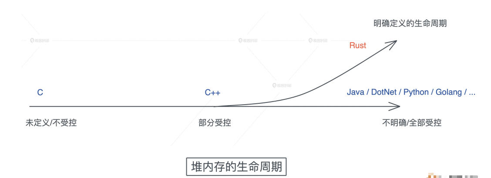

而Rust的创建者们, 重新审视了堆内存的生命周期, 发现大部分堆内存的需求在于动态大小, 小部分的需求是更长的生命周期, 所以它默认将堆内存的生命周期和栈内存的生命周期绑定在一起, 并留了一个小口子leaked机制, 让堆内存在需要的时候, 可以有超出帧存活时期的生命周期

我们看下图的总结对比:

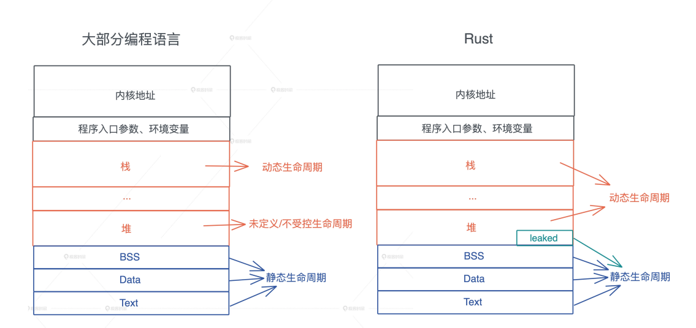

有了这些基本的认知, 我们在看看在值的创建, 使用, 销毁的过程中, Rust是如何管理内存的

希望学习完今天的内容后, 看到一个Rust的数据结构, 你就可以在脑海中大致浮现出, 这个数据结构在内存中的基本布局: 那些字段在栈上, 那些在堆上, 以及它大致的大小

## 值的创建

当我们为数据结构创建一个值的时候, 并将其赋给一个变量, 根据值的性质, 它有可能被创建在栈上, 也有可能创建在堆上

简单回顾一下: 理论上编译时可以确定大小的值都会放在栈上, 包括Rust提供的原生类型比如字符, 数组, 元组等, 以及开发者自定义的固定大小的结构体, 枚举等

如果数据结构的大小无法确定, 或者它的大小确定但是在使用时需要更长的生命周期, 就最好放在堆上

接下来我们来看看struct/enum/vec/String这几种重要的数据类型在创建时的内存布局

**struct**

Rust在内存中排布数据时, 会根据每个域的对齐(aligment)对数据进行重排, 使其内存大小和访问效率最好, 比如, 一个包含ABC三个域的struct, 它在内存中可以能是ACB:

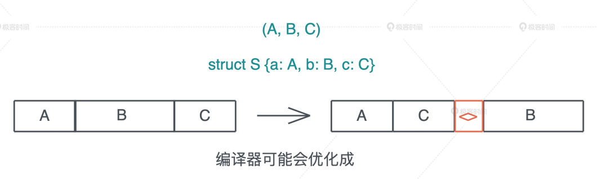

为什么编译器会这么做呢?

我们先看看C语言在内存中表述一个结构体时遇到的问题, 来写一段底阿妈, 其中两个数据结构S1和S2都有三个域abc, 其中a和c是u8, 占用一个字节, b是u16占用两个字节, S1在定义时顺序是abc, 而S2在定义时顺序是acb

猜猜看S1和S2的大小是多少

```c
#include <stdio.h>
struct S1 {
    u_int8_t a;
    u_int16_t b;
    u_int8_t c;
};
struct S2 {
    u_int8_t a;
    u_int8_t c;
    u_int16_t b;
};
void main() {
    printf("size of S1: %d, S2: %d", sizeof(struct S1), sizeof(struct S2));
}
```

正确答案是: 6和4

为什么明明只占用了4个字节, S1的大小确实6呢? 这是因为CPU在加载不对齐的内存时, 性能会急剧下降, 所以要避免用户定义不对齐的数据时, 造成的性能影响

对于这个问题, C语言会对结构体做这样的处理

1. 首先确定每个域的长度和对齐长度, 原始类型的对齐长度和类型长度一致
2. 每个域的起始位置要和气对齐长度对齐, 如果无法对齐, 则添加padding直至对齐
3. 结构体的对齐大小和最大域的对齐大小相同, 而结构体的长度则四舍五入到其对齐长度的倍数

字面上的这三条规则, 你是不是觉得像绕口令, 别担心, 我们结合刚才的代码来看, 其实很容易理解

对于S1, 字段a是u8类型, 所以其长度和对齐都是1, b是u16, 其长度和对齐是2, 然而因为a只占了一个字节, b的偏移量是1, 根据第二条规则, 起始位置和b的长度无法对齐, 所以编辑器会添加一个字节的padding, 让b的偏移为2, 这样b就对齐了

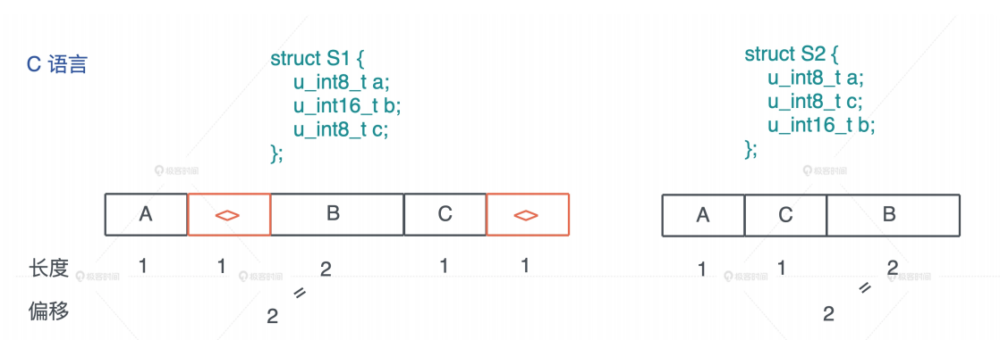

随后c长度和对齐都是1, 不需要padding, 这样算下来S1的大小是5, 但根据上面的第三条规则, S1的对齐是2, 和5最接近的2的倍数是6, 所以最终的长度是6, 起始最后一条规则是为了让S1放在数组中, 可以有效对齐

所以, 如果结构体考虑的不够周全, 会为了对齐浪费很多空间, 我们看到, 保存同样的数据, S1和S2的大小相差了50%

使用C语言的时候, 定义结构体的最佳实践是, 充分考虑每一个域的对齐, 合理的排列它们, 使其内存使用更高效, 这个工作开发者做回归很费劲, 尤其是嵌套的结构体, 需要仔细的计算才能得到最优解

而Rust编译器替我们自动完成了这个优化, 这就是为什么Rust会自动重排你定义的结构来达到最高效率, 我们看同样的代码, 在Rust下, S1和S2的带下都是4

```rust
use std::mem::{align_of, size_of};
struct S1 {
    a: u8,
    b: u16,
    c: u8,
}
struct S2 {
    a: u8,
    c: u8,
    b: u16,
}
fn main() {
    println!("sizeof S1: {}, S2: {}", size_of::<S1>(), size_of::<S2>());
    println!("alignof S1: {}, S2: {}", align_of::<S1>(), align_of::<S2>());
}
```

你也可以看这张图来直观对比, C和Rust的行为:

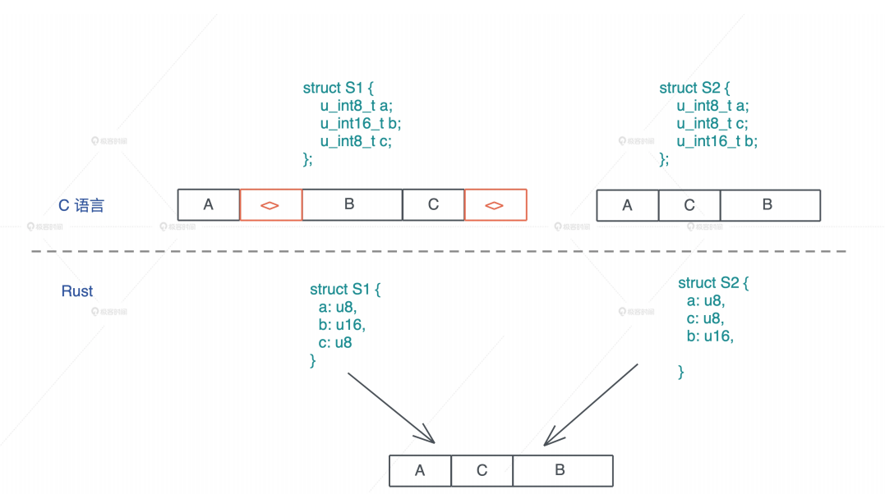

虽然, Rust编译器默认为开发者优化结构体的排列, 你也可以使用`#[repr]`宏, 强制让Rust编译器不做优化, 和C的行为一致, 这样, Rust代码可以方便的和C代码无缝交互

在明白Rust下的struct的布局后(tuple类似), 我们看看enum

**enum**

enum我们之前讲过, 在Rust下它是一个标签联合体(tagged union), 它的大小是标签大小, 加上最大类型的长度

我们定义enum数据结构时, 简单提到有`Option<T>`和`Result<T,E>`两种设计举例, Option是有值/无值这种最简单的枚举类型, Result包括成功返回的数据和错误返回的数据的枚举类型, 后面会详细讲到, 这里我们理解器内存设计就可以了

根据刚才说的第三条对齐规则, tag后的内存, 会根据对齐大小进行对齐, 所以对于`Option<u8>`, 其长度是1 + 1= 2字节, 而`Option<f64>`, 长度是8 + 8 = 16字节, 一般而言, 64位CPU下, enum的最大长度是: 最大类型的长度 + 8, 因为64位CPU的对打对齐是64bit, 也就是8个字节

下图展示了enum, Option和Result的布局

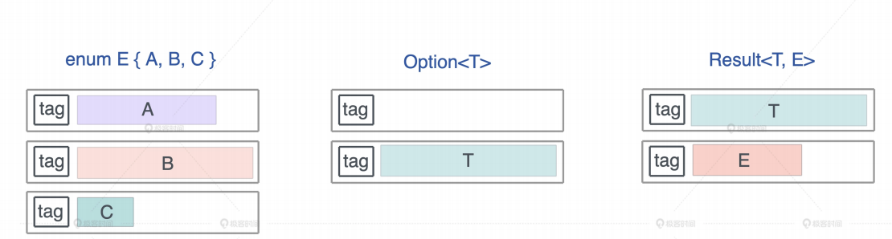

值得注意的是, Rust编译器会对enum做一些额外的优化, 让某些常用的结构的内存布局更紧凑, 我们先来写一段代码, 帮你更好的了解不同的数据结构占用的大小:

```rust
use std::collections::HashMap;
use std::mem::size_of;

enum E {
    A(f64),
    B(HashMap<String, String>),
    C(Result<Vec<u8>, String>),
}

// 这是一个声明宏, 它会打印各种数据结构本身的带下, 在Option中的大小, 以及在Result中的大小
macro_rules! show_size {
    (header) => {
        println!(
            "{:<24} {:>4} {} {}",
            "Type", "T", "Option<T>", "Result<T, io::Error>"
        );
        println!("{}", "-".repeat(64));
    };
    ($t:ty) => {
        println!(
            "{:<24} {:4} {:8} {:12}",
            stringify!($t),
            size_of::<$t>(),
            size_of::<Option<$t>>(),
            size_of::<Result<$t, std::io::Error>>(),
        )
    };
}

fn main() {
    show_size!(header);
    show_size!(u8);
    show_size!(f64);
    show_size!(&u8);
    show_size!(Box<u8>);
    show_size!(&[u8]);

    show_size!(String);
    show_size!(Vec<u8>);
    show_size!(HashMap<String, String>);
    show_size!(E);
}
```

这段代码抱包含了一个声明宏show_size, 我们先不必管它, 运行这段代码时, 你会发现, Option配合带有引用类型的数据结构, 比如&u8, Box, Vec, HashMap, 没有额外的占用空间, 这就很有意思了

```bash
Type                        T Option<T> Result<T, io::Error>
----------------------------------------------------------------
u8                          1        2           16
f64                         8       16           16
&u8                         8        8           16
Box<u8>                     8        8           16
&[u8]                      16       16           16
String                     24       24           24
Vec<u8>                    24       24           24
HashMap<String, String>    48       48           48
E                          56       56           56
```

对于Option结构而言, 它的tag只有两种情况: 0或者1, tag为0时, 表示None, tag为1时, 表示Some

正常来说, 的那个我们把它和一个引用放在一起的时候, 虽然tag只占用一个bit, 但64为CPU下, 引用结构的对齐是8, 所以它自己加上额外的padding, 会占据8个字节, 一共16个字节, 这非常浪费内存, 怎么办呢?

Rust是怎么处理的, 我们知道, 引用类型的第一个域是个指针, 而指针是不可能等于0的, 但是我们可以复用这个指针, 当其为0时, 表示None, 否则是Sime, 减少内存占用, 这是非常巧妙的优化, 我们可以学习

**`vec<T>`和Sting**

从刚才带代码中, 我们也能看到String和`Vec<u8>`占用相同的大小, 都是24字节, 其实, 如果你打开String结构的源码可以看到, 它内部就是`Vec<u8>`

而且`Vec<T>`结构是3个word的胖指针, 包含: 一个指向堆内存指针的pointer, 分配的堆内存的容量capacity, 以及数据在堆内存的长度length, 如下图所示:

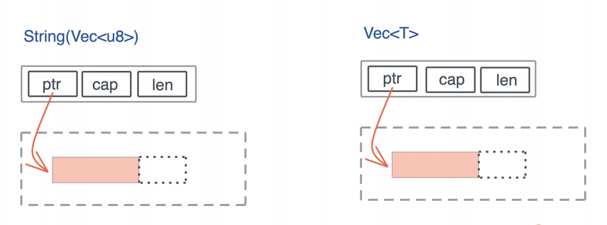

很多动态大小的数据结构, 在创建的时候都有类似的内存布局: 栈内存放的胖指针, 指向堆内存分配出来的数据, 我们之前介绍的Rc也是如此

关于值在创建时的内存布局, 今天就讲怎么多, 如果你对其他结构的内存布局感性却, 可以访问cheat.rs, 它是Rust语言的备忘清单, 非常适合随时翻阅, 比如, 引用类型的内存布局

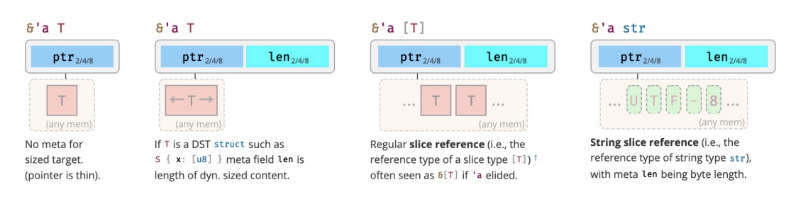

现在只已经创建成功了, 我们对它的内存有了足够的认识, 那在试用期间, 它的内存会发生什么样的变化呢?

## 值的使用

在讲所有权的时候, 我们知道了, 对Rust而言, 一个值如果没有实现Copy trait, 在赋值传参的以及函数返回时会被Move

其实Copy和Move在内部实现上, 都是浅层的按位做内存复制, 只不过Copy trait允许你访问之前的变量, 而Move不允许

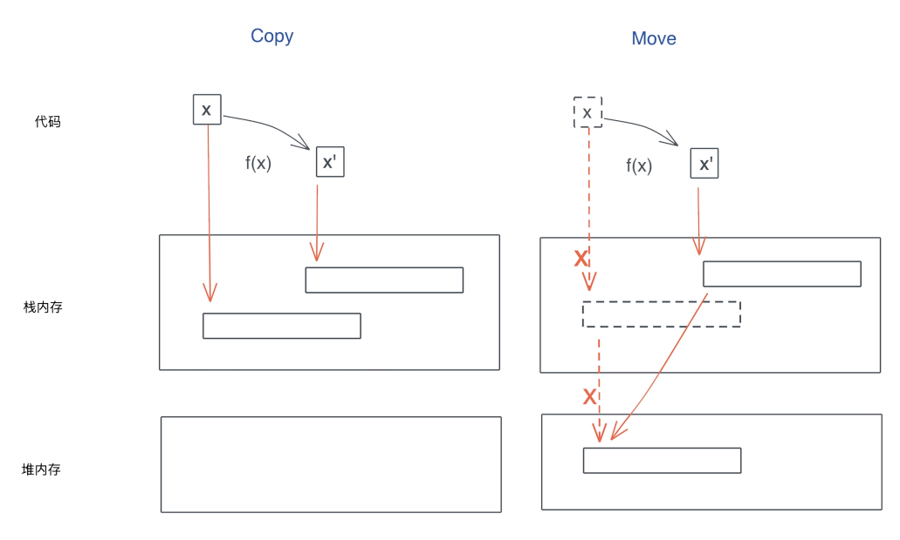

在我们的认知中, 内存复制是个很重的操作, 效率很低, 确实是这样, 如果你的关键路径的每次调用, 都要复制几百K的数据, 比如一个大数组, 是很低效的

但是, 如果你要复制的只是原生类型(Copy)或者栈上的胖指针(Move), 不涉及到堆内存的复制也就是浅拷贝(deep copy), 那这个效率是非常高的, 我们不必担心每次赋值或者每次传参带来的性能损失

所以, 无论是Copy还是Move它的效率都是非常高的

不过也有一个例外, 要说明: 对栈上的大数组传参, 由于需要复制整个数组, 会影响效率, 所以, 我们一般不建议在栈上放大数组, 如果实在需要, 那么传递这个数组的时, 最好用传引用而不是传值

在使用值的过程中, 除了Move, 你还需要注意值的动态增长, 因为Rust下, 集合类型的数据结构, 都会在使用过程中自动拓展

以一个`Vec<T>`为例, 当你使用完堆内存目前的容量后, 还继续添加新的内存, 就会触发堆呢村的自动增长, 有时候, 集合类型里的数据不断进进出出, 导致结合一直增长, 但只使用了很小部分的容量, 内存的使用效率很低, 所以你要考虑使用, 比如strink_to_fit方法, 来节约对内存的使用

## 值的销毁

之前笼统的谈到, 当所有者离开作用域, 它拥有的值会被丢弃, 那从代码层面讲, Rust到底是如何丢弃的呢?

这里用到了Drop trait, Drop trait类似面向对象编程中的析构函数, 当一个值要被释放, 它的Drop trait会被调用, 比如下面的代码, 变量greeting是一个字符串, 在退出作用域时, 其drop函数会被自动调用, 释放堆上包含`hello world`的内存, 然后在释放栈上的内存:

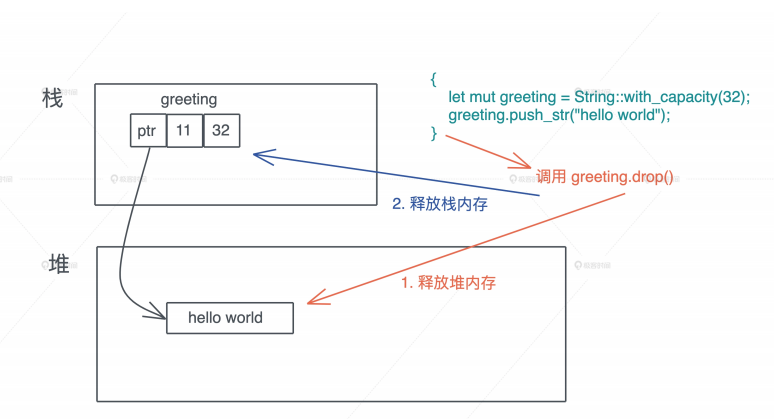

  如果要释放的值是一个复杂的数据结构, 比如一个结构体, 那么这个结构体在调用drop时, 会一次调用一个域的drop函数, 如果域是一个复杂的结构或者集合类型, 就会递归下去, 直到每个域都释放干净

我们可以看这个例子:

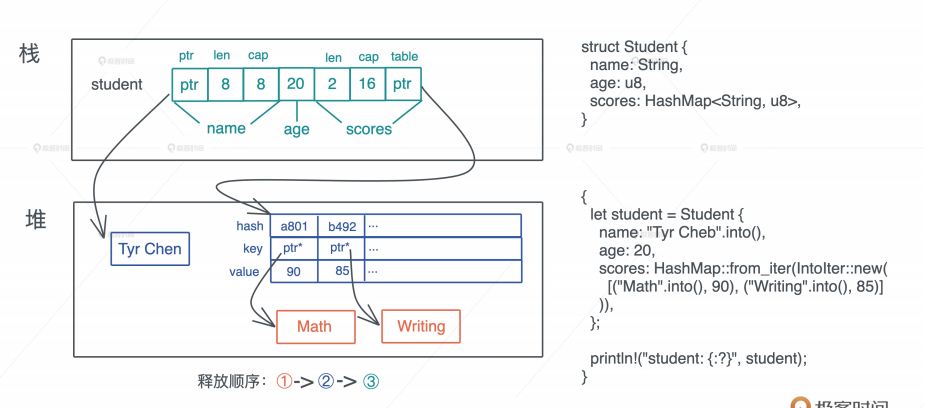

代码中的student变量是一个结构体, 有name, age, scores, 其中name是String, scores是HashMap, 它们本身需要额外的drop, 整个释放顺序从内到外是: 先释放HashMap下的key, 然后释放HashMap堆上的表结构, 最后释放栈上的内存

## 堆内存释放

所有权机制规定了, 一个值只能有一个所有者, 所以在释放对内存的时候, 整个过程简单清晰, 就是单纯调用Drop trait, 不需要有其他顾虑, 这种对值安全, 也没有额外负担的释放能力, 是Rust独有的

我觉得Rust在内存管理的设计特别像蚁群, 每个个体的行为都遵循这非常简单死板的规范, 最终大量简单的个体能构造出一个高效且不出错的系统

反观其他语言, 每个个体或者说值, 都非常灵活, 引用传来传去, 最终却构造出来一个很难分析的复杂系统, 单靠编译器无法决定, 每个值在各个作用域中究竟能不能安全的释放, 导致系统, 要么像C/C++一样将这个重担全部交给开发者, 要么像Java那样构建另一个系统专门应对内存安全释放的问题

在Rust里, 你自定义的数据结构, 对大多数的情况下, 不需要实现自己的Drop trait, 编译器缺省的行为就足够了, 但是, 如果你想自己控制drop行为, 你也可以为这些数据结构实现它

如果你定义的drop函数和系统自定义drop函数都drop某个域, Rust编译器确保, 这个域只会被drop一次, 至于Drop trait怎么实现, 有什么注意事项, 什么场合下自定义, 我们在后续的课程中会在详细介绍

## 释放其他资源

我们刚才将Rust的Drop trait主要是为了堆内存释放的问题, 其实, 它还可以释放任何资源, 比如socket, 文件, 锁等等, Rust对所有资源都有很好的RAII支持

比如我们创建一个文件file, 往里面写入`hello world`, 当file离开作用域的时, 不但它的内存会被释放掉, 它占用的资源, 操作系统打开的文件描述符, 也会被释放, 也就是文件会自动关闭

```rust
use std::fs::File;
use std::io::prelude::*;
fn main() -> std::io::Result<()> {
    let mut file = File::create("foo.txt")?;
    file.write_all(b"hello world")?;
    Ok(())
}
```

在其他语言中, 无论Java, Python,还是Golang, 你都需要显示的关闭文件, 避免资源泄露, 这是因为, 即便GC能够帮助开发者最终释放不在引用的内存, 它并不能释放出内存外的资源

而Rust, 再一次的, 因为其清晰的所有权界定, 是编译器清除的知道: 当一个值离开作用域的时候, 这个值不会有任何人引用, 它占用的任何资源, 包括内存资源, 都可以立即释放, 而不会导致问题

说到这, 你也许觉得不用显式的关闭文件, 关闭socket, 释放锁, 不过是省了close而已, 有什么大不了?

然而, 不要忘了, 在庞大的业务代码中, 还有很大一部分要用来处理错误, 当错误处理搅和进来, 我们面对的代码编辑更复杂, 还需添加close调用的上下文更多, 虽然Python的with, Golang的defer, 可以一定程度上解决释放资源的问题, 但还不够完美

一旦, 多个变量和多种异常或者错误叠加, 我们忘记释放资源的风险敞口会成倍增加, 很多死锁就是这么产生的

从Drop trait中我们再一次看到, 从事物的本原触发解决问题, 会极其优雅的解决掉很多其他关联问题, 好比, 所有权几个简单规则, 就让我们顺带处理了资源释放的大难题

## 小结

我们进一步探讨了Rust的内存管理, 在所有权和生命周期管理的基础上, 介绍了一个值在内存中创建, 使用和销毁的过程, 学习了数据结构在创建时, 是如何在内存中布局的, 大小和对齐之间的关系; 数据在使用过程中, 是如何Move和自动增长的; 以及数据是如何销毁的


数据结构在内存中的布局, 尤其是哪些部分放在栈上, 哪些部分放在堆上, 非常有助于帮助我们理解代码的结构和效率

你不强行记忆这些内容, 只要有个思路, 在需要的时候, 翻阅本文或者cheats.rs即可, 当我们掌握了数据结构的创建, 在使用过程中如何Move或者Copy, 最后如何销毁, 我们在阅读别人代码或者自己撰写代码时就会游刃有余

## 思考题

1. `Result<String, ()>`占用多少内存? 为什么?

   > 还是占用24, 首先()不占内存, Rust编译器会做一些优化, 引用类型的第一个域是个指针, 而指针是不可能为空的, 我们可以复用这个指针: 当其为空的时候, 正好表述Err

