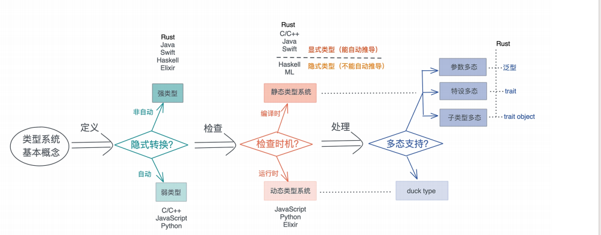
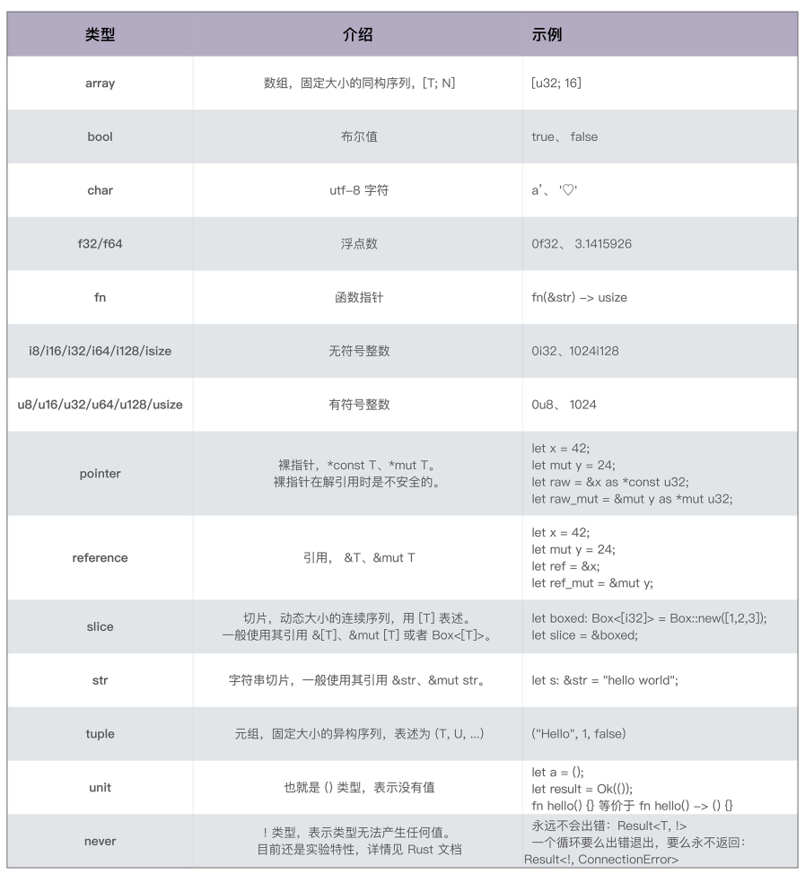
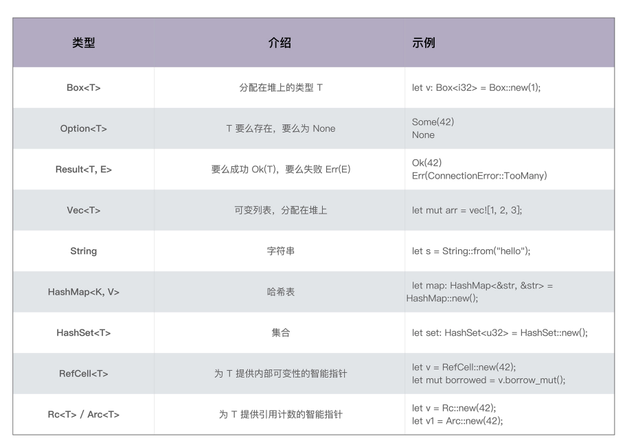
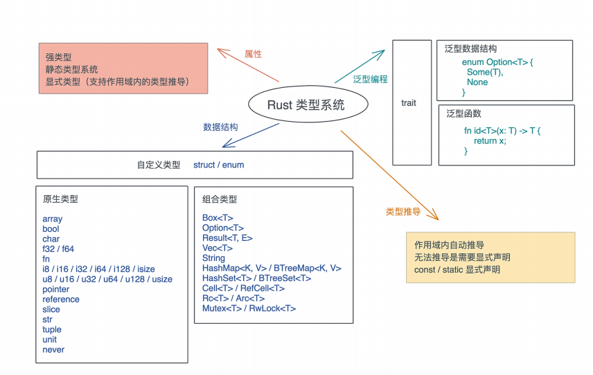

# 类型系统: Rust的类型系统有什么特点

如果你用C/Golang这样不支持泛型的静态语言, 或者用Python/Ruby/JavaScript这样的动态语言, 这个部分可能是一个难点, 希望你做好了转换思维的准备

其实之前的课程中, 我们已经写了不少的Rust代码, 使用了各种各样的数据结构, 相信你对Rust类型系统已经有了一个非常粗浅的印象, 那类型系统是什么? 能用来干什么? 什么时候用? 今天我们来一探究竟

作为一门语言的核心要素, 类型系统很大程序塑造了语言的用户体验以及程序的安全性, 为什么怎么说? 因为在机器码的世界中, 没有类型而言, 指令仅仅和立即数或者内存打交道, 内存中存放的数据都是字节流

所以说, 可以说类型系统完全是一种工具, 编译器在编译时对数据做静态检查, 或者语言在运行时对数据做动态检查的时候, 来保证某个操作处理的数据是开发者期望的数据类型

现在你是不是能理解, 为什么Rust类型系统对类型问题的检查格外严格

## 类型系统的基本概念与分类

在具体讲Rust类型系统之前, 我们先来澄清一些类型的概念, 在基本理解上达成一致

在之前提到过, 类型是对值的区分, 它包含了值在内存中的长度, 对齐以及值可以进行的操作等信息

比如u32类型, 它是一个无符号32位整数, 长度是4个字节, 对齐也是4个字节, 取值在0~4G之间; u32类型实现了加减乘除, 大小比较等接口, 所以我们可以做类似`1 + 2, i <= 3`这样的操作

类型系统其实就是对类型进行定义, 检查和处理的系统, 所以, 按对类型的操作阶段不同, 就有了吧冉的划分标准, 也对应不同的分类, 我们一个个来看

按定义后类型是否可以隐式转换, 可以分为强类型和弱类型, Rust不同类型间不能自动转换是强类型语言

按类型检查时机, 在编译时检查还是运行时检查, 可以分为静态类型系和动态类型系统, 对于静态类型系统, 根据类型是否能够被推导出来, 还可以进一步分为显示静态和隐式静态, 

在类型系统中, 多态是一个非常重要的思想, 它在使用相同的接口时, 不同的类型, 会采用不同的表现

对于动态类型系统, 多态通过鸭子类型实现; 而对于静态类型系统, 多态可以通过参数多态, 特设多态和子类型多态实现

参数多态是指, 代码操作的类型是满足某些约束的参数, 而非具体的类型

特殊多态是指同一种行为有多个不同实现的多态

子类型多态是指, 在运行时, 子类型可以被当成父类型使用

在Rust中, 参数多态通过泛型来实现, 特设多态通过trait来支持, 子类型多态通过trait object来支持, 



## Rust类型系统

掌握了类型的基础概念和分类, 我们在看Rust的类型系统

按刚才不同阶段的分类, 在定义时, Rust不允许隐式转换, 也就是说, Rust是强类型的语言; 同时在检查时机来说, Rust使用了静态类型系统, 在编译器保证类型正确, 强类型加静态语言, 使得Rust是一门类型安全的语言

其实说到类型安全, 我们经常听到这个词语, 但是你真的清除它是什么涵义吗?

从内存的角度来看, 类型安全是指代码, 只能按照被允许的方法, 访问它被授权访问的内存

以一个长度为4, 存放u64数据的数组为例, 访问这个数组的代码, 只能在这个数组的起始地址到数组的结束地址之间这片32个字节的内存中访问, 而且访问是按照8字节来对齐, 另外, 数组中的每个元素, 只能做u64类型允许的操作, 对此, 编译器会对代码进行严格检查来保证这个行为

所以C/C++这样, 定义后的数据可以隐式的转换类型的弱类型语言, 不是内存安全的, 而Rust这样的强类型语言, 是类型安全的, 不会出现开发者不小心引入了一个隐式转换 ,导致读取不正确的数组, 甚至内存访问越界的问题

在此基础上, Rust还进一步对内存的访问进行了读/写分开的授权, 所以Rust下的内存安全更严格: 代码只能按照被允许的方法和被允许的群贤, 访问它被授权访问的内存

为了鸥到这么严格的类型安全, Rust除了let/fn/static/const这些定义性语句外, 都是表达式, 而一切表达式都有类型, 所以可以说在Rust中类型无处不在

你也许会有疑问, 那类型这样的代码, 它的类型是什么?

```rust
if hash_work {
    do_something();
}
```

在Rust中, 对于一个作用域, 无论是if/else/for循环, 还是函数, 最后一个表达式的返回值就是其作用域的返回值, 如果表达式或者函数不返回任何值, 那么它返回一个unit类型, unit是只有一个值的类型, 它的值和类型都是()

像上面这个if块, 它的类型和返回值都是(), 所以当它放在一个没有返回值的函数中:

```rust
fn work(has_work: bool) {
    if has_work {
        do_something();
    }
}
```

Rust类型无处不在这个逻辑还是自洽的

unit的应用非常广泛, 除了违返回值, 它还被大量使用在数据结构中

到这里简单总结一下, 我们了解了Rust是强类型/静态类型语言, 并且在代码中, 类型无处不在

作为静态类型语言, Rust提供了大量的数据类型, 但是在使用的过程中, 进行类型标注是很费劲的, 所以Rust类型系统贴心地提供了类型推导

而对比动态系统, 静态类型系统还比较麻烦的是, 同一个算法, 对于输入的数据结构不同, 需要有不同的实现, 哪怕这些实现没有什么逻辑上的差异, 对于Rust给出的答案是泛型(参数多态)

所以接下来, 我们先看看Rust有哪些基本数据类型, 然后在了解一下类型推导式如何完成的, 最后看Rust是如何支持泛型的

### 数据类型

在之前我们介绍过原生类型和组合类型的定义, 今天我们将详细的介绍一下这两种类型在Rust中的设计

Rust的原生类型包括字符, 整数, 浮点数, 布尔值, 数组, 元祖, 切片, 指针, 引用, 函数等



在原生类型的基础上, Rust标准库还支持非常丰富的组合类型, 我们看看迄今为止我们遇到过的



另外在Rust已有的数据类型的基础上, 你也可以使用结构体和标签联合定义自己的组合类型


### 类型推导

作为静态类型的语言, 虽然能够在编译器保证类型的安全, 但一个很大的不便是, 代码撰写起来很繁杂, 导出都要进行类型声明, 尤其刚刚讲了Rust的数据类型相当多, 所以, 为了减轻开发者的负担, Rust支持局部的类型推导

在一个作用域之内, Rust可以根据变量使用的上下文, 推导出变量的类型, 这样我们就不需要显示的进行类型标注了

在有些情况下编译器无法推导出合适的类型, 我们就需要手动标注, 比如:

```rust
fn main() {
    let numbers = vec![1, 2, 3, 4, 5, 6, 7, 8, 9, 10];
    let even_numbers = numbers
    .into_iter()
    .filter(|n| n % 2 == 0)
    .collect();
    println!("{:?}", even_numbers);
}
```

collect是Iterator trait的方法, 它把一个iterator转化成一个集合, 因为很多集合类型都实现了Iterator, 所以collect究竟要返回什么类型, 编译器是无法从上下文中推断的

所以这段代码是无法编译的, 它会给出如下错误: `consider giving even_nembers a type`

对于这种情况, 我们就无法依赖类型推导来简化代码了, 必须给其一个明确的类型, 所以我们可以使用类型声明

```rust
fn main() {
    let numbers = vec![1, 2, 3, 4, 5, 6, 7, 8, 9, 10];
    let even_numbers: Vec<_> = numbers
    .into_iter()
    .filter(|n| n % 2 == 0)
    .collect();
    println!("{:?}", even_numbers);
}
```

注意这里编译器只是无法推断出集合类型, 但集合类型内部的元素, 还是可以根据上下文得出, 所以我们可以简写为`Vec<_>`

除了给变量一个显式的类型之外, 我们也可以让collect返回一个明确的类型

```rust
fn main() {
    let numbers = vec![1, 2, 3, 4, 5, 6, 7, 8, 9, 10];
    let even_numbers = numbers
    .into_iter()
    .filter(|n| n % 2 == 0)
    .collect::<Vec<_>>();
    println!("{:?}", even_numbers);
}
```

你可以看到, 在泛型函数后使用`::<T>`来强制使用类型T, 这种写法被称为turbofish

```rust
use std::net::SocketAddr;
fn main() {
    let addr = "127.0.0.1:8080".parse::<SocketAddr>().unwrap();
    println!("addr: {:?}, port: {:?}", addr.ip(), addr.port());
}
```

turbofish的写法在很多场景都有优势, 因为在某些上下文中, 你想直接把一个表达式传递给一个函数或者当成一个作用域的返回值

```rust
match data {
    Some(s) => v.parse::<User>()?,
    _ => return Err(...),
}
```

如果User类型在上下文无法推导出来, 有没有turbofish语法, 我们就不得不先给一个局部变量赋值时声明类型, 然后在返回, 这样代码就变得冗余了

有些情况下即使上下午中含有类型的信息, 也需要开发者为变量提供类型, 比如常量和静态变量

```rust
const PI: f64 = 3.1415926;
static E: f32 = 2.71828;
fn main() {
    const V: u32 = 10;
    static V1: &str = "hello";
    println!("PI: {}, E: {}, V {}, V1: {}", PI, E, V, V1);
}
```

这个是因为static/const主要用于定义全局变量, 它们可以在不同的上下文使用, 所以为了代码的可读性, 需要明确的类型声明

## 用泛型实现多态

类型的定义和使用哦我们讲到这里, 刚才说过Rust通过泛型, 来避免开发者为不同的类型提供不同的算法, 一门静态类型语言不支持泛型, 用起来是很痛苦的, 比如我们熟悉的`Vec<T>`如果不支持泛型, 每一个类型都要实现一遍`Vec<T>`么?

所以我们现在来看看Rust对泛型的支持如何, 今天先讲参数多态, 它包含泛型数据结构和泛型函数, 下一节我们在讲特设多态和子类型多态

### 泛型数据结构

Rust对数据结构的泛型, 或者说参数化类型, 有着完整的支持

在过去的学习中, 其实你已经接触到了很多带有类型的数据类型, 这些参数化类型可以极大的增强代码的复用性, 介绍代码的冗余, 几乎所有支持静态类型的系统的现代编程语言, 都支持参数化类型

我们从一个最简单的泛型例子`Optin<T>`开始回顾:

```rust
enum Option<T> {
    SOme(T),
    None
}
```

这个数据结构你应该很熟悉了, T代表了任意类型, 当Option有值时是Some否则是None

在定义刚才这个泛型数据结构的时候, 你有没有这样的感觉, 有点像在定义函数

- 函数是把重复代码中的参数抽取出来, 使其更加通用, 调用函数的时候, 根据参数的不同, 我们得到不同的结果
- 而泛型是把重复数据结构中的参数抽取出来, 在使用泛型类型时, 根据不同的参数, 我们会得到不同的具体类型

再来看一个复杂一点的泛型结构`Vec<T>`的例子, 验证一下这个想法:

```rust
pub struct Vec<T, A: Allocator = Global> {
    buf: RawVec<T, A>,
    len: usize,
}

pub struct RawVec<T, A: Allocator = Global> {
    ptr: Unique<T>,
    cap: uszie,
    alloc: A,
}
```

Vec有两个参数, 一个是T, 是列表里的每个数据的类型, 另一个是A, 它有进一步的限制`A: Allocator`, 也就是说A需要满足Allocator trait

A这个参数有默认值Global, 它是Rust默认的全局分配器, 这也是为什么`Vec<T>`虽然有两个参数, 使用时我们都只需要用T

在讲生命周期标注的时, 我们讲过, 数据类型内部如果有借用的数据, 需要显式的标注生命周期, 其实在Rust里, 生命周期标注也是泛型的一部分, 一个生命周期`'a`代表任意的生命周期, 和T代表的任意类型是一样的

我们来看一个枚举类型`Cow<T>`的例子:

```rust
pub enum Cow<'a, B: ?Sized + 'a> where B: ToOwned,
{
    // 借用的数据
    Borrowed(&'a B),
    // 拥有的数据
    Owned(<B as ToOwned>::Owned),
}
```

Cow是Rust中一个很有意思且很重要的数据结构, 它就像Option一样, 在返回数据的时提供了一种可能: 要么返回一个借用的数据, 要么返回一个拥有所有权的数据

对于拥有所有权的数据B, 第一个是生命周期约束, 这里B的生命周期约束是`'a`, 所以B需要满足`'a`, 这里和泛型一样, 也是用`B: 'a`来保湿, 当Cow内部的类型B生命周期为`'a`时, Cow自己的生命周期也是`'a`

B还有两个约束: `?Sizd`和`where B: ToOwned`

在表述泛型参数的约束时, Rust允许两种方式, 一种类似函数参数的类型声明用冒号来表明约束, 多个约束之间用加号连接; 另一种是使用where字句, 在定义的结尾来表明参数的约束, 两种方法都可以, 且可以共存

`?Sized`是一种特殊的约束写法, `?`代表可以放松问号之后的约束, 由于Rust默认的泛型番薯都需要是Sized, 也就是固定大小的类型, 所以这里`?Sized`代表可变大小的类型

ToOwned是一个trait, 它可以吧借用的数据克隆出来一个拥有所有权的数据

所以这里对B的三个约束是:

- 生命周期`'a`
- 长度可变`?Sized`
- 符合ToOwned trait

最后解释一下Cow这个enum里`<B as ToOwned>::Owned`的含义: 它对B做了一个强制类型转换, 转成了ToOwned trait的子类型, 因而B可以使用ToOwned约束, 所以它是ToOwned trait的子类型, 因为B可以安全的转换成ToOwned

上面Vec和Cow的例子中, 泛型参数的约束都发生在开头struct和enum的定义中, 其实, 很多时候我们也可以在不同的实现下逐步添加约护士, 比如下面的例子:

```rust
use std::fs::File;
use std::io::{BufReader, Read, Result};
// 定义一个带有泛型参数 R 的 reader，此处我们不限制 R
struct MyReader<R> {
    reader: R,
    buf: String,
}
// 实现 new 函数时，我们不需要限制 R
impl<R> MyReader<R> {
    pub fn new(reader: R) -> Self {
        Self {
            reader,
            buf: String::with_capacity(1024),
        }
    }
}
// 定义 process 时，我们需要用到 R 的方法，此时我们限制 R 必须实现 Read trait
impl<R> MyReader<R>
where
R: Read,
{
    pub fn process(&mut self) -> Result<usize> {
        self.reader.read_to_string(&mut self.buf)
    }
}
fn main() {
    // 在 windows 下，你需要换个文件读取，否则会出错
    let f = File::open("/etc/hosts").unwrap();
    let mut reader = MyReader::new(BufReader::new(f));
    let size = reader.process().unwrap();
    println!("total size read: {}", size);
}
```

逐步添加约束, 可以让约束出现在它不得不出现的地方, 这样代码的灵活性最大

### 泛型函数

了解了泛型数据结构是如何定义和使用的, 我们再来看泛型函数, 它们的思想类似, 在声明一个函数的时, 我们还可以不指定具体的参数或者返回值的类型, 而是由泛型参数来代替, 对函数而言这是更高阶的抽象

我们来看一个简单的理解

```rust
fn id<T>(x: T) -> T {
    return x;
}
fn main() {
    let int = id(10);
    let string = id("Tyr");
    println!("{}, {}", int, string);
}
```

对于泛型函数, Rust会进行单态化处理, 也就是编译时, 把所用到的泛型函数的泛型参数展开, 生成若干个函数

单态化的好处是, 泛型函数的调用时静态分派的, 在编译时就一一对应, 即包有多态的灵活性有没有丧失任何效率的损失, 和普通函数一样高效

但是单态化有很明显的坏处, 就是变异速度很慢, 一个泛型函数, 编译器需要将所有用到的不同类型, 一个个编译, 所以Rust的变异速度总被人吐槽, 这和单态化脱不开关系(另一个重要因素是宏)

同时, 这样编出来的二进制会比较大, 因为泛型函数的二进制代码实际存在N份

还有一个你可能不怎么注意的问题: 因为单态化, 代码以二进制分发会损失泛型的信息, 如果我写了一个库, 使用这个库的开发者拿到的是二进制, 那么这个二进制中必须电邮原始的泛型函数才能调用, 但单态化后, 原本的泛型信息就被丢弃了

## 小结

我们今天介绍了类型系统中的一些基本概念以及Rust的类型系统

我们用一张图描述了Rust类型系统的主要特征, 包括其属性, 数据结构, 类型推导和泛型编程:



按类型定义, 检查以及检查时能否被推导出来, Rust是强类型 + 静态类型 + 显式类型

因为是静态类型, 那么在写代码时常用的类型需要牢牢掌握, 为了避免静态类型要出做类型标记的繁琐, Rust提供了类型推导

在少数情况下Rust无法通过上下文进行类型推导, 我们需要为一个变量显式标注类型, 或者通过turbofish语法, 为泛型函数提供一个明确的类型, 有个例外是在Rust代码中定义常量或者静态变量的时候. 即使上下文类型信息非常明确, 也需要显式的进行类型标注

在参数多态上, Rust提供有完整支持的泛型, 你可以使用和定义泛型数据将诶狗, 在声明一个函数的时候, 我们也可以不指定具体的参数或返回值的类型, 而是由泛型参数来代替, 也就是泛型函数, 它们的思想其实差不多, 因为当数据结构可以泛型时, 函数自然也就需要支持发耐性

另外生命周期标注其实也是泛型的一部分, 而对于泛型函数, 在编译时会被单态化, 导致编译速度慢