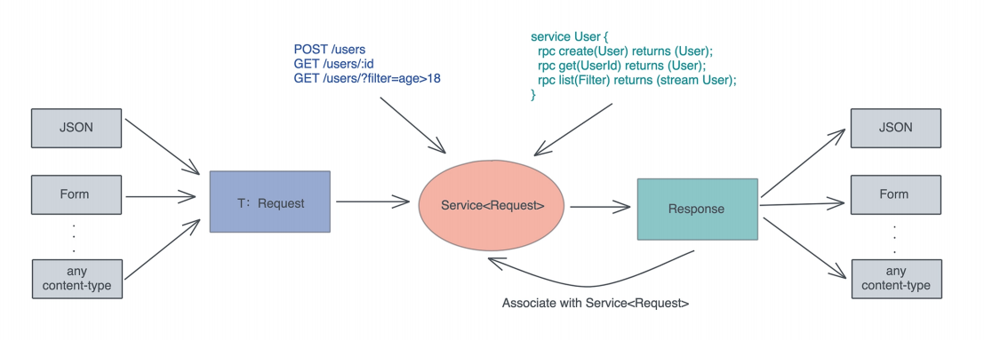
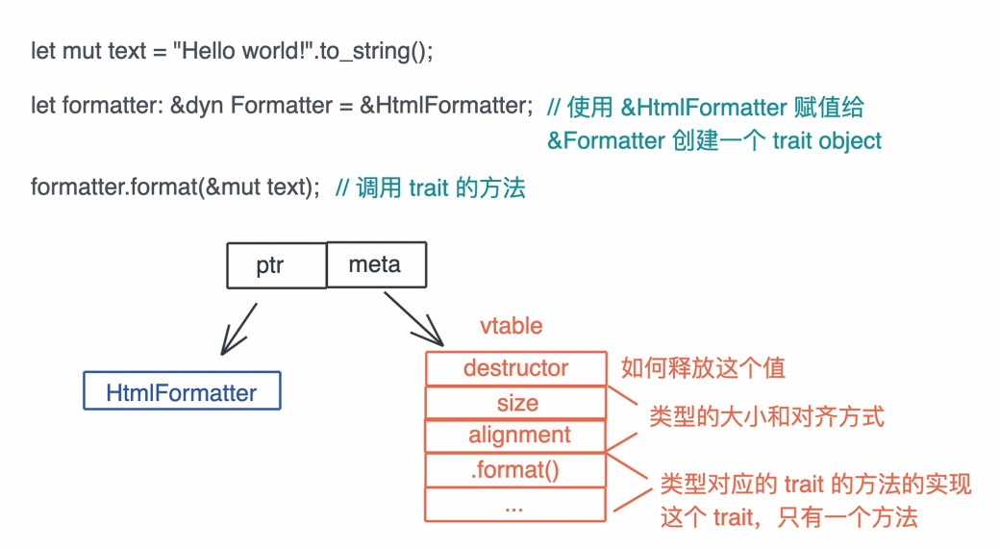
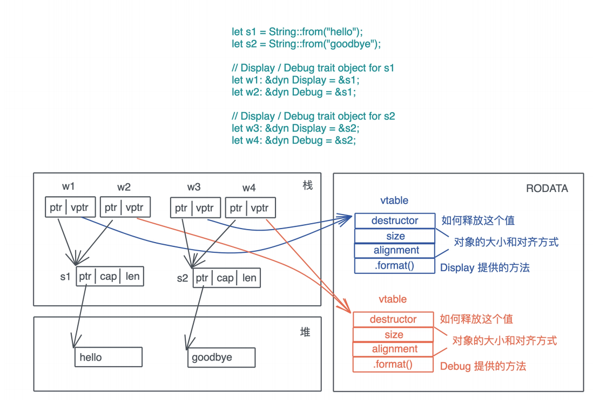

# 类型系统: 如何使用trait来定义接口

在上一节的学习中, 我们对Rust类型系统的本质有了认识, 作为对类型进行定义, 检查和处理的工具, 类型系统保证了某个操作处理的数据类型是我们所希望的

在Rust强大的泛型支持下, 我们可以很方便的定义, 使用泛型数据结构和泛型函数, 并使它们来处理参数多态, 让输入输出的类型更灵活, 增强代码的复用性

今天我们继续讲多态中另外两种方式: 特设多态和子类型多态, 看看它们能用来解决什么问题, 如何实现, 如何使用

如果你不太记得这两种多态的定义, 我们简单回顾一下: 特设多态抱愧运算符重载, 是指同一种行为有很多不同的实现; 而把子类型当成父类型使用, 属于子类型多态

这两种多态的实现在Rust中都和trait有关, 所以我们得先来了解一下trait是什么, 再看看怎么用trait来处理这两种多态

## 什么是trait

trait是Rust中的接口, 它定义了类型使用这个接口的行为, 你可以类比到自己熟悉的语言中理解

在开发复杂系统的时候, 我们常常会强调接口和实现要分离, 因为这是一种良好的设计习惯, 它把调用者和实现着隔离开, 双方只要按照接口开发, 彼此就可以不受对方内部改动的影响

trait就是这样, 它可以把数据结构中的行为单独抽取出来, 使其可以在多个类型之间共享; 也可以作为约束, 限制参数化类型必须符合它规定的行为

### 基本trait

我们来看看基本trait如何定义, 这里以标准库中`std::io::Write`为例, 可以看到这个trait中定义了一系列方法的接口:

```rust
pub trait Write {
    fn write(&mut self, buf: &[u8]) -> Result<usize>;
    fn flush(&mut self) -> Result<()>;
    fn write_vectored(&mut self, bufs: &[IoSlice<'_>]) -> Result<usize> { ...
    fn is_write_vectored(&self) -> bool { ... }
    fn write_all(&mut self, buf: &[u8]) -> Result<()> { ... }
    fn write_all_vectored(&mut self, bufs: &mut [IoSlice<'_>]) -> Result<()> {
    fn write_fmt(&mut self, fmt: Arguments<'_>) -> Result<()> { ... }
    fn by_ref(&mut self) -> &mut Self where Self: Sized { ... }
}
```

这些方法也被称作关联函数, 在trait中方法可以有缺省的实现, 对于这个Write trait, 你只需要实现write和flush两个方法, 其他都有缺省实现

如果你把trait类比为父类, 实现trait的类型类比子类, 那么缺省实现的方法就相当于子类可以重载但不是必须重载的方法

在刚才定义方法的时候, 我们频繁的看到两个特殊的关键字: Self和self

- Self代表当前的类型, 比如File类型实现了Write, 那么实现过程中使用到的Self就指代File
- self在用作方法的第一个参数时, 实际上是`self: Self`的简写, 所以`&self: &Self`, `&mut self: &mut Self`

光讲定义, 理解不太深刻, 我们构建一个BufBuilder结构实现Write trait, 结合代码来说明:

```rust
use std::fmt;
use std::io::Write;

struct BufBuilder {
    buf: Vec<u8>,
}

impl BufBuilder {
    pub fn new() -> Self {
        Self {
            buf: Vec::with_capacity(1024),
        }
    }
}

impl fmt::Debug for BufBuilder {
    fn fmt(&self, f: &mut fmt::Formatter<'_>) -> fmt::Result {
        write!(f, "{}", String::from_utf8_lossy(&self.buf))
    }
}

impl Write for BufBuilder {
    fn write(&mut self, buf: &[u8]) -> std::io::Result<usize> {
        // 把buf添加到BufBuilder的尾部
        self.buf.extend_from_slice(buf);
        Ok(buf.len())
    }

    fn flush(&mut self) -> std::io::Result<()> {
        // 由于是在内存中操作, 所以不需要flush
        Ok(())
    }
}

fn main() {
    let mut buf = BufBuilder::new();
    buf.write_all(b"Hello World!").unwrap();
}
```

从代码中可以看到, 我们实现了write和flush方法, 其他的方法都用缺省实现, 这样BufBuilder对Write trait的实现是完整的, 如果没有实现write或者flush, Rust编译器会报错

数据结构一旦实现了某个trait, 那么这个trait内部的方法都可以被使用, 比如这里我们调用了`buf.write_all`

那么`write_all`是如何被调用的呢? 我们看看`write_all`的签名

```rust
fn write_all(&mut self, buf: &[u8]) -> Result<()>
```

它接受两个参数: `&mut self`和`&[u8]`, 第一个采纳数传递的是buf这个变量的可变引用, 第二个参数是传递的是`b"Hello World!"`

### 基本trait练习

假设我们要做一个字符串解析器, 可以把字符串某部分解析成某个类型, 那么可以这么定义一个trait: 它有一个方法是parse, 这个方法接收一个字符串引用, 返回Self

```rust
pub trait Parser {
    fn parse(s: &str) -> Self;
}
```

这个parse方法是trait的静态方法, 因为它的第一个参数和self无关, 所以调用时需要使用`T::parse(str)`

我们来尝试为u8这个数据类型来实现Parse, 比如说: `123abc`解析出整数123, 而`abcd`解析出0

要达到这个目的, 需要引入一个新的库Regex使用正则表达式提取需要的内容, 除此之外, 还需要使用`str::parse`函数把一个包含数字的字符串转换成数字

```rust
use regex::Regex;

pub trait Parser {
    fn parse(s: &str) -> Self;
}

impl Parser for u8 {
    fn parse(s: &str) -> Self {
        let re = Regex::new(r"^[0-9]+").unwrap();
        if let Some(captures) = re.captures(s) {
            // 取第一个match, 将其捕获的digits转换成u8
            captures
                .get(0)
                .map_or(0, |s| s.as_str().parse().unwrap_or(0))
        } else {
            0
        }
    }
}

#[test]
fn parse_should_work() {
    assert_eq!(u8::parse("123abcd"), 123);
    assert_eq!(u8::parse("abcd"), 0);
    assert_eq!(u8::parse("1234abcd"), 1234);
}

fn main() {
    println!("result: {}", u8::parse("255 hello world"));
}
```

这个实现并不难, 如果你感兴趣的话, 可以在尝试为f64实现这个Parse trait

在实现f64的过程中, 你是不是觉得除了类型和用于捕获的regex略有变化外, 整个代码和上面的代码是重复的,

我们可以使用泛型编程, 所以在实现trait的时候,, 也可以用泛型参数来实现trait, 需要注意的是, 要对参数要做一定的限制

- 不是任何类型都可以通过字符串解析出来, 在例子中, 我们只能处理数字类型, 并且这个类型还要能被`str::parse`处理
  - 具体看文档, `str::parse`是一个泛型函数, 它返回了实现了FromStr trait的类型, 所以这里对泛型参数的第一个限制是, 它必须实现了FromStr trait
- 上面代码当无法正确解析字符串的时候, 会直接返回0, 表示无法处理, 但我们使用泛型参数后, 无法返回0, 因为0不一定是某个符合泛型参数的类型中的一个值, 怎么办?
  - 其实返回0的目的是为处理不了的情况, 返回一个缺省值, 在Rust标准库中有Default trait, 绝大多数的类型都实现了这个trait, 来为数据结构提供缺省值, 所以泛型参数的另一个限制是Default

基本的思路有了, 来看看代码吧

```rust
use regex::Regex;
use std::str::FromStr;

pub trait Parser {
    fn parse(s: &str) -> Self;
}

impl<T> Parser for T
where
    T: Default + FromStr,
{
    fn parse(s: &str) -> Self {
        let re = Regex::new(r"^[0-9]+(\.[0-9]+)?").unwrap();
        // 生成一个创建缺省值闭包, 这里主要是为了简化后续的代码
        // Default::default()返回的类型根据上下文能够推导出来
        // 而我们约定了Self, 也就是T, 是Default trait
        let d = || Default::default();
        if let Some(capture) = re.captures(s) {
            capture
                .get(0)
                .map_or(d(), |s| s.as_str().parse().unwrap_or(d()))
        } else {
            d()
        }
    }
}

#[test]
fn parse_should_work() {
    assert_eq!(u8::parse("123abcd"), 123);
    assert_eq!(u8::parse("abcd"), 0);
    assert_eq!(u8::parse("1234abcd"), 1234);
}

fn main() {
    println!("result: {}", u8::parse("255 hello world"));
}
```

通过带有约束的泛型参数实现trait, 一份代码就实现了`u32/f64`等类型的Parse trait, 非常精简, 不过, 看这段代码你有没有感觉还是有些问题, 当无法正确解析字符串的时候, 我们返回了缺省值, 难道不应该返回一个错误么?

所以更好的方式是parse函数返回一个`Result<T, E>`:

```rust
pub trait Parse {
    fn parse(s: &str) -> Result<Self, E>;
}
```

但这里的Result的E让人犯难了: 要返回的错误信息, 在trait定义时并不确定, 不同的实现着可以使用不同的错误类型, 这里的trait的定义者最好能把这种灵活性留给trait的实现着, 怎么办?

既然trait中内部包含方法, 也就是关联函数, 是不是也有关联类型呢? 这是肯定的

### 带关联类型的trait

Rust允许trait内部包含一个关联类型, 实现时跟关联函数一样, 它也需要实现关联类型, 我们看怎么为Parse trait添加关联类型

```rust
pub trait Parse {
    type Error;
    fn parse(s: &str) -> Result<Self, Self::Error>;
}
```

有了关联类型Error, Parse trait就可以在出错的时候返回合理的错误了:

```rust
use regex::Regex;
use std::str::FromStr;

pub trait Parser {
    type Error;
    fn parse(s: &str) -> Result<Self, Self::Error>
    where
        Self: Sized;
}

impl<T> Parser for T
where
    T: Default + FromStr,
{
    type Error = String;
    fn parse(s: &str) -> Result<Self, Self::Error>
    where
        Self: Sized,
    {
        let re = Regex::new(r"^[0-9]+(\.[0-9]+)?").unwrap();
        if let Some(capture) = re.captures(s) {
            capture
                .get(0)
                .map_or(Err("failed to capture".to_string()), |s| {
                    s.as_str()
                        .parse()
                        .map_err(|_err| "failed to parse capture string".to_string())
                })
        } else {
            Err("failed to parse string".to_string())
        }
    }
}

#[test]
fn parse_should_work() {
    assert_eq!(u8::parse("123abcd"), Ok(123));
}

fn main() {
    println!("result: {:?}", u8::parse("255 hello world"));
}
```

上面的代码中, 我们允许用户把错误类型延迟到trait实现时才决定, 这种带有关联类型的trait比普通trait更加灵活, 抽象度更高

trait方法里的参数或者返回值, 都可以用关联类型来描述, 而在实现有关联类型的trait时, 只需要额外提供关联类型具体的类型即可

### 支持泛型的trait

到目前为止我们一步步的了解了基础的trait定义, 使用, 以及更为复杂灵活的带关联类型的trait, 所以结合上一讲介绍的泛型, 你有没有想到这个问题: trait的定义是不是可以支持泛型

比如要定义一个Concat trait允许数据结构拼接起来, 那么自然而然的, 我们希望String可以和String拼接, 和`&str`拼接, 甚至和任何能转换成String的数据结构拼接, 这个时候, 就需要Trait支持泛型了

来看看标准库里的操作符是如何重载的, 以`std::ops::Add`这个用于提供加法运算的trait为例:

```rust
pub trait Add<Rhs = Self> {
    type Output;
    #[must_use]
    fn add(self, rhs: Rhs) -> Self;:Output;
}
```

这个trait有一个泛型参数Rhs, 代表加号右边的值, 它被用在add方法的第二个参数为, 这里Rhs默认是Self, 也就是说你用Add trait, 如果不提供泛型参数, 那么加号右值和左值都要是相同的类型

我们来定义一个复数类型, 尝试使用下这个trait

```rust
use std::ops::Add;

#[derive(Debug)]
struct Complex {
    real: f64,
    imagine: f64,
}

impl Complex {
    pub fn new(real: f64, imagine: f64) -> Self {
        Self { real, imagine }
    }
}

// 对Complex类型的实现
impl Add for Complex {
    type Output = Self;

    // 注意add的第一个参数self, 会移动所有权
    fn add(self, rhs: Self) -> Self::Output {
        let real = self.real + rhs.real;
        let imagine = self.imagine + rhs.imagine;

        Complex::new(real, imagine)
    }
}

fn main() {
    let c1 = Complex::new(1.0, 1_f64);
    let c2 = Complex::new(2 as f64, 3.0);
    println!("{:?}", c1 + c2);
}
```

复数类型有实部和虚部, 两个复数实部相加, 虚部相加, 得到一个新的复数, 注意add的第一个参数是self, 它会移动所有权, 所以调用完两个c1+c2后, 根据所有权规则, 它就无法使用了

我们也可以Complex的引用实现该规则:

```rust
use std::ops::Add;

#[derive(Debug)]
struct Complex {
    real: f64,
    imagine: f64,
}

impl Complex {
    pub fn new(real: f64, imagine: f64) -> Self {
        Self { real, imagine }
    }
}

// 对Complex类型的实现
impl Add for &Complex {
    type Output = Complex;

    // 注意add的第一个参数self, 会移动所有权
    fn add(self, rhs: Self) -> Self::Output {
        let real = self.real + rhs.real;
        let imagine = self.imagine + rhs.imagine;

        Complex::new(real, imagine)
    }
}

fn main() {
    let c1 = Complex::new(1.0, 1_f64);
    let c2 = Complex::new(2 as f64, 3.0);
    println!("{:?}", &c1 + &c2);
}
```

这样所有权就不会移动了

说了怎么多, 你可能有疑问了, 这里都只使用了缺省的泛型参数, 那定义泛型有什么用吗?

我们用加法的实际例子, 来回答这个问题, 之前都是两个复数的相加, 现在设计一个复数和一个实数直接相加, 相加的结果是实部与实数相加, 虚部不变

```rust
impl Add<f64> for &Complex {
    type Output = Complex;

    fn add(self, rhs: f64) -> Self::Output {
        let real = self.real + rhs;
        Complex::new(real, self.imagine)
    }
}

fn main() {
    let c1 = Complex::new(1.0, 1_f64);
    let c2 = Complex::new(2 as f64, 3.0);
    println!("{:?}", &c1 + &c2);
    println!("{:?}", &c1 + 2.0);
}
```

通过使用Add, 为Complex实现了和f64相加的方法, 所以泛型trait, 你局知道这个支持有多强大了

`tower::Service`是一个第三方库, 它定义了一个精巧的用户处理请求, 返回响应的经典trait, 在不少著名的第三方网络库中都有使用, 比如处理gRPC的tonic

看Service的定义:

```rust
// Service trait 允许某个 service 的实现能处理多个不同的 Request
pub trait Service<Request> {
    type Response;
    type Error;
    // Future 类型受 Future trait 约束
    type Future: Future;
    fn poll_ready(
        &mut self,
        cx: &mut Context<'_>
    ) -> Poll<Result<(), Self::Error>>;
    fn call(&mut self, req: Request) -> Self::Future;
}
```

这个trait允许某个Service能处理不同的Request, 我们在Web开发中使用该trait的话, 每个Method+URL可以定义为一个Service, 其Request是输入类型

注意对于某个确定的Request类型, 只会返回一种Response, 所以这里Resposne使用的关联类型, 而非泛型, 如果有可能返回多个Response, 那么应该使用泛型`Service<Request, Response>`



### trait的继承

在Rust中一个trait可以继承另一个trait的关联类型和关联函数, 比如trait B: A, 是说任何的类型的T, 如果实现了trait B, 它也必须实现了trait A, 换句话说, trait B在定义时可以使用trait A中的关联类型和方法

可继承对拓展trait的能力很有帮助, 很多常见的trait都会使用trait继承来提供更多的能力, 比如tokio库中的AsyncWriteExt, futures库中的StreamExt

以StreamExt为例, 由于StreamExt中的方法都有缺省的实现, 且所有实现了StreamExt trait都实现了Stream trait

```rust
impl<T: ?Sized> StreamExt for T where T: Stream {}
```

到这里, 基本的trait就基本讲完了, 简单的总结一下, trait作为对不同数据结构中相同行为的一种抽象, 除了基本的trait之外:

- 当行为和具体的数据关联时, 我们使用关联类型, 把和行为有关的数据类型定义, 进一步延迟到trait实现的时候
- 对于同一个类型的同一个trait行为, 可以有不同的实现, 比如我们之前大量使用的From, 此时可以用泛型trait

可以说Rust的trait就像一把瑞士军刀, 把需要定义接口的各种场景都考虑进去了

而特设多态是同一种行为的不同实现, 所以, 通过定义trait以及为不同的类型实现这个trait, 我们就已经实现了特设多态

刚刚讲过的Add trait就是一个典型的特设多态, 同样是加法操作, 根据操作数据的不同进行不同的处理, Service trait是一个不那么明显的特设多态, 同样是Web请求对于不同的URL, 我们使用不同的代码去处理

## 如何做子类型多态

从严格意义上来说, 子类型多态是面向对象语言的专利, 如果一个对象A是对象B的子类, 那么A的实例可以出现在任何期望B的实例的上下文中

Rust虽然没有父类和子类, 但trait和实现trait的类型之间也是类似的关系, 所以Rust也可以子类型多态

```rust
struct Cat;
struct Dog;

trait Animal {
    fn name(&self) -> &'static str;
}

impl Animal for Cat {
    fn name(&self) -> &'static str {
        "Cat"
    }
}

impl Animal for Dog {
    fn name(&self) -> &'static str {
        "Dog"
    }
}

fn name(animal: impl Animal) -> &'static str {
    animal.name()
}

fn main() {
    let cat = Cat;
    println!("cat: {}", name(cat));
}
```

这里`impl Animal`是`T: Animal`的简写, 所以name函数的定义和以下定义等价:

```rust
fn name<T: Animal>(animal: T) -> &'static str;
```

上一节提到过, 这种泛型函数会根据具体使用的类型被单态化, 编译成多个实例, 是静态分派

静态分派固然好, 效率很高, 但很多时候, 类型可能很难再编译时决定, 比如说要撰写一个格式化工具, 这个IDE里很常见, 我们可以定义一个Format接口, 然后接口创建一系列的实现:

```rust
pub trait Formatter {
    fn format(&self, input: &mut String) -> bool;
}

struct MarkdownFormatter;
impl Formatter for MarkdownFormatter {
    fn format(&self, input: &mut String) -> bool {
        input.push_str("\nformatted with Markdown formatter");
        true
    }
}
struct RustFormatter;
impl Formatter for RustFormatter {
    fn format(&self, input: &mut String) -> bool {
        input.push_str("\nformatted with Rust formatter");
        true
    }
}
struct HtmlFormatter;
impl Formatter for HtmlFormatter {
    fn format(&self, input: &mut String) -> bool {
        input.push_str("\nformatted with HTML formatter");
        true
    }
}
```

首先, 使用什么格式化方法, 只有当打开文件, 分析出文件内容之后才能确定, 我们无法在编译期给出一个具体的类型, 其次, 一个文件的可能有一到多个格式化工具, 比如一个Markdown文件里有Rust代码, 同时需要MarkdownFormatter和RustFormatter来格式化

这里如果使用一个`Vec<T>`来提供所有需要的格式化工具, 那么, 下面这个函数其formatters参数该如何确定类型呢?

```rust
pub fn format(input: &mut String, formatters: Vec<???>) {
    for formatter in formatters {
        formatter.format(input);
    }
}
```

正常情况下, `Vec<>`容器里的类型需要是一至的, 但此处无法给定一个一致的类型

所以我们要有一种手段, 告诉编译器, 此处需要并且仅需要任何实现Formatter接口的数据类型, 在Rust里, 这种类型叫做Trait Object, 表现为`&dyn Trait`或者`Box<dyn Trait>`

这里, dyn关键字只是用来帮助我们更好的区分普通类型和Trait类型, 阅读代码的时候, 看到dyn就知道后面跟的是一个trai了

于是上述代码就可以写成

```rust
pub fn format(input: &mut String, formatters: Vec<&dyn Formatter> {
    for formatter in formatters {
        formatter.format(input);
    }
}
```

这样可以在运行时, 构造一个Formatter的列表, 传递给format函数进行文件的格式化, 这就是动态分派(dynamic dispatching)

看最终调用格式化工具的代码:

```rust
pub trait Formatter {
    fn format(&self, input: &mut String) -> bool;
}

struct MarkdownFormatter;
impl Formatter for MarkdownFormatter {
    fn format(&self, input: &mut String) -> bool {
        input.push_str("\nformatted with Markdown formatter");
        true
    }
}
struct RustFormatter;
impl Formatter for RustFormatter {
    fn format(&self, input: &mut String) -> bool {
        input.push_str("\nformatted with Rust formatter");
        true
    }
}
struct HtmlFormatter;
impl Formatter for HtmlFormatter {
    fn format(&self, input: &mut String) -> bool {
        input.push_str("\nformatted with HTML formatter");
        true
    }
}

pub fn format(input: &mut String, formatters: Vec<&dyn Formatter>) {
    for formatter in formatters {
        formatter.format(input);
    }
}

fn main() {
    let mut input = "Hello World!".to_string();
    let formatters: Vec<&dyn Formatter> = vec![&MarkdownFormatter, &RustFormatter, &HtmlFormatter];
    format(&mut input, formatters);
    println!("{}", input);
}
```

这个实现是不是很简单? 学到这里你在兴奋之余, 不知道会不会感觉有点负担, 有一个Rust的新名词出现, 别担心, 虽然Trait Object虽然是Rust独有的概念, 但是这个概念并不新鲜, 为什么这么说呢? 来看它的实现机理

### Trait Object的实现机理

当需要使用Formatter trait做动态分派的时候, 可以像如下的例子一样, 将一个具体的类型引用, 赋给`&Formatter`



HtmlFormatter的引用赋给Formatter后, 会生成一个Trait Object, 在上图中可以看到, Trait Object的底层逻辑就是胖指针, 其中一个指针指向数据本身, 另一个则指向虚函数表(vtable)

vtable是一张静态的表, Rust在编译时候会为每种类型的每个trait实现生成一张表, 放在可执行文件中(一般在TEXT或RODATA段), 看下图可以帮助你理解:



在这张表里, 包含具体类型的一些信息, 如size, aligment以及一系列函数指针:

- 这个接口支持所有的方法, 比如format
- 具体类型的drop trait, 当Trait Object被释放, 它用来释放其使用的所有资源

这样当运行时执行`formatter.format()`时, formatter就可以从vtable里找到对应的函数指针, 执行具体的操作

所以Rust里的Trait Object没有什么神秘的, 它不过是我们熟知C++/Java中的vtable变体而已

这里说句题外话, C++/Java指向vtable的指针, 在编译时放在类结构里, 而Rust放在Trait Object中, 这也是为什么Rust很容易时间动态分派, 而C++/Java不行

事实上, Rust也并不区分原生类型和组合类型, 对Rust来说, 所有类型的地位都是一致的

不过你使用trait object的时候要注意对象安全(object safety), 只有满足对象安全的trait才能使用trait object

那什么样的trait不是对象安全的呢?

如果trait的所有的方法, 返回值是Self或者携带泛型参数, 那么这个trait就不能产生trait object

不允许返回Self, 是因为trait object在产生时, 原来的类型会被抹去, 所以Self究竟是谁不知道, 比如Clone trait中的clone, 返回Self, 所以它就不能产生trait

不允许携带泛型参数, 是因为Rust里带泛型的类型在编译时会做单态化, 而trait object是运行时的产物, 两者不能兼容

比如Form trait, 因为整个trait带了泛型, 每个方法也自然包含泛型, 就不能产生trait object, 如果一个trait只有部分方法返回Self或者使用了泛型参数, 那么这部分在trait object中不能使用

## 小结

今天完整的介绍了trait是如何定义和使用的, 包括最基本的trait, 带关联的trait, 以及泛型trait, 我们还回顾了trait做静态分发以及使用triat object做动态分发


triat作为对不同数据结构的一种抽象, 它可以让我们在开发时, 通过用户需求, 先敲定系统的行为, 把这些行为抽象成trait, 之后在慢慢确定要使用的数据结构, 以及如何为数据结构实现这些trait

所以, trait是你做Rust开发的核心元素, 什么时候使用trait, 需要根据需求来确定

但是需求往往不是那么明确的, 尤其是因为我们要把用户需求翻译成系统设计上的需求, 这种翻译能力, 得到足够多源码的阅读和思考, 以及足够丰富的历练, 一点点累计起来

因为Rust的trait在强大, 也只是一把瑞士军刀, 能让它充分发挥作用的是持有它的那个人

## 延伸阅读

使用trait有两个注意规则:

- 在定义和使用trait的时候, 我们需要遵循孤儿规则
  - trait和实现trait的数据类型, 至少有一个是当前create中定义的, 也就是说, 你不能为第三方类型实现的第三方trait, 当你尝试这么做时, Rust编译器会报错, 我们可以使用newtype来解决这个问题

## 思考题

1. 对于`Add<Rhs> trait`, 如果我们不使用泛型, 把Rhs作为Add trait的关联类型, 可以么? 为什么?

   > 不可以, 因为trait只能被具体的类型实现一次, 如何我们向实现不同类型的相加就只能使用泛型

2. 如下代码能编译通过吗, 为什么?

   ```rust
   use std::{fs::File, io::Write};
   fn main() {
       let mut f = File::create("/tmp/test_write_trait").unwrap();
       let w: &mut dyn Write = &mut f;
       w.write_all(b"hello ").unwrap();
       let w1 = w.by_ref();
       w1.write_all(b"world").unwrap();
   }
   ```

   > 不可以, 返回类型中的 Self 需要是Sized, 而 dyn Write 不是Sized

3. 在Complex的例子中, `c1 + c2`到导致所有权移动, 所以我们还是用了`&c1 + &c2`来避免这种行为, 初次之外, 你还什么方法能够让`c1 + c2`执行完杭州继续使用吗? 如何修改Complex的代码实现这个功能

   > 限制实现接口之前先实现`Copy + Clone`

4. 学有余力的同学可以挑战一下，Iterator 是 Rust 下的迭代器的 trait，你可以阅读

   Iterator 的文档获得更多的信息。它有一个关联类型 Item 和一个方法 next() 需要实现，

   每次调用 next，如果迭代器中还能得到一个值，则返回 Some(Item)，否则返回 None。

   请阅读如下代码，想想看如何实现 SentenceIter 这个结构的迭代器？

   ```rust
   struct SentenceIter<'a> {
       s: &'a mut &'a str,
       delimiter: char,
   }
   impl<'a> SentenceIter<'a> {
       pub fn new(s: &'a mut &'a str, delimiter: char) -> Self {
           Self { s, delimiter }
       }
   }
   impl<'a> Iterator for SentenceIter<'a> {
       type Item; // 想想 Item 应该是什么类型？
       fn next(&mut self) -> Option<Self::Item> {
           // 如何实现 next 方法让下面的测试通过？
           todo!()
       }
   }
   #[test]
   fn it_works() {
       let mut s = "This is the 1st sentence. This is the 2nd sentence.";
       let mut iter = SentenceIter::new(&mut s, '.');
       assert_eq!(iter.next(), Some("This is the 1st sentence."));
       assert_eq!(iter.next(), Some("This is the 2nd sentence."));
       assert_eq!(iter.next(), None);
   }
   fn main() {
       let mut s = "a。 b。 c";
       let sentences: Vec<_> = SentenceIter::new(&mut s, '。').collect();
       println!("sentences: {:?}", sentences);
   }
   ```

   ```rust
   struct SentenceIter<'a> {
       s: &'a mut &'a str,
       delimiter: char,
   }
   impl<'a> SentenceIter<'a> {
       pub fn new(s: &'a mut &'a str, delimiter: char) -> Self {
           Self { s, delimiter }
       }
   }
   impl<'a> Iterator for SentenceIter<'a> {
       type Item = &'a str; // 想想 Item 应该是什么类型？
       fn next(&mut self) -> Option<Self::Item> {
           // 如何实现 next 方法让下面的测试通过？
           if self.s.is_empty() {
               return None;
           }
   
           match self.s.find(self.delimiter) {
               Some(pos) => {
                   let len = self.delimiter.len_utf8();
                   let s = &self.s[..pos + len];
                   let suffix = &self.s[pos + len..];
                   *self.s = suffix;
                   Some(s.trim())
               }
               None => {
                   let s = (*self.s).trim();
                   *self.s = "";
                   if s.len() == 0 {
                       return None;
                   } else {
                       Some(s)
                   }
               }
           }
       }
   }
   #[test]
   fn it_works() {
       let mut s = "This is the 1st sentence. This is the 2nd sentence.";
       let mut iter = SentenceIter::new(&mut s, '.');
       assert_eq!(iter.next(), Some("This is the 1st sentence."));
       assert_eq!(iter.next(), Some("This is the 2nd sentence."));
       assert_eq!(iter.next(), None);
   }
   fn main() {
       let mut s = "a。 b。 c";
       let sentences: Vec<_> = SentenceIter::new(&mut s, '。').collect();
       println!("sentences: {:?}", sentences);
   }
   ```

   

