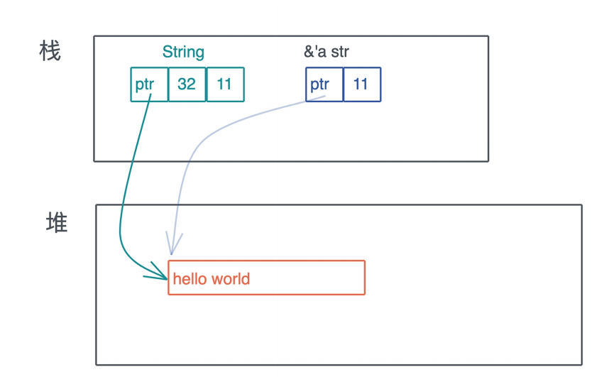
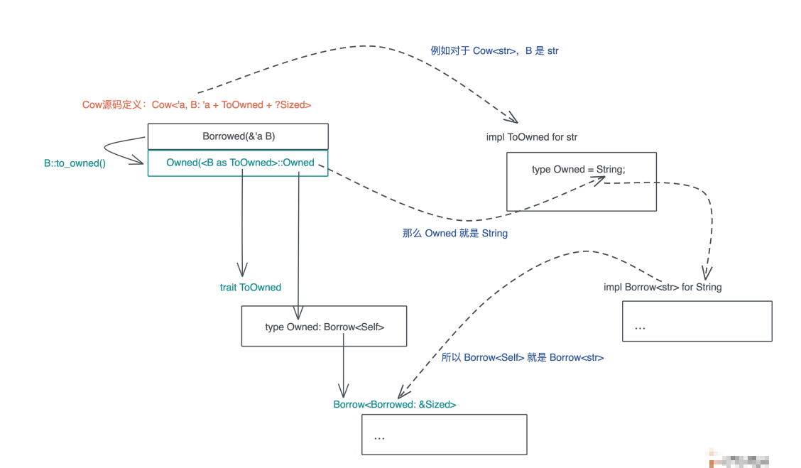

# 数据结构: 这些结构竟然都是智能指针?

到目前为止, 我们学习了Rust的所有权, 生命周期, 内存管理, 类型系统, 基础知识里还剩下一块版图没有涉及: 数据结构, 数据结构里最容易让人困惑的就是智能指针, 所以我们今天就来解决这个难点

我们之前简单介绍过指针, 这里还是先回顾一下: 指针是一个持有内存地址的值, 可以通过解引用来访问指向它的内存地址, 理论上可以解引用到任意数据类型; 引用是一个特殊的指针, 它的解引用是受限的, 只能解引用到它引用数据的结构, 不能用作它用

那什么是智能指针呢?

## 智能指针

在指针和引用的基础上, Rust偷师C++, 提供了智能指针, 智能指针时一个表现行为很像指针的数据结构, 但除了指向数据的指针外, 它还有元数据以及提供额外的处理能力

这个定义有点模糊, 我们对比其他的数据结构来确定一下:

你有没有觉得很像之前讲的胖指针, 智能指针一定是一个胖指针, 但胖指针不一定是一个智能指针, 比如`&str`就是一个胖指针, 它有指向堆内存的字符串的指针, 同时还有关于字符串长度的元数据

我们看智能指针String和`&str`的区别:



从图上可以看到, String除了多一个capacity字段, 似乎没有什么特殊, 但String对堆上的值有所有权, 而`&str`是没有所有权的, 这是Rust中智能指针和普通胖指针的区别

那么又有一个问题了, 智能指针和结构体有什么区别呢? 因为我们知道, String是用结构体定义的:

```rust
pub struct String {
    vec: Vec<u8>,
}
```

和普通结构体不同的是, String实现了Deref和DerefMut, 这使得它们在解引用的时候会得到`&str`, 看下面的标准库的实现:

```rust
impl ops::Deref for String {
    type Target = str;
    fn deref(&self) -> &str {
        unsafe { str::from_utf8_unchecked(&self.vec) }
    }
}
impl ops::DerefMut for String {
    fn deref_mut(&mut self) -> &mut str {
        unsafe { str::from_utf8_unchecked_mut(&mut *self.vec) }
    }
}
```

另外, 由于在堆上分配了数据, String还需要为其分配的资源做相应的回收, 而String内部使用了`Vec<u8>`, 所以它可以依赖`Vec<T>`的能力来释放堆内存, 下面是标准库中`Vec<T>`的Drop trait实现:

```rust
unsafe impl<#[may_dangle] T, A: Allocator> Drop for Vec<T, A> {
    fn drop(&mut self) {
        unsafe {
            // use drop for [T]
            // use a raw slice to refer to the elements of the vector as weake
            // could avoid questions of validity in certain cases
            ptr::drop_in_place(ptr::slice_from_raw_parts_mut(self.as_mut_ptr()
                }
                // RawVec handles deallocation
            }
        }
```

所以在清晰一下定义, 在Rust中, 凡是需要做资源回收的数据结构, 且实现了Deref / DerefMut / Drop, 都是智能指针

按照这个定义, 除了String, 在之前的课程中我们遇到了很多智能指针, 比如用于在堆上分配内存的`Box<T>`和`Vec<T>`, 用于引用计数的`Rc<T>`和`Arc<T>`, 很多其他的数据结构, 如PathBuf, `Cow<'a, B>`, `MutexGuard<T>`, `RwLockReadGuard<T>`和RwLockWriteGuard等也是智能指针

今天我们就深入分析三个使用智能指针的数据结构: 在堆上创建内存的`Box<T>`, 提供写时克隆的`Cow<'a, B>`, 以及用于数据加锁的`MutexGuard<T>`

而且最后我们会尝试实现自己的智能指针, 希望学完后你不但能更好的理解智能指针, 还能在需要的时候, 构建自己的智能指针来解决问题

## `Box<T>`

我们先看`Box<T>`, 它是Rust中最基础的在堆上分配内存的方式, 绝大多数其他包含在堆内存分配的数据结构, 内部都是通过`Box<T>`完成的, 比如`Vec<T>`

为什么有`Box<T>`的设计, 我们得先回忆一下在C语言中, 堆内存是怎么分配的

C需要使用malloc / calloc / realloc / free来处理内存的分配, 很多时候, 被分配出来的内存在函数调用中来来回回使用, 导致谁应该负责释放这件事很难确定, 给开发者造成极大的心智负担

C++在此基础上改进了一下, 提供了一个智能指针unique_ptr, 可以在指针退出作用域的时候释放堆内存, 这样保证了堆内存的单一所有权, 这个unique_ptr就是Rust的`Box<T>`的前身

你看`Box<T>`的定义里, 内部就是一个`Unique<T>`用于致敬C++, `Unique<T>`是一个私有的数据结构, 我们不能直接使用, 它包裹一个`*mut T`指针, 并唯一拥有这个指针

```rust
pub struct Unique<T: ?Sized> {
    pointer: *const T,
    _marker: PhantomData<T>,
}
```

我们知道, 在堆上分配内存, 需要使用内存分配器(Allocator), 如果你上过操作系统课程, 应该还记得一个简答的buddy system是如何分配和管理堆内存的

设计内存分配器的除了保证正确性之外, 就是为了有效的利用剩余内存, 并控制内存在分配和释放过程中产生的碎片的数量, 在多核环境下, 它还能够高效的处理并发请求

对上分配内存的`Box<T>`其实有一个缺省的泛型参数A, 就需要满足Allocator trait, 并且默认是Global

```rust
pub struct Box<T: ?Sized, A: Allocator = Global>(Unique<T>, A)
```

Allocator trait提供很多方法:

- allocate是主要方法, 用于分配内存, 对应C的malloc / calloc;
- deallocate, 用于释放内存, 对应C的free;
- 还有grow / shrink, 用来扩大或缩小堆上已分配的内存, 对应C的realloc

这里对Allocator trait我们就不详细介绍了, 如果你想替换默认的内存分配器, 可以使用`#[global_allocator]`标记宏, 定义你自己的全局分配器, 下面代码展示了如何在Rust下使用jemalloc;

```rust
use jemallocator::Jemalloc;

#[global_allocator]
static GLOBAL: Jemalloc = Jemalloc;
```

这样设置之后, 你使用`Box::new`分配的内存就是jemalloc分配出来的了, 另外, 如果你想撰写自己的全局分配器, 可以是按GlobalAlloc trait, 它和Allocator trait的区别, 主要在于是否允许分配长度为0的内存

### 使用场景

下面我们来实现一个自己的内存分配器, 别担心, 这里就是想debug一下, 看看内存如何分配和释放, 并不会实际实现摸一个分配算法

首先看看内存分配, 这里MyAllocator就是System allocator, 然后加`eprintln!()`, 和哦们常用的`println!()`不同的是, `eprintln!()`将数据打印到stderr

```rust
use std::alloc::{GlobalAlloc, Layout, System};

struct MyAllocator;

unsafe impl GlobalAlloc for MyAllocator {
    unsafe fn alloc(&self, layout: Layout) -> *mut u8 {
        let data = System.alloc(layout);
        eprintln!("ALLOC: {:?}, size {}", data, layout.size());
        data
    }

    unsafe fn dealloc(&self, ptr: *mut u8, layout: Layout) {
        System.dealloc(ptr, layout);
        eprintln!("FREE: {:?}, size {}", ptr, layout.size());
    }
}

#[global_allocator]
static GLOBAL: MyAllocator = MyAllocator;

#[allow(dead_code)]
struct Matrix {
    data: [u8; 505],
}

impl Default for Matrix {
    fn default() -> Self {
        Self { data: [0; 505] }
    }
}

fn main() {
    // 在这句之前已经有好多内存分配
    let data = Box::new(Matrix::default());

    // 输出中有一个1024大小的内存分配, 是println!导致的
    println!(
        "!!! allocated memory: {:p}, len: {}",
        &*data,
        std::mem::size_of::<Matrix>()
    )

    // data到这里drop, 可以在打印中看到FREE
    // 之后还有很多其他内存被释放
}
```

注意这里不能使用`println!`, 因为stdout会打印到一个由Mutex互斥所保护的共享全局buffer中, 不过这个过程会设计内存的分配, 分配的内存又会触发`println!`, 最终造成程序崩溃, 而`eprintln!`知己打印到stderr, 不会buffer

运行这段代码, 你可以看到类似如下输出, 其中505大小的内存是我们`Box::new`出来的

```
❯ cargo run --bin allocator --quiet
ALLOC: 0x7fbe0dc05c20, size 4
ALLOC: 0x7fbe0dc05c30, size 5
FREE: 0x7fbe0dc05c20, size 4
ALLOC: 0x7fbe0dc05c40, size 64
ALLOC: 0x7fbe0dc05c80, size 48
ALLOC: 0x7fbe0dc05cb0, size 80
ALLOC: 0x7fbe0dc05da0, size 24
ALLOC: 0x7fbe0dc05dc0, size 64
ALLOC: 0x7fbe0dc05e00, size 505
ALLOC: 0x7fbe0e008800, size 1024
!!! allocated memory: 0x7fbe0dc05e00, len: 505
FREE: 0x7fbe0dc05e00, size 505
FREE: 0x7fbe0e008800, size 1024
FREE: 0x7fbe0dc05c30, size 5
FREE: 0x7fbe0dc05c40, size 64
FREE: 0x7fbe0dc05c80, size 48
FREE: 0x7fbe0dc05cb0, size 80
FREE: 0x7fbe0dc05dc0, size 64
```

在使用Box分配堆内存的时候需要注意, `Box::new`是一个函数, 所以传入它的数据会出现在栈上, 在移动到堆上, 所以, 如果我们的Matrix结构不是505个字节, 是一个非常大的数据结构, 就有可能出问题

比如下面的代码想在堆上分配16M内存, 如果你在playground里运行, 直接栈溢出

```rust
fn main() {
    // 在堆上分配 16M 内存，但它会现在栈上出现，再移动到堆上
    let boxed = Box::new([0u8; 1 << 24]);
    println!("len: {}", boxed.len());
}
```

但如果你在本地使用`cargo run --release`编译成release代码运行, 会正常执行

这是因为`cargo run`默认是debug build, 它不会做任何inlin的优化, 而`Box::new`的实现就一行代码, 并注明了要inline, 在release模式下, 这个函数调用会被优化掉

```rust
#[cfg(not(no_global_oom_handling))]
#[inline(always)]
#[doc(alias = "alloc")]
#[doc(alias = "malloc")]
#[stable(feature = "rust1", since = "1.0.0")]
pub fn new(x: T) -> Self {
    box x
}
```

如果不是inline, 整个16M的大数组会通过栈内存传递给Box::new, 导致栈溢出, 这里哦我们惊喜的发现一个新的关键字box, 然而box是Rust内部的管金子, 用户无法调用, 它只出现在Rust代码中, 用于分配堆内存, box关键字在编译时, 会使用内存分配器分配内存

搞明白`Box<T>`的内存分配, 我们还是很关心内存是如何释放的, 来看它实现的Drop trait

```rust
#[stable(feature = "rust1", since = "1.0.0")]
unsafe impl<#[may_dangle] T: ?Sized, A: Allocator> Drop for Box<T, A> {
    #[inline]
    fn drop(&mut self) {
        // the T in the Box is dropped by the compiler before the destructor is run

        let ptr = self.0;

        unsafe {
            let layout = Layout::for_value_raw(ptr.as_ptr());
            if layout.size() != 0 {
                self.1.deallocate(From::from(ptr.cast()), layout);
            }
        }
    }
}
```

## `Cow<'a, B>`

了解了Box的工作原理之后, 我们在来看看`Cow<'a, B>`的原理和使用场景

Cow是Rust下用于提供写时克隆的一个智能指针, 它跟虚拟内存管理的写时复制有异曲同工之妙: 包裹一个只读借用, 但如果调用者需要所有权或者需要修改内容, 那么他会clone借用的数据

我们看看Cow的定义:

```rust
pub enum Cow<'a, B> where B: 'a + ToOwned + ?Sized {
    Borrowed(&'a B),
    Owned(<B as ToOwned>::Owned),
}
```

它是一个enum, 可以包含一个对类型B的只读引用, 或者包含对类型B的拥有所有权的数据

这里又引入了两个trait, 首先是ToOwned, 在ToOwned trait定义的时候, 引入了Borrow trait, 它们都是`std::borrow`下的trait

```rust
pub trait ToOwned {
    type Owned: Borrow<Self>;
    #[must_use = "cloning is often expensive and is not expected to have side"
        fn to_owned(&self) -> Self::Owned;
        fn clone_into(&self, target: &mut Self::Owned) { ... }
    }
    pub trait Borrow<Borrowed> where Borrowed: ?Sized {
        fn borrow(&self) -> &Borrowed;
    }
```

如果你看不懂这段代码, 不要着急, 想要理解Cow trait, ToOwned trait是一到坎, 因为`type Owned: Borrow<Self>`不好理解, 耐下心来我们拆开一点点解读

首先: `type Owned: Borrow<Self>`是一个带有关联类型的trait, 这里Owned是关联类型, 需要使用者定义, 和我们之前介绍的关联类型不同的是, 这里Owned不能是任意类型, 它必须满足`Borrow<T> trait`, 我们来看看str对ToOwned trait的实现

```rust
impl ToOwned for str {
    type Owned = String;
    #[inline]
    fn to_owned(&self) -> String {
        unsafe { String::from_utf8_unchecked(self.as_bytes().to_owned()) }
    }
    fn clone_into(&self, target: &mut String) {
        let mut b = mem::take(target).into_bytes();
        self.as_bytes().clone_into(&mut b);
        *target = unsafe { String::from_utf8_unchecked(b) }
    }
}
```

可以看到关联类型Owned被定义为String, 而根据要求, String必须定义`Borrow<T>`, 到这里`Borrow<T>`里的泛型变量T是谁呢?

ToOwned要求是`Borrow<Self>`, 而此刻实现ToOwned的主体是str, 所以`Borrow<Self>`是`Borrow<str>`, 也就是说String要实现`Borrow<str>`, 我们来看看文档, 它的确实现了这个trait

```rust
impl Borrow<str> for String {
    #[inline]
    fn borrow(&self) -> &str {
        &self[..]
    }
}
```

你是不是有点晕了, 我用一张图梳理了这几个trait之间的关系:



通过这张图我们可以更好的清除Cow和ToOwned / `Borrow<T>`之间的关系

这里你可能会有疑惑, 为何Borrow要定义成一个泛型trait呢? 稿怎么复杂, 难道一个类型还可以被借用成不同的引用么?

是的, 我们来看一个例子:

```rust
use std::borrow::Borrow;

fn main() {
    let s = "hello world!".to_owned();

    // 这里必须声明类型, 因为String有多个Borrow<T>实现
    let r1: &String = s.borrow();

    let r2: &str = s.borrow();

    println!("r1: {:p}, r2: {:p}", r1, r2);
}
```

在这个例子里, String可以被借用为`&String`也可以被借用为`&str`

在继续看Cow, 我们说它是智能指针, 那它自然需要实现Deref trait"

```rust
impl<B: ?Sized + ToOwned> Deref for Cow<'_, B> {
    type Target = B;
    fn deref(&self) -> &B {
        match *self {
            Borrowed(borrowed) => borrowed,
            Owned(ref owned) => owned.borrow(),
        }
    }
}
```

实现原理很简单, 根据Self是Borrowed还是Owned, 我们分别取其内容, 生成引用:

- 对于Borrowed, 直接就是引用;
- 对于Owned, 调用其borrow方法, 获得引用

这就很厉害了, 虽然Cow是一个enum, 但是通过Deref的实现, 我们可以获得统一体验, 使用的感觉和`&str / String`是基本一致的, 注意, 这种enum的不同状态来进行统一分发的方法是第三种分发手段, 之前讲过可以使用泛型参数做静态分发和使用trait object做动态分发

### 使用场景

那么Cow有什么用你? 显然它可以在需要的时候才进行内存的分配和拷贝, 在很多应用场合, 它可以大大提升系统的效率, 如果`Cow<'a, B>`中的Owned数据是一个需要再堆上分配内存的类型, 还能减少堆内存分配的次数

我们说过, 相对于栈内存的分配释放来说, 堆内存的分配和释放效率要低很多, 其内部还涉及系统调用和锁, 减少不必要的内存分配是提升系统效率的关键手段, 而Rust的`Cow<'a, B>`, 在帮助你达成这个效果的同时, 使用体验还非常简单舒服

我们来看一个实用Cow的实际例子

在解析URL的时候, 我们经常需要将querystring中的参数, 提取成KV pair来进一步使用, 绝大多数的语言中, 提取出来的KV都是新的字符串, 在每秒处理几十K甚至上百K请求的系统中, 你可以想象这会带来多少次堆内存的分配吗

但是Rust中, 我们可以用Cow类型轻松高效的处理它, 在读取URL的过程中:

- 每解析出一个key或者value, 我们可以用一个`&str`指向URL中相应的位置, 然后用Cow封装它;
- 而当解析出来的内容不能直接使用, 需要decode时, 我们可以生成一恶搞解析后的String, 同样用Cow封装它

```rust
use std::{borrow::Cow, collections::HashMap};
use url::Url;

fn main() {
    let url = Url::parse("http://www.baidu.com/rust?page=1&size=10&header=dir&dr=ald").unwrap();
    let mut paris = url.query_pairs();
    // let map = paris.collect::<HashMap<_, _>>();
    // println!("{:?}", map)

    let (mut k, v) = paris.next().unwrap();
    // 此时此刻, 它们都是Borrowed
    println!("ket: {k}, v: {v}");
    // 当发生修改时, k变成Owned
    k.to_mut().push_str("_lala");

    print_pairs((k, v));

    print_pairs(paris.next().unwrap());

    print_pairs(paris.next().unwrap());
}

fn print_pairs(pair: (Cow<str>, Cow<str>)) {
    println!("key: {}, value: {}", show_cow(pair.0), show_cow(pair.1));
}

fn show_cow(cow: Cow<str>) -> String {
    match cow {
        Cow::Borrowed(v) => format!("Borrowed {v}"),
        Cow::Owned(v) => format!("Owned {v}"),
    }
}
```

类似URL parse这样的处理方式, 在Rust标准库中和第三方库中非常常见, 比如Rust下著名的serde库, 可以非常高效的㐉Rust数据结构, 进行序列化 / 反序列化, 他对Cow就有很好的支持

我们可以通过如下的代码将一个JSON反序列化为User类型, 同时让User中的name使用Cow来引用JSON文本中的内容

```rust
use serde::Deserialize;
use std::borrow::Cow;
#[derive(Debug, Deserialize)]
struct User<'input> {
    #[serde(borrow)]
    name: Cow<'input, str>,
    age: u8,
}
fn main() {
    let input = r#"{ "name": "Tyr", "age": 18 }"#;
    let user: User = serde_json::from_str(input).unwrap();
    match user.name {
        Cow::Borrowed(x) => println!("borrowed {}", x),
        Cow::Owned(x) => println!("owned {}", x),
    }
}																											
```

## `MutexGuard<T>`

如果说上面介绍的String, `Box<T>`, `Cow<'a, B>`等智能指针, 都是通过Deref来提供良好的用户体验, 那么`MutexGuard<T>`是另外一类很有意思的智能指针: 它不但通过Deref提供良好的用户体验, 还通过Drop trait啦以确保, 使用到的内存意外的资源在退出的是进行释放

MutexGuard这个结构是在调用`Mutex::lock`时生成的:

```rust
pub fn lock(&self) -> LockResult<MutexGuard<'_, T>> {
    unsafe {
        self.inner.raw_lock();
        MutexGuard::new(self)
    }
}
```

首先, 它会取得锁资源, 如果拿不到, 会在这里等待; 如果拿到了, 会把Mutex结构引用传递给MutexGuard

我们看MutexGuard的定义以及它的Deref和Drop的实现, 很简单

```rust
// 这里用 must_use，当你得到了却不使用 MutexGuard 时会报警
#[must_use = "if unused the Mutex will immediately unlock"]
pub struct MutexGuard<'a, T: ?Sized + 'a> {
    lock: &'a Mutex<T>,
    poison: poison::Guard,
}
impl<T: ?Sized> Deref for MutexGuard<'_, T> {
    type Target = T;
    fn deref(&self) -> &T {
        unsafe { &*self.lock.data.get() }
    }
}
impl<T: ?Sized> DerefMut for MutexGuard<'_, T> {
    fn deref_mut(&mut self) -> &mut T {
        unsafe { &mut *self.lock.data.get() }
    }
}
impl<T: ?Sized> Drop for MutexGuard<'_, T> {
    #[inline]
    fn drop(&mut self) {
        unsafe {
            self.lock.poison.done(&self.poison);
            self.lock.inner.raw_unlock();
        }
    }
}
```

从代码可以看到, 当MutexGuard结束时, Mutex会做unlock, 这样用户在使用Mutex时, 可以不用关心这个互斥锁, 因为无论你在栈上怎么传递MutexGuard, 哪怕在错误处理流程上提前退出, Rust有所有权机制, 可以确保只要MutexGuard离开作用域, 锁就会被释放

### 使用场景

我们看一个使用Mutex和MutexGuard的例子

```rust
use lazy_static::lazy_static;
use std::borrow::Cow;
use std::collections::HashMap;
use std::sync::{Arc, Mutex};
use std::thread;
use std::time::Duration;

// lazy_static宏可以生成复杂的static对象
lazy_static! {
    // 一般情况下Mutex和Arc一起在多线程环境下提供共享内存的使用
    // 如果你把Mutex声明成static, 其中生命周期是静态的, 不需要Arc
    static ref METRICS: Mutex<HashMap<Cow<'static, str>, usize>> = Mutex::new(HashMap::new());
}

fn main() {
    // 用Arc来提供并发环境下的共性所有权(使用引用计数)
    let metrics: Arc<Mutex<HashMap<Cow<'static, str>, usize>>> =
        Arc::new(Mutex::new(HashMap::new()));

    for _ in 0..32 {
        let m = metrics.clone();
        thread::spawn(move || {
            let mut g = m.lock().unwrap();
            // 此时只有拿到MutexGuard的线程可以访问HashMap
            let data = &mut *g;
            // Cow实现了很多数据结构的From trait
            // 所以我们用"hello".into() 生成Cow
            let entry = data.entry("hello".into()).or_insert(0);
            *entry += 1;
            // MutexGuard被Drop, 索贝释放
        });
    }

    thread::sleep(Duration::from_millis(100));

    println!("metrics: {:?}", metrics.lock().unwrap());
}
```

如果你有疑问, 这样如何保证锁额线程安全呢? 如果我在线程1拿到了锁, 然后把MutexGuard移动给线程2使用, 加锁和解锁在完全不同的线程下, 会有很大的死锁风险, 怎么办?

不要担心, MutexGuard不允许Send, 只允许Sync, 也就是说, 你可以把MutexGuard的引用传给另一个线程中使用, 但你无法把MutexGuard整个移动到另一个线程:

```rust
impl<T: ?Sized> !Send for MutexGuard<'_, T> {}
unsafe impl<T: ?Sized + Sync> Sync for MutexGuard<'_, T> {}
```

类似MutexGuard的智能指针有很多用途, 比如要创建一个连接池, 你可以在Drop trait中, 回收checkout出来的连接, 将其再放回连接池, 如果你对此感兴趣, 可以看看r2d2的实现, 它是Rust下一个数据连接池的实现

