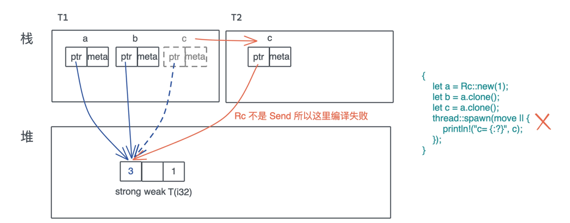
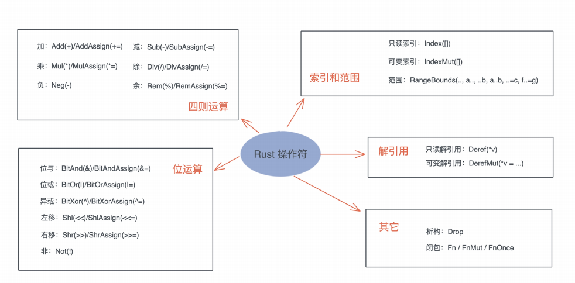
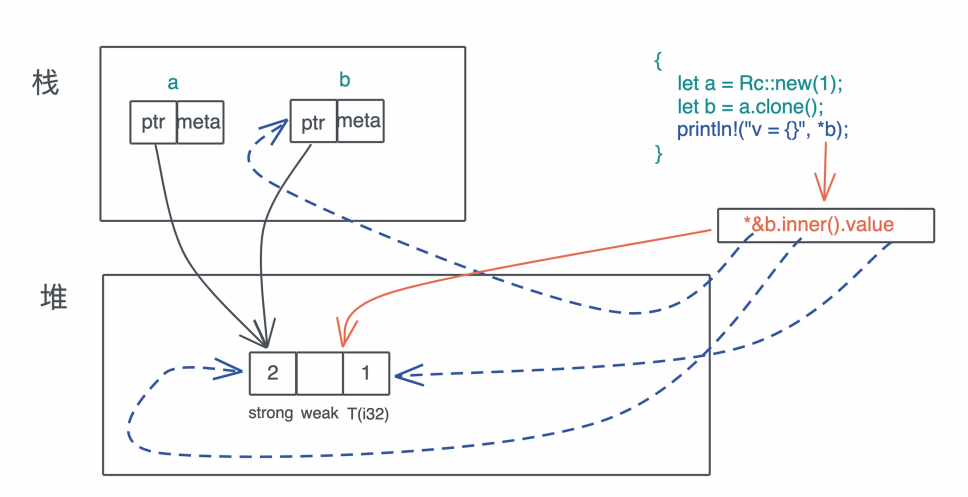
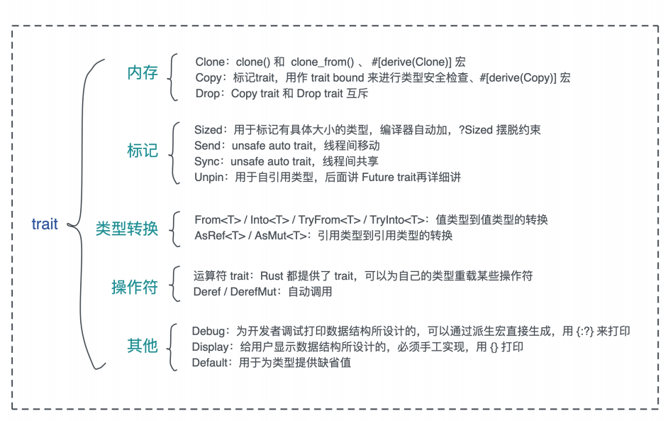

# 类型系统: 有哪些必须掌握的Trait?

经过之前的学习, 相信你现在对trait的理解就深入了, 在实际解决问题的过程中, 用好这些trait, 会让的代码结构更加清晰, 阅读和使用都更加符合Rust生态的习惯, 比如数据实现了Debug trait, 那么你想打印数据结构时, 就可以用`{:?}`来打印; 如果你的类型事件了`From<T>`那么可以直接使用into方法做数据转换

## trait

Rust语言的标准库定义了大量的trait, 先来看看我们学过的, 看看攒了哪些:

- Clone / Copy trait: 约定了数据被深拷贝和浅拷贝的行为;
- Read / Write trait: 约定了I/O读写的行为;
- Iterator: 约定了迭代器的行为;
- Debug: 约定了数据如何被以debug的方式显示出来的行为
- Default: 约定数据类型的缺省值如何产生的行为
- `From<T>` / `TryFrom<T>`: 约定数据间如何转换的行为

我们会在学习几类重要的trait, 包括和内存分配相关的trait, 用于区别不同类型协助编译器做类型安全检查的标记trait, 进行类型转换的trait, 操作符相关的trait, 以及Debug / Display / Default

在恶习这些trait的过程中, 你也可以结合之前讲的内容, 有意识的思考一下Rust为什么这么设计, 在增进对语言理解的同时, 也能写出更加优雅的Rust代码

## 内存相关: Clone / Copy / Drop

先来看看内存先关的Clone / Copy / Drop, 这三个trait在介绍所有权的时候已经学习过, 这里我们在深入研究一下它们的定义和使用场景

### Clone trait

首先看Clone:

```rust
pub trait Clone {
    fn clone(&self) -> Self;
    
    fn clone_from(&mut self, source: &Self) {
        *self = source.clone();
    }
}
```

Clone trait有两个方法, clone和clone_from, 后者有缺省实现, 所以我们只需要实现clone方法即可, 你也许会有疑惑, 这个clone_from有什么作用呢? 因为看起来`a.clone_from(&b)和`a = b.clone()`是等价的

其实不是, 如果a已经存在, 在clone过程中会分配内存, 那么用`a.clone_from(&b)`可以避免内存分配, 提高效率

Clone trait可以通过派生宏实现,  这样可以简化不少代码, 如果在你的数据结构中, 每一个字段都实现了Clone trait, 你可以用`#[derive(Clone)]`, 看下面的代码:

```rust
#[derive(Clone, Debug)]
struct Developer {
    name: String,
    age: u8,
    lang: Language,
}

#[allow(dead_code)]
#[derive(Clone, Debug)]
enum Language {
    Rust,
    TypeScript,
    Elixir,
    Haskell,
}

fn main() {
    let dev = Developer {
        name: "Tyr".to_string(),
        age: 19,
        lang: Language::Rust,
    };

    let dev1 = dev.clone();

    println!("dev: {:?}", dev);
    println!("dev1: {:?}", dev1);

    println!("dev: {:?}, addr of dev name: {:p}", dev, dev.name.as_str());
    println!(
        "dev1: {:?}, addr of dev1 name: {:p}",
        dev1,
        dev1.name.as_str()
    );
}
```

如果没有为Language实现Clone trait, Developer的派生宏Clone将会编译出错, 运行这段代码可以看到, 对于name, 也就是String类型的Clone, 其堆上的内存也被Clone了一份, 所以Clone是深度拷贝, 栈内存和堆内存一起拷贝

值得注意的是, clone方法的接口是`&self`, 这在绝大多数场合下都是适用的, 我们在clone一个数据时只需要有已有的数据的只读引用, 但对`Rc<T>`这样在clone时维护引用计数的数据结构, clone过程中会改变自己, 所以要用`Cell<T>`这样提供内部可变性的结构来进行改变

### Copy trait

和Clone trait不同的是, Copy trait没有任何额外的方法, 它知识一个标记trait(marker trait)

```rust
pub trait Copy: Clone {}
```

所以看这个定义, 如果要实现Copy trait的话, 必须实现Clone trait, 然后实现一个空的Copy trait, 你是不是有些疑惑: 这样不包含任何行为的trait有什么用呢?

这样trait虽然没有任何行为, 按它可以用作trait bound来进行类型安全检查, 所以我们管它叫标记trait

和Clone一样, 如果数据结构的所有字段都实现了Copy trait, 也可以用`#[derive(Copy)]`宏来为数据结构实现Copy trait

```rust
#[derive(Clone, Debug, Copy)]
struct Developer {
    name: String,
    age: u8,
    lang: Language,
}

#[allow(dead_code)]
#[derive(Clone, Debug, Copy)]
enum Language {
    Rust,
    TypeScript,
    Elixir,
    Haskell,
}

fn main() {
    let dev = Developer {
        name: "Tyr".to_string(),
        age: 19,
        lang: Language::Rust,
    };

    let dev1 = dev.clone();

    println!("dev: {:?}", dev);
    println!("dev1: {:?}", dev1);

    println!("dev: {:?}, addr of dev name: {:p}", dev, dev.name.as_str());
    println!(
        "dev1: {:?}, addr of dev1 name: {:p}",
        dev1,
        dev1.name.as_str()
    );
}
```

这个代码会报错, 因为String类型没哟实现Copy trait, 因此, Developer数据结构只能实现clone, 无法copy, 我们知道, 如果类型实现了Copy trait, 那么在赋值, 函数调用的时候, 值会被拷贝, 否则所有权会被移动

所以上面的代码Developer类型做参数传递的时候, 会执行Move语义, 而Language会执行Copy语义

在将所有权可变/不可变引用的时候提到, 不可变引用实现了Copy trait, 而可变引用`&mut T`没有实现Copy trait, 为什么会这样?

因为如果可变引用实现了Copy trait, 那么生成一个可变引用然后赋值给另一个变量时, 就会违背所有权规则; 同一个作用域下只能有一个活跃的可变引用, 可见Rust标准库在哪些接口可以Copy哪些结构不可以Copy上, 有着仔细的考量

### Drop trait

在内存管理中已经详细探讨过Drop trait, 这里我们在看一下它的定义:

```rust
pub trait Drop {
    fn drop(&mut self);
}
```

大部分场景无需为数据解耦提供Drop trait, 系统默认会依次对数据结构的每个域drop, 但有两种情况你可能需要手工实现Drop

第一种是希望在数据结束生命周期的时候做一些事情, 比如日志记录

第二种是需要对资源回收场景, 编译器并不知道你额外使用了哪些资源, 也就无法帮助你drop它们, 比如说锁资源的释放, 比如`MutexGuard<T>`中实现了Drop trait来释放锁资源

```rust
impl<T: ?Sized> Drop for MutexGuard<'_, T> {
    #[inlin]
    fn drop(&mut self) {
        unsafe {
            self.lock.poison.done(&self.poison);
            self.lock.inner.raw_unlock();
        }
    }
}
```

需要注意的是, Copy trait和Drop trait是互斥的, 两者不能共存, 当你尝试为同一种数据类型实现Copy trait时, 也实现Drop trait, 编译器就会报错, 这其实很好理解: Copy trait是按位做浅拷贝, 那么它会默认拷贝的数据没有需要释放的资源; 而Drop恰恰是为了释放额外的资源而生的

我们写一段代码来辅助理解, 在代码中, 强行用`Box::into_raw`获得堆内存的指针, 放入RawBuffer结构中, 这样就接管了这块堆内存的释放

虽然RawBuffer可以实现Copy trait, 但这样一来就无法实现Drop trait, 如果程序非要这么写, 会导致内存泄露, 因为该释放的堆内存没有释放

但是个操作不会破坏Rust的正确性保证: 即便你Copy了N份RawBuffer, 由于无法实现Drop trait, RawBuffer指向的同一块堆内存不会红四方, 所以不会出现`use after free`的内存安全问题

```rust
use std::{fmt, slice, vec};

#[derive(Clone, Copy)]
struct RawBuffer {
    // 裸指针用 *const / *mut 来表述, 这里和引用的&不同
    ptr: *mut u8,
    len: usize,
}

impl From<Vec<u8>> for RawBuffer {
    fn from(value: Vec<u8>) -> Self {
        let slice = value.into_boxed_slice();
        Self {
            len: slice.len(),
            // into_raw之后, Box就不管这块内存的释放了, RawBuffer需要处理释放
            ptr: Box::into_raw(slice) as *mut u8,
        }
    }
}

// 如果RawBuffer实现了Drop trait, 就可以在所有者提出时释放内存
// 然后Drop trait会跟Copy trait冲突, 要不实现Copy trait要不实现Drop trait
// 如果不实现Drop trait, 那么就会导致内存泄露, 但它不会对正确性有任何破坏
// 比如不会出现use after free这样的问题
// impl Drop for RawBuffer {
//     #[inline]
//     fn drop(&mut self) {
//         let data = unsafe {
//             Box::from_raw(slice::from_raw_parts_mut(self.ptr, self.len));
//         };
//         drop(data);
//     }
// }

impl fmt::Debug for RawBuffer {
    fn fmt(&self, f: &mut fmt::Formatter<'_>) -> fmt::Result {
        let data = self.as_ref();
        write!(f, "{:p}: {:?}", self.ptr, data)
    }
}
impl AsRef<[u8]> for RawBuffer {
    fn as_ref(&self) -> &[u8] {
        unsafe { slice::from_raw_parts(self.ptr, self.len) }
    }
}

fn main() {
    let data = vec![1, 2, 3, 4];
    let buf: RawBuffer = data.into();
    use_buffer(buf);
    println!("buf: {:?}", buf);
}

fn use_buffer(buf: RawBuffer) {
    println!("buf to die: {:?}", buf);
    // drop(buf);
}
```

对于代码安全来说, 内存泄露危害大? 还是use after free危害大? 肯定是后者, Rust的底线是内存安全, 所以梁海相权取其轻

实际上, 任何编程语言都无法保证不发生人为的内存泄露, 比如程序在运行时, 开发者疏忽了, 对哈希表只添加不删除, 就会导致内存泄露, 但Rust会保证即使开发者疏忽了, 也不会出现内存安全的问题

建议你仔细阅读这段代码中的注释, 试着把注释掉的Drop trait恢复, 然后将代码该的可以编译通过, 认真思考一下Rust的良苦用心

## 标记trait: Sized / Send / Sync / Unpin

讲完内存相关的主要trait, 来看看标记trait

刚才我们已经看到一个标记trait: Copy trait, Rus还支持几种标记trait: Ssized / Send / Sync / Unpin

Sized trait用于标记有具体大小的类型, 在使用泛型参数时, Rust编译器会自动为泛型参数加上Sized trait约束, 比如下面的`Data<T>`和处理`Data<T>`的函数process_data:

```rust
struct Data<T> {
    inner: T,
}

fn process_data<T>(data: Data<T>) {
    todo!();
}
```

让等价于:

```rust
struct Data<T> {
    inner: T,
}

fn process_data<T: Sized>(data: Data<T>) {
    todo!();
}
```

大部分时候, 我们都希望自动添加这样的约束, 因为这样定义出泛型结构, 在编译期大小都是固定的, 可以作为参数传递给函数, 如果没有这个约束, T是大小不固定的类型, process_data函数会无法编译

但是这个自动添加的约束有时候不太适用, 在少数情况下, 需要T是可变类型的, 怎么办? Rust提供了`?Sized`来摆脱这个约束

如果开发者显式定义了`T: ?Sized`, 那么T就可以是任意大小, 如果你对之前说的Cow还有印象, 可能会记得Cow中泛型参数B的约束是`?Sized`

```rust
pub enum Cow<'a, B: ?Sized + 'a> where B: ToOwned,
{
    // 借用的数据
    Borrowed(&'a B),
    Owned(<B as ToOwned>::Owned),
}
```

这样B就可以是一个`[T]`或者str类型, 大小都是不固定的, 要注意`Borrowed(&'a B)`大小是固定的, 因为它内部是对B的一个引用, 而引用的大小是固定的

### Send / Sync

说完了Sized, 我们在来看看Send / Sync, 定义时:

```rust
pub unsafe auto trait Send {};
pub unsafe auto trait Sync {};
```

这两个trait都是unsafe auto trait, auto意味着编译器会在合适的场景, 自动为数据结构添加它们的实现, 而unsafe代表实现这个trait可能会违背Rust的内存安全原则, 如果开发者手工实现这两个trait, 要自己为它们的安全性负责

Send / Sync是Rust并发安全的基础:

- 如果一个类型T实现了Send trait, 意味着T可以安全的从一个线程移动到另一个线程, 也就说所有权可以在线程中安全的移动
- 如果一个类型T实现了Sync trait, 意味着`&T`可以安全的在多个线程中共享, 一个类型满足Sync trait, 当且仅当`&T`满足Send trait

对于Send / Sync在线程安全中的作用, 可以这么看, 如果一个类型`T: Send`, 那么T在某个线程中的独占访问是线程安全的; 如果一个类型`T: Sync`, 那么T在线程间的只读共享是安全的

对于我们自己定义的数据结构, 如果其内部的所有作用域都实现了Send / Sync, 那么这个数据结构会自动添加Send / Sync, 基本上原生数据类型都支持Send / Sync, 也就是说绝大多数自定义的数据结构都是满足Send / Sync的, 标准库中不支持Send / Sync的数据结构主要有:

- 裸指针`*const / *mut T`, 它们是不安全的, 所以既不是Send也不是Sync
- `UnsafeCell<T>`不支持Sync, 也就是说, 使用任何Cell或者RefCell的数据结构不支持Sync
- 引用计数Rc不支持Send也不支持Sync, 所以Rc无法跨线程

之前介绍的Rc/RefCell, 我们来看看尝试跨线程使用Rc/RefCell, 会发生什么, 在Rust下如果向创建一个新线程, 需要使用`std::thread::spawn`:

```rust
pub fn spawn<F, T>(f: F) -> JoinHander<T>
where
	F: FoOnce() -> T,
	F: Send + 'static,
	T: Send + 'static,
{}
```

它参数是一个闭包, 这个闭包需要`Send + 'static`:

- `'static`意思是捕获的自由变量必须是一个拥有所有权的类型, 或者是拥有静态生命周期的引用
- Send的意思是, 这些被捕获的自由变量的所有权可以从一个线程移动到另一个线程

从这个接口上, 可以得出结论: 如果在线程间传递Rc, 是无法编译通过的, 因为Rc的实现不支持Send和Sync

```rust
use std::rc::Rc;
fn rc_is_not_send_and_sync() {
    let a = Rc::new(1);
    let b = a.clone();
    let c = a.clone();
    std::thread::spawn(move || {
        println!("c = {:?}", c);
    })
}
```

果然这段代码不通过



那么`RefCell<T>`可以在线程间转移所有权吗? RefCell实现了Send, 但没有实现Sync, 所以看起来是可以工作的:

```rust
use std::cell::RefCell;

fn refcell_is_send() {
    let a = RefCell::new(1);
    std::thread::spawn(move || println!("a: {:?}", a));
}

fn main() {
    refcell_is_send();
}
```

这是可以的

既然Rc不能Send, 我们无法跨线程使用`Rc<RefCell<T>>`这样的数据, 那么使用支持Send / Sync的Arc呢, 使用`Arc<RefCell<T>>`来获得, 一个可以在多个线程间共享, 且可以修改的类型

```rust
use std::{cell::RefCell, sync::Arc};

// RefCell现在有多个Arc持有它, 虽然Arc是Send/Sync, 但RefCell不是Sync
fn refcell_is_not_sync() {
    let a = Arc::new(RefCell::new(1));
    let b = a.clone();
    let c  = a.clone();
    std::thread::spawn(move || {
        println!("c = {:?}", c);
    });
}
```

这是错误的, 因为Arc内部的数据是共享的, 需要支持Sync的数据结构, 但是RefCell不是Sync, 编译失败, 所以在多线程情况下, 我们只能使用支持Send/Sync的Arc, 和Mutex一起, 构造一个可以在多个线程之间共享且可以修改的类型

```rust
use std::sync::{Arc, Mutex};

// RefCell现在有多个Arc持有它, 虽然Arc是Send/Sync, 但RefCell不是Sync
fn arc_mutex_is_send_sync() {
    let a = Arc::new(Mutex::new(1));
    let b = a.clone();
    let c = a.clone();
    let handle = std::thread::spawn(move || {
        let mut g = c.lock().unwrap();
        *g += 1;
    });

    {
        let mut g = b.lock().unwrap();
        *g += 1;
    }

    handle.join().unwrap();
    println!("a = {:?}", a);
}

fn main() {
    arc_mutex_is_send_sync();
}
```

这几段代码建议你都好好阅读和运行一下, 对于编译出错的情况, 仔细看看编译器给出的错误, 会帮助你理解好Send / Sync trait以及它们如何保证并发安全

最后一个标记trait Unpin, 是用于自引用类型的, 后面讲到Future trait时, 在详细讲

## 类型转换相关: `From<T>` / `Into<T>` / `AsRef<T>` / `AsMut<T>`

学习完标记trait, 来看看类型转换相关的trait, 在软件开发中, 我们经常需要在某个上下文中, 把一种数据结构转换成另一种数据结构

不过转换的方式有很多, 来看下面的代码, 你觉得那种转换方式更好呢?

```rust
// 第一种方法，为每一种转换提供一个方法
// 把字符串 s 转换成 Path
let v = s.to_path();
// 把字符串 s 转换成 u64
let v = s.to_u64();
// 第二种方法，为 s 和要转换的类型之间实现一个 Into<T> trait
// v 的类型根据上下文得出
let v = s.into();
// 或者也可以显式地标注 v 的类型
let v: u64 = s.into();
```

第一种方式, 在类型T的实现里, 要为每一种可能的转换提供一个方法; 第二种为我们类型T和类型U之间的转换实现一个数据转换的trait, 这样可以调用同一个方法来是按不同的转换

显然, 第二种方法要更好, 因为它符合软件开发的开闭原则: 软件中的对象对拓展是开发的, 但是对修改是封闭的

在第一种方式下, 未来每次要添加对新的类型的转换, 都要重新修改类型T的实现, 而第二种方式, 我们只需要添加一个对于数据转换的trait的新实现即可

基于个思路, 对值类型的转换和对引用类型的转换, Rust提供了两套不同的trait:

- 值类型到值类型的转换: `From<T>` / `Into<T>` / `TryFrom<T>` / `TryInto<T>`
- 引用类型到引用类型的转换: `AsRef<T>` / `AsMut<T>`

### `From<T>` / `Into<T>`

先看`From<T>`和`Into<T>,` 这两个trait的定义如下:

```rust
pub trait From<T> {
    fn from(T) -> Self;
}

pub trait Into<T> {
    fn into(self) -> T;
}
```

在实现`From<T>`的时候会自动实现`Into<T>`, 这是因为

```rust
// 实现From会自动实现Into
impl<T, U> Into<U> for T where U: From<T> {
    fn into(self) -> U {
        U::from(self)
    }
}
```

所以大部分情况下, 只要实现了`From<T>`然后这两种方式都能做数据转换, 比如:

```rust
let s = String::from("Hello World!");
let s = "Hello World".into::<String>();
```

这两种方式是等价的, 怎么选呢? `From<T>`可以根据上下文做类型推导, 使用场景更多; 而且因为实现了`Form<T>`会自动实现`Into<T>`反之不会, 所以需要的时候, 不要去实现`Into<T>`, 只要实现`From<T>`就好了

此外, `From<T>`和`Into<T>`还是自反的: 把类型T的值转换成类型T, 会直接返回, 这因为标准库中有如下实现: 

```rust
// Form(以及Into)是自反的
impl<T> From<T> for T {
    fn from(t: T) -> T {
        t
    }
}
```

有了`From<T>`和`Into<T>`, 很多函数的接口就可以变得灵活多变, 比如函数如果接收一个IpAddr为参数, 我们可以使用`Into<IpAdd>`让更多的类型可以被这个函数使用, 看下面的代码:

```rust
use std::net::{IpAddr, Ipv4Addr, Ipv6Addr};

fn print(v: impl Into<IpAddr>) {
    println!("{:?}", v.into());
}

fn main() {
    let v4 = "2.2.2.2".parse::<Ipv4Addr>().unwrap();
    let v6 = "::1".parse::<Ipv6Addr>().unwrap();
    print([1, 1, 1, 1]);
    print(v4);
    print(v6);
}
```

所以合法的使用`From<T>` / `Into<T>`可以让代码更加简洁, 符合Rust可读性强的风格, 更符合开闭原则

注意, 如果你的数据类型在转换的过程中有可能出现错误, 可以哦使用`TryFrom<T>`和`TryInto<T>`, 它的用法和`From<T>` / `Into<T>`一样, 只是trait内多了一个关联类型Error, 且返回的结果是`Result<T, Self::Error>`

### `AsRef<T>` / `AsMut<T>`

搞明白`From<T>` / `Into<T>`后, `AsRef<T> `和`AsMut<T>`就很好理解了,, 用于从引用到引用的转换, 还是先看它们的定义:

```rust
pub trait AsRef<T> where T: ?Sized {
    fn as_ref(&self) -> &T;
}

pub trait ASMut<T> where T: ?Sized {
    fn as_mut(&mut self) -> &mut T;
}
```

在trait的定义上, 都允许T使用大小可变的类型, 如str, `[u8]`等, `AsMut<T>`除了使用可变引用生成可变引用外, 其他都和`AsRef<T>`一样, 所以我们重点看`AsRef<T>`

看标准库中打开文件的接口`std::fs::File::open`:

```rust
pub fn open<P: AsRef<Path>>(path: P) -> Result<File>
```

它的参数path是符合`AsRef<Path>`的类型, 所以, 你可以为这个参数传入String, `&str`, PathBuf, Path等类型, 而且, 当你使用`path.as_ref()`时, 会得到一个`&Path`

来写一段代码体验一下`AsRef<T>`的使用和实现:

```rust
#[allow(dead_code)]
enum Language {
    Rust,
    TypeScript,
    Elixir,
    Haskell,
}

impl AsRef<str> for Language {
    fn as_ref(&self) -> &str {
        match &self {
            Language::Rust => "Rust",
            Language::TypeScript => "TypeScript",
            Language::Elixir => "Elixir",
            Language::Haskell => "Haskell",
        }
    }
}

fn print_ref(v: impl AsRef<str>) {
    println!("{}", v.as_ref());
}

fn main() {
    let lang = Language::Rust;

    // &str实现了AsRef<str>
    print_ref("Hello World!");

    // String实现了AsRef<str>
    print_ref("Hello World!".to_string());

    // 我们自己定义的枚举也实现了AsRef<str>
    print_ref(lang);
}
```

现在对在Rust下, 如何使用From / Into/ AsRef / AsMut进行类型间转换, 有了深入了解, 未来我们还会在实战中使用到这些trait

刚才的小例子中要额外说明一下的是, 如果你的代码出现`v.as_ref().clone()`这样的语句, 也就是说你要对v进行引用转换, 然后又得到了拥有所有权的值, 那么你应该实现`From<T>`然后做`v.into()`

## 操作符相关: Deref / DerefMut

操作符相关的trait: 之前我们已经看到了`Add<Rhs> trait`, 它允许你重载加法运算符, Rust为所有的运算符都提供了trait, 你可以为自己的类型重载某些操作符, 这里用下图概括一下, 更详细的信息你可以阅读官方文档:



今日重点要介绍的操作符是Deref和DerefMut, 来看他们的定义:

```rust
pub trait Deref {
    type Target: ?Sized;
    fn deref(&self) -> &Self::Target;
}

pub trait DerefMut: Deref {
    fn deref_mut(&mut self) -> &mut Self::Target;
}
```

可以看到, DerefMut继承了Deref, 只是它额外提供了一个deref_mut方法, 用来获取可变的解引用, 所以这里重点学习Deref

对于普通的引用, 解引用很直观, 因为它只有一个指向值的地址, 从这个地址可以获取到所需要的值:

```rust 
let mut x = 42;
let y = &mut x;
// 解引用, 内部调用DerefMut(其实现就是*self)
*y += 1;
```

但对于智能指针来说, 拿什么域来解引用就不那么直观了, 我们来看之前学过的Rc是怎么实现Deref的:

```rust
impl<T: ?Sized> Deref for Rc<T> {
    type Target = T;
    
    fn deref(&self) -> &T {
        &self.inner().value
    }
}
```

可以看到, 它最终指向了堆上的RcBox内部的value的地址, 然后如果对其解引用的话, 得到了value对应的值, 以下图为例, 最终打印出`v=1`



从图中可以看到, Deref和DerefMut是自动调用的, `*b`会被展开为`*(b.deref())`

在Rust里, 绝大多数的智能指针都实现了Deref, 我们也可以为自己的数据结构实现Deref, 看一个例子:

```rust
use std::ops::{Deref, DerefMut};

#[derive(Debug)]
struct Buffer<T>(Vec<T>);

impl<T> Buffer<T> {
    pub fn new(v: impl Into<Vec<T>>) -> Self {
        Self(v.into())
    }
}

impl<T> Deref for Buffer<T> {
    type Target = [T];

    fn deref(&self) -> &Self::Target {
        &self.0
    }
}

impl<T> DerefMut for Buffer<T> {
    fn deref_mut(&mut self) -> &mut Self::Target {
        &mut self.0
    }
}

fn main() {
    let mut buf = Buffer::new([1, 2, 3, 4]);
    // 因为实现了Deref和DerefMut, 这里buf可以直接访问Vec<T>的方法
    // 下面这句相当于: (&mut buf).deref_mut().sort() / (&mut buf.0).sort()
    buf.sort();
    println!("buf: {:?}", buf)
}
```

但是在这个例子汇总, 数据结构`Buffer<T>`包裹住了`Vec<T>`, 但这样一来, 原本`Vec<T>`实现了很多方法, 现在使用起来就很不方便, 需要用`buf.0`来访问, 怎么办?

可以实现Deref和DerefMut, 这样在解引用的时候, 直接访问到`buf.0`, 省去了代码的啰嗦和数据结构内部字段的隐藏

在这段代码里, 还有一个值得注意的地方: 写`buf.sort`的时候, 并没有做解引用的操作, 为什么会相当于访问了`buf.0.sort`呢? 这是因为sort方法第一个参数是`&mut self`, 此时Rust编译器会强制做Deref / DerefMut的解引用, 所以这相当于`(*(&mut buf)).sort()`

## 其他: Debug / Display / Default

现在我们对运算符先关的trait有了足够的了解, 最后来看看其他的常用trait: Debug / Display / Default

先看Debug / Display它们的定义如下:

```rust
pub trait Debug {
    fn fmt(&self, f: &mut Formatter<'_>) -> Result<(), Error>;
}

pub trait Display {
    fn fmt(&self, f: &mut Formatter<'_>) -> Result<(), Error>;
}
```

可以看到, Debug和Display两个trait的签名一样, 都接受一个`&self`和一个`&mut Formatter`, 那为什么要有两个一样的trait呢?

这是因为Debug是为开发者调试打印数据结构时设计的, 而Display是给用户显示数据结构所设计的, 这也是为什么Debug trait的实现可以通过派生宏直接生成, 而Display必须手工实现, 在使用的时候Debug用`{:?}`来打印, Display用`{}`打印

最后看Default trait, 它的定义如下:

```rust
pub trait Default [
    fn defualt() -> Self;
]
```

Default trait用于为类型提供缺省值, 它也可以通过derive宏`#[derive(Default))]`来生成实现, 前提是类型中每个字段都实现了Default trait, 在初始化一个数据结构时, 我们可以部分初始化, 然后剩余的部分使用`Default::default()`

Debug / Display / Default如何使用, 统一来看个例子:

```rust
use std::fmt;

// struct可以derive Default, 但我们需要所有的字段都实现了Default
#[derive(Debug, Clone, Default)]
struct Developer {
    name: String,
    age: u8,
    lang: Language,
}

// enum不能derive Default
#[allow(dead_code)]
#[derive(Clone, Debug)]
enum Language {
    Rust,
    TypeScript,
    Elixir,
    Haskell,
}

// 手工实现Default
impl Default for Language {
    fn default() -> Self {
        Language::Rust
    }
}

impl Developer {
    pub fn new(name: &str) -> Self {
        // 用..Default::default() 为剩余字段使用缺省值
        Self {
            name: name.to_owned(),
            ..Default::default()
        }
    }
}

impl fmt::Display for Developer {
    fn fmt(&self, f: &mut fmt::Formatter<'_>) -> fmt::Result {
        write!(
            f,
            "{}({} years old); {:?} developer",
            self.name, self.age, self.lang
        )
    }
}

fn main() {
    // 使用T::default()
    let dev1 = Developer::default();
    // 使用Default::default(), 但此时类型无法通过上下文推断, 需要提供类型
    let dev2: Developer = Default::default();
    // 使用 T::new
    let dev3 = Developer::new("Tyr");
    println!("dev1: {}\\ndev2: {}\\ndev3: {:?}", dev1, dev2, dev3);
}
```

## 小结

今天介绍了内存管理, 类型转换, 操作符, 数据显示等相关的基本trait, 还介绍了标记trait, 它是一种特殊的trait, 主要是用于协助编译器检查类型安全



在我们使用Rust开发时, trait占据了非常核心额地位, 一个设计良好的trait可以大大提升整个系统的可用性和拓展性

很多优秀的第三方库, 都围绕这trait展开它的能力

因为trait实现了延迟绑定, 不知道你是否还记得, 之前我们谈到, 在软件开发中, 延迟绑定会到来极大的灵活性

从数据的角度来看, 数据结构是具体数据的而延迟绑定, 泛型结构是具体数据结构的延迟绑定; 从代码的角度来看, 函数是一组实现某个功能的表达式的延迟绑定, 泛型函数是函数的延迟绑定; trait是行为的延迟绑定, 我们可以在不知道具体要处理什么数据的前提下, 先通过trait把系统的很多行为约定好, 这也是为什么开头解释标准trait时, 频繁用到了约定行为

## 思考题

1. `Vec<T>`可以实现Copy trait么? 为什么?

   > 不可以, 因为Vec实现了Drop trait, Drop trait和Copy trait是互斥的

2. 在使用`Arc<Mutex<T>>`时, 为什么下面这段代码可以直接使用`shard.lock()`

   ```rust
   use std::sync::{Arc, Mutex};
   let shared = Arc::new(Mutex::new(1));
   let mut g = shared.lock().unwrap();
   *g += 1;
   ```

   > 因为Arc实现了Deref / DerefMut trait

3. 有余力的同学可以尝试一下，为下面的 List<T> 类型实现 Index，使得所有的测试都能

   通过。这段代码使用了 std::collections::LinkedList，你可以参考官方文档阅读它支持的

   方法

   ```rust
   use std::{
       collections::LinkedList,
       ops::{Deref, DerefMut, Index},
   };
   struct List<T>(LinkedList<T>);
   impl<T> Deref for List<T> {
       type Target = LinkedList<T>;
       fn deref(&self) -> &Self::Target {
           &self.0
       }
   }
   impl<T> DerefMut for List<T> {
       fn deref_mut(&mut self) -> &mut Self::Target {
           &mut self.0
       }
   }
   impl<T> Default for List<T> {
       fn default() -> Self {
           Self(Default::default())
       }
   }
   impl<T> Index<isize> for List<T> {
       type Output = T;
       fn index(&self, index: isize) -> &Self::Output {
           todo!();
       }
   }
   #[test]
   fn it_works() {
       let mut list: List<u32> = List::default();
       for i in 0..16 {
           list.push_back(i);
       }
       assert_eq!(list[0], 0);
       assert_eq!(list[5], 5);
       assert_eq!(list[15], 15);
       assert_eq!(list[16], 0);
       assert_eq!(list[-1], 15);
       assert_eq!(list[128], 0);
       assert_eq!(list[-128], 0);
   }
   ```

   ```rust
   use std::{
       collections::LinkedList,
       ops::{Deref, DerefMut, Index},
   };
   struct List<T>(LinkedList<T>);
   
   impl<T> Deref for List<T> {
       type Target = LinkedList<T>;
       fn deref(&self) -> &Self::Target {
           &self.0
       }
   }
   impl<T> DerefMut for List<T> {
       fn deref_mut(&mut self) -> &mut Self::Target {
           &mut self.0
       }
   }
   impl<T> Default for List<T> {
       fn default() -> Self {
           Self(Default::default())
       }
   }
   impl<T> Index<isize> for List<T> {
       type Output = T;
       fn index(&self, index: isize) -> &Self::Output {
           let len = self.len() as isize;
           if len == 0 {
               panic!("Convert index into an empty list");
           }
   
           let mut idx = if index < 0 { len + index } else { index };
   
           if idx < 0 || idx >= len {
               // panic!("index out of bounds: the len is {len} but the index is {index}");
               idx = 0;
           }
   
           self.iter()
               .nth(idx as usize)
               .expect("Indexing into a LinkedList failed")
       }
   }
   #[test]
   fn it_works() {
       let mut list: List<u32> = List::default();
       for i in 0..16 {
           list.push_back(i);
       }
       assert_eq!(list[0], 0);
       assert_eq!(list[5], 5);
       assert_eq!(list[15], 15);
       assert_eq!(list[16], 0);
       assert_eq!(list[-1], 15);
       assert_eq!(list[128], 0);
       assert_eq!(list[-128], 0);
   }
   
   fn main() {}
   ```


