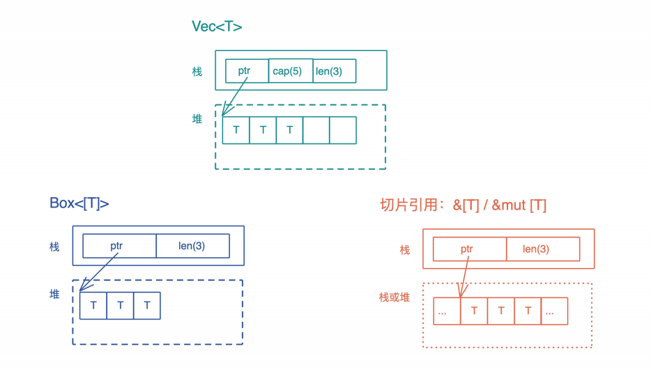

# 数据结构: 你真的了解集合么?

现在哦我们解除到了越来越多的数据结构, 一下是Rust中主要的数据结构, 从原生类型, 容器类型, 系统相关类型几个纬度整理一下, 你可以数数自己掌握了多少


可以看到, 容器占据了数据结构的半壁江山

提到容器, 很可能你首先回想到的就是数组, 列表这些可以遍历容器, 但其实只要把某种特定的数据封装在某个数据结构中, 这个数据结构就是一个容器, 比如`Option<T>`, 它是一个包裹了T存在或者不存在的容器, 而Cow是一个封装了内部数据B或被就用或拥有所有权的容器

对于容器的两小雷, 到目前为止, 像Cow这样, 为特定目的而产生的容易我们已经介绍了不少, 包括Box / Rc / Arc / RefCell, 还没讲到的Option和Result等

今天我们来详细讲讲另一类, 集合容器

## 集合容器

集合容器, 顾名思义, 就是把一系列拥有相同类的数据放在一起, 统一处理, 比如:

- 我们熟悉的字符串String, 数组`[T: n]`, 列表`Vec<T>`和哈希表`HashMap<K, V>`等
- 虽然到处在使用, 但还并不熟悉的切片slice
- 在其他语言中使用过, 但在Rust中还没有用过的缓冲区`VecDeque<T>`, 双线列表`LinkedList<T>`等

这些集合容器有很多共性, 比如可以被遍历, 可以进行map-reduce操作, 可以从一种类型准换成另一种类型等等

我们会选取两类典型的集合容器: 切片和哈希表, 深入解读, 理解这两类容器, 其他的集合容器设计思路都差不多, 并不难学习, 今天先介绍切片以及和切片相关的容器, 下一节我们学习哈希表

## 切片究竟是什么

在Rust里, 切片是描述一组属于同一类型, 长度不确定的, 在内存中连续存放的数据结构, 用`[T]`表示, 因为长度表去顶, 所以切片是一个DST

切片一般只出现在数据结构的定义中, 不能直接访问, 在使用中主要用于以下形式:

- `&[T]`: 表示一个只读的切片引用
- `&mut [T]`: 表示一个可写的切片引用
- `Box<[T]>`: 一个在堆上分配的切片

怎么理解切片呢? 打个比方, 切片之于具体的数据结构, 就像数据库有中的视图之于表, 你可以把它看成一种工具, 让我们可以统一访问行为相同, 结构类似但有些差异的类型

来看看下面的代码:

```rust
fn main() {
    let arr = [1, 2, 3, 4, 5];
    let vec = vec![1, 2, 3, 4, 5];
    let s1 = &arr[..2];
    let s2 = &vec[..2];
    println!("s1: {:?}, s2: {:?}", s1, s2);

    // &[T]和&[T]是否相等取决于长度和内容是否相等
    assert_eq!(s1, s2);
    // &[T]可以和Vec<T>/[T;n]比较, 也会看长度和内容
    assert_eq!(&arr[..], vec);
    assert_eq!(&vec[..], arr);
}
```

对于array和vector, 虽然是不同的数据结构, 一个放在栈上, 一个放在堆上, 但它们的切片都是类似的; 而且对于相同内容数据的相同切片, 比如`&arr[1..3]`和`&vec[1..3]`, 这两种是等价的, 除此之外, 切片和对应的数据结构也可以直接比较, 这是它们之间实现了PartialEq trait

下图比较清晰的诚信了切片和数据之间的关系:


另外在Rust下, 切片日常中都是使用引用`&[T]`, 所以很多同学容易搞不清楚`&[T]`和`&Vec<T>`之间的区别, 看下图, 帮助你更好的理解它们之间的关系


在使用的时候, 支持切片的具体数据类型, 你可以根据需要, 解引用成切片类型, 比如`Vec<T>`和`[T;n]`会转换成`&[T]`, 这是因为`Vec<T>`实现了Deref trait, 而array内建了到`&[T]`的解引用, 我们可以写一段代码验证这个行为

```rust
use std::{fmt, ops::Deref};

fn main() {
    let v = vec![1, 2, 3, 4];

    // Vec实现了Deref, &Vec<T>会自动解引用为&[T], 符合接口定义
    print_slice(&v);

    // 直接是&[T], 符合接口定义
    print_slice(&v[..]);

    // &Vec<T>支持AsRef<T>
    print_slice1(&v);

    // &[T]支持AsRef<T>
    print_slice1(&v[..]);

    // Vec也支持AsRef<T>
    print_slice1(v);

    let arr = [1, 2, 3, 4];
    // 数组虽然没有实现Deref. 但它的解引用就是&[T]
    print_slice(&arr);
    print_slice(&arr[..]);
    print_slice1(&arr);
    print_slice1(&arr[..]);
    print_slice1(arr);
}

fn print_slice<T: fmt::Debug>(s: &[T]) {
    println!("{:?}", s);
}

fn print_slice1<T, U>(s: T)
where
    T: AsRef<[U]>,
    U: fmt::Debug,
{
    println!("{:?}", s.as_ref());
}
```

这就意味着, 通过解引用, 这几个切片有关的数据结构都会获得切片的所有能力, 包括, binary_search, chunks, concat, contains, start_with, end_with, group_by, iter, join, sort, split, swap等一系列丰富的功能

## 切片和迭代器

迭代器可以说是切片的孪生兄弟, 切片是结合数据的视图, 而迭代器定义了对集合数据的各种各样的访问操作

通过切片的iter方法, 我们可以生成一个迭代器, 对切片进行迭代

在之前讲Rust类型推导已经见过了iterator trait(用collect方法把过滤出来的数据形成新列表), iterator trait有大量的方法, 但绝大多数情况下, 我们只需要定义它的关联类型Item和next方法

- Iter定义了每次我们从迭代器中取出的数据类型
- next是从迭代器中取出下一个值的方法, 当一个迭代器的next方法返回None时, 表明迭代器中没有数据了

```rust
#[must_use = "iterators are lazy and do nothing unless consumed"]
pub trait Iterator {
    type Item;
    fn next(&mut self) -> Option<Self::Item>;
    // 大量缺省的方法，包括 size_hint, count, chain, zip, map,
    // filter, for_each, skip, take_while, flat_map, flatten
    // collect, partition 等
    // ...
}
```

看一个例子, 对`Vec<T>`使用iter方法, 并进行各种map / filter / take操作, 在函数式编程语言中, 这样的写法很常见, 代码可读性很强, Rust也支持这种写法

```rust
fn main() {
    // 这里Vec<T>在调用iter()时被解引用成&[T], 所以可以访问iter()
    let result = vec![1, 2, 3, 4]
        .iter()
        .map(|v| v * v)
        .filter(|v| *v < 16)
        .take(1)
        .collect::<Vec<_>>();

    println!("result: {:?}", result)
}
```

需要注意的是Rust下的迭代器接口是个懒接口, 也就是说这段代码知道运行到collect时才开始执行, 之前的不烦不过是在不断的生成新的结构, 求累计处理逻辑而已, 泥坑好奇, 这是怎么做到的

在VSCode中, 如果你使用了rust-analyzer插件, 就可以发现这一奥秘:


原来Iterator大部分方法都返回一个实现了Iterator的数据接口, 所以可以这样一路链式下去, 在Rust标准库中, 这些数据结构被称为Iterator Adapter, 比如上面的map方法, 它返回Map结构, 而Map结构实现了Iterator

整个过程是这样的:

- 在collect执行的时候, 它实际视图使用FromIterator从迭代器中构建一个结合类型, 这会不断调用next获取下一个数据;
- 此时Iterator是Take, Take会调用自己的next, 也就是他会调用Filter的next
- Filter的next实际上调用自己内部的iter的find, 此时内部的iter是Map
- find会使用try_fold, 它会继续调用next, 特就是Map的next
- Map的next会调用其内部的iter取next然后执行map函数, 而此时内部iiter来自`Vec<i32>`

所以只有在collect时, 才触发代码一层层调用下去, 并且调用会根据需要随时结束, 这段代码中我们使用了`take(1)`, 整调用链循环一次, 就能满足`take(1)以及所有中间过程的要求, 所以它只会循环一次

你可能会有疑惑: 这种函数式编程的写法, 代码是漂亮了, 然后这么多无谓的函数调用, 性能肯定很差吧? 毕竟, 函数式编程语言的一大恶名就是性能差

这个你完全不用担心, Rust大量使用了inlin等优化技术, 这样非常清晰友好的表达方式, 心梗和C语言的for循环差别不大

介绍完时什么, 按惯例我们就要上代码实际使用一下, 不过迭代器是一个非常重要的一个功能, 基本上每种语言都有对迭代器的完整支持, 所以只要你之前使用过, 对此应该并不陌生, 大部分的方法, 你一看就能明白是在做什么

如果标准库中的功能还不能满足你的需求, 你可以看看itertoils, 它是和Python下itertools同名且功能类似的工具, 提供大量额外的adapter

```rust
fn main() {
    let err_str = "bad happened";
    let input = vec![Ok(21), Err(err_str), Ok(7)];
    let it = input
        .into_iter()
        .filter_map_ok(|i| if i > 10 { Some(i * 2) } else { None });
    println!("{:?}", it.collect::<Vec<_>>());
}
```

在实际开发中, 我们可能从一组Future中汇聚出一组结果, 里面有成功则执行成功的结果, 也有失败的错误信息, 如果想对成功的结果进一步做filter / map, 那么标准库就无法帮忙了, 就需要用itertools里的filter_map_ok

## 特殊的切片: &str

学完了普通切片`&[T]`, 我们来看一种特殊的切片: `&str`, 之前见过, String是一个特殊的`Vec<u8>`, 所以在String上做切片, 也是一个特殊的结构&str

String和`&str`对比:


String在解引用的时候, 会转换成`&str`, 可以用下面的代码验证:

```rust
use std::fmt;
fn main() {
    let s = String::from("hello");
    // &String 会被解引用成 &str
    print_slice(&s);
    // &s[..] 和 s.as_str() 一样，都会得到 &str
    print_slice(&s[..]);
    // String 支持 AsRef<str>
    print_slice1(&s);
    print_slice1(&s[..]);
    print_slice1(s.clone());
    // String 也实现了 AsRef<[u8]>，所以下面的代码成立
    // 打印出来是 [104, 101, 108, 108, 111]
    print_slice2(&s);
    print_slice2(&s[..]);
    print_slice2(s);
}
fn print_slice(s: &str) {
    println!("{:?}", s);
}
fn print_slice1<T: AsRef<str>>(s: T)
println!("{:?}", s.as_ref());
}
fn print_slice2<T, U>(s: T)
where
T: AsRef<[U]>,
U: fmt::Debug,
{
    println!("{:?}", s.as_ref());
}
```

有同学可能会有疑问: 那么字符的列表和字符串有什么关系和区别吗?

```rust
use std::iter::FromIterator;

fn main() {
    let arr = ['h', 'e', 'l', 'l', 'o'];
    let vec = vec!['h', 'e', 'l', 'l', 'o'];
    let s = String::from("hello");
    let s1 = &arr[1..3];
    let s2 = &vec[1..3];
    // &str本身就是一个特殊的slice
    let s3 = &s[1..3];
    println!("s1: {:?}, s2: {:?}, s3: {:?}", s1, s2, s3);

    // &[char] 和 &[char] 是否相等取决于长度和内容是否相等
    assert_eq!(s1, s2);
    // &[char] 和 &str 不能直接对比，我们把 s3 变成 Vec<char>
    assert_eq!(s2, s3.chars().collect::<Vec<_>>());
    // &[char] 可以通过迭代器转换成 String，String 和 &str 可以直接对比
    assert_eq!(String::from_iter(s2), s3);
}
```

可以到, 字符列表可以通过迭代器转换成String, String也可以通过chars函数转换成字符列表, 如果不转换, 二者不能比较

下图把数组, 列表, 字符串以及它们的切片放在一起比较, 可以帮助你更好的理解它们的区别:


## 切片的引用和堆上的切片, 它们是怎么一回事?

开头我们讲过, 切片主要有三种使用方式: 切片的只读引用`&[T]`, 切片的可变引用`&mut [T]`, `Box<[T]>`, 刚才已经详细学习了只读切片`&[T]`, 也和其他各种数据结构进行了对比帮助理解, 可变切片`&mut [T]`和它相似

我们来看看`Box<[T]>`

`Box<[T]>`是一个比较有意思的存在, 它和`Vec<T>`有一点点差别; `Vec<T>`有额外的capacity, 可以增长; 而`Box<[T]>`一旦生成就固定下, 没有capacity, 也无法增长

`Box<[T]>`和切片的引用`&[T]`也很类似: 它们都是在栈上有一个包含长度的胖指针, 指向存储数据的内存位置, 区别是`Box<[T]>`只会指向堆, `&[T]`指向的位置可以是对也可以是栈, 此外, `Box<[T]>`对数据具有所有权, 而`&[T]`只是一个借用



那么如何产生`Box<[T]>`呢? 目前的接口就只有一个: 从已有的`Vec<T>`中转换, 我们看代码:

```rust
use std::ops::Deref;

fn main() {
    let mut v1 = vec![1, 2, 3, 4];
    v1.push(5);
    println!("cap should be 8: {}", v1.capacity());

    // 从Vec<T>转换成Box<[T]>, 此时会丢弃多余的capacity
    let b1 = v1.into_boxed_slice();
    let mut b2 = b1.clone();
    let v2 = b1.into_vec();
    println!("cap should be exactly 5: {}", v2.capacity());
    assert!(b2.deref() == v2);

    // Box<[T]>可以更改其内部数据, 但无法push
    b2[0] = 2;
    println!("b2: {:?}", b2);

    // 注意Box<[T]>和Box<[T;n]>并不相同
    let b3 = Box::new([2, 2, 3, 4, 5]);
    println!("b3: {:?}", b3);

    // b2和b3相等, 但b3.deref()无法和v2进行比较
    assert!(b2 == b3);
    let a = b3.deref();
    let b = v2.deref();
    // assert!(b3.deref() == v2);
}
```

运行代码可以看到, `Vec<T>`可以通into_boxed_slice转换成`Box<[T]>`, `Box<[T]>`也可以通过into_vec转换回`Vec<T>`

这两个转换都是很轻量的转换, 只是变换一下结构, 不涉及数据的拷贝, 区别是, 当`Vec<T>`转换成`Box<[T]>`时, 没有使用到的容量就会被丢弃, 所以整体占用的内存可能会降低, 而且`Box<[T]>`有一个很好特性是, 不想`Box<[T;n]>`那么样在编译时就要确定大小, 它可以在运行期生成, 以后大小不会在改变

所以, 当我们需要在堆上创建固定带下的集合数据, 且不希望自动增长, 那么, 可以先创建`Vec<T>`, 在转换成`Box<[T]>`, tokio在提供broadcast channel时, 就使用了`Box<[T]>`这个特性

## 小结

我们讨论了切片以及和切片相关的主要数据类型, 切片是一个很重要的数据类型, 你可以着重理解它存在的意义, 以及使用方式

今天学完相信你也看到了, 围绕着切片有很多种数据类型, 而切片将它们抽象成相同的访问方式, 实现了在不同数据类型之上的同一抽象, 这种方法很值得我们学习, 此外, 当我们构建自己的数据结构时, 如果它内部也有连续排列的等长的数据结构, 可以考虑AsRef或者Reref到切片

下图描述了切片的和数组`[T;n]`, 列表`Vec<T>`, 切片引用`&[T]` / `&mut T`, 以及在堆上分配的切片`Box<[T]>`之间的厝, 建议和你花些时间理解这张图, 也可以用相同的方式去总结学到的其他有关联的数据类型


## 思考题

1. 在讲`&str`时, 里面的print_slice1函数, 乳沟写成这样可不可以? 你可以尝试一下, 然后说明理解

   ```rust
   fn print_slice1<T, U>(s: T)
   where
       T: AsRef<U>,
       U: fmt::Debug,
   {
       println!("{:?}", s.as_ref());
   }
   
   // U可以是[u8]类型, 也可以是str, rust编译器无法根据上下文确定U具体是谁
   ```

2. 类似itertools, 你可以试着开发一个新的Iterator trait IteratorExt, 为其提供window_count函数, 使其可以做下图中的动作:

   

   ```rust
   // IteratorExt继承Iterator, 这样就可以地哦啊用Iterator的全部功能
   pub trait IteratorExt: Iterator {
       fn window_count(self, count: u32) -> WindowCount<Self>
       where
           Self: Sized,
       {
           WindowCount { iter: self, count }
       }
   }
   
   // 这句很重要, 它让所有实现了Iterator的T都自动实现了IteratorExt
   impl<T: ?Sized> IteratorExt for T where T: Iterator {}
   
   pub struct WindowCount<I> {
       pub(crate) iter: I,
       count: u32,
   }
   
   impl<I: Iterator> Iterator for WindowCount<I> {
       type Item = Vec<I::Item>;
       fn next(&mut self) -> Option<Self::Item> {
           let data = (0..self.count)
               .filter_map(|_| self.iter.next())
               .collect::<Vec<_>>();
           if data.is_empty() {
               None
           } else {
               Some(data)
           }
       }
   }
   
   fn main() {
       let data = vec![1, 2, 3, 4, 5];
       let result = data.iter().window_count(2).collect::<Vec<_>>();
       println!("{:?}", result);
   }
   ```

   
