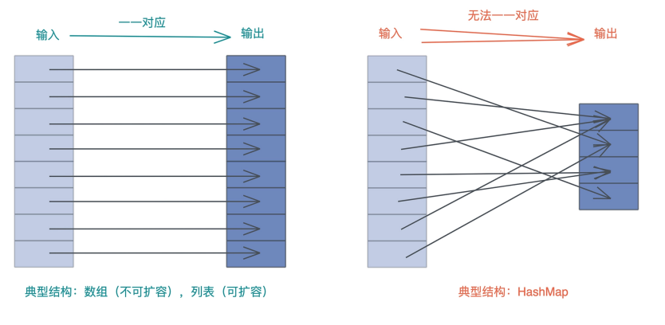
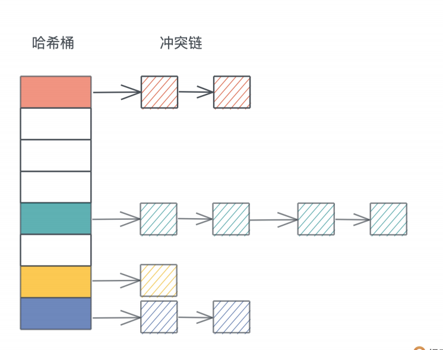
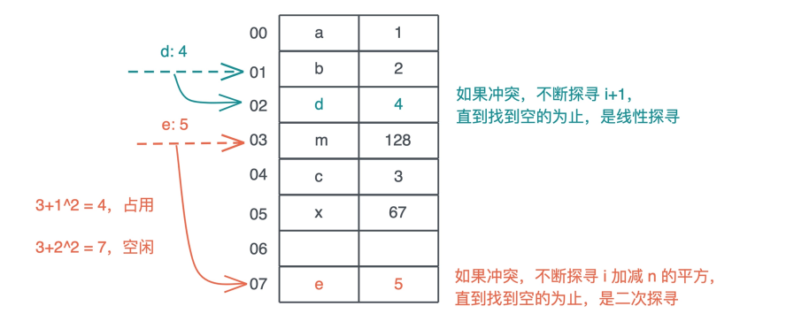
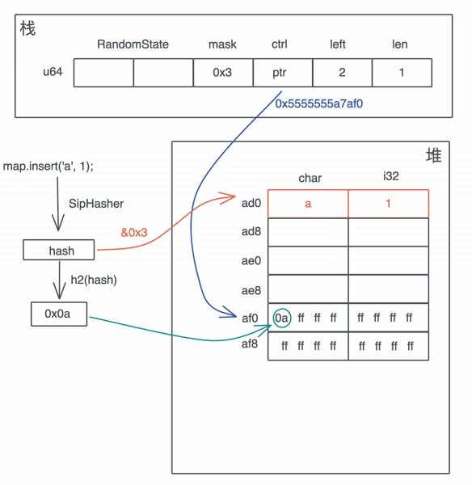
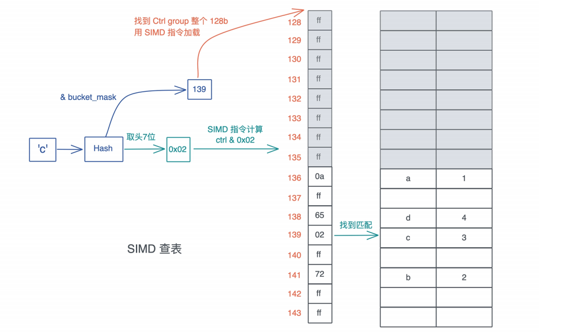
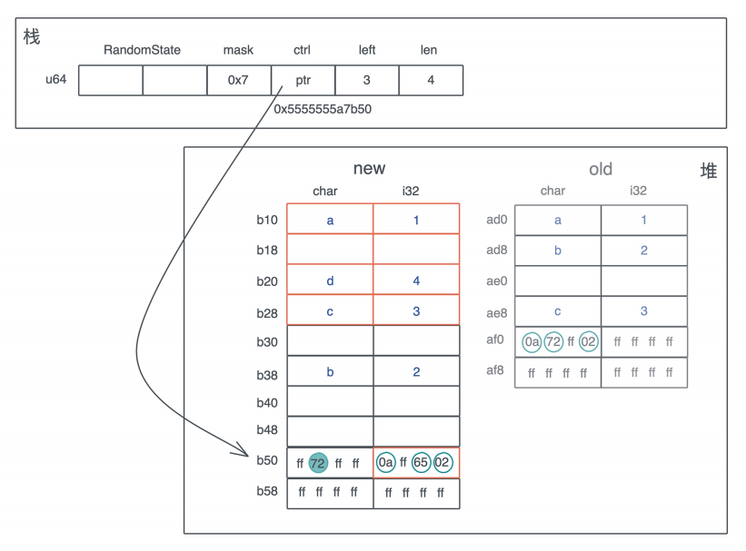
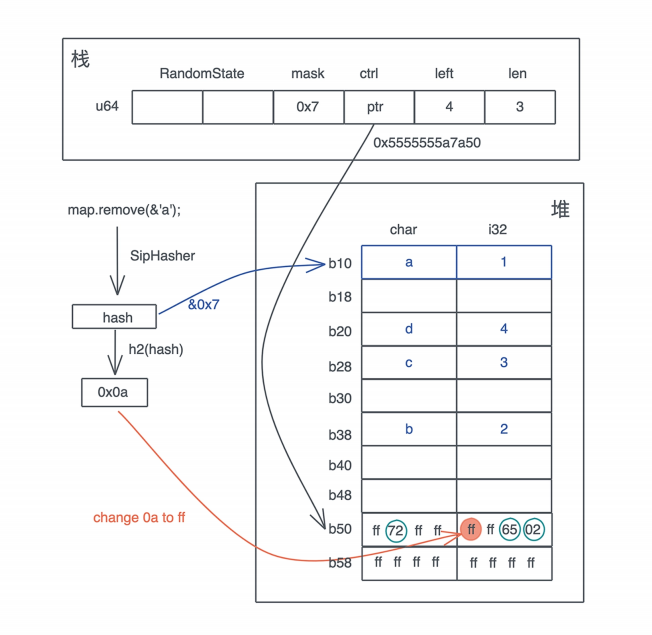
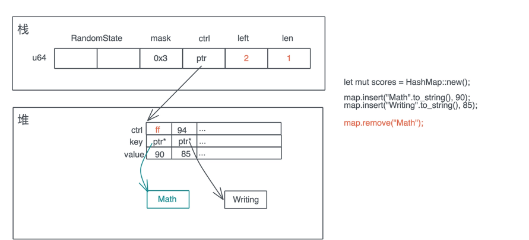

# 数据结构: 软件系统核心部件哈希表, 内存如何布局?

上一节我们深入学习了切片, 对比了数据, 列表, 字符串和它们的切片以及切片引用的关系, 今天我们就继续讲讲Rust里另一个非常重要的集合容器: HashMap, 也就是哈希表

如果谈论软件开发最重要, 出镜率最高的数据结构, 那哈希表一定位列其中, 很多编程语言会将哈希表作为一种内置的数据结构, 做进了语言核心, 比如PHP的关联数组, Python的字典, JavaScript的对象和Map

我们知道, 哈希表和列表类似, 都用于处理需要随机访问的数据结构, 如果数据结构的输入和输出能意义对应, 那么可以使用列表, 如果无法一一对应, 那么就需要使用哈希表



## Rust的哈希表

那Rust为我们提供了什么样的哈希表呢? 它长什么样? 性能如何? 我们从官方文档学起

如果你打开HashMap的文档, 会看到这样一句话:

> A hash map implemented with quadratic probing and SIME lookup

这句话出现了两个高端词汇: 二次探查(quadratic probing)和SIMD查表(SIME lookup), 都是什么意思? 它们是Rust哈希表算法的设计核心, 我们今天的学习也会围绕着两个词展开, 所以别着急, 等学完相信你会理解这句话的

先把基础理论扫一遍, 哈希表最核心的特点就是: 巨量的可能输入和有限的哈希表容量, 这就会引发哈希冲突, 也就是两个或者多个输入的哈希被映射到了同一个位置, 所以我们要能够处理哈希冲突

要解决冲突, 首先可以通过更好的, 分布更均匀的哈希函数, 以及使用更大的哈希表来缓解冲突, 但无法完全解决, 所以我们还需要使用冲突解决机制

## 如何解决冲突?

理论上, 主要的冲突解决机制有链地址法(chaining)和开发寻址法(open addressing)

链地址法, 我们比较熟悉, 就是把落在同一个哈希上的数据用链表或者双链表连接起来, 这样在查找的时候, 先找到对应的哈希桶(hash bucket), 然后再在冲突链上挨个比较, 直到找到匹配的项:



冲突链处理哈希冲突非常直观, 很容易理解和撰写代码, 但缺点是哈希表盒冲突链使用了不同的内存, 对缓存不太友好

开发寻址法把整个哈希表看做是一个大数组, 不引入额外的内存, 当冲突产生的时候, 按照一定的规则把数据插入到其他空闲的位置, 比如线性探寻(linear probing)在出现哈希冲突时, 不断往后探寻, 直到找到空闲的位置插入

而二次探查, 理论上是在冲突发生时, 不断探寻哈希位置加减n的二次方, 找到空闲的位置插入, 我们看图, 更容易理解:



> 图中示意是理论上的处理方法, 实际为了性能会有很多不同的处理

开放寻址法还有其他方案, 比如二次哈希什么, 今天就不详细介绍了

搞明白哈希表的二次探查的理论知识, 我们可以推测, Rust哈希表不是用冲突链来解决哈希冲突, 而是使用寻址法的二次探查来解决, 当然后面会讲到Rust的二次探查和理论的处理方式有些差别

而另一个关键词, 使用SIMD做单指令多数据的查表, 也和一会要讲到Rust哈希表巧妙的内存布局息息相关

## HashMap的数据结构

我们来看看Rust哈希表的数据结构是什么样子的:

```rust
use hashbrown::hash_map as base;

#[derive(Clone)]
pub struct RandomState {
    k0: u64,
    k1: u64,
}

pub struct HashMap<K, V, S = RandomState> {
    base: base::HashMap<K, V, S>,
}
```

可以看到, HashMap有三个泛型参数, K和V代表key/value的类型, S是哈希算法的状态, 它默认是RandomState, 占两个u64, RandomState使用SipHash作为缺省的哈希算法, 它是一个加密安全的哈希函数

从定义还能看到, Rust的HashMap复用了hashbrow的HashMap, hashbrown是Rust下对Google Swiis Table的一个改进版实现, 我们打开hashbrown的代码, 看他的结构

```rust
pub struct HashMap<K, V, S = DefaultHashBuilder, A: Allocator = Global> {
    pub(crate) hash_builder: S,
    pub(crate) table: RawTable<(K, V), A>,
}
```

可以看到, HashMap里有两个与, 一个是hash_builder, 类型是刚才我们提到的标准库使用它的RandomState, 还有一个是具体的RawTable:

```rust
pub struct RawTable<T, A: Allocator = Global> {
    table: RawTableInner,
    alloc: A,
    // Tell dropck that we own instances of T.
    marker: PhantomData<T>,
}

/// Non-generic part of `RawTable` which allows functions to be instantiated only once regardless
/// of how many different key-value types are used.
struct RawTableInner {
    // Mask to get an index from a hash value. The value is one less than the
    // number of buckets in the table.
    bucket_mask: usize,

    // [Padding], T1, T2, ..., Tlast, C1, C2, ...
    //                                ^ points here
    ctrl: NonNull<u8>,

    // Number of elements that can be inserted before we need to grow the table
    growth_left: usize,

    // Number of elements in the table, only really used by len()
    items: usize,
}
```

RawTable中, 实际上有意义的数据结构是RawTableInner, 前四个字段很重要, 我们一会讲到HashMap的内存布局中会在提到:

- uszie的bucket_mask, 是哈希表中哈希桶的数量减一,
- 名词叫ctrl的指针, 它指向哈希表堆内存末端的ctrl区,
- usize的字段growth_left, 指哈希表在下次自动增长前还能存储多少数据
- usize的items, 表明哈希表现在有多少数据

这里最后的alloc字段, 和RawTable和market一样只是一个用来占位的类型, 我们现在只需知道, 它用来分配堆上的内存

## HashMap的基本使用方法

数据结构搞清楚, 我们在看具体使用方法, Rust哈希表的使用很简单, 它提供了一系列的很方便的方法, 使用起来和其他编程语言非常类似, 你只要看文档, 就很容易理解, 我们来写一点代码, 尝试一下:

```rust
use std::collections::HashMap;

fn main() {
    let mut map = HashMap::new();
    explain("empty", &map);

    map.insert('a', 1);
    explain("added 1", &map);

    map.insert('b', 2);
    map.insert('c', 3);
    explain("added3", &map);

    map.insert('4', 4);
    explain("added 4", &map);

    // get时需要使用引用, 并且也返回引用
    assert_eq!(map.get(&'a'), Some(&1));
    assert_eq!(map.get_key_value(&'b'), Some((&'b', &2)));

    map.remove(&'a');
    // 删除后就找不到了
    assert_eq!(map.contains_key(&'a'), false);
    assert_eq!(map.get(&'a'), None);
    explain("removed", &map);

    // shrink后哈希表变小
    map.shrink_to_fit();
    explain("shrinked", &map);
}
```

运行这段代码后, 我们可以看到这样的输出

```
empty: len: 0, cap: 0
added 1: len: 1, cap: 3 
added3: len: 3, cap: 3  
added 4: len: 4, cap: 7 
removed: len: 3, cap: 7 
shrinked: len: 3, cap: 3
```

可以看到, 当`HashMap::new`时, 它并没有分配空间, 容量为零, 随着哈希表不断插入数据, 它会以2的幂减一的方式增长, 最小是3, 当删除表中的数据时, 原有表大小不变, 只有显式的调用shrink_to_fit, 才会让哈希表变小

## HashMap的内存布局

但是通过HashMap的公开接口, 我们无法看到HashMap在内存中是如何布局的, 还是需要借助之前使用过的`std::mem::transmute`方法, 来吧数据打出来, 我们把刚才的代码修改一下:

```rust
use std::collections::HashMap;

fn main() {
    let map = HashMap::new();
    let mut map = explain("empty", map);
    map.insert('a', 1);
    let mut map = explain("added 1", map);
    map.insert('b', 2);
    map.insert('c', 3);
    let mut map = explain("added 3", map);
    map.insert('d', 4);
    let mut map = explain("added 4", map);
    map.remove(&'a');
    explain("final", map);
}

// HashMap 结构有两个 u64 的 RandomState，然后是四个 usize，
// 分别是 bucket_mask, ctrl, growth_left 和 items
// 我们 transmute 打印之后，再 transmute 回去
fn explain<K, V>(name: &str, map: HashMap<K, V>) -> HashMap<K, V> {
    let arr: [usize; 6] = unsafe { std::mem::transmute(map) };

    println!(
        "{}: bucket_mask 0x{:x}, ctrl 0x{:x}, growth_left: {}, items: {}",
        name, arr[2], arr[3], arr[4], arr[5]
    );

    unsafe { std::mem::transmute(arr) }
}
```

运行之后, 可以看到:

```
empty: bucket_mask 0x0, ctrl 0x1056df820, growth_left: 0, items: 0
added 1: bucket_mask 0x3, ctrl 0x7fa0d1405e30, growth_left: 2, items: 1
added 3: bucket_mask 0x3, ctrl 0x7fa0d1405e30, growth_left: 0, items: 3
added 4: bucket_mask 0x7, ctrl 0x7fa0d1405e90, growth_left: 3, items: 4
final: bucket_mask 0x7, ctrl 0x7fa0d1405e90, growth_left: 4, items: 3
```

我们发现在运行的过程中, ctrl的对地址发生了改变

在我们OS X下, 一开始哈希表为空, ctrl地址看上去是一个TEXT/DODATA段的地址, 应该是指向一个默认的空表地址; 插入第一个数据后, 哈希表分配了四个buctet, ctrl地址变化; 在插入三个数据后, growth_left为0, 在插入时, 哈希表重新分配, ctrl地址继续发生改变

刚才在探索HashMap数据结构时, 说过ctrl是一个指向哈希表堆地址末端的ctrl区的地址, 所以我们可以通过这个地址, 计算出哈希表堆地址的起始地址

因为哈希表有8个bucket(0x7 + 1), 每个bucket大小是key(char) + value(i32)的带下, 也就是8个字节, 所以一共是64个字节, 对于这个例子, 通过ctrl地址减去64, 就可以得到哈希表堆内存的起始地址, 然后, 我们可以用rust-gdb/rust-lldb来打印这个内存

这里我用Linux下的rust-gdb设置断点, 依次查看哈希表有一个三个四个 值, 以及删除一个值的状态:

```rust
❯ rust-gdb ~/.target/debug/hashmap2
GNU gdb (Ubuntu 9.2-0ubuntu2) 9.2
...
(gdb) b hashmap2.rs:32
Breakpoint 1 at 0xa43e: file src/hashmap2.rs, line 32.
(gdb) r
Starting program: /home/tchen/.target/debug/hashmap2
...
# 最初的状态，哈希表为空
empty: bucket_mask 0x0, ctrl 0x555555597be0, growth_left: 0, items: 0
Breakpoint 1, hashmap2::explain (name=..., map=...) at src/hashmap2.rs:32
32 unsafe { std::mem::transmute(arr) }
(gdb) c
Continuing.
# 插入了一个元素后，bucket 有 4 个（0x3+1），堆地址起始位置 0x5555555a7af0 - 4*8(0x20
added 1: bucket_mask 0x3, ctrl 0x5555555a7af0, growth_left: 2, items: 1
Breakpoint 1, hashmap2::explain (name=..., map=...) at src/hashmap2.rs:32
32 unsafe { std::mem::transmute(arr) }
(gdb) x /12x 0x5555555a7ad0
0x5555555a7ad0: 0x00000061 0x00000001 0x00000000 0x00000000
0x5555555a7ae0: 0x00000000 0x00000000 0x00000000 0x00000000
0x5555555a7af0: 0x0affffff 0xffffffff 0xffffffff 0xffffffff
(gdb) c
Continuing.
# 插入了三个元素后，哈希表没有剩余空间，堆地址起始位置不变 0x5555555a7af0 - 4*8(0x20)
added 3: bucket_mask 0x3, ctrl 0x5555555a7af0, growth_left: 0, items: 3
Breakpoint 1, hashmap2::explain (name=..., map=...) at src/hashmap2.rs:32
32 unsafe { std::mem::transmute(arr) }
(gdb) x /12x 0x5555555a7ad0
0x5555555a7ad0: 0x00000061 0x00000001 0x00000062 0x00000002
0x5555555a7ae0: 0x00000000 0x00000000 0x00000063 0x00000003
0x5555555a7af0: 0x0a72ff02 0xffffffff 0xffffffff 0xffffffff
(gdb) c
Continuing.
# 插入第四个元素后，哈希表扩容，堆地址起始位置变为 0x5555555a7b50 - 8*8(0x40)
added 4: bucket_mask 0x7, ctrl 0x5555555a7b50, growth_left: 3, items: 4
Breakpoint 1, hashmap2::explain (name=..., map=...) at src/hashmap2.rs:32
32 unsafe { std::mem::transmute(arr) }
(gdb) x /20x 0x5555555a7b10
0x5555555a7b10: 0x00000061 0x00000001 0x00000000 0x00000000
0x5555555a7b20: 0x00000064 0x00000004 0x00000063 0x00000003
0x5555555a7b30: 0x00000000 0x00000000 0x00000062 0x00000002
0x5555555a7b40: 0x00000000 0x00000000 0x00000000 0x00000000
0x5555555a7b50: 0xff72ffff 0x0aff6502 0xffffffff 0xffffffff
(gdb) c
Continuing.
# 删除 a 后，剩余 4 个位置。注意 ctrl bit 的变化，以及 0x61 0x1 并没有被清除
final: bucket_mask 0x7, ctrl 0x5555555a7b50, growth_left: 4, items: 3
Breakpoint 1, hashmap2::explain (name=..., map=...) at src/hashmap2.rs:32
32 unsafe { std::mem::transmute(arr) }
(gdb) x /20x 0x5555555a7b10
0x5555555a7b10: 0x00000061 0x00000001 0x00000000 0x00000000
0x5555555a7b20: 0x00000064 0x00000004 0x00000063 0x00000003
0x5555555a7b30: 0x00000000 0x00000000 0x00000062 0x00000002
0x5555555a7b40: 0x00000000 0x00000000 0x00000000 0x00000000
0x5555555a7b50: 0xff72ffff 0xffff6502 0xffffffff 0xffffffff
```

这段输出蕴藏了很多信息, 我们结合示意图来仔细梳理

首先, 插入第一个元素`'a': 1`后, 哈希表内存布局如下:



key 'a' 的hash和bucket_mask 0x3运算后得到第0个位置插入, 同时这个hash的头7位取出来, 在ctrl表中对应的位置, 也就是0个字节, 把这个值写入

要理解这个步骤, 关键就是要搞清楚ctrl表示是什么

### ctrl表

ctrl表的主要目的是快速查找, 它的设计非常优雅, 值得我们学习

一张ctrl表里, 有若干个128bit或者16个字节的分组(group), group里的米格字段叫ctrl byte, 对应一个bucket, 那么一个group对应16个bucet, 如果一个bucket对应的ctrl byte首位不为1, 就表示这个ctrl byte被使用; 如果所有位都是1或者说这个字节是0xff, 那么它是空闲的

一组control byte的整个128bit的数据, 可以让一条指令加载进来, 然后和摸一个值进行mask, 找到它所在的位置, 这就是以爱是的SIMD查表

我们知道现代CPU都支持单指令多数据集的操作, 而Rust充分利用了CPU这种能力, 一条指令可以让多个相关的数据载入到缓存中处理, 大大加快了查表的速度, 所以Rust的哈希表查询的效率是非常高的

具体怎么操作, 我们来看HashMap是如何通过ctrl表来进行数据查询的, 假设这张表里已经添加了一些数据, 我们现在要查找key为 'c'的数据:

1. 首先对 'c' 做哈希, 得到一个哈希值
2. 把h根bucket_mask做与, 得到一个值图中是139
3. 拿着这个139赵铎对应的ctrl group的起始位置, 因为ctrl group以16位一组, 所以这里找到128
4. 用SIMD指令加载从128对应地址开始的16个字节
5. 对hash取头7个bit, 然后和刚刚取出的16个字节一起做与, 找到对应的匹配, 如果找到了, 它们很大概率是要找的值
6. 如果不是, 那么以二次探测(以16的倍数不断累计)的方式往后查找, 知道找到为止

你可以结合下图理解这个算法:



所以当HashMap插入和删除数据的时候, 以及因此到导致重新分配的时候, 主要的工作就是在维护这张ctrl和数据的对应

因为ctrl表示所有操作最先触及的内存, 所以在HashMap的结构中, 堆内存的指针直接指向ctrl表, 而不是堆内存的起始位置, 这样可以减少一次内存的访问

### 哈希表重新分配与增长

在插入第一条数据后, 我们哈希表只有4个bucket, 所以只有头4个ctrl表有用, 随着哈希表的增长, bucket不够, 就会导致重新分配, 由于bucket_mask永远比bucket数量少1, 所以插入第三个元素后就会重新分配

根据rust-gdb中得到的新, 我们看插入三个元素后没有剩余空间的哈希表, 在加入`'d': 4`时, 是如何增长的

首先, 哈希表会按幂扩容, 从4个bucket拓展到8个bucket

这会导致分配新的堆内存,然后原来的ctrl table和对应的kv数据会被移动到新的内存中, 这个例子里因为char和i32实现了Copy trait所以是拷贝; 如果key的类型是String, 那么只有String的24个字节(prt|cap|len)的结构被移动, String的实际内存不需要变动

在移动的过程中, 会涉及哈希的重分配, 从下图可以看到, `'a' / 'c'`的相对位置和它们的ctrl byte没有变化, 但重新做hash后, 'b'的ctrl byte和位置都发生了变化



### 删除一个值

明白了哈希表是如何增长的, 我们再来看看删除的时候发生什么

当要在哈希表中删除一个值时, 整个过程和查找类似, 先要找到要被删除的key所在的位置, 要找到具体位置后, 并不需要实际清除内存, 只需要将它的ctrl byte设会0xff(或被标记成删除状态), 这样这个bucket就可以被再次使用了



这里有一个问题, 当key/value有额外的内存时, 比如String, 它的内存不会立即回收, 只有在下一次对应bucket被使用的时, 让HashMap不在拥有这个String的所有权后, 这个String的内存才被回收, 



一般来说, 这并不会带来什么问题, 顶多是内存占用稍高一些, 但某些极端情况下, 比如在哈希表中添加大量内存, 有删除大量内存后运行你这时候你可以通过shrint_to_fit / shrint_to释放掉不需要的内存

## 让自定义的数据结构做Hash Key

有时候, 我们需要让自定义的结构成为HashMap的Key, 此时要使用到三个trait: Hash / PartialEq, Eq, 不过这三个trait都可以通过派生宏自动生成, 其中:

- 实现了Hash triat, 可以让数据结构计算出哈希
- 实现了PartialEq / Eq trait, 可以让数据结构进行相等和不相等的比较, Eq实现了比较的自反性(a == a), 对称性(a == b 则 b == a), 以及传递性(a == b, b == c, 则a ==c), PartialWq没有实现自反性

我们可以写一个例子, 看看自定义数据结构如何支持HashMap

```rust
use std::{
    collections::HashMap,
    hash::{DefaultHasher, Hash, Hasher},
};

#[derive(Debug, Hash, PartialEq, Eq)]
struct Student<'a> {
    name: &'a str,
    age: u8,
}

impl<'a> Student<'a> {
    fn new(name: &'a str, age: u8) -> Self {
        Self { name, age }
    }
}

fn main() {
    let mut hasher = DefaultHasher::new();
    let student = Student::new("Tyr", 19);
    // 实现了Hash trait的数据结构可以直接调用hash方法
    student.hash(&mut hasher);
    let mut map = HashMap::new();
    // 实现了 Hash / PartialEq / Eq 的数据结构可以作为HashMap的key
    map.insert(student, vec!["Math", "Writing"]);
    println!("hash: 0x{:x}, map: {:?}", hasher.finish(), map);
}
```

## HashSet / BTreeMap / BTreeSet

有时候我们只需要简单确认元素是否在集合中, 如果用HashMap就有些浪费空间了, 我们可以使用HashSet, 它就是简化版的HashMap, 可以用来存放无序的集合, 定义直接是`HashMap<K, ()>`

```rust
use hashbrown::hash_set as base;
pub struct HashSet<T, S = RandomState> {
    base: base::HashSet<T, S>,
}
pub struct HashSet<T, S = DefaultHashBuilder, A: Allocator + Clone = Global> {
    pub(crate) map: HashMap<T, (), S, A>,
}
```

使用HashSet查看一个元素是否属于集合的效率非常高

另一个 HashMap一样常用的数据结构是BTreeMap, BTreeMap是内部使用B-tree来组织哈希表的数据结构, 另外BTreeSet和HashSet类似, 是BTreeMap的简化版, 可以用来存放有序集合

我们重点看下BTreeMap, 它的结构如下

```rust
pub struct BTreeMap<K, V> {
    root: Option<Root<K, V>>,
    length: usize,
}
pub type Root<K, V> = NodeRef<marker::Owned, K, V, marker::LeafOrInternal>;
pub struct NodeRef<BorrowType, K, V, Type> {
    height: usize,
    node: NonNull<LeafNode<K, V>>,
    _marker: PhantomData<(BorrowType, Type)>,
}
struct LeafNode<K, V> {
    parent: Option<NonNull<InternalNode<K, V>>>,
    parent_idx: MaybeUninit<u16>,
    len: u16,
    keys: [MaybeUninit<K>; CAPACITY],
    vals: [MaybeUninit<V>; CAPACITY],
}
struct InternalNode<K, V> {
    data: LeafNode<K, V>,
    edges: [MaybeUninit<BoxedNode<K, V>>; 2 * B],
}
```

和HashMap不同的是, BTreeMap是有序的

```rust
use std::collections::BTreeMap;
fn main() {
    let map = BTreeMap::new();
    let mut map = explain("empty", map);
    for i in 0..16usize {
        map.insert(format!("Tyr {}", i), i);
    }
    let mut map = explain("added", map);
    map.remove("Tyr 1");
    let map = explain("remove 1", map);
    for item in map.iter() {
        println!("{:?}", item);
    }
}
// BTreeMap 结构有 height，node 和 length
// 我们 transmute 打印之后，再 transmute 回去
fn explain<K, V>(name: &str, map: BTreeMap<K, V>) -> BTreeMap<K, V> {
    let arr: [usize; 3] = unsafe { std::mem::transmute(map) };
    println!(
        "{}: height: {}, root node: 0x{:x}, len: 0x{:x}",
        name, arr[0], arr[1], arr[2]
    );
    unsafe { std::mem::transmute(arr) }
}
```

```
empty: height: 0, root node: 0x0, len: 0x0
added: height: 1, root node: 0x7f8286406190, len: 0x10
remove 1: height: 1, root node: 0x7f8286406190, len: 0xf
("Tyr 0", 0)
("Tyr 10", 10)
("Tyr 11", 11)
("Tyr 12", 12)
("Tyr 13", 13)
("Tyr 14", 14)
("Tyr 15", 15)
("Tyr 2", 2)
("Tyr 3", 3)
("Tyr 4", 4)
("Tyr 5", 5)
("Tyr 6", 6)
("Tyr 7", 7)
("Tyr 8", 8)
("Tyr 9", 9)
```

可以看到, 在遍历时, BTreeMap会按照key的顺序吧值打印出来, 如果你想自定义的数据结构作为BTreeMap的key, 那么需要实现PartialOrd和Ord, 这两者的关系和PartialEq / Eq类似, PartialEq没有自反性, 同样的, PartialOrd和Ord也可以通过派生宏来实现

## 小结

在学习数据结构的时候, 常用的数据结构的内存布局和基本算法你一定要理解清除, 对它在不同情况下如何增长, 也要尽量做到心中有数

## 思考题

1. 修改下面代码的错误, 使其编译通过

   ```rust
   use std::collections::BTreeMap;
   #[derive(Debug)]
   struct Name {
       pub name: String,
       pub flags: u32,
   }
   impl Name {
       pub fn new(name: impl AsRef<str>, flags: u32) -> Self {
           Self {
               name: name.as_ref().to_string(),
               flags,
           }
       }
   }
   fn main() {
       let mut map = BTreeMap::new();
       map.insert(Name::new("/etc/password", 0x1), 12);
       map.insert(Name::new("/etc/hosts", 0x1), 4);
       map.insert(Name::new("/home/tchen", 0x0), 28);
       for item in map.iter() {
           println!("{:?}", item);
       }
   }
   ```

   