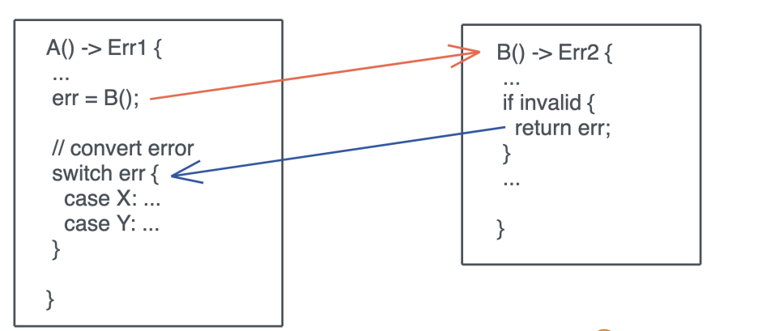
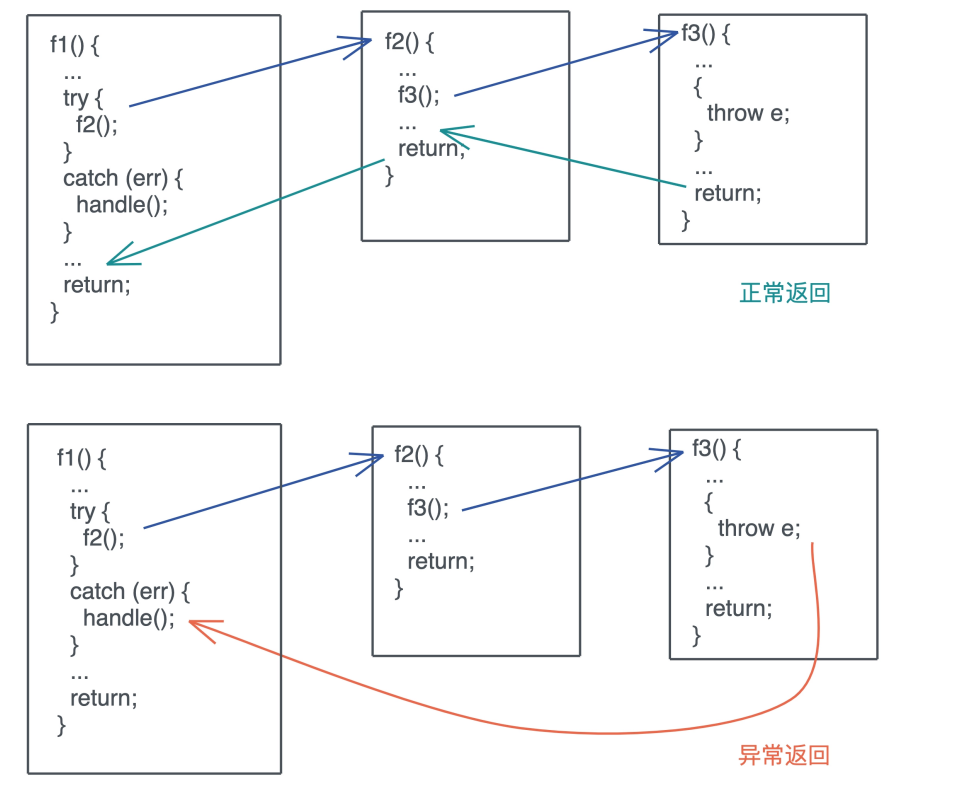
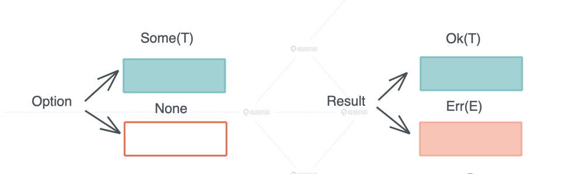
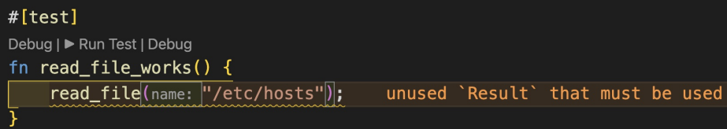

# 错误处理: 为什么Rust的错误处理与众不同?

作为被线上业务毒打过的开发者, 我们都对墨菲定律刻骨铭心, 任何一个系统, 只要运行的时间足够久, 或者用户额规模足够大, 极小概率的错误就一定会发生, 比如主机的磁盘可能被写满, 数据库系统可能会脑裂, 上游服务必须CDN可能会宕机, 甚至承载服务的硬件本身可能损坏等

因为哦我们平时写练习代码, 一般只会关注正常路径, 可以对小概率发生的错误路径置之不理; 但在实际生产环境中, 任何错误只要没有妥善处理, 就会个系统埋下隐患, 区轻则影响开发者用户体验, 重则会给系统带来安全性问题

在一门编程语言中, 控制流程是语言的核心流程, 而错误处理, 有是控制流程的重要组成部分

语言优秀的错误处理能力, 会大大减少错误处理对整体流程的破坏, 让我们写代码更行云流水, 读起来心智负担也更小


对于我们开发者来说, 错误处理包含这么几个部分

1. 当错误发生时, 用合适的错误类型捕获这个错误
2. 捕获错误后, 可以理解处理, 也可以延迟到不得不处理的时候, 这就涉及错误的传播了
3. 最后, 根据不同类型的错误, 给用户返回合适的, 帮助它们解决问题所在的错误消息

作为一门极其注重用户体验的编程语言, Rust从其他优秀语言中吸取了错误处理的精髓, 并已自己独到的方式展示

## 错误处理的主流方法

在详细介绍Rust错误处理方式之前, 让哦我们稍稍放慢脚步, 看看错误处理的三种主流方式以及其他语言是如何应用这些方法的

### 使用返回码(错误码)

使用返回值来表征错误, 是最古老也是最实用的一种方式, 它的使用范围很广, 从函数返回值, 到操作系统调用的错误码errno, 进程退出的错误码retval, 甚至HTTP API的错误码, 都能看到这种方法的身影

举个例子, 在C语言中, 如果fopen(filename)无法打开文件, 会返回NULL, 调用者通过返回值是否为NULL来进行相应的错误处理:

我们再来看一个例子:

```rust
size_t fread(void *ptr, size_t size, size_t nmemb, FILE *stream)
```

单看这个接口, 我们很难直观了解, 当文件出错时, 错误是如何返回的, 从文档中, 我们得知, 如果返回size_t和传入的size_t不一致, 那么要么返回错误, 要么是读取到文件为(EOF), 调用者要进一步通过ferror才能得到更详细的错误

像C那样, 通过返回值携带的错误信息, 有很多局限, 返回值有它原本的语义, 强行把错误类型嵌入到返回值原本的语义中, 需要全面且实时更新的文档, 来确保开发者能正确区别对待, 正常返回和错误返回

所以Golang对其做了拓展, 在函数返回的时候, 可以专门携带一个错误对象, 比如上文中的fread, 在Golang下可以这么可以定义:

```rust
func Fread(file *File, b[]byte) (n int, err error)
```

Golang这样, 区分开错误返回和正常返回, 相对C来说进了一大步

但是使用返回值的方式, 始终有个致命的问题: 在调用者调用时, 错误就必须得到处理或者显式的传播

如果函数A调用了函数B, 在A返回错误的时候, 就要把B的错误传唤成A的错误, 显示出来:



这样写出来的代码会非常冗长, 对我们开发者的用户体验不好, 如果不处理, 又会丢掉错误信息, 造成隐患

另外, 大部分生产环境下的错误是嵌套的, 一个SQL执行过程中抛出的错误, 可能是服务器出错, 而更深层次的错误可能是, 连接数据库服务器的TLS session状态异常

其实知道服务器出错之外, 我们更需要清除服务器出错的内在原因, 因为服务器处从这个表层错误提供给最终用户, 而出错的深层原因要提给我们自己, 服务的维护者, 但是这样的嵌套错误在C / Golang都是很难完美表述的

### 使用异常

因为返回值不利于错误的传播, 有诸多限制, Java等很多语言使用异常来处理错误

你可以把异常看成一种关注分离: 错误的产生和错误的处理完全被分隔开, 调用者不必关心错误, 而被调者也不强求调用者关心错误

程序中任何可能出错的地方, 都可以抛出异常; 而异常可以通过栈回溯被一层层自动传递, 直到遇到捕获异常的地方, 如果回溯到main函数还无人捕获, 程序就会崩溃



使用异常来返回UC哦呜可以极大的简化错误处理的流程, 它解决了返回值的传播问题

然而, 上图中异常返回看上去很直观,但实际上, 这个过程远比你想的复杂, 而且需要额外的操心异常安全

确实在大多数情况下, 用异常更容易写代码, 但当异常安全无法保证时, 程序的正确性会受到很大的挑战, 因此, 你在使用异常处理时, 需要特别注意异常安全, 尤其是在并发环境下

而比较讥讽的是, 保证异常安全第一个原则就是: 避免抛出异常, 这也是Golang在语言设计时避开了常规的异常, 走回返回值的老路的原因

异常处理另外一个比较严重的问题是: 开发者会滥用异常, 只要有错误, 不论是否严重, 是否可恢复, 都一股脑抛个异常, 到了需要的地方, 捕获一下了之, 殊不知, 异常处理的开销要比处理返回值要大的多, 滥用会有很多额外的开销

### 使用类型系统

第三种错误处理的方式就是使用类型系统, 其实, 在返回值处理错误的时候, 我们已经看到了类型系统的雏形

错误纳西既可以通过已有的类型携带, 或者通过多返回值的方式提供, 那么通过类型系统来表征错误, 使用一个内部包含正常返回类型的复合类型, 通过类型系统来强制错误的处理和传递, 是不是可以达到更好的效果呢?

这种方式大量使用在由强大类型系统支持的函数式编程语言中

这种方法依旧是返回错误, 但是错误被包裹在一个完整的, 必须处理的类型中, 比Golang的方法更安全

我们前面提到过, 使用返回值返回错误的一大缺点是, 错误需要被调用者立即处理或者显式的传递, 但是我们使用类型来处理UC哦呜, 可以简化错误的处理, 让代码相对不那么冗余

需要注意的是, 很多不可恢复的错误, 使用异常处理可以避免一层层传递, 让代码高效简洁, 所以大多数使用类型系统处理的语言, 会同时使用异常处理作为补充

## Rust的异常处理

由于诞生年代较晚, Rust有机会从已有语言中学习到给各种错误处理的优劣, 对于Rust来说, 目前几种方式相比而言,  最佳的方法是, 使用类型系统来构建主要的错误处理流程

Rust构建了Option类型和Result类型



### Option和Result

Option是一个enum

```rust
enum Option<T> {
    None,
    Some(T),
}
```

它可以承载有值/无值这种最简单的错误类型

Result是一个更加复杂的enum

```rust
#[must_use = "this `Result` may be an `Err` variant, which should be handled"]
pub enum Result<T, E> {
    Ok(T),
    Err(E),
}
```

当函数出错时, 可以返回`Err(E)`否则`Ok(T)`

我们看到, Result类型声明是还有个must_use标签, 编译器会对must_use标注的所有类型做特殊处理: 如果该理性对应的值没有被显式使用, 则会告警, 这样, 保证错误被妥善处理



这样可以极大避免遗忘错误的显示处理, 但如何我们担心错误, 只需要传递错误, 还是会写出C或者Golang一样的冗余代码怎么办?

### ?操作符

Rust处理强大的类型系统之外, 还具备元编程的能力, 早期Rust提供了try!操作符来简化错误的显式处理, 后来为了进一步提升用户体验, try!操作符进化成?操作符

```rust
use std::fs::File;
use std::io::Read;
fn read_file(name: &str) -> Result<String, std::io::Error> {
    let mut f = File::open(name)?;
    let mut contents = String::new();
    f.read_to_string(&mut contents)?;
    Ok(contents)
}
```

通过?操作符, Rust让错误处理的代价和异常处理不相上下, 同时又避免了异常处理的诸多问题

?操作符内部被展开成类似这样的代码:

```rust
match result {
    Ok(V) => v,
    Err(e) => return Err(e.into())
}
```

所以我们可以方法的写出类似这样的代码, 简洁易懂, 可读性很强

```rust
fut
.await?
.process()?
.next()
.await?;
```


虽然?操作符使用起来非常方便, 但你需要注意得是在不同的类型之间是无法直接使用的. 需要完成From trait在二者之间构建起转换的桥梁, 这会带来麻烦, 我们暂且把这个问题放下, 稍后我们会谈到解决方案

### 函数式错误处理

Rust还未Option和Result提供了大量的辅助函数, 如map / map_err / and_then, 你可以很方便的处理数据结构中的部分情况


通过这些函数, 你可以很方便的对错误处理引入Railroad oriented programming范式, 比如用户注册的流程, 你需要检验用户的输入, 对数据进行处理, 转换, 然后存入数据库中. 你可以撰写这个流程:

```rust
Ok(data)
.and_then(validate)
.and_then(process)
.map(transform)
.and_then(store)
.map_error(...)
```


我们可以看到, 无论是通过?操作符还是函数是编程进行处理错误, Rust都力求让错误处理灵活高效, 让开发者使用起来简单直观

### panic!和catch_unwind

使用Option和Result是Rust中错误处理的首选, 绝大多数时候我们也应该使用, 但Rust也提供了特殊的异常处理能力

在Rust来看, 一旦你需要抛出异常, 那抛出的一定是严重的错误, 所以Rust根Golang一样, 使用了诸如panic!这样的字眼警示开发者, 在使用Option和Result类型时, 开发者也可以对其进行unwarp或者expect, 强制把Option和Result转换成T, 如果无法完成这个错误, 也会panic出来

一般而言, panic!是不可恢复或者不想恢复的类型, 我们希望在此刻, 程序终止运行并得到崩溃信息. 比如下面中这段代码, 它解决noise protoco的协议变量

```rust
let params: NoiseParams = "Noise_XX_25519_AESGCM_SHA256".parse().unwrap();
```

如果开发者不小心把协议变量写错了, 最佳方式是以及panic出来, 让错误立刻暴露出来, 以便解决这个问题

有时候, 我们也希望能够像异常处理哪些栈回溯, 把环境恢复到捕获异常的上下文中, Rust标准库下提供了catch_unwind, 把调用栈回溯到catch_unwind这一刻, 作用和其他语言的try..catch一样

当然和异常处理一样, 并不意味着你可以滥用这一特性

### Error triat和错误类型的转换

上文中, 我们讲到`Result<T, E>`里E是一个代表错误的数据类型, 为了规范这个代表错误类型的行为, Rust定义了Error trait:

```rust
pub trait Error: Debug + Display {
    fn source(&self) -> Option<&(dyn Error + 'static)> { ... }
    fn backtrace(&self) -> Option<&Backtrace> { ... }
    fn description(&self) -> &str { ... }
    fn cause(&self) -> Option<&dyn Error> { ... }
}
```

我们以定义我们自己的数据类型, 然后为其实现Error trait

不过, 这样的工作有人替我们简化了: 我们可以使用thiserror 和anyhow来简化这个步骤, 比如:  thiserror提供了一个派生宏(derive macro)来简化错误类型的定义

```rust
use thiserror::Error;
#[derive(Error, Debug)]
#[non_exhaustive]
pub enum DataStoreError {
    #[error("data store disconnected")]
    Disconnect(#[from] io::Error),
    #[error("the data for key `{0}` is not available")]
    Redaction(String),
    #[error("invalid header (expected {expected:?}, found {found:?})")]
    InvalidHeader {
        expected: String,
        found: String,
    },
    #[error("unknown data store error")]
    Unknown,
}
```

如果你在撰写一个Rust库, 那么thiserror可以很好的的协助你对这个库里所有的可能发生的错误进行建模

而anyhow实现了anyhow::Error和任意符合Error trait的错误类型之间转换, 让你可以使用?操作符, 而不必费力的定义错误类型, 当然, 我们不提倡滥用这个能力

作为一个严肃的开发者, 我非常建议你在开发前, 先用类似thiserror的库定义好你项目中主要的错误类型, 并随着项目的深入, 不断增加新的错误类型, 让系统中所有的潜在错误都无所遁形

## 小结

这一讲我们讨论了处理错误的三种方式: 使用返回值, 异常处理和类型系统, 而Rust站在巨人的肩膀上, 才各家之长, 形成了我们目前看到的方案: 主要用类型系统来处理错误, 辅以异常来应对不可恢复的错误

- 相比C/Golang直接用返回值的错误处理方式, Rust在类型上更完备, 构建了逻辑更为严谨的Option类型和Result类型, 既避免了错误不慎忽略, 也避免了异常安全带来的诸多问题
- 相对于C++/Java使用异常的方式, Rust为了区分可恢复错误和不可恢复错误, 分别使用了Option/Result, 以及panic!/catch_unwind来应对, 这更加安全高效, 避免了异常安全带来的诸多问题
- 而对比它的老师Haskell, Rust的错误处理更加使用简介, 这得益于它强大的元编程功能, 使用?操作符来简化错误的传递

总结一下: Rust的错误处理很使用, 足够强大, 处理起来有不会过于冗长, 充分使用Rust语言本身的恶能力, 大大简化了错误传递的代码, 简洁明了, 几乎接近于异常的处理的方式

当然Rust错误处理还有很多提升空间, 尤其标准库没有给出足够的工具, 导致社区里有大量不兼容的辅助库, 不过这些都瑕不掩瑜, 错误处理还处于一个不断进步的阶段, 相信标准库会给出更好更方便的答案

