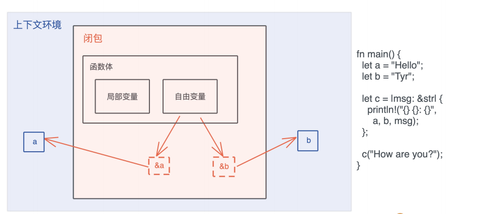
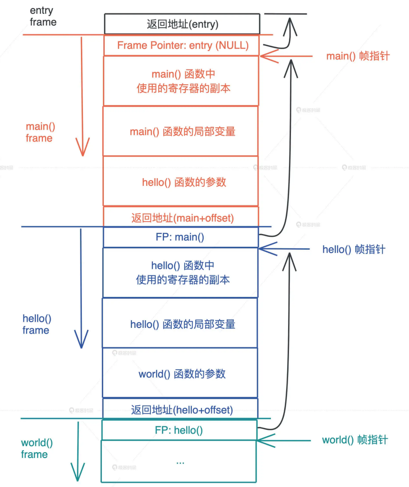
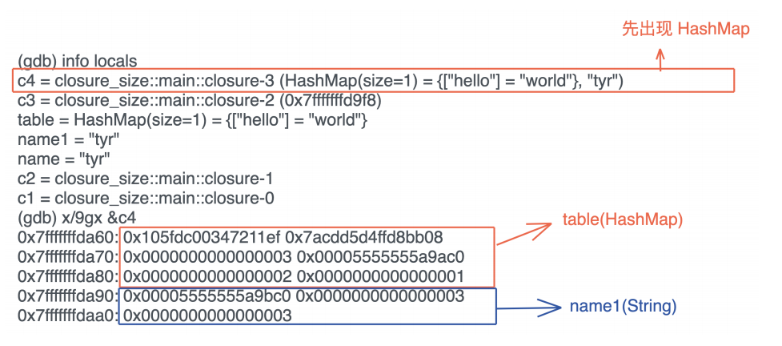
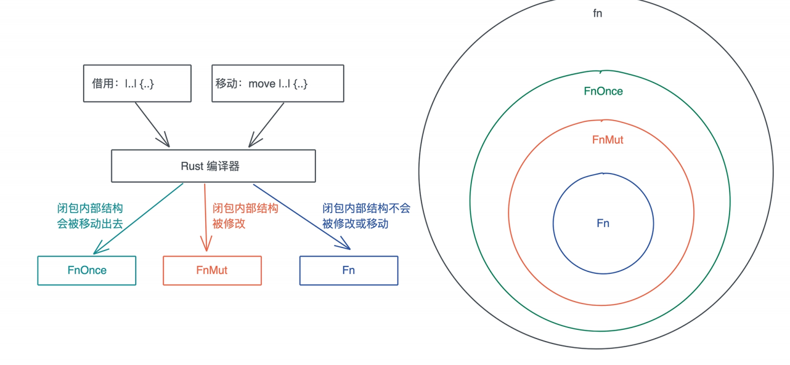

# 闭包: FnOnce, FnMut和Fn, 为什么会有怎么多类型?

在现代编程语言中, 闭包是一个非常重要的工具, 可以让我们很方便的以函数式编程的方式来撰写代码, 因为闭包可以作为参数传递给函数, 可以作为返回值被函数返回, 也可以为它实现某个trait, 使其能表现出其他的行为, 而不仅仅是作为函数被调用

这些都是怎么做到的? 这就和Rust里闭包的本质有关了, 我们今天就来学习基础篇最后一个知识点: 闭包

## 闭包的蒂尼

之前介绍了闭包的基本概念和一个非常简单的例子:

> 闭包是将函数, 或者说代码和其环境一起存储的一种数据结构, 闭包引用的上下文中的自由变量, 会被捕获到闭包的结构中, 成为闭包类型的一部分

闭包会根据内部的使用情况, 捕获环境中的自由变量, 在Rust里, 闭包可以用`|args| {code}`来表述, 图中闭包c捕获了上下文中的a和b, 并通过引用来使用这两个自由变量:



除了用引用来捕获自由变量之外, 还有另外一个方法使用move关键字`move |args| {code}`

之前的课程中, 多次见到了创建新线程的`thread::spwan`, 它的参数是一个闭包:

```rust
pub fn spawn<F, T>(f: F) -> JoinHandle<T>
where
F: FnOnce() -> T,
F: Send + 'static,
T: Send + 'static,
```

仔细看这个接口:

1. `F: FnOnce() -> T`: 表明F是一个接收0个参数, 返回T的闭包, FnOnce我们稍后再说
2. `F: Send + 'static`: 说明闭包F这个数据结构, 需要静态生命周期或者拥有所有权, 并且它还能被发送给另一个线程
3. `T: Send + 'static`: 说明闭包F返回的T, 需要静态声明周期或者拥有所有权, 并且它还能被发送给另一个线程

1和3和很好理解, 但是2就有些费解了, 一个闭包, 它不就是一段代码 + 被捕获的变量么? 需要静态生命周期或者拥有所有权是什么意思?

拆开看, 代码自然是静态生命周期了, 那么是不是意味着被捕获的变量, 需要静态生命周期或者所有权?

的确如此, 在使用`thread::spawn`时, 我们需要使用move关键字, 把变量的所有权从当前作用域移动到闭包的作用域, 让`thread::spawn`可以正常编译通过

```rust
use std::thread;
fn main() {
    let s = String::from("hello world");
    let handle = thread::spawn(move || {
        println!("moved: {:?}", s);
    });
    handle.join().unwrap();
}
```

但是你有没有好奇过, 加move和不加move, 这两种闭包有什么本质上的不同? 闭包究竟是一种什么样的数据类型, 让编译器可以判断他是否满足`Send + 'static`呢? 我们从闭包的本质下手来尝试回答这两个问题

## 闭包的本质是什么?

在官方的Rust reference中, 有这样的定义:

> A clousre expression produces a closure value with a unique. anonymous type that cannot be written out. A closuure type is approximately equivalent to a struct which contains the captured variables.

闭包是一种匿名类型, 一旦声明, 就会产生一个新的类型, 但这个类型无法比其他地方使用, 这个类型就像一个结构体, 会包含所有捕获的变量

所以闭包是类似一个特殊的结构体?

为了搞明白这一点, 我们得写段代码探索一下:

```rust
use std::collections::HashMap;

fn main() {
    // 长度为0
    let c1 = || println!("hello world!");
    // 和参数无关, 长度也为0
    let c2 = |i: i32| println!("hello: {i}");
    let name = String::from("tyr");
    let name1 = name.clone();
    let mut table = HashMap::new();
    table.insert("hello", "world");
    // 如果捕获一个引用, 长度为8
    let c3 = || println!("hello: {name}");
    // 捕获移动的数据name1(长度24) + table(长度48), closure长度72
    let c4 = move || println!("hello: {}, {:?}", name1, table);
    let name2 = name.clone();
    // 和局部变量无关, 捕获一个String name2, closure长度为24
    let c5 = move || {
        let x = 1;
        let name3 = String::from("lindsey");
        println!("hello: {}, {:?}, {:?}", x, name2, name3);
    };

    println!(
        "c1: {}, c2: {}, c3: {}, c4: {}, c5:{}, main: {}",
        size_of_val(&c1),
        size_of_val(&c2),
        size_of_val(&c3),
        size_of_val(&c4),
        size_of_val(&c5),
        size_of_val(&main)
    );
}
```

分别生成了5个闭包:

- c1没有参数, 也没捕获任何变量, 从代码输出可以看到, c1长度为0
- c2有一个i32作为参数, 没有捕获任何变量, 长度也为0, 可以看出参数跟闭包的代销无关
- c3捕获了一个对变量name的引用, 这个引用是`&String`, 长度为8, 而c3的长度也是8
- c4捕获了变量name1和table, 由于用了move, 它们的所有权移动到了c4中, c4长度是72, 恰好等于String的24个字节加上HashMap的48个字节
- c5捕获了name2, name2的所有权移动到了c5, 虽然c5有局部变量, 但它的大小和局部变量也无关, c5的大小等于String的24字节

看到这里, 前面的第一个问题就解决了, 可以看到, 不带move时, 闭包捕获的是对应自由变量的引用; 带move时, 对应自由变量的所有权会被移动到闭包结构中

继续分析这段代码的运行结果

还知道, 闭包的大小跟参数无关, 局部变量都无关, 只跟捕获的变量有关, 如果你回顾局部变量在栈中如何存放的图, 就很清楚了: 因为它们是在调用的时刻才在站上产生的内存分配, 说到和闭包类型本身是无关的, 所以闭包的大小根它们自然无关

`

那一个闭包类型在内存中究竟是如何排布的, 和结构体有什么区别? 我们要再次结合rust-gdb探索, 在看看上面的代码在运行结束前, 几个长度不为0闭包内存里都放了什么:


可以看到c3的确是一个引用, 把它指向的内存地址的24个字节打出来是(ptr | cap | len)的标准结构, 如果打印ptr对应的堆内存的三个字节是`tyr`

而c4捕获的是name和table, 内存结构和下面的结构体一模一样

```rust
struct Closure4 {
    name: String, // (ptr|cap|len)=24字节
    table: HashMap<&str, &str> // (RandomState(16)|mask|ctrl|left|len)=48字节
}
```

不过对于closure类型来说, 编译器知道新函数一样调用闭包c4是合法的, 并且知道执行c4时, 代码应该跳转到什么地址来执行, 在执行过程中, 如果遇到了name, table, 可以从自己的数据结构中获取

那么多想一步, 闭包捕获变量的顺序, 和其内存结构的顺序是一致的么? 的确如此, 如果我们调用闭包里使用name1和table的顺序:

```rust
let c4 = move || println!("hello: {:?}, {}", table, name1);
```

其数据位置是相反的, 类似于:

```rust
struct Closure4 {
    table: HashMap<&str, &str> // (RandomState(16)|mask|ctrl|left|len)=48字节
    name: String, // (ptr|cap|len)=24字节
}
```

从gbd中也可以看到同样的结果:



不过这只是逻辑上的位置, 如果你还记得struct在内存中的排布, Rust编译器会重排内存, 让数据能够以最小的代价对齐, 所以有些情况下爱, 内存中的数据的顺序可能和struct定义不一致

所以回到刚才闭包和结构体的比较, 在Rust里, 闭包产生的匿名数据类型, 格式和struct是一样的, 看图中gdb的输出, 闭包是存储在栈上, 并且除了捕获的数据外, 闭包本身不包含任何额外的函数指针指向闭包的代码, 如果你理解了c3/c4这两个闭包, c5是如何构造的就很好理解了

现在, 你是不是可以回答为什么`thread::spawn`对传入的闭包约束是`Send + 'static`了? 究竟什么样的闭包满足它呢? 使用了move且move到闭包内的数据结构满足Send, 因为此时, 闭包的数据结构拥有所有数据的所有权, 它的生命周期是`'static`

我们看看其他语言的闭包设计

## 不同语言的闭包设计

闭包最大的问题是变量的多重引用导致生命周期不明确, 所以你先向, 其他支持闭包的语言, 它们的闭包存放在哪里

栈上么? 是, 有好像不是

因为闭包, 从当前上下文中捕获了这些变量, 变得有些不伦不类, 不像函数那样清除, 尤其是这些被捕获的变量, 它们的归属和生命周期处理起来很麻烦, 所以, 大部分编程语言的闭包很多时候无法放在栈上, 需要额外的堆分配, 你可以看这个Golang的例子

不光Golang, Java / Swift / Python / JavaScript等语言都是如此, 这也是为什么大多数编程语言闭包的性能要远低于函数调用, 因为闭包旧意味着: 额外的堆内存分配, 潜在的动态分派(很多语言会把闭包处理成函数指针), 额外的内存回收

在性能上, 唯有C++的lambda和Rust闭包类似, 不过C++的闭包还有一些场景会触发堆内存分配, 如果你还记得之前iterator函数式编程的性能测试:


Kotlin运行超时, Swift很慢, Rust的性能和使用命令式编程的C几乎一样, 除了编译器优化的效果, 也因为Rust闭包的性能和函数差不多

为什么Rust可以做到这样呢? 这又跟Rust从根本上使用所有权和借用, 解决了内存归属的问题有关

在其他语言中, 闭包因为多重引用导致生命周期不明确, 但Rust从一开始就消灭了这个问题:

- 如果不使用move转移所有权, 闭包会引用上下文中的变量, 这个引用是受借用规则的约束, 所以只要编译通过, 那么闭包对变量的引用就不会超过变量的生命周期, 没有内存安全问题
- 如果使用move转移所有权, 上下文中的变量在转以后就无法访问, 闭包完全接管这些变量, 它们的生命周期和闭包一致, 所以也不会有内存安全问题

而Rust为每个闭包生成一个新的类型, 又使得调用闭包时候可以直接和代码对应, 省去了使用函数指针再转一道受手的额外消耗

所以还是那句话, 当回归到最初的本源, 你解决的不是单个问题, 而是由此引发的所有问题, 我们不必为堆内存管理设计GC, 不必为其他资源的回收提供deref关键字, 不必为并发安全进行诸多限制, 也不必为闭包挖空心思搞优化

## Rust的闭包类型

现在我们搞明白了闭包是什么东西, 在内存中怎么表示, 接下来我们看看FnOnce / FnMut / Fn这三种闭包类型有什么区别

在声明闭包的时候, 我们并不需要指定闭包要满足的约束, 但是当闭包作为函数的参数或者数据结构的一个域时, 我们需要告诉调用者, 对闭包的约束, 还以`thread::spwan`为例, 它要求传入满足FnOnce trait

### FnOnce

先来看FnOnce, 它的定义如下:

```rust
pub trait FnOnce<Args> {
    type Output;
    extern "rust-call" fn call_once(self, args: Args) -> Self::Output;
}
```

FnOnce trait有一个关联类型Output, 显然, 它是闭包返回值的类型; 还有一个方法call_once, 要注意的是call_once第一个参数是self, 它会转移到所有权到call_once函数中

这也是为什么FnOnce被称作Once: 它只能被调用一次, 再次调用, 编译器就会包变量已经被move这样的常见所有权错误了

置于FnOnce的参数, 是一个叫Args的泛型参数, 它并没有任何约束

看一个隐式FnOnce的例子:

```rust
fn main() {
    let name = String::from("Tyr");
    let c = move |greeting: String| (greeting, name);
    let result = c("hello".to_string());
    println!("result: {:?}", result);
    // 无法再次调用
    // let result = c("hi".to_string());
}
```

这个闭包c, 啥也没做, 只是把捕获的参数返回, 就像一个结构体力, 某个字段转移走之后, 就不能在访问一样, 闭包内部的数据一旦被转移, 这个闭包就不完整了, 也就无法再次使用, 所以它是一个FnOnce的闭包

如果额闭包并不准一自己的内部数据, 那么它就不是FnOnce, 然而, 一旦它被当做FnOnce调用, 自己会被转移到call_once函数的作用域中, 之后就无法再次调用了, 哦我们看看例子

```rust
fn main() {
    let name = String::from("Tyr");

    // 这个闭包会clone内部额数据返回, 所以它不是FnOnce
    let c = move |greeting: String| (greeting, name.clone());

    // 所以c1可以被调用多次
    println!("c1 call once: {:?}", c("qiao".into()));
    println!("c1 call twice: {:?}", c("bonjour".into()));

    // 然后一旦被当成FnOnce被调用, 就无法再次调用
    println!("result: {:?}", call_once("h1".into(), c));

    // 无法再次调用
    // let result = c("he".into());

    // fn也可以被当成fnOnce调用, 只要结构一致接可以
    println!("result: {:?}", call_once("hola".into(), not_closure))
}

fn call_once(arg: String, c: impl FnOnce(String) -> (String, String)) -> (String, String) {
    c(arg)
}

fn not_closure(arg: String) -> (String, String) {
    (arg, "Rosie".into())
}
```

## FnMut

理解了FnOnce, 我们在来看FnMut, 它的定义如下

```rust
pub trait FnMut<Args>: FnOnce<Args> {
    extern "rust-call" fn call_mut(
        &mut self,
        args: Args
    ) -> Self::Output;
}
```

首先FnMut继承了FnOnce, 或者说FnOnce是FnMut的super trait, 所以FnMut也拥有Output这个关联类型和call_once这个方法, 此外, 它还有一个call_mut方法, 注意call_mut传入`&mut self`, 它不移动self, 所以FnMut可以多次调用

因此FnOnce是FnMut的super trait, 所以一个FnMut闭包, 可以被传给一个需要的FnOnce的上下文, 此时调用碧波啊相当于调用call_once

如果你理解了前面讲的碧波啊的内存组织结构, 那么FnMut就不难理解, 就像结构体如果向改变数据需要用let mut声明一样, 如果你想改变闭包捕获的数据结构, 那么就需要FnMut, 我们来看个例子:

```rust
fn main() {
    let mut name = String::from("hello");
    let mut name1 = String::from("hello");

    let mut c = || {
        name.push_str("!");
        println!("c: {:?}", name);
    };

    let mut c1 = || {
        name1.push_str("!");
        println!("c1: {:?}", name1);
    };

    c();
    c1();

    call_mut(&mut c);
    call_once(&mut c1);

    call_once(c);
    call_once(c1);
}

// 在作为参数时, FnMut需要显示的使用mut或者&mut
fn call_mut(c: &mut impl FnMut()) {
    c();
}

fn call_once(c: impl FnOnce()) {
    c();
}
```

在声明的闭包c和c1里, 我们修改捕获的name和name1, 不同的是name使用了引用, 而name1移动了所有权, 这两种情况和其他代码一样, 也需要遵循所有权和借用有关的规则, 所以, 如果在闭包c里借用了name, 你就不能把name移动给另一个闭包c1

这里也展示了, c和c1这两个符合FnMut的闭包, 能作为FnOnce来调用, 我们在代码中也确认了, FnMut可以被多次调用, 这是因为call_mut使用的是`&mut self`, 不移动所有权

### Fn

最后我们来看看Fn trait

```rust
pub trait Fn<Args>: FnMut<Args> {
    extern "rust-call" fn call(&self, args: Args) -> Self::Output;
}
```

可以看到, 它继承了FnMut, 或者说FnMut是Fn的super trait, 这也就意味着任何需要FnOnce或者FnMut的场合, 都可以传入满足Fn的闭包

```rust
fn main() {
    let v = vec![0_u8; 1024];
    let v1 = vec![0_u8; 1023];

    // Fn, 不移动所有权
    let mut c = |x: u64| v.len() as u64 * x;
    // Fn 移动所有权
    let mut c1 = move |x: u64| v1.len() as u64 * x;

    println!("direct call: {}", c(2));
    println!("direct call: {}", c1(2));

    println!("call: {}", call(3, &c));
    println!("call: {}", call(3, &c1));

    println!("call_mut: {}", call_mut(4, &mut c));
    println!("call_mut: {}", call_mut(4, &mut c1));

    println!("call_once: {}", call_once(5, c));
    println!("call_once: {}", call_once(5, c1));
}

fn call(arg: u64, c: &impl Fn(u64) -> u64) -> u64 {
    c(arg)
}

fn call_mut(arg: u64, c: &mut impl FnMut(u64) -> u64) -> u64 {
    c(arg)
}

fn call_once(arg: u64, c: impl FnOnce(u64) -> u64) -> u64 {
    c(arg)
}
```

## 闭包的使用场景

在讲完Rust的三个闭包类型之后, 最后来看看闭包的使用场景, 虽然今天才开始讲闭包, 但其实之前隐患的使用了很多闭包, `thread::spawn`自然不必说, 我们熟悉的Iterator trait里面一大部分函数都接收一个闭包, 比如map

```rust
fn map<B, F>(self, f: F) -> Map<Self, F>
where
Self: Sized,
F: FnMut(Self::Item) -> B,
{
    Map::new(self, f)
}
```

可以看到, Iterator triat的map方法接受一个FnMut, 它的参数是`Self::Item`, 返回值是没有约束的泛型参数B, `Self::Item`是`Iterator.next()`方法吐出来的数据, 被map之后, 可以得到另一个结果

所以在函数的参数中使用闭包, 是闭包一种非常典型的用法, 另外闭包也可以作为函数的返回值,, 举个简单的例子:

```rust
use std::ops::Mul;
fn main() {
    let c1 = curry(5);
    println!("5 multiply 2 is: {}", c1(2));
    let adder2 = curry(3.14);
    println!("pi multiply 4^2 is: {}", adder2(4. * 4.));
}
fn curry<T>(x: T) -> impl Fn(T) -> T
where
T: Mul<Output = T> + Copy,
{
    move |y| x * y
}
```

最后, 闭包还有一种并不少少见, 但可能不它容易理解的用法: 为它实现某个trait, 使其能表现出其他的行为, 而不仅仅是作为函数被调用, 比如说有些接口可以传入一个结构体, 又可以传入一个函数或者闭包

我们看一个tonic(Rust下gRPC库)的例子:

```rust
pub trait Interceptor {
    /// Intercept a request before it is sent, optionally cancelling it.
    fn call(&mut self, request: crate::Request<()>) -> Result<crate::Request<(
    }
    impl<F> Interceptor for F
    where
    F: FnMut(crate::Request<()>) -> Result<crate::Request<()>, Status>,
    {
        fn call(&mut self, request: crate::Request<()>) -> Result<crate::Request<(
            self(request)
        }
    }
```

在这个例子里, Interceptor有一个call方法, 它可以让gRPC Request被发送出去之前被修改, 一般是添加各种头, 比如Authorization头

我们可以创建一个结构体, 为它实现Interceptor, 不过大部分时候Interceptor可以直接通过一个闭包函数完成, 为了让传入的闭包也能通过`Interceptor::call`方法同一调用, 可以为符合接口的闭包实现Interceptor trait, 掌握了这种用法, 我们就可以通过某些trait把特定的结构体和闭包统一起来调用

## 小结

Rust闭包的效率非常高, 首先闭包捕获的变量, 都存储在栈上, 没有堆内存的分配, 其次因为闭包在创建时会隐式的创建自己的类型, 每个闭包都死一个新的类型, Rust不需要额外的函数指针来运行闭包, 所以闭包的调用效率和函数几乎一致

Rust支持三种不同的闭包trait: FnOnce / FnMut / Fn, FnOnce是FnMut的super trait, FnMut是Fn的super trait

- FnOnce只能调用一次
- FnMut允许在执行时修改闭包的内部数据, 可以执行多次
- Fn不允许修改闭包的内部数据, 也可以执行多次

总结一下三种闭包的使用情况以及它们之间的关系



## 思考题

1. 下面代码中, 闭包c相当于一个什么样的结构体, 它的长度多大, 代码最后, main函数还能访问变量name? 为什么?

   ```rust
   fn main() {
       let name = String::from("Tyr");
       let vec = vec!["Rust", "Elixir", "Javascript"];
       let v = &vec[..];
       let data = (1, 2, 3, 4);
       let c = move || {
           println!("data: {:?}", data);
           println!("v: {:?}, name: {:?}", v, name.clone());
       };
       c();
       // 请问在这里，还能访问 name 么？为什么？
   }
   ```

   > 闭包相当于结构体:
   >
   > ```rust
   > struct {
   >     data: (i32, i32, i32, i32),
   >     v: &'a[&'b str; 3],
   >     name: String
   > }
   > ```
   >
   > 闭包的长度为: 16 + 4 + 24
   >
   > 最后不能访问a了, 因为a已经移动到闭包里了

2. 在讲到FnMut时, 我们放了一段代码, 在那段代码里, 我问了一个问题: 为啥coll_once不需要c是mut呢? 就像下面这样:

   ```rust
   // 想想看，为啥 call_once 不需要 mut？
   fn call_once(mut c: impl FnOnce()) {
       c();
   }
   ```

   > 因为FnOnce会拥有其所有权, 以后你也不会在使用了, 所以不同加mut

3. 为下面代码添加实现, 使其能够正常工作:

   ```rust
   pub trait Executor {
       fn execute(&self, cmd: &str) -> Result<String, &'static str>;
   }
   struct BashExecutor {
       env: String,
   }
   impl Executor for BashExecutor {
       fn execute(&self, cmd: &str) -> Result<String, &'static str> {
           Ok(format!(
               "fake bash execute: env: {}, cmd: {}",
               self.env, cmd
           ))
       }
   }
   // 看看我给的 tonic 的例子，想想怎么实现让 27 行可以正常执行
   fn main() {
       let env = "PATH=/usr/bin".to_string();
       let cmd = "cat /etc/passwd";
       let r1 = execute(cmd, BashExecutor { env: env.clone() });
       println!("{:?}", r1);
       let r2 = execute(cmd, |cmd: &str| {
           Ok(format!("fake fish execute: env: {}, cmd: {}", env, cmd))
       });
       println!("{:?}", r2);
   }
   fn execute(cmd: &str, exec: impl Executor) -> Result<String, &'static str> {
       exec.execute(cmd)
   }
   ```

   ```rust
   pub trait Executor {
       fn execute(&self, cmd: &str) -> Result<String, &'static str>;
   }
   
   impl<F> Executor for F
   where
       F: Fn(&str) -> Result<String, &'static str>,
   {
       fn execute(&self, cmd: &str) -> Result<String, &'static str> {
           self(cmd)
       }
   }
   
   struct BashExecutor {
       env: String,
   }
   impl Executor for BashExecutor {
       fn execute(&self, cmd: &str) -> Result<String, &'static str> {
           Ok(format!(
               "fake bash execute: env: {}, cmd: {}",
               self.env, cmd
           ))
       }
   }
   // 看看我给的 tonic 的例子，想想怎么实现让 27 行可以正常执行
   fn main() {
       let env = "PATH=/usr/bin".to_string();
       let cmd = "cat /etc/passwd";
       let r1 = execute(cmd, BashExecutor { env: env.clone() });
       println!("{:?}", r1);
       let r2 = execute(cmd, |cmd: &str| {
           Ok(format!("fake fish execute: env: {}, cmd: {}", env, cmd))
       });
       println!("{:?}", r2);
   }
   fn execute(cmd: &str, exec: impl Executor) -> Result<String, &'static str> {
       exec.execute(cmd)
   }
   ```
   
   