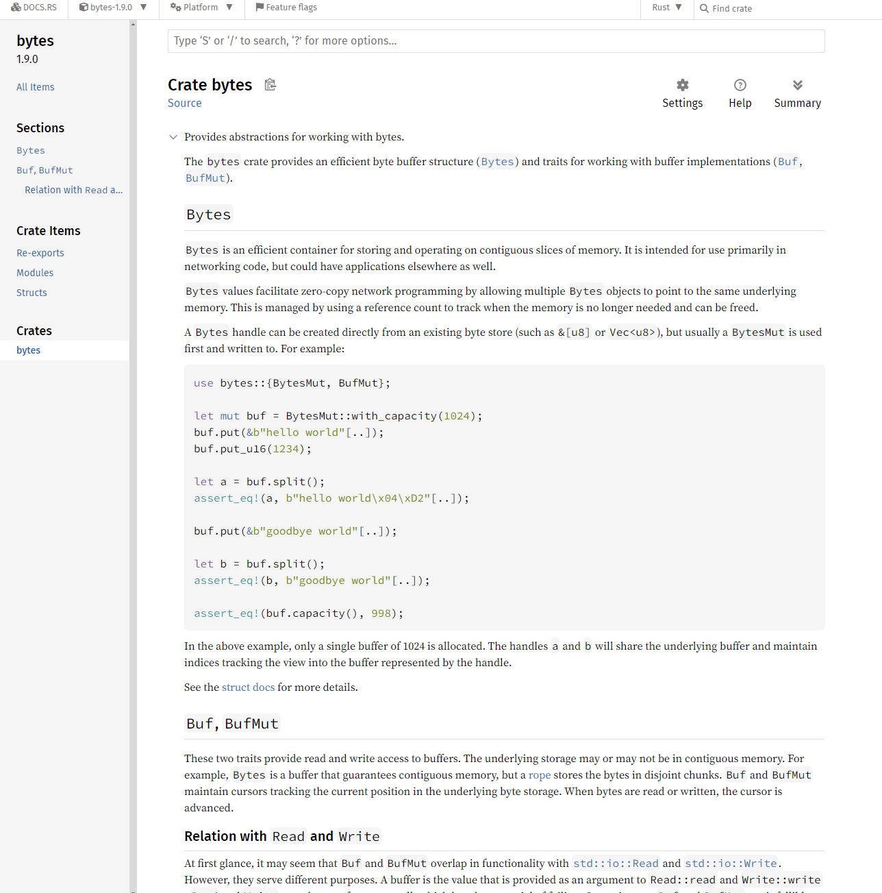
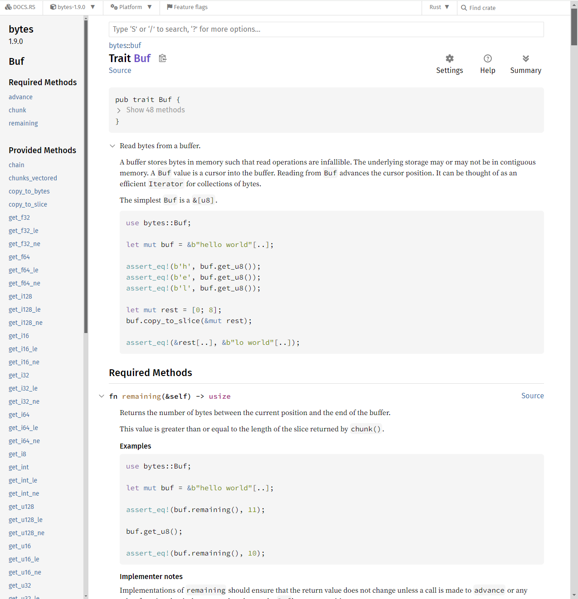
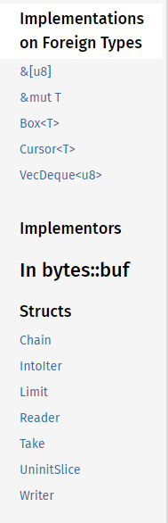
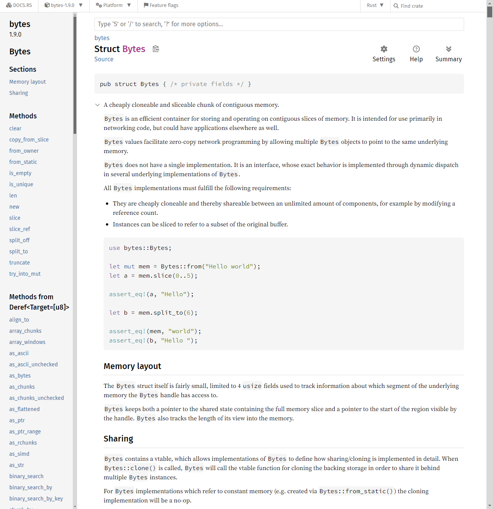
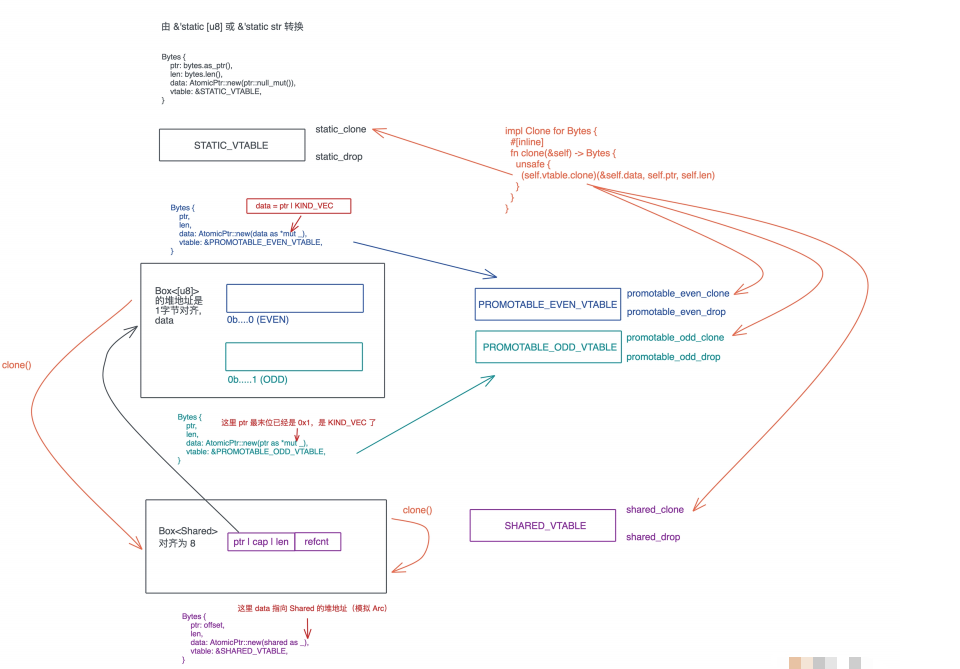

# 如何更好的调试源码

到目前为止, Rust的基础知识我们学的差不多了, 这倒不是说已经像筛子一样, 把基础知识细筛一遍, 只是提供了学习Rust的思路, 扫清入门障碍, 老话说得好, 师傅领进门, 修行看个人, 在Rust世界里打怪升级, 还得靠自己的努力

所以开始阶段实操之前引入大量新第三方库之前, 我们先聊一个很重要的技巧: 如何更好的阅读源码

其实会读源码是终身受益的开发技能, 却往往被忽略

## 为什么要阅读源码

如果课程中的每一讲你都认真看过, 会发现时刻都在引用标准库中的源码, 让我们在阅读的时候, 不光学基础知识, 还能围绕它的第一手资料展开讨论

如果说它人总结的知识是果实, 那源代码就是结出果实的种子, 指摘果子吃, 就是等他人赏饭, 非常被动, 分不容易分清楚果子的好坏; 如果靠不俗的源码种子结出了自己的果实, 确实前期要寂寞施肥浇水, 但收割的时候, 一切尽在自己的掌握之中

作为开发者, 我们每天都在和代码打交道, 进过数年的基础教育和职业培训, 我们都会写代码, 或者至少会抄代码和改代码, 但是会读代码的其实并不多, 会读代码又真正能读懂一些大项目的源码的, 少之又少

这种怪装, 真要追究起来, 就是因为前期我们所有的教育和培训都在强调如何写代码, 并没有教怎么读代码, 而走入工作后, 大多数的场景都是一个萝卜一个坑, 我们只需要了解系统的一个布局就能开展工作, 读和工作内容不相关的代码, 似乎没什么用

那没有读过大量代码究竟有什么问题, 毕竟工作好像还是能够开展? 就拿跟写带代码又很多相通之处的写作来对比

小时候我们都经常读课文, 背课文, 写作文的过程, 除了学习语法和文法知识外, 从小学开始, 经年累月, 阅读各种名家作品, 经过各种写作训练, 才积累出自己的写作能力, 所以说, 写作建立在大量阅读基础上

而我们写代码的过程就很不同了, 在学会基础的语法和实验了若干example后, 跳过了大量阅读名家作品的阶段, 直接坐火箭窜到自己开始细业务代码

这样跳过了大量的代码阅读有三个问题:

首先没有足够的基类, 我们很容易养成StactOverflow driven的写代码协管

遇到不知道如何写代码, 从网上找现成的答案, 找个高票复制粘贴, 改一改凑活用, 先完成功能再说, 写代码的过程中, 就开启调试模式, 要么设置无数断点一步步追踪, 要么导出打印信息试图为满是窟窿的代码打上补丁, 导致写代码的整个过程就是一部调代码的血泪史

其实, 因为平时基础不牢固, 我们靠编写边学的进步是最慢的, 道理很简单, 前辈们踩过的坑总结的经验教训, 都不得不亲自用最慢的法子一点点试着踩一遍

最后还有一个非常容易被忽略的天花板问题, 周围能触达的那个最强工程师开发水平的上限就是我们的上限

但是如果重视读源码的平时基类, 并且具备一定阅读技巧, 这三个问题就能迎刃而解

## 三大功用

读源码的第一个好处是, 只是的源头在你这里, 你可以根据事实来分辨是非, 而不是迷信权威, 比如之前讲Rc的时候我们通过源码引出`Box::leak`, 回答了为啥Rc可以突破Rust单一所有权的桎梏; 谈到FnOnce通过源码一眼看透为啥FnOnce只能调用一次

未来你在跟别人分享的时候, 可以很自信的触达这些问题

通过源码我们还学到了很多技巧, 比如`Rc::clone`如何使用内部可变性保持Clone trait的不可变约束; Iterator里方法如何通过不断构造新的Iterator数据结构, 来支持lazy evaluation

未来你在写代码的时候, 这些技巧都可以使用, 这是读源码的第二个好处, 看别人的代码, 积累了素材, 开拓了思路, 自己写代码时才可以写的更好

最后一个解决的问题就是打破天花板了, 累计素材是基础, 被启发出来的思路将这些素材串成线, 才形成了自己的知识

优秀的代码读的越多, 越能引发思考, 从而引发更多的阅读, 形成一个飞轮效应, 让自己的知识变得越来越优秀, 而知识的融会贯通, 最终形成读代码的第三大功用: 通过了解, 吸取别人的思想, 去芜存菁, 最终形成自己的思想或者说智慧

当然从素材, 到知识, 再到智慧, 要长期积累, 并非一朝一夕之功, 搞明白为什么给到我们三个学习方向, 所以现在来进一步解决如何, 分享一下我的方法论, 为你的积累助助力

## 如何阅读代码呢?

我们以第三方那个库Bytes为例, 来看看如何阅读源码

Bytes是tokio下一个高效的处理网路数据的库, 代码结构非常简单

```
❯ tree src
src
├── buf
│ ├── buf_impl.rs
│ ├── buf_mut.rs
│ ├── chain.rs
│ ├── iter.rs
│ ├── limit.rs
│ ├── mod.rs
│ ├── reader.rs
│ ├── take.rs
│ ├── uninit_slice.rs
│ ├── vec_deque.rs
│ └── writer.rs
├── bytes.rs
├── bytes_mut.rs
├── fmt
│ ├── debug.rs
│ ├── hex.rs
│ └── mod.rs
├── lib.rs
├── loom.rs
└── serde.rs
```

先简单讲一下读Rust代码的顺序: 从crate的大纲开始, 先了解目标代码能干什么, 怎么用; 然后学习核心trait, 看看它支持那些功能; 之后在掌握主要的数据结构, 开始写一些示例代码; 最后围绕自己感兴趣的情景深入阅读

## step1: 从大纲开始

我们先从文档的大纲入手, Rust的文档系统是所有编程语言中处在第一梯队, 即便不是最好的, 也是最好之一, 它的文档和代码结合的紧密, 可以来回跳转

Rust几乎所有库的文档都在docs.rs下, 比如Bytes的文档可以通过`docs.rs/bytes`访问



首先阅读crate的文档, 这样可以快速了解这个crate是做什么, 就像阅读一本书的时候, 可以从书的序和前言入手了解, 初次之外, 我们还可以看一下源码根目录下的README.md作为补充资料

有了大致了解后, 你就可以深入了解自己感兴趣的内容, 我们就按照初学的顺序来看

对于Bytes, 我们看到它有两个trait Buf / BufMut以及两个数据结构Bytes / BytesMut. 没有crate级别的函数, 接下来就是深入阅读代码了

我看的顺序一般是: `trait -> struct -> 函数 / 方法`, 因为这和我们写代码思考方式非常类似:

- 先从需求额流程中敲定, 需要定义什么接口trait
- 在考虑系统有什么状态, 定义了哪些数据结构struct
- 最后到实现细节, 包括如何为数据结构实现trait, 数据结构自身有什么算法, 如何把整个流程串起来等等

## step2: 熟悉核心trait的行为

所以先看trait, 我们以Buf trait为例, 点进去看文档, 主页面给了这个trait的定义和一个使用示例



注意左侧导航栏的"required Methods"和"Provided Methods", 前者是实现这个trait需要实现的方法, 后者是缺省方法, 也就是说数据结构只要实现了这个trait的三个方法: advance, chunk, remaining, 就可以自动实现所有的缺省方法, 当然, 你也可以重载某个缺省方法

导航栏继续向下拉, 可以按到bytes为哪些"foreign types"实现了Buf trait, 以及当前模块偶哪些implementors, 这些信息很重要, 说明了这个trait的生态:



对于其他数据类型(foreign type):

- 切片`&[u8]`, `VecDeque<u8>`都实现了Buf trait
- 如果T满足Buf trait, 那么`&mut T`, `Box<T>`也实现了Buf trait
- 如果T实现了`AsRef<u8>` 那么`Cursor<T>`也实现了Buf trait

所以回过头来, 上一副图文档给到的示例, 一个`&[u8]`可以使用Buf trait里的方法就顺理成章了

```rust
use bytes::Buf;
let mut buf = &b"hello world"[..];
assert_eq!(b'h', buf.get_u8());
assert_eq!(b'e', buf.get_u8());
assert_eq!(b'l', buf.get_u8());
let mut rest = [0; 8];
buf.copy_to_slice(&mut rest);
assert eq!(&rest[..], &b"lo world"[..]);
```

而且也知道了, 如果未来为自己的数据结构T实现Buf trait, 那么我们无需为`Box<T>`, `&mut T`实现Buf trait, 这省去了在各种场景下使用T的诸多麻烦

看到这里, 我们目前还没有深入源码, 但已经可以学习到高手定义trait的一些思路:

- 定义好trait后, 可以考虑一下标准库的数据结构, 哪些可以实现这个trait
- 如果未来别人的某个类型T, 实现了你的trait. 那它的`&T`, `&mut T`, `Box<T>`等衍生类型, 是否能够自动实现这个trait

接着看邹策导航栏中的"implementors", Bytes, BytesMut, Chain, Take都实现了Buf trait. 这样我们知道了在这个crate里, 哪些数据结构实现了这个trait, 之后遇到它就知道都能用来做什么了

现在, 对Buf trait以及围绕着它的生态, 我们已经有了一些基本的认识, 后面你可以从几个方向深入学习

- Buf trait某个缺省方法是如何实现的, 比如get_u8
- 其他类型是如何实现Buf trait的, 比如`&[u8]`
- 你甚至不用clone bytes的源码, 在docs.rs里就可以直接完成这些代码的阅读, 非常方便

## step3: 掌握主要的struct

扫完trait的基本功能后, 我们再来看数据结构, 以Bytes这个结构为例:



一般来说, 好的文档会给数据结构的介绍, 用法, 使用时的注意事项, 以及一些代码示例, 了解了数据结构的基本介绍后, 继续看它的内部结构:

```rust
/// ```text
///
/// Arc ptrs +---------+
/// ________________________ / | Bytes 2 |
/// / +---------+
/// / +-----------+ | |
/// |_________/ | Bytes 1 | | |
/// | +-----------+ | |
/// | | | ___/ data | tail
/// | data | tail |/ |
/// v v v v
/// +-----+---------------------------------+-----+
/// | Arc | | | | |
/// +-----+---------------------------------+-----+
/// ```
pub struct Bytes {
    ptr: *const u8,
    len: usize,
    // inlined "trait object"
    data: AtomicPtr<()>,
    vtable: &'static Vtable,
}
pub(crate) struct Vtable {
    /// fn(data, ptr, len)
    pub clone: unsafe fn(&AtomicPtr<()>, *const u8, usize) -> Bytes,
    /// fn(data, ptr, len)
    pub drop: unsafe fn(&mut AtomicPtr<()>, *const u8, usize),
}
```

数据结构往往会有一些注释, 帮助你理解它地设计, 对于Bytes来说, 顺着代码往下看:

- 它内部使用了裸指针和长度, 模拟一个切片, 指向内存中一片连续的地址
- 同时, 还使用了AtomicPtr和手工打造的Vtable来模拟了trait object的行为
- 看Vtable的样子, 大概可以推断出Bytes的clone和drop的行为是动态的, 这是个很有意思的发现

不过先不先继续探索它是如何实现这个行为的, 继续看文档

和trait类似的, 在左侧导航栏, 有一些值得关注的信息: 这个数据结构实现了哪些方法, 实现了哪些trait. 以及Auto trait / Blanket trait

可以看到, Bytes除了实现刚才讲过的Buf trait外, 还实现了很多标准trait

这也带给我们新的启发: 我们自己的数据结构, 也应该尽可能实现需要的标准trait, 包括但不限于: AsRef, Borrow, Clone, Debug, Default, ...等

注意, 除了这些trait之外, Bytes还实现了Send / Sync, 如果看很多我们解除的数据结构, 比如`Vec<T>`, Send / Sync是自动实现的, 但Bytes需要手工实现

这是因为之前讲过, 如果你的数据结构里使用了不支持Send / Sync的类型, 编译器默认这个数据结构不能跨线程安全使用, 不会自动添加Send / Sync trait的实现, 但如果你能确保跨线程的安全性, 可以手工通过unsafe impl实现它们

了解一个数据结构实现了哪些trait, 非常有助于理解它如何使用, 所以标准库里的主要trait我们一定要好好学习, 多多使用, 最好能形成肌肉记忆, 所以, 这样学些别人的代码时, 效率会很高, 比如我看Bytes这个数据结构, 扫一下它实现了哪些trait, 就基本能知道:

- 什么数据结构可以转换成Bytes, 也就是如何生成Bytes结构
- Bytes可以跟谁比较
- Bytes是否可以跨线程使用
- 在使用中, Bytes的行为和谁比较像(看Deref trait)

这就是肌肉记忆的好处, 你可以区create.io的Data structures多翻翻不同的库, 比如IndexMap, 看看它实现了哪些标准trait, 不了解的旧看看哪些trait的文档, 也可以回顾

当你了解了数据结构的基本文档, 知道它实现了哪些方法和哪些trait后, 基本上, 这个数据结构使用就不在话下了, 你也快可以看源代码里的examples目录或者tests目录, 看看数据结构对外如何使用的, 作为参考

对于bytes可以, 它没有额外的examples目录, 所以我们可以看看`tests/test_bytes.rs`来理解Bytes类型如何使用, 现在你应该能比较从容的使用这个Bytes库了, 不放试一试写一些自己的实例代码, 感受它的能力

## Step4: 深入研究实现逻辑

当trait和数据结构都掌握好, 我们已经可以从它的接口上学到很多开发上的思想和技巧, 一些关键接口, 也了解了足够多的实现细节, 获得的知识对使用这个库做一些事情已经绰绰有余

大部分 源代码的学习, 就可以就此止步, 因为对我们来说, 没有太富裕的时间把每个遇到的库都从头到尾研究以便, 主要搞清楚如何使用好Rust生态中的可用库来构建想构建的系统, 就足够了

但有些时候, 我们希望能够更深一步研究

比如说想更好的使用这个库, 希望进一步了解Byts是如何做到多线程共享数据的, 它根`Arc<Vec>`是不是可以完成bytes的工作? 又或者说, 在实现某个系统时, 我们也想像Bytes这样, 实现数据结构自己的vtable, 让数据结构更加灵活

这是就要去深入按主题阅读了, 这里我推荐主题阅读或者说情境阅读, 就是围绕着一个特定的使用主题, 以这个场景的主流程为脉络, 搞明白实现原理

这时, 光靠docs.rs上的代码已经满足不了我们的需求, 我们要把代码clone下来, 用Vs Code打开自己研究

我们就继续以Bytes如何实现自己的vtable为例, 深入看Bytes是如何clone的?

```rust
impl Clone for Bytes {
    #[inline]
    fn clone(&self) -> Bytes {
        unsafe { (self.vtable.clone)(&self.data, self.ptr, self.len) }
    }
}
```

它用了vtable中的clone方法, 传入了data, 指向数据的指针以及长度, 根据这个信息, 我们如果能找到Bytes定义的所有vtable, 以及每个vtable的clone做了什么事, 就足以了解Bytes是如何实现vtable

相信你很快从代码中能够找到STATIC_VTABLE、PROMOTABLE_EVEN_VTABLE、PROMOTABLE_ODD_VTABLE 和 SHARED_VTABLE 这四张表

后三张表示处理动态数据的, 在使用如果Bytes的来源是`Vec<u8>`, `Box<[u8]>`或者String, 它们统统被转换成`Box<[u8]>`, 并在第一次clone时, 生成类似`Arc<T>`的Shared结构, 维护引用计数

由于Bytes的ptr指向这个Bytes的起始地址, 而data指向引用计数的地址, 所以, 你可以在这段内存上, 生成任意多的, 大小不同的, 其实位置不一样的Bytes结构, 它们都用同一个引用计数, 这样比`Arc<Vec>`要灵活的多



## 小结

阅读别人的代码, 尤其是优秀的代码, 能帮助你快速成长

Rust为了让代码和文档可读性更强, 在工具链上做了巨大的努力, 让我们在读源码的或者比人代码的时候, 很容易理清楚代码的主要流程和使用方式, 今天讲的阅读代码尤其是阅读Rust代码的很多技巧, 少有人分享但很重要, 掌握好它, 你就掌握了通向大牛之路的钥匙

注意阅读的顺序: 从大纲开始, 先了解目标代码能干什么, 怎么用; 然后学习它主要的trait; 之后是数据结构, 搞明白后在看看示例代码; 最后围绕着自己感兴趣的情景在深入阅读, 并不是所有的代码都要走到最后一步, 你要根据自己的需要和精力量力而行

