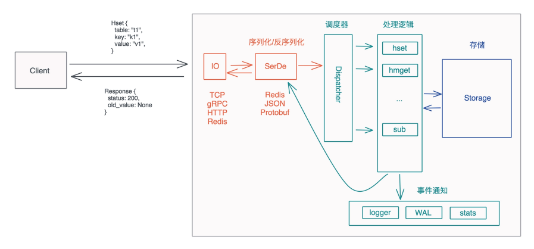

# KV Server

## 架构设计



**流程探索**

1. 客户端和服务端使用什么协议通信
2. 客户端和服务器之间交互的应用层协议
3. 服务器支持哪些命令
4. 具体的处理逻辑, 需要不需要加 hook, 在处理过程中发布的一些事件
5. 存储, 支持那种存储引擎, 或者支持多种吗?
6. 整个系统可以配置么? 比如服务使用那个端口, 那个存储引擎

**架构参考**

1. 像 KV Server 这样需要高性能的场景, 通信有限考虑 TCP 协议, 但是我们需要考虑可插拔
2. 应用层协议我们可以使用 protobuf, protobuf 直接解决了协议的定义以及如何序列化和反序列化
3. 服务器支持的命令我们可以参考 Redis 的命令集
4. 处理流程中加这些 hook: 收到客户端的命令后 onRequestReceived, 处理完客户端命令后的 onRequestExecuted, 发送响应之前 BeforeResponseSend, 发送响应之后 AfterResponseSend
5. 存储必须足够灵活, 可以对存储做个 trait 来抽象其基本行为, 一开始可以就制作 MemDb, 未来肯定要支持持久化
6. 需要配置, 但优先级不高, 等基本流程搞定了, 我们就可以考虑配置文件如何处理了

> 最重要的三个主体交互接口: 客户端和服务端之间的接口或者说是协议, 服务器和命令处理流程的接口, 服务器和存储的接口

## 客户端和服务器之间的协议

详见 abi.proto 文件

## CommandService trait

这是如何处理请求的命令, 返回响应
我们打算支持 9 中命令, 所以最好定义一个 trait 来统一的处理所有命令, 返回处理的结构, 在处理命令的时候, 需要和存储发生关系, 这样才能根据请求中携带的参数读取数据, 或者将请求的中的数据存入存储系统中, 所以这个 trait 可以这样定义:

```rust
// 对command的处理抽象
pub trait CommandService {
  // 处理command, 返回Response
  fn execute(self, store: &impl Storage) -> CommandResponse;
}
```

有了这个 trait, 并且每个命令都实现这个 trait 之后, dispatch 方法就可以是类似这样的代码:

```rust
// 从Request中得到Response
pub fn dispatch(cmd: CommandRequest, store: &impl Storage) -> CommandResponse {
  match cmd.request_data {
    ...
  }
}
```

这样的话, 未来我们支持新命令的时候, 只需要做两件事情: 为命令实现 CommandService, 在 dispatch 中添加新命令的支持

## Storage trait

为不同的存储而设计的 Storage trait, 它提供了 Kv store 的主要接口

```rust
/// 对存储的抽象, 我们不关心数据存在那种数据结构汇总, 但需要定义外界如何根存储打交道
pub trait Storage {
/// 从一个 HashTable 里获取一个 key 的 value
  fn get(&self, table: &str, key: &str) -> Result<Option<Value>, KvError>;
/// 从一个 HashTable 里设置一个 key 的 value，返回旧的 value
  fn set(&self, table: &str, key: String, value: Value) -> Result<Option<Value>, KvError>;
/// 查看 HashTable 中是否有 key
  fn contains(&self, table: &str, key: &str) -> Result<bool, KvError>;
/// 从 HashTable 中删除一个 key
  fn del(&self, table: &str, key: &str) -> Result<Option<Value>, KvError>;
/// 遍历 HashTable，返回所有 kv pair（这个接口不好）
  fn get_all(&self, table: &str) -> Result<Vec<Kvpair>, KvError>;
/// 遍历 HashTable，返回 kv pair 的 Iterator
  fn get_iter(&self, table: &str) -> Result<Box<dyn Iterator<Item = Kvpair>>
}
```
在CommandService trait中已经看到, 在处理客户端请求的时候, 与之打交道的就是Storage trait, 而非具体的某个store, 这样做的好处是, 未来根据业务的需要, 在不同的场景下添加不同的store. 只需要为其实现不同的Storage trait即可, 不必修改CommandService有关的代码
