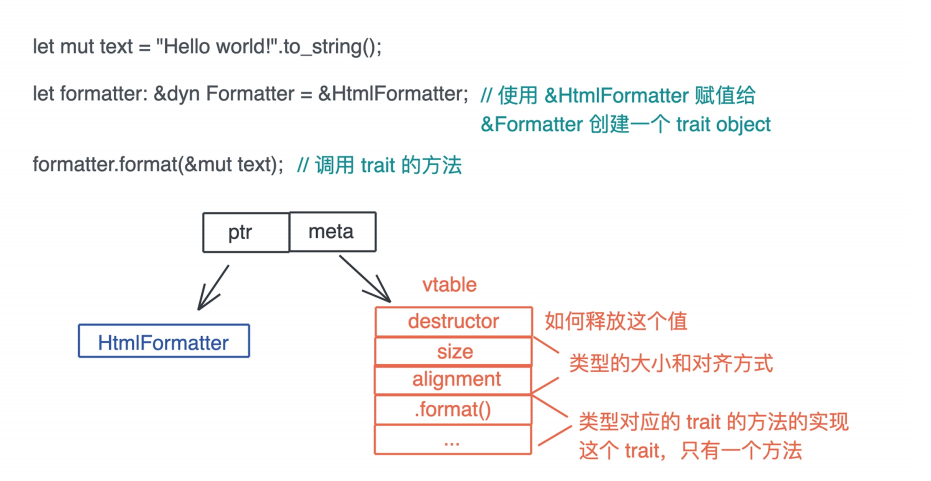
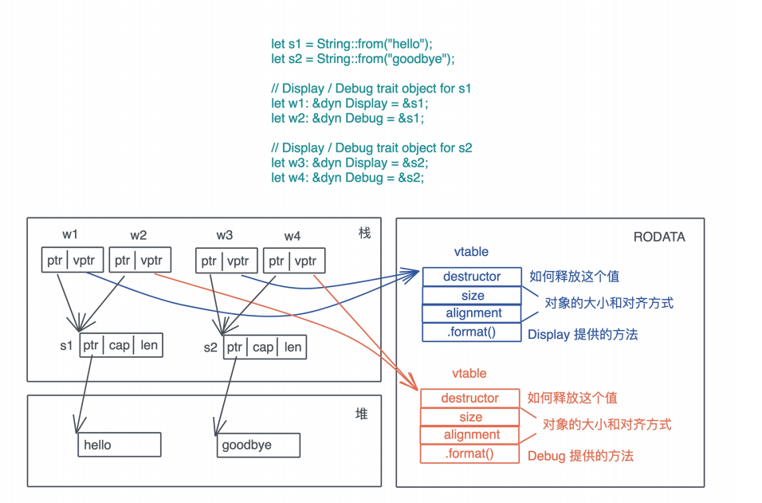

# 类型系统: 如何在实战中使用Trait Object?

我们先来回顾一下trait object, 当哦我们在运行时想让某个具体的类型, 只表现出某个trait的行为, 可以通过将其赋值给一个dyn T, 无论是`&dyn T`还是`Box<dyn T>`, 还是`Arc<dyn T>`都可以, 这里, T是当前数据类型实现的某个trait, 此时原有的类型被抹去, Rust会创建一个trait object, 并为其分配满足该trait 的vtable



在编译dyn T时, Rust会为使用了trait object类型的trait实现, 生成相应的vtable, 放在可执行文件中(一般是TEXT或者RODADA段)



这样, 当trait object调用trait方法时, 它会先从vptr中找到对应的vtable, 进而找到对应的方法来执行

使用trait object的好处是, 当在某个上下文中需要满足某个trait的类型, 且这样的类型有很多, 当前上下文无法确定或得到哪一个类型时, 我们可以使用trait object来统一的处理行为, 和泛型参数一种, trait object也是一种延迟绑定, 它让决策可以延迟到运行时, 从而得到最大的灵活性

当然, 有得必有失, trait object把决策延迟到运行时, 带来的后果是执行效率的打折, 在Rust里, 函数或者方法就是一次跳转指令, 而trait object方法的执行还多了异步, 它涉及额外的内存访问, 才能得到要跳转的位置在进行跳转, 执行的效率要低一些

此外如果要把trait object作为返回值返回, 或者要在线程中传递trait object, 都免不了使用`Box<dyn T>`或者`Arc<dyn T>`, 会带来额外的堆分配的开销

## 在函数中使用trait object

我们可以在函数的参数或者返回值中使用trait object

先来看看参数中使用trait object, 下面的代码构建了一个Executor trait, 并对比做静态分发的impl Executor和做动态分发的`&dyn Executor`和`Box<dync Executor>`这几种不同的参数的使用

```rust
use std::{error::Error, process::Command};

pub type BoxedError = Box<dyn Error + Sync + Send>;

pub trait Executor {
  fn run(&self) -> Result<Option<i32>, BoxedError>;
}

pub struct Shell<'a, 'b> {
  cmd: &'a str,
  args: &'b [&'a str],
}

impl<'a, 'b> Shell<'a, 'b> {
  pub fn new(cmd: &'a str, args: &'b [&'a str]) -> Self {
    Self { cmd, args }
  }
}

impl<'a, 'b> Executor for Shell<'a, 'b> {
  fn run(&self) -> Result<Option<i32>, BoxedError> {
      let output = Command::new(self.cmd).args(self.args).output()?;
      Ok(output.status.code())
  }
}

/// 使用泛型参数
pub fn execute_generics(cmd: &impl Executor) -> Result<Option<i32>, BoxedError> {
  cmd.run()
}

/// 使用trait object: &dyn T
pub fn execute_trait_object(cmd: &dyn Executor) -> Result<Option<i32>, BoxedError> {
  cmd.run()
}

/// 使用trait object: Box<dyn T>
pub fn execute_box_trait_object(cmd: Box<dyn Executor>) -> Result<Option<i32>, BoxedError> {
  cmd.run()
}

#[cfg(test)]
mod tests {
  use super::*;

  #[test]
  fn shell_shall_work() {
    let cmd = Shell::new("ls", &[]);
    let result = cmd.run().unwrap();
    assert_eq!(result, Some(0));
  }

  #[test]
  fn execute_shall_work() {
    let cmd = Shell::new("ls", &[]);
    
    let result = execute_generics(&cmd).unwrap();
    assert_eq!(result, Some(0));
    
    let result = execute_trait_object(&cmd).unwrap();
    assert_eq!(result, Some(0));
    
    let result = execute_box_trait_object(Box::new(cmd)).unwrap();
    assert_eq!(result, Some(0));
  }
}
```

其中, impl Executor使用的是泛型参数的简化版本, 而`&dyn Executor`和`Box<dyn Executor>`是trait object, 前者在栈上, 后者分配在堆上, 值得注意的是, 分配在堆上的trait object可以作为返回值返回, 比如示例中的`Result<Option<i32>, BoxedError>`里使用了trait object

这里为了简化代码, 我使用了type关键字创建了一个BoxedError类型, 是`Box<dyn Error + Send + Sync + 'static>`的别名, 它是Error trait的trait object, 除了要求类型实现了Error trait之外, 它还额外的约束了类型必须满足Send / Sync这两个trait

在参数中使用trait object比较简单, 再来看一个实战中的例子巩固一下:

```rust
pub trait CookieStore: Send + Sync {
    fn set_cookies(
    	&self,
        cookie_haders: &mut dyn Iterator<Item = &HeaderValue>,
        url: &Url,
    );
    
    fn cookies(&slef, url: &Url) -> Option<HeaderValue>;
}
```

这是我们之前使用过的reqwest库中的一个处理CookieStore的trait, 在set_cookies方法中使用了`&mut dyn Iterator`这样一个trait object

## 在函数返回值中使用

我们来看看在函数返回值中使用trait object, 这是trait object使用频率比较高的场景

之前出现谷偶很多次, 比如上一讲已经详细介绍的, 为何Kv Server里的Storage trait不能使用泛型参数来处理返回的iterator, 只能用`Box<dyn Iterator>`

我们来看一些实战中会遇到的例子

首先是async_trait, 它是一种特殊的trait, 方法是包含async fn,目前Rust并不支持trait中使用async fn, 一种变通的方法是使用async_trait宏

在之前我们就使用过async trait

```rust
// Rust的async trait还没有稳定, 可以用async_trait宏
#[async_trait]
pub trait Fetch {
    type Error;
    async fn fetch(&self) -> Result<String, Self::Error>;
}
```

这里个展开后, 类似于:

```rust
pub trait Fetch {
    type Error;
    fn fetch<'a>(&'a self) -> Result<Pin<Box<dyn Future<Output = String> + Send + 'a>>, Self::Error>;
}
```

我们再来看一个snow下的CryptoResolver的例子:

```rust
/// An object that resolves the providers of Noise crypto choices
pub trait CryptoResolver {
    /// Provide an implementation of the Random trait or None if none availabl
    fn resolve_rng(&self) -> Option<Box<dyn Random>>;
    /// Provide an implementation of the Dh trait for the given DHChoice or No
    fn resolve_dh(&self, choice: &DHChoice) -> Option<Box<dyn Dh>>;
    /// Provide an implementation of the Hash trait for the given HashChoice o
    fn resolve_hash(&self, choice: &HashChoice) -> Option<Box<dyn Hash>>;
    /// Provide an implementation of the Cipher trait for the given CipherChoi
    fn resolve_cipher(&self, choice: &CipherChoice) -> Option<Box<dyn Cipher>>
    /// Provide an implementation of the Kem trait for the given KemChoice or
    #[cfg(feature = "hfs")]
    fn resolve_kem(&self, _choice: &KemChoice) -> Option<Box<dyn Kem>> {
        None
    }
}
```

这是一个处理Noise Protocol使用何种机密算法的trait, 这个strait的每个方法, 都返回一个trait object, 每个trait object都提供加密算法中所需要的不同的能力, 比如随机生成算法(Random), DH算法, 哈希算法, 对称加密算法和秘钥封装算法

所有这些, 都有一系列的具体算法实现, 通过CryptoResolver trait, 可以得到当前使用的某个具体算法的trait object, 这样, 再出业务逻辑时, 我们不用关心当前究竟使用了什么算法, 就能根据这些trait object构筑相应的实现, 比如下面的generate_keypair:

```rust
pub fn generate_keypair(&self) -> Result<Keypair, Error> {
    // 拿到当前的随机数生成算法
    let mut rng = self.resolve_rng().ok_or(InitStage::GetRngImpl)?;
    // 拿到当前DH算法
    let mut dh = self.resolver.resolve_dh(&self.params.dh).ok_or(InitStage::GetRangImpl)?;
    let private = vec![0u8; dh.priv_len()];
    let public = vec![0u8; dh.pub_len()];
    // 使用随机数生成器和DH生成密钥对
    dh.generate(&mut *rng);
    private.copy_from_slice(dh.privkey());
    public.copy_from_slice(dh.pubkey());
    
    Ok(Keypair {private, public})
}
```

如果你想更好的学习trait和trait object的使用, snow是一个很好的学习资料, 你可以顺着CryptoResolver梳理它用到的这几个主要的加密算法相关的trait, 看看别人是如何把trait和核心数据结构练习起来的

## 在数据结构中使用trait object

了解了在函数中是如何使用trait object的, 接下来我们我们在看看在数据结构中, 如何使用trait object

继续以snow的代码为例, 看HandshakeState这个用于处理Noise Protocol握手协议的数据结构, 用到了哪些trait object

```rust
pub struct HandshakeState {
pub(crate) rng: Box<dyn Random>,
pub(crate) symmetricstate: SymmetricState,
pub(crate) cipherstates: CipherStates,
pub(crate) s: Toggle<Box<dyn Dh>>,
pub(crate) e: Toggle<Box<dyn Dh>>,
pub(crate) fixed_ephemeral: bool,
pub(crate) rs: Toggle<[u8; MAXDHLEN]>,
pub(crate) re: Toggle<[u8; MAXDHLEN]>,
pub(crate) initiator: bool,
pub(crate) params: NoiseParams,
pub(crate) psks: [Option<[u8; PSKLEN]>; 10],
#[cfg(feature = "hfs")]
pub(crate) kem: Option<Box<dyn Kem>>,
#[cfg(feature = "hfs")]
pub(crate) kem_re: Option<[u8; MAXKEMPUBLEN]>,
pub(crate) my_turn: bool,
pub(crate) message_patterns: MessagePatterns,
pub(crate) pattern_position: usize,
}
```

你不需要了解Noise protocol, 也能大概可以明白这里Random, Dh以及Kem三个trait object的作用; 它们为握手期间使用的加密协议提供最大的灵活性

想想看, 如果这里不用trait object, 这个数据结构该怎么处理?

可以使用泛型参数

```rust
pub struct HandshakeState<R, D,K>
where
	R: Random,
	D: Dh,
	K: Kem,
{
    ...
}
```

这里我们大部分时候处理这样的数据结构的选择, 但是过多的泛型参数会带来两个问题: 首先代码在实现过程中, 所有涉及到接口都变得非常臃肿, 你在使用`HandshakeState<R, D, K>`的任何地方, 都必须带着这几个泛型参数以及它们的约束, 其次, 这些参数所有被使用到得的地方, 会生成大量的代码

而使用trait object, 我们会在牺牲一点性能的前提下, 消除了这些泛型参数, 实现的代码更加干净清爽, 且代码只会有一份实现

在数据结构中使用trait object还有一种很典型的场景是, 闭包

因为在Rust中, 闭包都是以匿名的方式出现, 我们无法直接在数据结构中使用类型, 只能用泛型参数, 而对碧波啊使用泛型参数后, 如果捕获的数据太大, 可能会造成数据结构本身太大, 单有时, 我们并不在意一点点性能损耗, 更愿意哦处理起来更方便

比如用于RBAC的库oso里的AttributeGetter, 它包含了一个Fn

```rust
#[derive(Clone)]
pub struct AttributeGetter {
    Arc<dyn Fn(&Instance, &mut Host) -> crate::Result<PolarValue> + Send + Sync, ...>
}
```

在比如做交互式CLI的dialoguer的Input, 它的validator就是一个FnMut:

```rust
pub struct Input<'a, T> {
    prompt: String,
    default: Option<T>,
    show_default: bool,
    initial_text: Option<String>,
    theme: &'a dyn Theme,
    permit_empty: bool,
    validator: Option<Box<dyn FnMut(&T) -> Option<String> + 'a>>,
    #[cfg(feature = "history")]
    history: Option<&'a mut dyn History<T>>,
}
```

## 用trait object处理Kv Server的Service结构

我们对之前写的KV Service结构来个趁热打铁, 我们尝试对它来做个处理, 使其内部使用trait object

其实对于KV Server而言, 使用泛型是更好的选择, 因为此处泛型不会造成太多的复杂性, 我们也不希望丢掉一点点性能, 然儿处于学习的目的, 我们可以看看如果store使用trait object, 代码会变成什么样, 你自己先尝试一下

```rust
use std::{error::Error, sync::Arc};
// 定义类型，让 KV server 里的 trait 可以被编译通过
pub type KvError = Box<dyn Error + Send + Sync>;
pub struct Value(i32);
pub struct Kvpair(i32, i32);
/// 对存储的抽象，我们不关心数据存在哪儿，但需要定义外界如何和存储打交道
pub trait Storage: Send + Sync + 'static {
    fn get(&self, table: &str, key: &str) -> Result<Option<Value>, KvError>;
    fn set(&self, table: &str, key: String, value: Value) -> Result<Option<Value>, KvError>;
    fn contains(&self, table: &str, key: &str) -> Result<bool, KvError>;
    fn del(&self, table: &str, key: &str) -> Result<Option<Value>, KvError>;
    fn get_all(&self, table: &str) -> Result<Vec<Kvpair>, KvError>;
    fn get_iter(&self, table: &str) -> Result<Box<dyn Iterator<Item = Kvpair>>, KvError>;
}

// 使用trait object, 不需要使用泛型, 也不需要ServiceInner了
pub struct Service {
    pub store: Arc<dyn Storage>,
}

impl Service {
    pub fn new<S: Storage>(store: S) -> Self {
        Self {
            store: Arc::new(store),
        }
    }
}

impl Clone for Service {
    fn clone(&self) -> Self {
        Self {
            store: Arc::clone(&self.store),
        }
    }
}
```

从这段代码尅看出来, 通过牺牲一点性能, 我们让代码整体撰写和使用起来方便了不少

## 小结

无论是上一节将的泛型参数, 还是今天的trait object, 都是Rust处理多态的手段, 当系统需要使用多态来解决复杂可变的需求, 让同一个接口可以展现出不同的行为时, 我们要决定究竟是在编译时静态分发好, 还是运行时动态分发好

一般情况下, 作为Rust开发者, 我们不介意泛型参数带来的稍微复杂的代码结构, 愿意用开发时的额外服务, 换区运行时的高效; 但是有时候, 当泛型参数过多, 导致代码出现了可读性的问题, 或者运行效率并不是主要的矛盾的时候, 我们可以通过使用trait object做动态分发, 来降低代码的复杂度

具体看有着情况下, 我们不台容易使用泛型参数, 比如希望函数返回某个trait的实现, 或者数据结构中某些参数在运行时的组合过于复杂, 比如上文提到的HandshakeState, 此时, 使用trait object是更好的选择