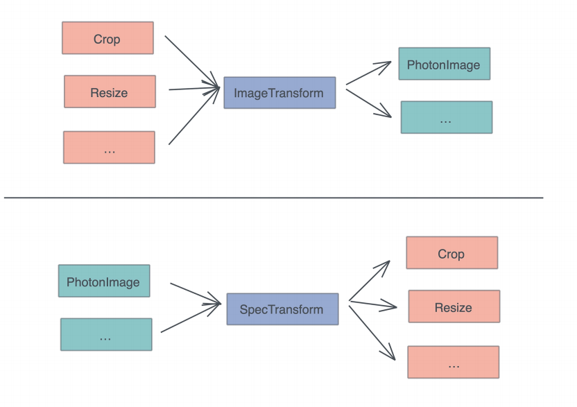

# 类型系统: 如何围绕Trait来设计和架构系统?

我们这一节还是讲Triat, 因为trait在Rust开发中的地位, 真的很重要

其实不光是Rust, 任何一门语言, 接口处理相关的概念, 都是那门语言在使用过程中最重要的概念, 软件开发的整个行为, 基本上可以说是不断创建和迭代接口, 往后在这些上进行实现的过程

在这个过程中, 有些接口是标准化的, 雷打不动的, 这些标准组件接口在确定下来后, 都不会改变, 它们就像Rust语言标准库找那个的标准trait一样

而有些接口是跟系统息息相关的, 它们可以吧系统的各个部分连接起来, 最终呈现给用户一个完整的使用体验

之前在讲架构和设计时, 不免要引入需求, 然后我需要解释这需求的来龙去脉, 在提供设计思路, 在介绍triat在其中的作用, 但这样下来, 一堂课的内容能讲好一个系统设计就不错了, 所以我们换个方式, 把之前设计过的系统捋一下, 看看其中的思路和取舍

## 用trait让代码自然舒服好用

在之前thumbor项目中, 我手机了一个SpecTransform trait, 通过它可以同一处理任意类型的, 描述我们希望如何处理图片的spec

```rust
// 一个 spec 可以包含上述的处理方式之一（这是 protobuf 定义）
message Spec {
    oneof data {
        Resize resize = 1;
        Crop crop = 2;
        Flipv flipv = 3;
        Fliph fliph = 4;
        Contrast contrast = 5;
        Filter filter = 6;
        Watermark watermark = 7;
    }
}
```

SpecTransform trait的定义如下:

```rust
// SpecTransfrom: 未来如果添加更多的spec, 只需要实现它即可
pub trait SpecTransform<T> {
    // 对图片使用op做transform
    fn transform(*mut self, op: T);
}
```

它可以用来对图片使用某个spec进行处理

但如果你阅读GitHub上的源码, 你可能会发现一个没用到的文件imageproc.rs中类似的trait:

```rust
pub trait ImageTransform {
    fn transfomr(&self, image: &mut PhotonImage);
}
```

这个trait是第一版的trait, 我依旧保留着他, 就是向在此展示一下trait设计上的取舍

当你审视这段代码的时候会不会觉得, 这个trait的设计有些草率, 因为如果传入的Image来自不同的图片处理引用, 而某个图片引擎提供的image类型不是PhotonImage. 那这个接口不久无法使用了么?

这是一个设计上的大问题, 想想看, 以及目前所学的知识, 怎么解决这个问题? 什么可以帮助我们延迟image是否必须是PhotonImage的决策呢?

对发耐性, 我们可以使用泛型修改刚才那段代码

```rust
pub trait ImageTransform<Image> {
    fn transfomr(&self, image: &mut Image);
}
```

把传入的image类型抽象成泛型类型之后, 延迟了图片类型判断和支持的决策, 可用性更高

但如果你继续对比现在的ImageTransformhe之前写的SpecTransform, 会发现它们实现trait的数据结构和用在trait上的泛型参数正好掉了个个

你看. PhotonImage下对于Contrast的ImageTransform的实现:

```rust
impl ImageTransform<PhotonImage> for Contrast {
    fn transform(&self, image: &mut Image) {
        effets::adjust_contrast(image. self.contrast);
    }
}
```

同样的, PhotonImage下对Contract的SpecTransform的实现:

```rust
impl SpecTransform<&Contrast> for Photon {
    fn transform(&mut self, op: &COntrast) {
        effects::adjust_contrast(&mut self.0, op.contrast);
    }
}
```

这两种方式基本上等价, 但一个围绕着Spec展开, 一个围绕着Image展开



那么. 那章设计会更好呢?

其实二者并没有功能上或者性能上的优劣

那为什选择SpecTransform的设计呢? 在第一版的设计我们没有考虑Engine的时候. 是以Spec为中心的, 但在把Engine为中心做了设计, 这样做的好处是, 开发新的Engine的时候, SpecTransform trait用起来更加顺手, 更自然一些

接口的设计一定要关注使用者的体验, 一个使用起来感觉自然顺手舒服的接口, 就是更好地接口. 因为这意味着使用的时候, 代码可以自然而然的写出来, 而无需看文档

要简洁, 自然的多, 它把实现细节都屏蔽起来, 只让用户关心它们需要关心的逻辑

所以, 我们在设计trait的时候, 除了关注的功能, 还要注意是否好用, 易用, 这也是为什么我们在介绍KV server的时候, 不断强调, 不要先着急撰写实现trait的代码, 而是先写一些对于trait使用的测试代码

你在写测试代码的使用体验, 就是别人在使用你的trait构建系统时的真实体验, 如果它用起来别扭, 啰嗦, 不看文档不容易用对, 那这个trait本身还有待进一步迭代

## 用trait做桥接

在软件开发绝大多数的时候, 我们都不会从零到一完完全全设计和构建系统的所有部分

作为架构师, 你的职责是在生态系统中找到合适的组件, 连同你自己打造的部分, 一起粘合起来, 形成一个产品, 所以你会遇到哪些接口与你预期不符的组件, 可视自己又无法改变哪些组件来让接口满足你的预期, 怎么办?

此刻, 我们需要桥接

在Rust里, 桥接的工作可以通过函数来完成, 但最好通过trait来桥接, 

```rust
// Engine trait：未来可以添加更多的 engine，主流程只需要替换 engine
pub trait Engine {
    // 对 engine 按照 specs 进行一系列有序的处理
    fn apply(&mut self, specs: &[Spec]);
    // 从 engine 中生成目标图片，注意这里用的是 self，而非 self 的引用
    fn generate(self, format: ImageOutputFormat) -> Vec<u8>;
}
```

通过Engine这个trait,我们把第三方库photo和自己设计的ImageSpec连接起来, 使我们不用关心Engine背后究竟是什么, 只需要调用apply和generate方法即可

```rust
// 使用 image engine 处理
let mut engine: Photon = data
.try_into()
.map_err(|_| StatusCode::INTERNAL_SERVER_ERROR)?;
engine.apply(&spec.specs);
let image = engine.generate(ImageOutputFormat::Jpeg(85));
```

这段代码中, 由于之前为Photon实现了`TryFrom<Bytes>`, 所以可以直接调用try_into得到一个photon engine

```rust
// 从 Bytes 转换成 Photon 结构
impl TryFrom<Bytes> for Photon {
    type Error = anyhow::Error;
    fn try_from(data: Bytes) -> Result<Self, Self::Error> {
        Ok(Self(open_image_from_bytes(&data)?))
    }
}
```

就桥接thumbor代码和photon crate而言, Engine表现良好, 它让我们不但很容易使用photon crate, 还可以很方便在未来需要的时候替换掉photon crate

不过, Engine在构造时, 所做的桥接还是不够直观和自然, 如果不仔细看代码或者文档, 使用者可能并不清楚, 第三行代码, 如何通过TryFrom/TypeInto得到一个实现了Engine的结构, 从这个使用体验来看, 我们希望通过使用Engine trait, 任何一个图片引用都可以统一的创建Engine结构怎么办?

```rust
// Engine trait：未来可以添加更多的 engine，主流程只需要替换 engine
pub trait Engine {
    // 生成一个新的 engine
    fn create<T>(data: T) -> Result<Self>
    where
    Self: Sized,
    T: TryInto<Self>,
    {
        data.try_into()
        .map_err(|_| anyhow!("failed to create engine"))
    }
    // 对 engine 按照 specs 进行一系列有序的处理
    fn apply(&mut self, specs: &[Spec]);
    // 从 engine 中生成目标图片，注意这里用的是 self，而非 self 的引用
    fn generate(self, format: ImageOutputFormat) -> Vec<u8>;
}
```

注意看新create方法的约束: 任何T, 只要实现了TryFrom / TryInto就可以用这个缺省的crate来构造Engine

有了这个接口之后, 上面使用engine的代码可以更加直观

```rust
// 使用 image engine 处理
let mut engine = Photon::create(data)
.map_err(|_| StatusCode::INTERNAL_SERVER_ERROR)?;
engine.apply(&spec.specs);
let image = engine.generate(ImageOutputFormat::Jpeg(85));
```

桥接是架构中一个非常重要的思想, 我们一定要掌握这个思想的精髓

再举个例子, 比如现在想要系统可以通过访问某个RUST API, 得到用户自己发布的, 按时间顺序排列的朋友圈, 怎么写这段代码呢? 最简单的方式是:

```rust
let secret_api = api_with_user_token(&user, params);
let data: Vec<Status> = reqwest::get(secret_api)?.json()?;
```

更好的方式是使用trait桥接来屏蔽实现细节

```rust
pub trait FriendCircle {
    fn get_published(&self, user: &User) -> Result<Vec<Status>, FriendCircleError> {
        ...
    }
}
```

这样, 我们业务逻辑可以围绕这个接口展开, 而无需关心它具体的实现是来自REST API还是其他什么地方; 也不用关心实现做没做cache, 有没有重传机制, 具体都返回什么UC哦呜等等

## 使用trait提供控制反转

继续看刚才的Engine代码, 在Engine和T之间通过TryInto trait进行了解耦, 使得调用者可以灵活的 处理它们的T

```rust
pub trait Engine {
    // 生成一个新的 engine
    fn create<T>(data: T) -> Result<Self>
    where
    Self: Sized,
    T: TryInto<Self>,
    {
        data.try_into()
        .map_err(|_| anyhow!("failed to create engine"))
    }
    ...
}
```

这里还体现了trait设计中, 另一很重要的作用, 控制反转

通过使用trait, 我们可以在设计底层库的时候告诉上层: 我们需要某个满足trait X的数据, 因为我UI来这个数据traitX方法来完成某些功能, 但这个数据具体怎么实现, 我不知道, 也不关心

刚才为Engine新创建的create方法, T是实现Engine所需要的依赖, 我们不知道属于类型T的data是如何在上下文中欧冠产生的, 也并不关心T具体是什么, 只要T实现了`TryInto<Self>`即可, 这就是典型的控制反转

控制反转是架构中经常使用到的功能, 它能够让调用者之间的关系在某个时刻调转过来, 被调用者反过来调用提调用者提供的能力, 二者协同完成一些事情

比如MapReduce的架构: 用于map的方法和用于reduce的方法是啥, MapReduce的架构设计者并不清楚, 但调用者可以吧这些方法提供给MapReduce架构, 由MapReduce架构在合适的时候进行调用

当然控制反转并非只能由trait来完成, 但使用trait做控制反转会非常灵活, 调用者和被调用者只需要关心它们之间的接口, 而非具体的数据结构

