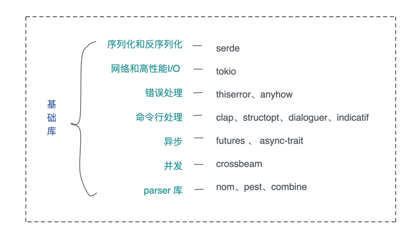
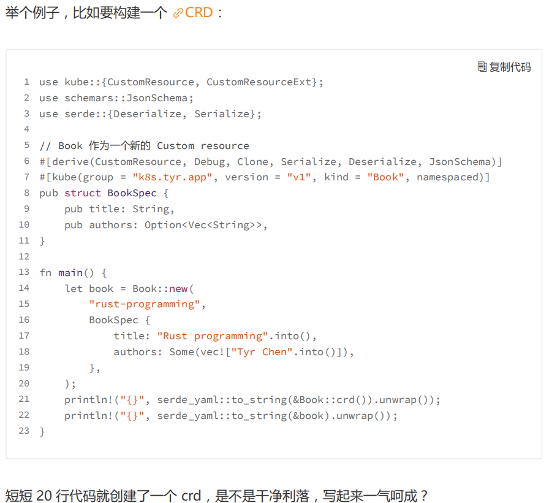
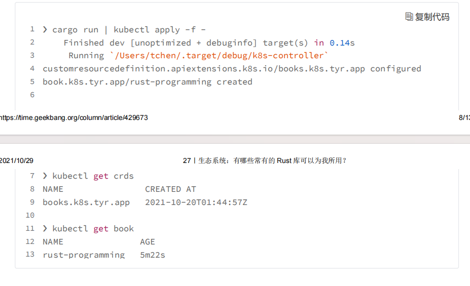
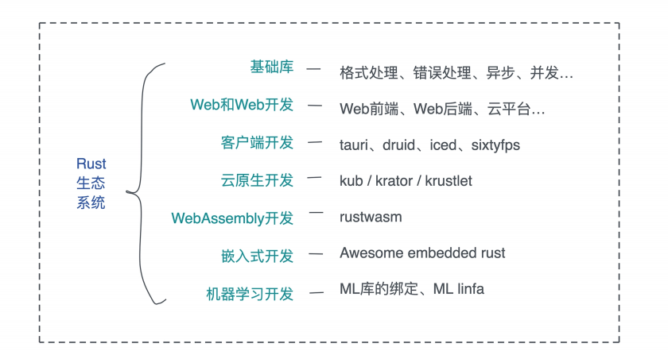

# 生态系统: 有哪些常用的Rust库可以为我所用?

一门编程语言的能力, 语言本身设计占了四成, 围绕着语言打造的生态系统占了六成

之前我们对比过Golang和Rust, Golang是一门优点和缺点同样突出的语言, Golang的某些缺点甚至是很严重的, 然而, 在Google的大力加持下, 借助微服务和云原生的春风, Golang构建了一个非常宏大的生态系统, 基本上, 如果你要做微服务, Golang完善的第三方库能够满足你几乎所有的需求

所以, 生态可以弥补语言的劣势, 编程语言对外展现出来的能力是语言 + 生态的一个合集

举个例子, 由于不支持宏编程Golang在开发很多项目的时候不得不引入大量的脚手架代码, 这些脚手架如果自己写, 费时费力, 但是社区里会有一大票优秀的框架, 帮助你生成这些脚手架

典型的比如kubebuilder, 直接把开发Kubernetes下operaor的门槛降了一大截, 如果没有类似的工具, 用Golang开发Kubernetes并不比Python来的容易, 反之, 承蒙在data science和machine learning上无比优秀且简洁实用的生态系统, Python才得以在这两个领域笑傲江湖, 独孤求败

那么, Rust的生态是什么样子呢? 我们可以用Rust做什么事情呢

今天内容主要是丰富你对Rust生态系统的了解, 方便你做不同项目的时候, 可以快速的找到合适的库和工具, 当然, 我无法把所有重要的出让特逗罗列出来, 如果本文中的内容无法涵盖到你的需求, 也可以去crate.io去查找

## 基础库

首先我们来介绍一些在各类应用中可能都会用到的库

先按照重要程度一次简单的说一下, 方便你根据需要自行跳转: 序列化和反序列化工具serde, 网络和高性能I/O库tokio, 用于错误处理的thiserror和anyhow, 用于命令行处理的clap以及其他, 用于处理异步的futures和async-trait, 用于提供并发相关的数据结构和算法的crossbeam, 以及用于撰写解析器的nom及其他



### serde

每一个从其他语言转移到Rust的开发者, 都会惊叹于serde及周边库的强大能力, 只需要在数据结构上使用`#[derive(Serialize, Deserialize)]`宏, 你的数据结构就能够被序列化和反序列化的绝大多数格式: JSON, YAML, TOML, MsgPack, Bincode等等

你还i为自己的格式撰写serde的支持, 比如使用json, 使用serde_json:

```rust
use serde::{Deserialize, Serialize};

#[derive(Debug, Serialize, Deserialize)]
struct Point {
    x: i32,
    y: i32,
}

fn main() {
    let point = Point { x: 1, y: 2 };

    let serialized = serde_json::to_string(&point).unwrap();

    println!("serialized: {serialized}");

    let deserialized: Point = serde_json::from_str(&serialized).unwrap();

    println!("deserialized: {deserialized:?}");
}
```

如果你用过其他语言的ORM, 你可以吧serde理解成增强版, 普适性的ORM, 它可以把任意可序列的数据结构, 序列化成任意格式, 或者从任意格式中反序列化

那么什么不是可序列化的数据结构呢? 任何状态无法简单重建的数据结构, 比如一个TcpStream, 一个文件描述符, 一个Mutex, 是不可序列化的, 而一个HashMap等式可以序列化的

### tokio

如果你要用Rust处理高性能网络, 那么tokio以及tokio的周边库, 不得不了解

tokio在Rust中的地位, 相当于Golang处理并发的运行时, 只不过Golang的开发者没得选用不用运行时, 而Rust开发者可以不同任何运行时, 或者在需要有选择的引入tokio / async-std / smol等

在所有这些运行时何种, 最通用最广的是tokio,围绕着它的有: tonic / axum / tokio-uring / tokio-rustls / tokio-stream / tokio-util等网络和异步IO库, 以及bytes / tracing / prost / mio / slab等, 我们在介绍如何阅读Rust代码时, 简单阅读了bytes, 在Kv Server的撰写过程中, 我们也遇到了提到的很多库

### thiserror  / anyhow

错误处理的两个库, 目前Rust生态里它们是最主流的错误处理工具

### clap / structopt / dialoguer / indicatif

clap和structopt依旧是Rust命令处理的主要选择, 其中clap3已经整合了structopt, 所以, 一旦它发布正式版本, structopt的用户可以放心切换过去

如果你要做交互式命令行, dialoguer是一个不错的选择, 如果你希望在命令行中还能够提供友好的进度条, 试一试indicatif

### futures / async-trait

虽然哦我们还没有正式的学习future, 但已经在很多场合使用过futures库和async-trait库

标准库中已经采纳了future库的Future trait, 并通过async / await关键字, 使用异步处理称为语言的一部分, 然而futures库中还有很多其它重要的trait和数据结构, 比如我们之前使用过的Stream / Sink, futures库还自带一个简单的executer, 可以在测试时取代tokio

async-trait库顾名思义, 就是为了解决Rust目前还不支持在trait中带有async fn的问题

### crossbeam

crossbeam是Rust下一个非常优秀的处理并发, 以及和并发相关的数据结构的库, 当你需要撰写自己的调度器时, 可以使用deque, 当你需要性能更好的MPMC channel时, 可以使用channel, 当你需要一个epoch-based GC时, 可以使用epoch

### nom / prest / combine

这三个都是非常优秀的parser库, 可以用来撰写高效的解析器

在Rust下, 当你需要处理某些文件格式时, 首先可以考虑serde, 其次可以考虑这结构库, 如果你要处理语法, 那么它们是最好的选择, 我个人偏爱nom其次是combine, 它们是parser combinator库, prst是PEG库, 你可以类似EBNF的结构定义语法, 然后访问生成的代码

## Web和Web服务开发

虽然Rust相对很多语言要年轻的多, 但Rust下Web开发工具厮杀的惨烈程度一点有不亚于Golang / Python等更成熟的语言

从Web协议支持来看, Rust有hyper处理http1 / http2, quinn / quiche处理QUIC/http3, tonic处理gRPC, 以及tungstenite / tokio-tungstenite处理websocket

从协议序列化 / 反序列化的角度看, Rust有avro-rs处理apache avro, capnp处理Cap' n Proyo, prost处理protobuf, flatbuffers处理google flatbuffers, thrift处理apache thrift, 以及serde_json处理我们最熟悉的JSON

一般来说, 如果你提供REST / GraphQL API, JSON是首选的序列化工具, 如果你提供二进制协议, 没有特殊情况(比如做游戏, 倾向于flatbuffers)建议使用protobuf

从Web框架的角度, 有号称性能宇宙第一的actix-web; 有简单好用且即将支持异步性能会大幅度提升的rocket; 还有tokio社区刚刚发布的后起之秀axum

从数据库支持角度来看, Rust支持几乎所有的主流数据库, 包括但不限于MySQL, Prostgres, Redis, RocksDb, Cassandra, MongoDB, ScylaDB, CouchDB等等, 如果你喜欢使用ORM, 可以用diesel, 或者sea-orm, 如果你享受直接但安全的SQL查询, 可以使用sqlx

从模版引擎的角度, Rust又支持jinja语法的askama, 有类似jinja2的tera, 还有处理markdown的comrak

从Web前端的角度来看, Rust有纯前端的yew和seed, 以及更偏重全含的MoonZoon, 其中yew更加成熟一点, 熟悉react/elm的同学更容易用起来

从Web测试的角度看, Rust有对标puppeteer的handless_chrome, 以及对标selenium的thirtyfour, fantoccini

从云平台部署的角度看，Rust 有支持 aws 的 rusoto 和 aws-sdk-rust、azure 的azure-sdk-for-rust。目前 Google Cloud、阿里云、腾讯云还没有官方的 SDK 支持。

在静态网站生成领域，Rust 有对标 hugo 的 zola 和对标 gitbook 的 mdbook。它们都是非常成熟的产品，可以放心使用。

## 客户端开发

这里的客户端, 特指带GUI的客户端开发, CLI在之前已经介绍过了

在https://areweguiyet.com/页面中, 我们可以看到大量的GUI库, 我个人觉得比较有前景的跨平台解决方案是tauri, druid, iced, sixtyfps

其中, tauri是electron的替代品, 如果你厌倦了electron庞大的身躯和贪婪的内存占用, 但有喜欢使用Web技术栈构建客户端GUI, 可以试一试tauri, 它使用了系统本身的webview. 在加上Rust本身极其克制内存占用, 性能和内存使用能甩electron好几个身位

剩下的三个都是提供原生GUI, 其中sixtyfps是一个非常不错的对嵌入式系统有很好支持的原生GUI库, 不过要注意它的授权是GPLv3, 在商业产品上谨慎使用

如果你希望能够创建更加丰富, 更加出众的GUI, 你可以使用skia-safe和tiny-skia, 前者是Goole的skia图形引擎的rustbinding, 后者是兼容skia的一个自己, skia是目前在跨平台GUI领域炽手可热的底层图形引擎, 通过它你可以做任何复杂的对图层的处理

当然, 你也可以用Flutter绘制UI, 用Rust输出C FFI, dart可以生成C FFI的包装, 供Flutter使用

## 云原生开发

云原生一直是Golang的天下, 如果你统计到Kubernetes生态中的operator, 几乎清一色是使用Golang编写的

然而, Rust在这个领域渐渐有冒头的趋势, 这要感谢之前提到的serde, 以及处理Kubernetes API的kube-rs项目做出的巨大努力, 还有Rust强大的宏编程能力, 它使得我们根Kubernetes打交道务必轻松





如果你用Golang的Kubebuilder做过类似的事情, 是不是发现Golang的哪些生成大量脚手架代码和YAML问价你的过程, 顿时就不香了,

虽然在云原生方面, Rust还是个小弟, 但是这个小弟有着强大的降维打击能力, 同样的功能, Rust可以只用Golang大概四分之一到十分之一的代码完成任务, 这得益于Rust宏编程的强大能力

处理kube这样的基础库, Rust还有刚刚崭露头角的krator和krustlet, krator可以帮助更好的构建kubernetes operator, 虽然operator并不太强调效率, 但是更少的代码, 完成更多的功能, 还有更低的内存占用, 我还是非常看好未来会有更多的kubernetes operator用Rust开发

krustlet顾名思义, 是用来替换kubelet的, krustlet使用了wasmtime作为数据平台(dataplane)的运行时, 而非传统的continersd, 这也就意味着, 你可以用更高效, 更精简的WebAssembly处理原本只能用container处理的工作

目前, WebAssembly在云原生领域还处在早期, 生态还不够完善, 但是它相对于厚重的container来说, 完全是一个降维打击

云原生另一个主要的方向是serverless, 这个领域由于amazon开源了用Rust开发的高性能micro VM firecracker, 使得Rust在serverless / FAAS方面处于领先地位

## WebAssembly开发

如果哦Web开发, 云原生是Rust擅长的领域, 那么WebAssembly可以说是Rust的主战场之一

Rust内置了wasm32-unknown-unknown作为编译目标, 如果你没添加, 可以用rustup添加, 然后在编译的时候指明目标, 就可以得到wasm

```bash
$ rustup target add wasm32-unknown-unknown
$ cargo build --target wasm32-unknown-unknown --release
```

你可以用wasm-pack和wasm-bindgen, 不但生成wasm, 同时还生成ts/js调用wasm的代码, 你可以在rustwasm下找到更多的相关项目

WebAssembly社区一个很重要的组织是Bytecode Alliance, 前文提到wasmtime就是的它们的主要开源产品, wasmtime可以让WebAssembly代码以沙箱的形式运行在服务器

另外一个WebAssembly的运行时wasmer, 是wasmtime的主要竞争者, 目前WebAssembly在服务器领域, 尤其是serverless/FAAS领域, 有着很大的发展空间

## 嵌入式开发

如果你用Rust做嵌入式开发, 那么embedded WG不可不关注

你也可以在https://github.com/rust-embedded/awesome-embedded-rust里找感兴趣的嵌入式开发工具, 现在很多嵌入式开发不是纯粹的嵌入式设备开发, 所以云原生, 边缘计算, WebAssembly也在这个领域有很多应用, 比如被接纳为CNCF sandbox项目不久的akri, 它就是一个管理嵌入式设备的云原生项目

## 机器学习开发

机器学习 / 深度学习是Rust很有潜力但目前生态还很匮乏的领域

Rust有tensorflow的绑定, 也有tch-rs这个libtorch(PyTorch)的绑定, 除了这些著名的ML库的Rust绑定外, Rust下还有对标scikit-learn的linfa

我觉得Rust在机器学习领域未来会有很大的突破的地方坑是是ML infra, 因为最终ML构建出来的模型, 还是需要一个高性能API系统对外提供服务, 而Rust将是目前这个领域的玩家们的主要挑战者

## 小结: Rust生态的未来

今天我们讲了Rust主要的方向上的生态




目前Rust在WebAssembly开发领域处于领先, 在Web和Web服务开发领域已经有了非常扎实的基础, 而在云原生领域正在奋起直追, 后劲十足, 这三个领域, 加上机器学习, 是未来几年主流的后端开发方向

作为一门依旧非常年轻的语言, Rust的生态还在蓬勃发展中

