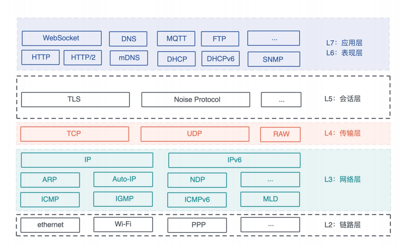
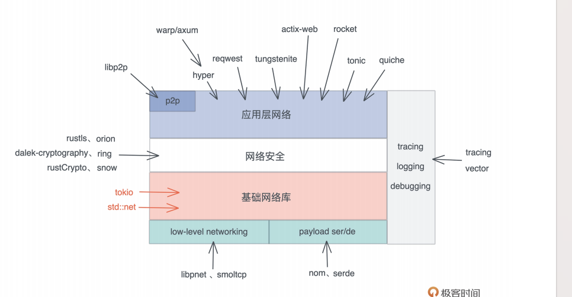
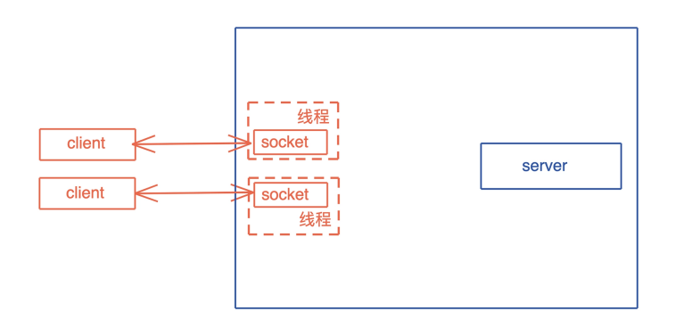
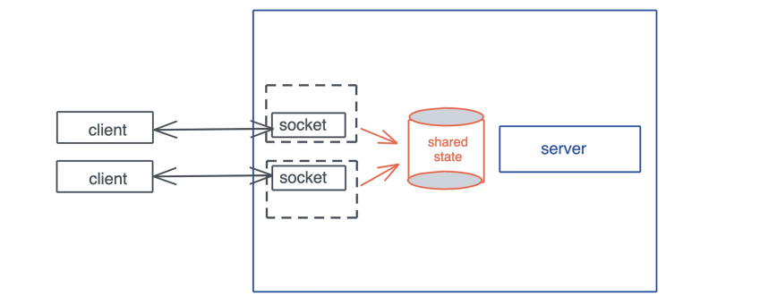
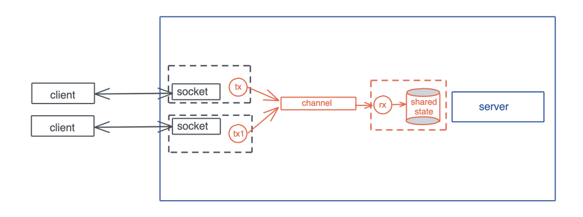
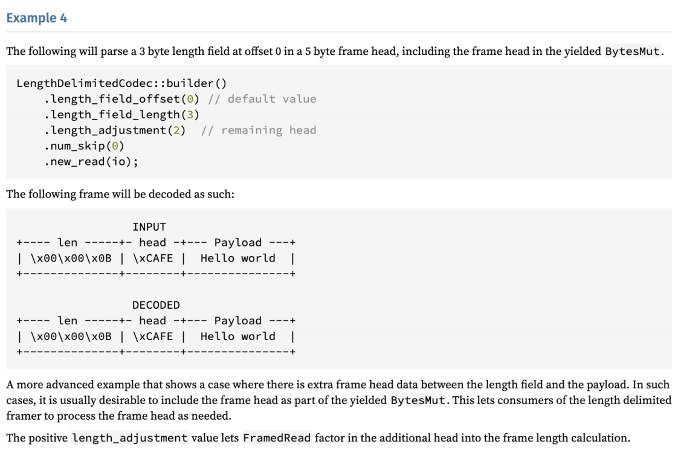

# 网络开发: 如何使用Rust处理网络请求?

今天我们学习如何使用Rust做网络开发

在互联网时代, 谈到网络, 我们想到的首先是Web开发以及设计的部分HTTP协议,和WebSocket协议

之所说部分, 是因为很多协议考虑到的部分, 比如更新是的并发控制, 大多数Web开发者并不知道, 当谈论到gRPC时, 很多人就会认为这是比较神秘的底层协议, 其实只不过是HTTP/2下的一种对二进制格式的封装

所以对于网络开发, 这个非常宏大的议题, 我们当然是不可能, 也没有必要覆盖全部内容的, 今天我们就先简单聊聊网络开发的大全景图, 然后重点学习如何使用Rust标准库以及生态系统中的库来做网络处理, 包括网络连接, 网络数据处理的一些方法, 最后也会介绍几种典型的通讯模型的使用

我们先来简单回顾一个ISO/OSI七层模型以及对应的协议, 物理层主要根PHY芯片有关, 就不多提了



七层模型中, 链路层和网络层一般构建在操作系统之中, 我们并不需要直接接触, 而表现层和应用层关系紧密, 所以在实现过程中, 大部分应用程序只关心网络层, 传输层, 应用层

网络层目前处于IPv4和IPv6分庭抗礼, IPv6还未完全对IPv4取而代之; 传输层除了对延迟非常敏感的应用(比如游戏), 绝大多数应用都使用TCP; 而在应用层, 对用户友好, 且对防火墙友好的HTTP协议家族, HTTP / WebSorcket / HTTP/2, 以及尚在草案中的HTTP/3, 在漫长的进化中, 脱颖而出, 成为应用程序的主流的选择

我们来看看Rust生态对网络协议的支持:



Rust标准库提供了`std::net`, 为整个TCP/IP协议栈的使用提供了封装, 然而`std::net`是同步的, 所以, 如果你要构建一个高性能的异步网络, 可以使用tokio, tokio提供了和`std::net`几乎一致的封装, 一旦熟悉了`std::net`, `tokio::net`里的功能对于来说并不陌生, 我们先从`std::net`开始了解

## std::net

`std::net`下提供了处理TCP / UDP的数据而机构, 以及一些辅助结构:

- TCP: TcpListener / TCPStream, 处理服务器的监听和客户端的链接
- UDP: UdpSocket, 处理UDP socket
- 其他: IpAddr是IPv4和IPv6地址的封装; SocketAddr, 表示IP地址 + 端口的数据结构

助力主要介绍一些TCP的处理, 顺便会是用到IpAddr / SocketAddrt

## TcpListener / TcpStream

如果要创建一个TCP server, 我们可以使用TcpListener绑定某个端口, 然后用loop循环处理接收到的用户请求, 接收到请求后, 会得到一个TcpStream, 它实现了Read / Write trait, 可以像读写文件一项, 进行socket的读写

```rust
use std::{
    io::{Read, Write},
    net::TcpListener,
    thread,
};

fn main() {
    let listener = TcpListener::bind("0.0.0.0:9527").unwrap();
    loop {
        let (mut stream, addr) = listener.accept().unwrap();
        println!("Accepted a new connection: {addr}");
        thread::spawn(move || {
            let mut buf = [0u8; 12];
            stream.read_exact(&mut buf).unwrap();
            println!("data: {:?}", String::from_utf8_lossy(&buf));
            // 一个写了17个字节
            stream.write_all(b"glad to meet you!").unwrap()
        });
    }
}
```

对于客户端, 我们可以使用`TcpStream::connect`得到一个TcpStream, 一旦客户端的请求被服务器接收, 就可以发送或者接收数据:

```rust
use std::{
    io::{Read, Write},
    net::TcpStream,
};

fn main() {
    let mut stream = TcpStream::connect("127.0.0.1:9527").unwrap();
    // 一个写了12个字节
    stream.write_all(b"hello world!").unwrap();

    let mut buf = [0u8; 17];
    stream.read_exact(&mut buf).unwrap();
    println!("data: {:?}", String::from_utf8_lossy(&buf));
}
```

在个例子中, 客户端在连接成功后, 会发送12个字节的hello world!给服务器, 服务器读取并回复, 客户端会尝试接收完成的, 来自服务器的17个字节的glad to meet you!

但是目前客户端都需要硬编码要接收数据的大小, 这样不够灵活, 后续我们会看到如何通过使用消息帧(frame)更好的处理

从客户端的代码可以看到, 我们无需显示的关闭TcpStream, 因为TcpStream的内部实现也处理了Drop trait, 使得其离开作用域时会自动关闭

但如果你去看TcpStream的文档, 会发现并没有实现Drop, 这是因为TcpStream内部包装了sys_common::net::TcpStream, 然后它有包装了Socket, 而Socket是一个平台相关的结构, 比如在Unix下实现是FileDesc, 然后他内部是一个OwnedFd, 最后会调用`liib::close(self.fs)`来关闭fd, 也就关闭了TcpStream

## 处理网络连接的一般方法

如果你使用了某个Web Framework处理Web流量, 那么无需关心网络连接, 框架会自动帮助你大点好一切, 你只需要关心某个路由或者某一个RPC的处理逻辑就可以了, 到哪如果你要在TCP纸上构建自己的协议, 那么你需要认真考虑如果妥善处理网路连接

我们在之前的listener代码中也看到了, 在网络处理的主循环中, 会不断accept一个新的连接

```rust
fn main() {
    ...
    loop {
        let (mut stream, addr) = listener.accept().unwrap();
        println!("Accepted a new connection: {}", addr);
        thread::spawn(move || {
            ...
        });
    }
}
```

但是处理连接的过程, 需要放在另一个线程或者另一个异步任务中, 而不要在主循环中处理, 因为这样会阻塞循环, 使其在处理完当前的连接前, 无法accept新的连接

所以, loop + spawn是处理网络连接的基本方式



但是使用线程处理频繁连接和退出网络连接, 一来效率上有问题, 二来线程间如何共享公共的数据也让人头疼, 哦我们来详细的看看

## 如果处理大量连接?

如果不断的创建线程, 那么当连接一高, 就容易把系统中可用的线程资源吃光, 此外, 因为线程的调度是操作系统完成的, 每次调度都要经历一个复杂的, 不那么高效的save and load的上下文切换的过程, 所以如果使用线程, 那么在早遇到C10K的瓶颈, 也就是连接数到万这个借呗, 系统就会遇到资源和算力的双重瓶颈

从资源的角度, 过多的线程占用过多的内存, Rust缺省的栈大小是2M, 10k连接机会占用20G(当然缺省栈大小也可可以根据需要修改); 从算力的角度, 太多的线程在连接数据到达时, 会来来回回切换线程, 导致CPU过分忙碌, 无法处理更多的连接请求

所以, 对于潜在有大量连接的网络服务, 使用线程不是一个好的方式

如果要突破C10K的瓶颈达到C10M, 我们就只能使用在用户态的协程来处理, 要么是类似Erlang/Golang那样的有效协程(stackful coroutine), 要么是类似Rust异步处理这样的无效协程(stackless coroutine)

所以在Rust下大部分处理网络相关的代码中, 你会看到, 很少直接有用std::net进行处理的, 大部分都是使用某个异步网络运行时, 比如tokio

## 如何处理共享信息?

第二个问题, 在构建服务器时, 我们总会有一些共享的状态供所有的连接使用, 比如数据库的连接, 对于这样的场景, 如果希望共享数据不需要修改, 我们可以考虑使用`Arc<T>`, 如果需要修改, 可以使用`Arc<RwLock<T>>`



但使用锁, 就意味着一旦在关键路径上需要访问被锁住的资源, 整个系统的吞吐量都会收到很大的影响

一种思路是, 我们把锁的粒度降低, 这样冲突就会见啥, 比如在KV Server中, 我们把key哈希一下摸N, 讲不通的key分摊到N个memory store中, 这样所的粒度就降低到之前的1/N个;额


另一种思路是我们改变共享资源的访问方式, 使其只被一个特定的线程访问; 其他线程或者协程只能通过给其发送消息的方式与之交互, 如果你用Erlang / Golang, 这种方式你应该不陌生, 在Rust下, 可以使用channel数据结构



Rust下的channel, 无论是标准库还是第三方库, 都有非常棒的实现, 同步的channel的有标准库的mpsc:channel和第三方库crossbeam_channel, 异步channel有tokio下的mpsc:channel, 以及flume

## 处理网络数据的一般方法

我们再来看看如何处理网络数据, 大部分时候, 我们可以使用已有的应用层协议来处理网络数据, 比如HTTP

在HTTP协议下, 基本上使用JSON构建REST API / JSON API是业界的共识, 客户端和服务器也有足够好的生态系统来支持这样的处理, 你只需要使用serde让你定义的Rust数据结构具备Serialize / Deserialize的能力, 然后用serde_json生成序列化后的JSON数据

下面是一个实用rocket来处理JSON数据的例子, 首先在Cargo.toml中引入:

```rust
rocket = { version = "0.5.0-rc.1", features = ["json"] }
```

Rocket是Rust的一个全功能Web框架, 类似于Python的Django, 可以看到, 使用rocket, 10多行代码, 我们就可以运行起一个Web Server

如果你出于性能或者其他原因, 可能需要定义自己的客户端 / 服务器之间的协议, 那么, 可以使用传统的TLV(Type-Length-Value)来描述协议数据, 或者使用更加高效的简洁的protobuf

## 使用protobuf自定义协议

protobuf是一种非常方便的定义向后兼容协议的工具, 它不仅能使用在购进gRPC服务器的场景中, 还能使用在其他网络服务中

在之前的实战中, 无论是thumbor的实现, 还是KV Server的实现, 都用到了protobuf, 在KV Server的实战中, 我们在TCP之上构建了基于protobuf的协议, 支持一系列HXXX命令, 如何使用protobuf之前讲过, 这里也不再赘述了

不过, 使用protobuf构建协议消息的时候需要注意, 因为protobuf生成的是不定长消息, 所以你需要在客户端和服务器之间越好, 如果界定一个消息帧(frame)

消息尾添加`\r\n`一般用于基于文本的协议, 比如HTTP头/ POP3 / Redis的RESP协议等, 但对于二进制协议, 更好的方式是在消息前面添加固定的长度, 比如对于protobuf这样的二进制语言, 消息中的数据正好出现连续的`\r\n`, 如果使用`\r\n`作为消息边界, 就会发现紊乱, 所以不可取

不过两种方式也可以混用, 比如HTTP协议, 本身使用`\r\n`界定头部, 但它的body会使用长度界定, 只不过这个长度在HTTP头中的Content-Length来声明

前面说过gRPC使用protobuf, 那么gRPC是怎么界定消息帧呢?

gRPC使用了五个字节的Length-Prefix-Message, 其中包含一个字节的压缩标志和四个四节的消息长度, 这样, 在处理gRPC消息时,, 我们先读取5个字节, 去出其中的长度N, 在读取N个字节就得到了一个完整的消息了

所以我们也可以采用这样的方法来使用protobuf自定义的协议

因为这种处理方式很常见, 所以tokio提供了length_delimiited codec, 来出路用长度隔离的消息帧, 它可以和Framed结构配合使用, 如果看它的文档, 会发现它除了简单支持在消息前加长度外, 还支持各种各样的复杂的场景

比如消息有一个固定的消息头, 其中包含三个字节长度, 五个字节内容, LengthDelimitedCodec处理完后, 会把完整的数据给你, 你也可以通过num_skip(3)把长度丢弃, 总之非常灵活:



下面是我使用tokio / tokio_util撰写服务器和客户端, 你可以看到, 服务器和客户端都使用了LengthDelimitedCodec来处理消息帧

**服务端**

```rust
use anyhow::Result;
use bytes::Bytes;
use futures::{SinkExt, StreamExt};
use tokio::net::TcpListener;
use tokio_util::codec::{Framed, LengthDelimitedCodec};

#[tokio::main]
async fn main() -> Result<()> {
    let listener = TcpListener::bind("127.0.0.1:9527").await?;

    loop {
        let (stream, addr) = listener.accept().await?;
        println!("accepted: {addr}");
        // LengthDelimitedCodec默认4字节长度
        let mut stream = Framed::new(stream, LengthDelimitedCodec::new());
        tokio::spawn(async move {
            while let Some(Ok(data)) = stream.next().await {
                println!("Got: {:?}", String::from_utf8_lossy(&data));
                // 发送消息也需要发送主题信息, 不需要提供长度
                // Framed/LengthDelimitedCodec会自动计算并添加
                stream.send(Bytes::from("goodbye world!")).await.unwrap();
            }
        });
    }
}
```

**客户端**

```rust
use anyhow::Result;
use bytes::Bytes;
use futures::{SinkExt, StreamExt};
use tokio::net::TcpStream;
use tokio_util::codec::{Framed, LengthDelimitedCodec};

#[tokio::main]
async fn main() -> Result<()> {
    let stream = TcpStream::connect("127.0.0.1:9527").await?;
    let mut stream = Framed::new(stream, LengthDelimitedCodec::new());
    stream.send(Bytes::from("hello world")).await?;
    // 从服务器接受返回的数据
    if let Some(Ok(data)) = stream.next().await {
        println!("Got: {:?}", String::from_utf8_lossy(&data));
    };

    Ok(())
}
```

和刚才的TcpListener / TcpStream代码相比, 双方都不需要知道对方发送的数据的长度, 就可以通过StreamExt trait的next接口得到下一个消息; 在发送时, 只需要调用SinkExt trait的接口发送, 相应的长度就会被自动的计算并添加到要发送的消息帧开头

这里为了代码的简便, 我并没有直接使用protobuf, 你可以把发送和接受到的Bytes里的内容视作protobuf序列化成的二进制数据, 我们可以看到, 使用LengthDelimitedCodec, 构建一个自定义协议, 变得非常简单, 短短二十行代码就完成了非常繁琐的工作

## 小结

我们今天聊了用Rust做网络开发的生态系统, 简单学习了Rust标准库提供的`std::net`和异步有优秀支持的tokio库, 以及如何用它们来处理网络连接和网络数据

绝大多数情况下, 我们应该使用支持异步的网络开发, 所以你会在各种网络相关的代码中看到tokio的身影, 作为Rust下主要的异步网络运行时, 你可以多花些时间了解它的功能

在接下来的KV Server的实现中, 我们会看到更多有关网络方面的详细处理, 你也会看到, 我们如何实现自己的Stream来处理消息帧