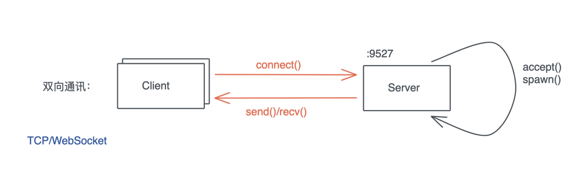
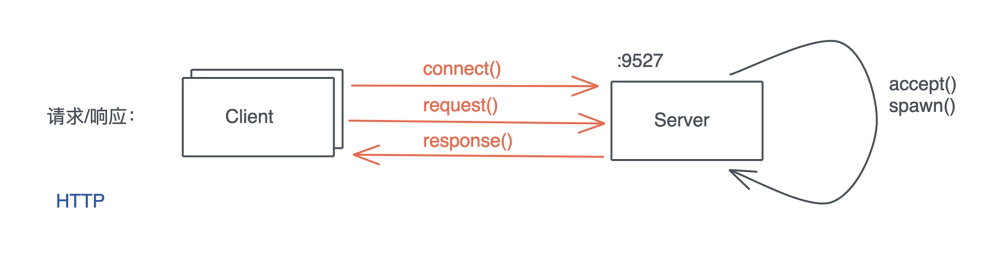
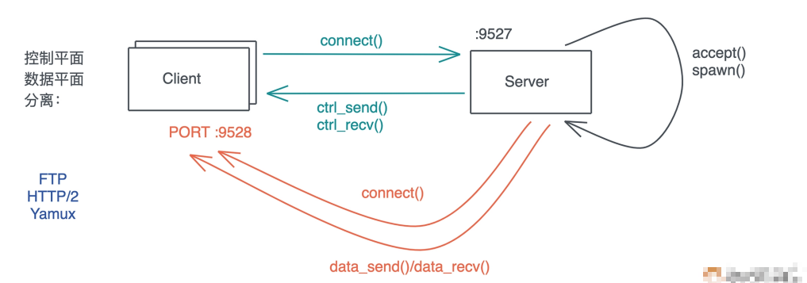
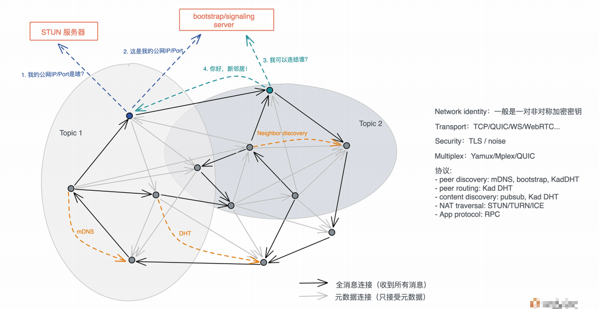
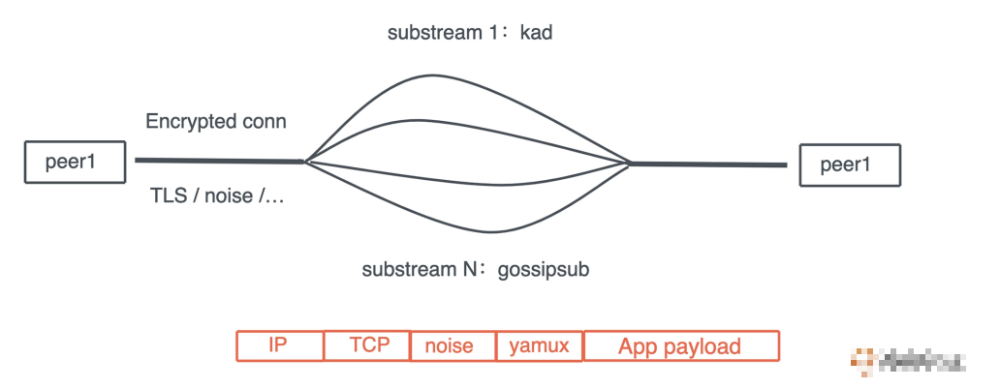

# 网络开发: 如何使用Rust处理网络请求?

上一节我们介绍了如何用Rust做基于TCP的网络开发, 通过TcpListener监听, 使用TcpStream连接, 在*nix操作系统层面, 一个TcpStream背后就是一个文件描述符, 值得注意的是, 当我们在处理网络应用的时候, 有些问题一定要重视:

- 网络是不可靠的
- 网络的延迟可能会很大
- 带宽是有限的
- 网络是非常不安全的

我们可以使用TCP以及构建在TCP之上的协议应对网络的不可靠; 使用队列和超时来应对网络的延时; 使用精简的二进制结构, 压缩算法以及某些技巧(比如HTTP的304)来减少带宽的使用, 以及不必要的网络传输; 最后需要使用TLS或者noise protocol这样的安全协议来保护传输中的数据

我们今天接着看网络开发中, 主要会涉及的网络通讯模型

## 双向通讯

上一节讲TCP服务器的例子, 所做的都是双向通讯, 这是最典型的一种通讯方式:



一旦连接建立, 服务器和客户端都可以根据需要主动向对方发起传输, 整个网络运行在全双工模式下(full duplex), 我们熟悉的TCP / WebSocket就运行在这种模型下

双向通讯这种方式的好处是, 数据的流向是没有限制的, 一端不必等待另一端才能发送数据, 网络可以进行比较实时的处理

## 请求响应

在Web开发的世界里, 请求 - 响应模型是我们最熟悉的模型, 客户端发送请求, 服务器根据请求返回响应, 整个网络处在半双工模式下(half duplex), HTTP/1.x就运行在这种模式下

一般而言, 请求响应模式下, 在客户端没有发起请求是, 服务器不会也无法主动向客户端发送数据, 除此之外, 请求发送的顺序和响应返回的顺序是一一对应的, 不会也不能乱序, 何种处理方式会导致应用层的队头阻塞(Head-Of-Line blocking)

请求响应模型处理起来也很简单, 由于HTTP协议的流行, 尽管有很多限制, 请求响应模型模型, 还是得到了非常广泛的应用



## 控制平面 / 数据平面分离

但有时候, 服务器和客户端之间会进行复杂的通讯, 这些通讯包含控制指令的数据流, 因为TCP有天然的网络层队头阻塞, 所以当控制信令和数据交杂在同一个连接中时, 过大的数据流会阻塞控制信令, 使其延迟加大, 无法及时响应一些重要的命令

以FTP为例, 如果用户在传输一个1G的文件后, 在进行ls命令, 如果文件传输和ls命令都在同一个连接中进行, 那么, 只有文件传输结束, 用户才会看到ls命令的结果, 这样显然对用户不友好

所以, 我们会采用控制平面和数据平面分离的方式, 进行网络处理

客户端会首先连接服务器, 建立控制连接, 控制连接是一个长连接, 会一直存在, 直到交互终止, 然后二者会根据需要额外创建临时的数据连接, 用于传输大容量的数据, 数据连接在完成相应的工作后, 会自动关闭



出FTP外, 还有很多协议都是类似的处理方式, 比如多媒体通讯协议SIP协议

HTTP/2和借鉴了HTTP/2的用于多路复用的Yamux协议, 虽然运行在同一个TCP连接之上, 它们的应用层也构建了类似的控制平面和数据平面

以HTTP/2为例, 控制平面(ctrl stream)可以创建很多新的stream, 用于并行处理多个应用层请求, 比如使用HTTP/2的gRPC, 各个请求可以并行处理, 不同的stream之间的数据可以乱序返回, 而不必受响应模型的限制, 虽然HTTP/2依旧受限于TCP层的队头阻塞, 但它解决了应用的队头阻塞

## P2P网络

前面我们谈论的网络通讯模型, 都是传统的客户端 / 服务器交互模型(C/S或B/S), 客户端和服务器在网络中的作用是不对等的, 客户端永远都是发起方, 而服务器是连接处理方

不对等的网络模型有很多好处, 比如客户端不需要公网地址, 可以隐藏在网络地址转换(NAT)设备(比如NAT网关, 防火墙)之后, 只要服务器拥有公网地址, 这个网络就可以连通, 所以客户端 / 服务器模型是天然中心化的, 所有连接都需要经过服务器这个中间人, 即便是两个客户端数据交互也不例外, 这种模型随着互联网的大规模使用成为了网络世界的主流

然而, 很多应用场景需要通讯的两端可以直接交互, 而无需一个中间人代为中转, 比如A和B分享一个1G的文件, 如果通过服务器中转, 数据相当于传输了两次, 效率较低

P2P模型打破了这种不对等的关系, 使得任意两个节点在理论上可以直接连接, 每个节点及时客户端又是服务器

## 如何构建P2P网络

可是由于历史上IPv4地址的缺乏, 以及对隐私和网络安全的担忧, 互联网的运营商在接入端, 大量使用了NAT设备, 使得普通的网络用户, 缺乏直接可以访问的公网IP, 因而, 构建一个P2P网络首先需要解决网络的连通性

主流的解决方法是P2P网络的每个节点, 首先会通过STUN服务器探索自己的公网IP/port, 然后在Bootstrap/signaling server上注册自己的公网IP/port, 让别人能发现自己, 从而和潜在的邻居建立连接

在一个大型的P2P网络中, 一个节点常常会拥有几十个邻居, 通过邻居以及邻居掌握的网络信息, 每个节点都能构造一张如何找到某个节点的路由表, 再次之上, 节点还可以加入某个或者某些topic, 然后通过某些协议(比如gossip)在整个topic下扩散消息:



P2P网络的构建, 一般要比客户端 / 服务器网络复杂, 因为节点间的连接要承载很多协议: 节点发现(mDNS, bootstrap, Kad DHT), 节点路由(Kad DHT), 内容发现(pubsub, Kad DHT)以及应用层协议, 同时连接的安全性受到的挑战也和之前的不同

所以我们会看到, P2P协议的连接, 往往在一个TCP连接中, 使用类似yamux的多路复用协议来承载很多其他协议



在网络安全方面, TLS虽然能很好的保护客户端 / 服务器模型, 然而证书的创建, 发放以及新人对P2P网络是个问题, 所以P2P网络倾向于使用自己的安全协议, 或者使用noise protocol, 来构建安全等级可以媲美TLS1.3的安全协议

## Rust如何处理P2P网络

在Rust下, 有libp2p这个比较成熟的库来处理P2P网络

下面是一个简单的P2P聊天应用, 在本地网络中通过MDNS做节点发现, 使用floodpub做消息传播, 在关键位置都写了注释:

```rust
use anyhow::Result;
use futures::StreamExt;
use libp2p::{
    core::upgrade,
    floodsub::{self, Floodsub, FloodsubEvent, Topic},
    identity,
    mdns::{Mdns, MdnsEvent},
    noise,
    swarm::{NetworkBehaviour, NetworkBehaviourEventProcess, SwarmBuilder, SwarmEvent},
    tcp::TokioTcpConfig,
    yamux, NetworkBehaviour, PeerId, Swarm, Transport,
};
use std::borrow::Cow;
use tokio::io::{stdin, AsyncBufReadExt, BufReader};

/// 处理p2p网络的behavior数据结构
/// 里面的每个域需要实现NetworkBehaviour, 或者使用#[behaviour]
#[derive(NetworkBehaviour)]
#[behaviour(event_process = true)]
pub struct ChatBehavior {
    /// flood subscription, 比较浪费带宽, gossipsub是更好的选择
    floodsub: Floodsub,

    /// 本地节点发现机制
    mdns: Mdns,
    // 在 behavior 结构中，你也可以放其它数据，但需要 ignore
    // #[behaviour(ignore)]
    // _useless: String,
}

impl ChatBehavior {
    /// 创建一个新的ChatBehavior
    pub async fn new(id: PeerId) -> Result<Self> {
        Ok(Self {
            mdns: Mdns::new(Default::default()).await?,
            floodsub: Floodsub::new(id),
        })
    }
}

impl NetworkBehaviourEventProcess<FloodsubEvent> for ChatBehavior {
    // 处理floodsub产生的消息
    fn inject_event(&mut self, event: FloodsubEvent) {
        if let FloodsubEvent::Message(msg) = event {
            let text = String::from_utf8_lossy(&msg.data);
            println!("{:?}: {:?}", msg.source, text);
        }
    }
}

impl NetworkBehaviourEventProcess<MdnsEvent> for ChatBehavior {
    fn inject_event(&mut self, event: MdnsEvent) {
        match event {
            MdnsEvent::Discovered(list) => {
                // 把mdns发现的新的peer加入到floodsub的view中
                for (id, addr) in list {
                    println!("Got peer: {} with addr {}", &id, &addr);
                    self.floodsub.add_node_to_partial_view(id);
                }
            }
            MdnsEvent::Expired(list) => {
                // 把mdns发现的离开的peer加入到floodsub的view中
                for (id, addr) in list {
                    println!("Removed peer: {} with addr {}", &id, &addr);
                    self.floodsub.remove_node_from_partial_view(&id);
                }
            }
        }
    }
}

#[tokio::main]
async fn main() -> Result<()> {
    // 如果带参数, 当成一个topic
    let name = match std::env::args().nth(1) {
        Some(arg) => Cow::Owned(arg),
        None => Cow::Borrowed("lobby"),
    };

    // 创建一个floodsub topic
    let topic = floodsub::Topic::new(name);

    // 创建swarm
    let mut swarm = create_swarm(topic.clone()).await?;

    swarm.listen_on("/ip4/127.0.0.1/tcp/0".parse()?)?;

    // 获取stdin的每一行
    let mut stdin = BufReader::new(stdin()).lines();

    // main loop
    loop {
        tokio::select! {
          line = stdin.next_line() => {
            let line = line?.expect("stdin closed");
            swarm.behaviour_mut().floodsub.publish(topic.clone(), line.as_bytes());
          }
          event = swarm.select_next_some() => {
            if let SwarmEvent::NewListenAddr {address, ..} = event {
              println!("Listening on {address:?}");
            }
          }
        }
    }
}

async fn create_swarm(topic: Topic) -> Result<Swarm<ChatBehavior>> {
    // 创建identify(密钥对)
    let id_keys = identity::Keypair::generate_ed25519();
    let peer_id = PeerId::from(id_keys.public());
    println!("Local peer id: {peer_id:?}");

    // 使用noise protocol来处理加密认证
    let noise_keys = noise::Keypair::<noise::X25519Spec>::new().into_authentic(&id_keys)?;

    // 创建传输层
    let transport = TokioTcpConfig::new()
        .nodelay(true)
        .upgrade(upgrade::Version::V1)
        .authenticate(noise::NoiseConfig::xx(noise_keys).into_authenticated())
        .multiplex(yamux::YamuxConfig::default())
        .boxed();

    // 创建chat behavior
    let mut behavior = ChatBehavior::new(peer_id).await?;
    // 订阅某个主题
    behavior.floodsub.subscribe(topic.clone());
    // 创建swarm
    let swarm = SwarmBuilder::new(transport, behavior, peer_id)
        .executor(Box::new(|fut| {
            tokio::spawn(fut);
        }))
        .build();

    Ok(swarm)
}
```

要运行这段代码, 你需要在Cargo.toml中使用futures和libp2p

```rust
futures = "0.3"
libp2p = { version = "0.39", features = ["tcp-tokio"] }
```

## 小结

从上下两讲的代码中, 我们可以看到, 五路那是处理高层的HTTP协议, 还是处理底层的网络, Rust都有非常丰富的工具供你使用

通过Rust的网络生态, 我们可以通过几十行代码就构建一个完整的TCP服务器, 或者上百行代码构建简单的P2P聊天工具, 如果你要构建自己的高性能网络服务器处理已知的协议, 或者构建自己的协议, Rust都可以很好的胜任

我们需要使用各种手段来应对网络开发中的四个问题: 网络是不可靠的, 网络的延迟可能会非常大, 带宽是有限的, 网络是非常不安全的, 同样, 在之后的KV Server的是按中, 我们也会用一讲来介绍如何使用TLS来构建安全的网络

