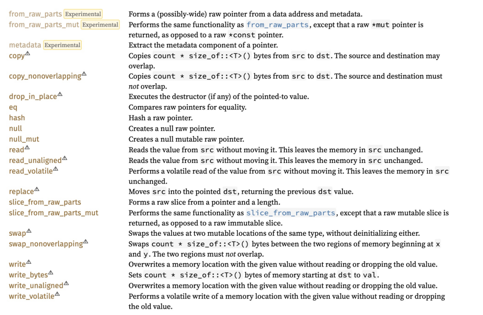
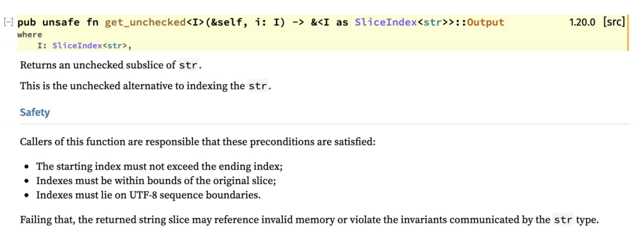
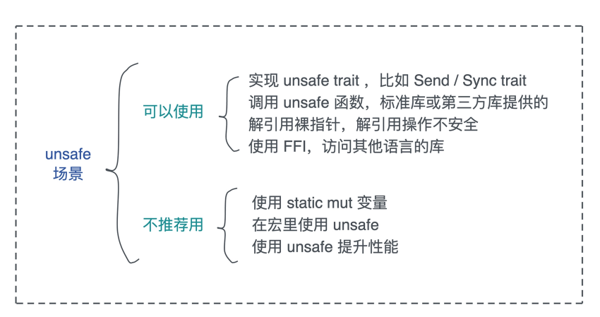

# Unsafe Rust: 如何用C++的方式打开Rust?

到i目前为止, 我们撰写的代码都在Rust精心构造的内存安全的国度里做一个守法公民, 通过遵循所有权, 借用检查, 生命周期等规则, 我们自己的代码一旦编译通过, 就相当于信心满满的向全世界宣布: 这个代码是安全的!

然而, 安全的Rust并不能适应所有的场景

首先, 为了内存安全, Rust所做的这些规则往往是普适性的, 编译器会把一切可疑的代码都严格的禁止掉, 可是, 这种一丝不苟的铁面无情往往会过于严苛, 导致错杀

就好比屋子的主任只会使用钥匙开门, 如果一个人尝试撬门, 那一定是坏人, 正常情况下, 这个逻辑是成立的, 所有尝试撬门的小偷都会被抓获(编译错误); 然而有时候主人丢了要是, 不得不请锁匠开门(unsafe code), 此时是正常诉求, 是可以网开一面的

其次, 无论Rust将其内部的世界构建的多么纯粹和完美, 它总归是要跟不纯粹也不完美的外界打交道, 无论是硬件还是软件

计算机硬件本身是unsafe的, 比如操作IO访问外设, 或者使用汇编指令进行特殊操作(操作CPU或者使用SSE指令集), 这样的操作, 编译器是无法保证内存安全额, 所以我们需要unsafe来告诉编译器要法外开恩

同样的, 当Rust要访问其他语言比如C/C++的库, 因为它们并不满足Rust的安全性要求, 这种跨语言的FFI(Foreign Function Interface), 也是unsafe的

这两种使用unsafe Rust的方式是不得而为之, 所以情有可原, 是我们需要Rust的主要原因之一

还有一大类使用unsafe Rust纯粹是为了性能, 比如略过边界检查, 使用未初始化内存等, 这样的unsafe我们要尽量不用, 除非通过bnchmark发现用unsafe可以解决某些性能瓶颈, 否则使用起来得不偿失, 因为在使用unsafe代码的时候, 我们已经把Rust的内存安全性, 降低到了和C++同等的水平

## 可以使用unsafe的场景

在了解了为什么需要unsafe Rust之后, 我们在来看看日常工作中, 都具体有哪些地方会用到unsafe Rust

我们先看可以使用, 也推荐使用unsafe的场景, 根据重要 / 常用程度, 会依次介绍: 实现unsafe trait, 主要是unsafe trait, 主要是Send / Sync这两个trait, 调用已有的unsafe接口, 对裸指针做解引用, 以及使用FFI

### 实现unsafe trait

Rust里, 名气最大的unsafe代码应该就是Send / Sync这两个trait了:

```rust
pub unsafe auto trait Send {}
pub unsafe auto trait Sync {}
```

相信你对着两个trait非常了解了, 但凡遇到了好并发相关的代码, 尤其是接口的类型声明时, 少不了要使用Send / Sync来约束, 我们也知道, 绝大多数数据结构都实现了Send / Sync, 但有一些例外, 比如Rc / RefCell / 裸指针等

因为Send / Sync是auto trait, 所以大部分情况下, 你自己的数据结构不需要实现Send / Sync, 然而, 当你在数据结构里使用裸指针时, 因为裸指针是没有实现Send / Sync的, 连带你的数据结构也就没有实现Send / Sync, 但很可能你的结构是线程安全的, 你也需要它线程安全

此时, 如果你可以保证它能在线程中安全的移动, 那可以实现Send; 如果可以保证它能在线程中安全的共享也可以去实现Sync, 之前我们讨论过Bytes就在使用裸指针的情况下实现了Send / Sync

```rust
pub struct Bytes {
    ptr: *const u8,
    len: usize,
    // inlined "trait object"
    data: AtomicPtr<()>,
    vtable: &'static Vtable,
}
// Vtable must enforce this behavior
unsafe impl Send for Bytes {}
unsafe impl Sync for Bytes {}
```

但是, 在实现Send / Sync的时候要特备小心, 如果你无法保证数据结构是线程安全的, 错误实现Send / Sync之后会导致程序出现莫名其妙的还不太容易复现的崩溃

比如下面的代码, 强行为Evil实现了Send, 而Evil内部携带的Rc是不允许实现Send的, 这段代码通过实现Send而避免了Rust的并发安全, 使其可以编译通过

```rust
use std::{cell::RefCell, rc::Rc, thread};
#[derive(Debug, Default, Clone)]
struct Evil {
    data: Rc<RefCell<usize>>,
}
// 为 Evil 强行实现 Send，这会让 Rc 整个紊乱
unsafe impl Send for Evil {}
fn main() {
    let v = Evil::default();
    let v1 = v.clone();
    let v2 = v.clone();
    let t1 = thread::spawn(move || {
        let v3 = v.clone();
        let mut data = v3.data.borrow_mut();
        *data += 1;
        println!("v3: {:?}", data);
    });
    let t2 = thread::spawn(move || {
        let v4 = v1.clone();
        let mut data = v4.data.borrow_mut();
        *data += 1;
        println!("v4: {:?}", data);
    });
    t2.join().unwrap();
    t1.join().unwrap();
    let mut data = v2.data.borrow_mut();
    *data += 1;
    println!("v2: {:?}", data);
}
```

然而在运行的时候, 有一定的几率出现崩溃

所以你没有十足的把我, 不宜胡乱实现Send / Sync

既然我们提到了unsafe trait, 你也许会好奇, 什么trait会是unsafe呢? 除了Send / Sync外, 还会有其他的unsafe trait么? 

任何trait, 只要声明成unsafe, 它就是一个unsafe trait, 而一个正常的trait里也可以包含unsafe函数, 我们看下面的代码

```rust
// 实现这个trait的开发者要保证实现的是内存安全
unsafe trait Foo {
    fn foo(&self);
}

trait Bar {
    // 调用这个函数的人要保证调用时安全的
    unsafe fn bar(&self);
}

struct Nonsense;

unsafe impl Foo for Nonsense {
    fn foo(&self) {
        println!("Foo");
    }
}

impl Bar for Nonsense {
    unsafe fn bar(&self) {
        println!("Bar");
    }
}

fn main() {
    let nonsense = Nonsense;
    // 调用者无需关心safety
    nonsense.foo();

    // 调用者需要为safety负责
    unsafe {
        nonsense.bar();
    };
}
```

可以看到, unsafe trait是对trait的实现者的约束, 它告诉trait的实现者: 实现我的时候要小心, 要保证内存安全, 所以实现的时候需要加unsafe关键字

但unsafe trait对于调用者来说, 可以正常调用, 不需要任何unsafe block, 因为这里的safety已经被实现者保证了, 毕竟如果实现者没保证, 调用者也做不了什么来保证safety, 就像我们使用Send / Sync一样

而unsafe fn是函数对调用者的约束, 它告诉函数的调用者: 如果你胡乱使用我, 会带来内存安全的问题, 请妥善使用, 所以调用unsafe fn时, 需要加unsafe block提醒别人注意

再来看一个实现和调用都是unsafe的trait: GlobalAlloc

下面这段代码是在智能指针那一节我们见到过, 通过GlobalAlloc我们已经实现了自己的内存分配器, 因为内存分配器对内存安全性影响很大, 所以实现者需要保证每个实现都是内存安全的, 同时alloc / dealloc这样的方法, 使用不正确的姿势去调用, 也会发现内存安全问题, 所以这两个方法也是unsafe的:

```rust
use std::alloc::{GlobalAlloc, Layout, System};
struct MyAllocator;
unsafe impl GlobalAlloc for MyAllocator {
    unsafe fn alloc(&self, layout: Layout) -> *mut u8 {
        let data = System.alloc(layout);
        eprintln!("ALLOC: {:p}, size {}", data, layout.size());
        data
    }
    unsafe fn dealloc(&self, ptr: *mut u8, layout: Layout) {
        System.dealloc(ptr, layout);
        eprintln!("FREE: {:p}, size {}", ptr, layout.size());
    }
}
#[global_allocator]
static GLOBAL: MyAllocator = MyAllocator;
```

### 调用有的unsafe函数

接下来我们讲unsafe函数, 有些使用, 你会发现, 标准库或者第三方库提供给你的函数本身就标明了unsafe, 比如我们之前为了打印HashMap结构所使用的transmute函数:

```rust
use std::collections::HashMap;
fn main() {
    let map = HashMap::new();
    let mut map = explain("empty", map);
    map.insert(String::from("a"), 1);
    explain("added 1", map);
}
// HashMap 结构有两个 u64 的 RandomState，然后是四个 usize，
// 分别是 bucket_mask, ctrl, growth_left 和 items
// 我们 transmute 打印之后，再 transmute 回去
fn explain<K, V>(name: &str, map: HashMap<K, V>) -> HashMap<K, V> {
    let arr: [usize; 6] = unsafe { std::mem::transmute(map) };
    println!(
        "{}: bucket_mask 0x{:x}, ctrl 0x{:x}, growth_left: {}, items: {}",
        name, arr[2], arr[3], arr[4], arr[5]
    );
    // 因为 std:mem::transmute 是一个 unsafe 函数，所以我们需要 unsafe
    unsafe { std::mem::transmute(arr) }
}
```

前面已经说过, 要调用一个unsafe函数, 你需要使用unsafe block把它包裹起来, 这相当于提醒大奖, 注意这里有unsafe代码!

另一种调用unsafe函数的方法是定义unsafe fn, 然后在这个unsafe fn里调用其他的unsafe fn

如果你阅读一些标准库代码会发现, 有时候同样的功能, Rust会提供unsafe和safe的版本, 比如把`&[u8]`里的数据转换成字符串

```rust
// safe 版本，验证合法性，如果不合法返回错误
pub fn from_utf8(v: &[u8]) -> Result<&str, Utf8Error> {
    run_utf8_validation(v)?;
    // SAFETY: Just ran validation.
    Ok(unsafe { from_utf8_unchecked(v) })
}
// 不验证合法性，调用者需要确保 &[u8] 里都是合法的字符
pub const unsafe fn from_utf8_unchecked(v: &[u8]) -> &str {
    // SAFETY: the caller must guarantee that the bytes `v` are valid UTF-8.
    // Also relies on `&str` and `&[u8]` having the same layout.
    unsafe { mem::transmute(v) }
}
```

安全的`str::from_utf8`内部做了一些检查后, 实际调用了`str::from_utf8_unchecked`, 如果我们不需要做这一层检查, 这个调用可以高效很多(可能是一个量级的区别), 因为unsafe版本就只是一个类型的转换而已

那么这样有两个版本的接口, 我们该如何调用呢?

如果你并不是特别清除, 一定要调用安全的版本, 不要为了性能的优势去调用不安全的版本, 如果你清除的知道, `&[u8]`已经做了检查了, 或者它本身就来源于你从`&str`转换成的`&[u8]`, 现在只不过在转换回去, 那可以调用不安全的版本, 并在注释中注明为什么这里是安全的

### 对裸指针解引用

unsafe trait和unsafe fn的使用就了解到这里啦, 我们再看裸指针, 很多时候, 如果需要进行一些特殊的处理, 我们会把得到的数据转换成裸指针, 别比如刚才的Bytes

裸指针生成的时候无需unsafe, 因为它并没有内存不安全的操作, 但裸指针解引用操作时不安全的, 潜在有风险, 它也需要使用unsafe来明确的告诉编译器, 以及代码的阅读者, 也就是说要使用unsafe block包裹起来

下面是一段对裸指针的解引用

```rust
use std::ops::Add;

fn main() {
    let mut age = 28;

    // 不可变指针
    let r1 = &age as *const i32;

    // 可变指针
    let r2 = &mut age as *mut i32;

    // 使用裸指针, 可以绕过immutable / mutable borrow rule

    // 然而, 对指针解引用需要使用unsafe
    unsafe {
        println!("r1: {}, r2: {}", *r1, *r2);
    }
}

fn immutable_mutable_cant_coexist() {
    let mut age = 19;

    let r1 = &age;
    let r2 = &mut age;

    println!("r1: {}, r2: {}", r1, r2);
}
```

我们i看到, 使用裸指针, 可变指针和不可变指针可以共存, 不像可变引用和不可变引用无法共存, 这是因为裸指针的任何对内存的操作, 无论是`ptr::read` / `ptr::write`, 还是解引用, 都是unsafe的操作, 所以只要读写内存, 裸指针的使用者就需要对内存安全负责

你也许会觉得奇怪, 这里也没有内存不安全的操作啊, 为啥需要unsafe呢? 是的, 虽然在这个例子汇总, 裸指针来源于一个可信的内存地址, 所有的代码都是安全的, 但是下面的代码就是不安全你的, 会导致segment fault(分段错误)

```rust
fn main() {
    // 裸指针指向一个有问题的地址
    let r1 = 0xdeadbeef as *mut u32;
    println!("so far so good!");
    unsafe {
        // 程序崩溃
        *r1 += 1;
        println!("r1: {}", *r1);
    }
}
```

这也是为什么我们在撰写unsafe Rust的时候, 要慎之又慎, 并且咋unsafe代码添加足够的注释来阐述为何你觉得可以保证这段代码的安全

使用裸指针的时候, 大部分的操作都是unsafe的(下图中表三角震惊符号的)



如果你对此感兴趣, 可以查阅`std::ptr`文档

### 使用FFI

最后一种可以使用unsafe的地方时FFI

当Rust要使用其他语言的能力时, Rust编译器并不能保证哪些语言具备内存安全, 所以和第三个语言交互的接口, 一律要使用unsafe, 比如我们调用libc来进行C语言开发数值的malloc/free

```rust
use std::mem::transmute;
fn main() {
    let data = unsafe {
        let p = libc::malloc(8);
        let arr: &mut [u8; 8] = transmute(p);
        arr
    };
    data.copy_from_slice(&[1, 2, 3, 4, 5, 6, 7, 8]);
    println!("data: {:?}", data);
    unsafe { libc::free(transmute(data)) };
}
```

从代码中可以看到, 所有的对libc函数的调用, 都需要使用unsafe block

## 不推荐用unsafe的场景

以上是我们可以使用unsafe的场景, 还有一些场景可以使用unsafe, 但是并不体检, 比如处理未初始化数据, 访问可变静态变量, 使用unsafe提升性能

虽然不推荐, 但是它们作为一种用法, 在标准库和第三方库中还是会出现, 我们即使自己不写, 但是在遇到的时候, 也最好能够读懂它们

### 访问或者修改可变静态变量

首先是可变静态变量, 之前的课程中, 我们见识过全局的static变量, 以及使用lazy_static来声明复杂的static变量, 然而之前遇到的static变量都是不可变的

Rust还支持可变的static变量, 可以使用static mut来声明

显而易见, 全局变量可写, 会潜在有线程不安全的风险, 所以如果你声明static mut变量, 在访问时, 统统需要使用unsafe代码, 一下的代码就使用了static mut, 并试图在两个线程分别改动它, 你可以感受到, 这个代码的危险:

```rust
use std::thread;

static mut COUNTER: usize = 1;

fn main() {
    let t1 = thread::spawn(move || {
        unsafe { COUNTER += 10 };
    });

    let t2 = thread::spawn(move || {
        unsafe { COUNTER *= 10 };
    });

    t2.join().unwrap();
    t1.join().unwrap();

    unsafe {
        println!("COUNTER: {COUNTER}");
    }
}
```

其实我们完全没必要这么做, 对于上面的场景, 我们可以使用AtomicXXX来改进:

```rust
use std::{sync::atomic::{AtomicUsize, Ordering}, thread};

static COUNTER: AtomicUsize = AtomicUsize::new(1);

fn main() {
  let t1 = thread::spawn(move || {
    COUNTER.fetch_add(10, Ordering::SeqCst);
  });

  let t2 = thread::spawn(move || {
    COUNTER.fetch_update(Ordering::SeqCst, Ordering::SeqCst, |v| Some(v * 10)).unwrap();
  });

  t2.join().unwrap();
  t1.join().unwrap();

  println!("COUNTER: {}", COUNTER.load(Ordering::Relaxed));
}
```

有同学可能会问: 如果我的数据结构比较复杂, 无法使用AtomicXXX呢?

如果你需要定义全局的可变状态, 那么, 你还可以使用`Mutex<T>`或者`RwLock<T>`来提供并发安全的写访问, 比如:

```rust
use std::{collections::HashMap, sync::Mutex, thread};

use lazy_static::lazy_static;

// 使用lazy_static初始化复杂的结构
lazy_static! {
  // 使用Mutex / RwLock来提供安全的并发写访问
  static ref STORE: Mutex<HashMap<&'static str, &'static [u8]>> = Mutex::new(HashMap::new());
}

fn main() {
    let t1 = thread::spawn(move || {
        let mut store = STORE.lock().unwrap();
        store.insert("hello", b"world");
    });

    let t2 = thread::spawn(move || {
        let mut store = STORE.lock().unwrap();
        store.insert("goodbye", b"world");
    });

    t2.join().unwrap();
    t1.join().unwrap();

    println!("store: {:?}", STORE.lock().unwrap());
}
```

所以, 我非常不建议你使用static mut, 任何需要使用static mut的地方, 都可以用AtomicXXX / Mutex / RwLock来取代, 千万不要为了一时之快, 给程序种下长远的祸根

### 在宏里使用unsafe

虽然我们并没有介绍宏编程, 但已经很多场合使用过宏了, 宏可以在编译时生成代码

在宏中使用unsafe是非常危险的

首先使用你的宏的开发者, 可能根本不知道unsafe代码的存在; 其次, 含有unsafe代码的宏在使用到的时候, 相当于把unsafe代码注入到当前上下文中, 在不知情的情况下, 开发者到处调用这样的宏, 会导致unsafe代码充斥在系统的各个角落, 不好处理; 最后, 一旦unsafe代码出现问题, 你可能很难找到问题的根本原因

一下是actix_web代码库中欧冠的downcast_dyn宏, 你可以感受到本来就比较晦涩的宏, 根unsafe碰撞在一起

```rust
// Generate implementation for dyn $name
macro_rules! downcast_dyn {
    ($name:ident) => {
        /// A struct with a private constructor, for use with
        /// `__private_get_type_id__`. Its single field is private,
        /// ensuring that it can only be constructed from this module
        #[doc(hidden)]
        #[allow(dead_code)]
        pub struct PrivateHelper(());

        impl dyn $name + 'static {
            /// Downcasts generic body to a specific type.
            #[allow(dead_code)]
            pub fn downcast_ref<T: $name + 'static>(&self) -> Option<&T> {
                if self.__private_get_type_id__(PrivateHelper(())).0
                    == std::any::TypeId::of::<T>()
                {
                    // SAFETY: external crates cannot override the default
                    // implementation of `__private_get_type_id__`, since
                    // it requires returning a private type. We can therefore
                    // rely on the returned `TypeId`, which ensures that this
                    // case is correct.
                    unsafe { Some(&*(self as *const dyn $name as *const T)) }
                } else {
                    None
                }
            }

            /// Downcasts a generic body to a mutable specific type.
            #[allow(dead_code)]
            pub fn downcast_mut<T: $name + 'static>(&mut self) -> Option<&mut T> {
                if self.__private_get_type_id__(PrivateHelper(())).0
                    == std::any::TypeId::of::<T>()
                {
                    // SAFETY: external crates cannot override the default
                    // implementation of `__private_get_type_id__`, since
                    // it requires returning a private type. We can therefore
                    // rely on the returned `TypeId`, which ensures that this
                    // case is correct.
                    unsafe { Some(&mut *(self as *const dyn $name as *const T as *mut T)) }
                } else {
                    None
                }
            }
        }
    };
}
```

所以, 除非你是一个unsafe以及宏编程的老手, 否则不建议这么做

### 使用unsafe提升性能

unsafe代码在很多Rust基础库中有大量使用, 比如哈希表讲到的hashbrown, 如果看它的代码库, 你会发现一共222处使用unsafe

这些unsafe代码, 大多是为了性能而做的妥协

比如下面的代码即使用了SIMDm指令来加速处理

```rust
unsafe {
    // A byte is EMPTY or DELETED iff the high bit is set
    BitMask(x86::_mm_movemask_epi8(self.0) as u16)
}
```

然而, 如果你不是在撰写非常基础的库, 并且这个库处在系统的关键路径上, 很不建议使用unsafe来提升性能

性能是一个系统级的问题, 在你没有解决好架构, 设计, 算法, 网络, 存储等其他问题时, 就来构建某个函数实现细节的性能, 我认为是不妥的, 尤其是试图通过使用unsafe代码, 跳过一些检查来提升性能

要知道, 好的算法和不好的算法可以有数量级上的差异, 而有些时候, 即使你能够使用unsafe代码让局部性能达到最优, 但作为一个整体来看, 这个局部优化可能根本没有意义

所以, 如果你用Rust做Web开发, 做微服务, 做客户端, 很可能都不需要专门撰写unsafe代码来提升性能

## 撰写unsafe代码

了解了unsafe可以使用和不建议使用的具体场景, 最后我们来写一段小小的代码, 看看如果实际工作中, 遇到不得不歇unsafe代码时, 该怎么做

需求是实现一个split函数, 得到一个字符串s, 按照字符sep第一次出现的位置, 把字符串s截成前后两个字符串, 这里当找到字符sep的位置是时, 我们需要使用一个函数, 得到字符开头到pos的子串, 以及从字符sep之后到字符串结尾的子串

要获得这个子串, Rust有安全的get方法, 以及不安全的get_unchecked方法, 正常情况下, 我们应该使用get方法, 但这个实例, 我们就强迫自己使用get_unchecked来跳过检查

先看这个函数的安全性要求:



在遇到unsafe接口时, 我们都应该仔细阅读器安全须知, 然后思考如何能满足它, 如果你对外提供的unsafe函数, 也应该在文档中详细的给出类似的安全须知, 告诉调用者, 怎么样调用函数才算安全

对于split的需求, 我们完全可以满足get_unchecked的安全需求, 以下是实现

```rust
fn main() {
    let mut s = "我爱你!中国".to_string();
    let r = s.as_mut();

    if let Some((s1, s2)) = split(r, '!') {
        println!("s1: {s1}, s2: {s2}");
    }
}

fn split(s: &str, sep: char) -> Option<(&str, &str)> {
    let pos = s.find(sep);
    pos.map(|pos| {
        let len = s.len();
        let sep_len = sep.len_utf8();

        // SAFETY: pos是find得到的, 它位于字符的边界处, 同样pos + sep_len也是如此
        // 所以一下的代码是安全的
        unsafe { (s.get_unchecked(0..pos), s.get_unchecked(pos + sep_len..len)) }
    })
}
```

同样的, 在撰写unsafe代码时调用别人的unsafe函数时, 我们一定要用注释声明代码的安全性, 这样, 别人在阅读我们的代码时, 可以明白为什么此处是安全的, 是符合这个unsafe函数预期的

## 小结

unsafe代码, 是Rust这样的系统级语言必须包含的部分, 当Rust跟硬件, 操作系统, 以及其他语言打交道的时候, unsafe是必不可少的



当我们使用unsafe撰写Rust代码时, 要格外小心, 因为此时编译器已经把内存安全的权限交给了你, 在打开unsafe block的那一刻, 你会获得C/C++代码一般的自由度, 但这个自由背后的代价就是安全性上的妥协

好的unsafe代码, 足够短小, 精简, 质保函不得不包含的内容, unsafe代码是开发者对编译器和其他开发者的一种庄重的承诺

今天讲的内容里的很多代码都是反面素材, 并不建议你大量使用, 尤其是初学者, 那为什么我们还要讲unsafe代码呢? 我们要知道Rust的阴暗面(unsafe rust), 才更容易受得住它光明的一面(safe rust)

