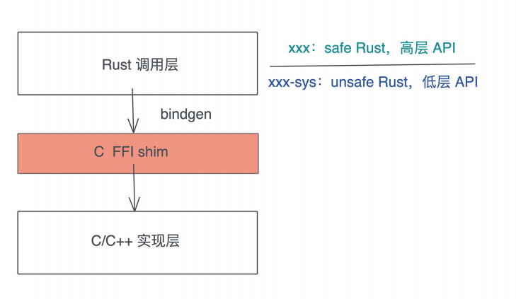
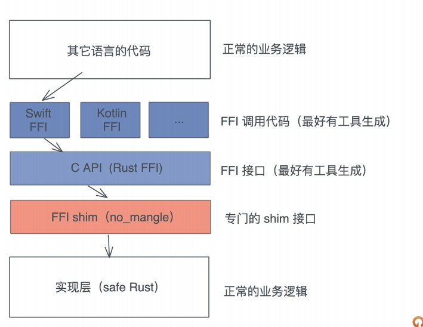
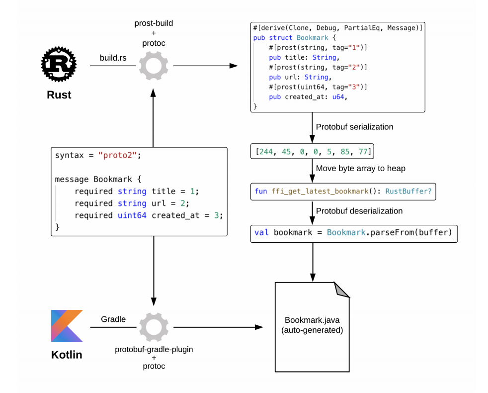

# FFI: Rust如何和你的语言架起沟通的桥梁?

FFI(Foreign Function Interface), 也就是外部函数接口, 或者说语言交互接口, 对于大部分开发者来说, 是一个神秘的存在, 平时可能几乎不会接触到它, 更别说FFI代码了

你是你用的语言生态有很大一部分都是由FFI构建的, 比如你在Python额下使用者NumPy愉快的做着数值计算, 殊不知NumPy的底层细节都是由C构建的; 当你用Rust时, 能开心的使用者OpenSSL为你的HTTP服务保驾护航, 其实底下也是C在处理这一切协议算法

我们现在所处的软件世界, 几乎所有的编程语言都在和C打造出来的生态系统打交道, 所以, 一门语言, 如果能跟C ABI(Application Binary Interfae)处理好关系, 那么就几乎和任何语言互通

当然对于大部分其他语言的开发者来书, 不知道如何和C也无所谓, 因为开源世界里总有前辈替我们铺好前路让我们前进; 对于Rust语言的使用者来说, 让别人铺好路上前进置于, 偶尔我们自己也需要为自己或者为别人铺一铺路, 谁让Rust是一门系统级别的语言呢, 所谓能力越大, 责任越大吗

也正是因为, 当大部分语言都还在吸血C的生态是, Rust在大大方方的极尽所能反哺生态, 比如cloudflare和百度mesalink就分别把纯Rust的HTTP/3实现quiche和TLS实现Rustls, 引入到C/C++生态里, 让C/C++的生态更美好, 更安全

所以现在, 处理C/C++做底层外, 越来越多的库会先用Rust实现, 在构建出对应的Python(pyo3), JavaScript(wasm), NodeJs(neon), Swift(uniffi), Kotlin(uniffi)等实现

所以学习Rust有一个好处就是, 学着学着, 你会发现, 不但能造一大堆轮子给自己用, 还能造一大堆轮子给其他语言用, 并且Rust的生态还很支持和鼓励你造轮子给其他语言用, 于是乎, Java的理想一次撰写, 到处使用, 到Rust这里成一次撰写, 导出调用

说了这么多, 你是不是已经非常好奇Rust FFI能力到底如何? 其实之前我们已经见识冰山一角, 几天我们就来更管饭的学一下Rust如何跟你的语言构架起来沟通的桥梁

## Rust调用C的库

首先看Rust和C/C++的互操作, 一般而言, 当看到一个C/C++库, 我们想在Rust中使用它的时候, 可以先撰写一些简单的shim代码, 把想要暴露出来的接口暴露出来, 然后使用bindgen来生成对应的Rust FFI代码

bindgen会生成底层的Rust API, Rust下约定俗成的方式是将使用bindgen的crate命名为xxx-sys, 里面包含因为FFI而导致的大量unsafe代码, 然后在这个基础上生成xxx crate, 用更高层的代码封装这些底层的代码, 为其他Rust开发者提供一套感觉更加Rusty的代码

比如, 围绕着低层的数据结构和函数, 提供Rust自己的struct / enum / trait接口



我们以使用bindgen来封装用于压缩/解压缩的bz2为例, 看看Rust如何调用C的库

首先创建一个项目, 在Cargo.toml文件中添加依赖:

```toml
[package]
name = "bzlib-sys"
version = "0.1.0"
edition = "2021"

[dependencies]
anyhow = "1.0.94"

[build-dependencies]
bindgen = "0.71.1"

```

其中bindgen需要在编译期使用, 所以我们在根目录下创建一个build.rs文件使其在编译期运行:

```rust
fn main() {
    // 告诉rustc 需要link bzip2
    println!("cargo:rustc-link-lib=bz2");

    // 告诉cargo当wrapper.h变化时重新运行
    println!("cargo:rerun-if-changed=wrapper.h");

    // 配置bindgen, 并生成Bindings结构
    let bindings = bindgen::Builder::default()
        .header("wrapper.h")
        .parse_callbacks(Box::new(bindgen::CargoCallbacks))
        .generate()
        .expect("Unable to generate bindings");

    // 生成Rust代码
    bindings
        .write_to_file("src/bindings.rs")
        .expect("Failed to write bindings");
}
```

在build.rs里, 引入了一个wrapper.h, 我们在根目录创建它, 并引用bzlib.h:

```h
#include <bzlib.h>
```

此时运行cargo run, 会在src目录下生成`src/bindings.rs`里面大概有几千行代码, 是binggen根据bzlib.h中暴露的常量定义, 数据结构和函数等生成的Rust代码

有了生成好的代码, 我们在`src/lib`下引用它:

```rust
// 生成的 bindings 代码根据 C/C++ 代码生成，里面有一些不符合 Rust 约定，我们不让编译期报警
#![allow(non_upper_case_globals)]
#![allow(non_camel_case_types)]
#![allow(non_snake_case)]
#![allow(deref_nullptr)]
use anyhow::{anyhow, Result};
use std::mem;
mod bindings;
pub use bindings::*;
```

接下来我们撰写两个高阶的接口compress / decompress, 正常情况下应该创建另一个crate来撰写这样的接口, 之前讲这是Rust处理FFI的惯例, 有助于把高阶接口和低阶接口分离, 在这里, 我们就直接写在`src/lib`中

```rust
// 高层的 API，处理压缩，一般应该出现在另一个 crate
pub fn compress(input: &[u8]) -> Result<Vec<u8>> {
    let output = vec![0u8; input.len()];
    unsafe {
        let mut stream: bz_stream = mem::zeroed();
        let result = BZ2_bzCompressInit(&mut stream as *mut _, 1, 0, 0);
        if result != BZ_OK as _ {
            return Err(anyhow!("Failed to initialize"));
        }
        // 传入 input / output 进行压缩
        stream.next_in = input.as_ptr() as *mut _;
        stream.avail_in = input.len() as _;
        stream.next_out = output.as_ptr() as *mut _;
        stream.avail_out = output.len() as _;
        let result = BZ2_bzCompress(&mut stream as *mut _, BZ_FINISH as _);
        if result != BZ_STREAM_END as _ {
            return Err(anyhow!("Failed to compress"));
        }
        // 结束压缩
        let result = BZ2_bzCompressEnd(&mut stream as *mut _);
        if result != BZ_OK as _ {
            return Err(anyhow!("Failed to end compression"));
        }
    }
    Ok(output)
}
// 高层的 API，处理解压缩，一般应该出现在另一个 crate
pub fn decompress(input: &[u8]) -> Result<Vec<u8>> {
    let output = vec![0u8; input.len()];
    unsafe {
        let mut stream: bz_stream = mem::zeroed();
        let result = BZ2_bzDecompressInit(&mut stream as *mut _, 0, 0);
        if result != BZ_OK as _ {
            return Err(anyhow!("Failed to initialize"));
        }
        // 传入 input / output 进行压缩
        stream.next_in = input.as_ptr() as *mut _;
        stream.avail_in = input.len() as _;
        stream.next_out = output.as_ptr() as *mut _;
        stream.avail_out = output.len() as _;
        let result = BZ2_bzDecompress(&mut stream as *mut _);
        if result != BZ_STREAM_END as _ {
            return Err(anyhow!("Failed to compress"));
        }
        // 结束解压缩
        let result = BZ2_bzDecompressEnd(&mut stream as *mut _);
        if result != BZ_OK as _ {
            return Err(anyhow!("Failed to end compression"));
        }
    }
    Ok(output)
}
```

最后, 不要忘了我们的好习惯, 写个测试确保工作正常

```rust
#[cfg(test)]
mod tests {
    use super::*;
    #[test]
    fn compression_decompression_should_work() {
        let input = include_str!("bindings.rs").as_bytes();
        let compressed = compress(input).unwrap();
        let decompressed = decompress(&compressed).unwrap();
        assert_eq!(input, &decompressed);
    }
}
```

运行cargo test, 测试能够正常通过, 你可以看到, 生成的bindings.rs里也有不少测试, cargo test总共执行了16个测试

怎么样, 我们总共写了大概100行代码, 就用Rust继承了bz2这个C库, 是不是很方便? 如果你曾经处理过其他语言类似的C绑定, 就会发现用Rust做FFI开发真实太方便了

如果你觉得这个例子过于简单, 你可以看看Rust中RocksDB的实现, 它非常适合你进一步了解复杂的, 需要额外集成C源码的库如何集成到Rust中

## 处理FFI的注意事项

bindgen这样的工具, 帮我们干了很多脏活累活, 虽然大部分的时候我们不太需要关心生成的FFi代码, 但在使用它们构建更高层的API时, 需要注意三个关键问题

- 如果处理数据结构的差异
  - 比如C string是NULL结尾, 而Rust String是完全不同的结构, 我们要清除数据结构在内存中组织的差异, 才能std::ffi来处理这样的问题, 比如CStr和CString来处理字符串
- 谁来释放内存
  - 没有特殊的情况, 谁分配的内存, 谁要释放, Rust的内存分配器和其他语言的可能不一样, 所以, Rust分配的内存在C的上下文中释放, 可能会导致未定义的错误
- 如何错误处理
  - 在上面的代码中我们也看到了, C通过返回的error code来报告执行过程中错误, 我们使用了anyhow!宏随手生成了错误, 这是不好的示例, 在正式的代码中, 应该使用thiserror或者类似的机制来定义所有的error code对应的错误情况, 然后相应的生成错误

## Rust调用其他语言

目前说了半天, 都是再说Rust如何调用C/C++, 那么Rust调用其他语言呢?

前面也提到了, 因为C ABI深入人心,. 两门语言之间的接口往往采用C ABI, 从这个角度来说, 如果我们需要Rust调用Golang的代码(先不管合不合理), 那么首先把Golang的代码使用cgo编译成兼容C的库; 然后Rust就可以像调用C/C++那样使用bindgen来生成对应的API了

至于把Rust调用其他语言, 也是类似, 只不过像JavaScript / Python这样的与其把他们编译成C库, 不如过把他们的解释器编译成C库或者WASM, 然后在Rust里调用其解释器使用相关的代码, 来的方便和痛快, 比如JavaScript / Python是脚本语言

## 把Rust代码编译成C库

讲完Rust如何使用其他语言, 我们再来看看如何把Rust编译成符合C ABI的库, 这样其他语言就可以像使用C那样使用Rust了

这里的处理逻辑和上面的Rust调用C是类似的, 只不过是角色对调了一下



要把Rust代码和数据结构提供给C使用, 我们首先要构造相应的Rust shim成, 把原有的, 正常的Rust代码实现封装一下, 便于C调用

Rust shim主要做四件事情:

- 提供Rust方法, trait方法等公开接口的独立函数, 注意C是不支持泛型的, 所以对于泛型函数需要提供具体的用于某个类型的shim类型
- 所有要暴露给C的独立函数, 都要声明成`#[no_mangle]`, 不做函数名称的改写
  - 如果不用`#[no_mangle]`, Rust编译器会为函数生成很复杂的名字, 我们很难在C中得到正确的改写后的名字, 同时, 这些函数的接口要使用C兼容的数据结构
- 数据结构需要处理成和C兼容的结构
  - 如果是你定义的结构体, 需要使用`#[repr]`, 对于要暴露给C的函数, 不能使用`String / Vec / Result`这些C无法正确操作的数据结构
- 要使用catch_unwind把所有可能发生的panic!的代码包裹起来
  - 切记, 其他语言调用Rust时, 遇到Rust的panic!, 会导致未定义的行为, 所以在FFI的边界处, 要catch_unwind, 阻止Rust栈回溯跑出Rust的世界

来看个例子:

```rust
// 使用 no_mangle 禁止函数名改编，这样其它语言可以通过 C ABI 调用这个函数
#[no_mangle]
pub extern "C" fn hello_world() -> *const c_char {
    // C String 以 "\\0" 结尾，你可以把 "\\0" 去掉看看会发生什么
    "hello world!\\0".as_ptr() as *const c_char
}
```

这段代码使用了`#[no_mangle]`, 在传回去字符串时使用"\0"结尾的字符串, 由于这个字符串在RODATA段, 是static生命周期, 所以将其转换成裸指针返回, 没有问题, 如果这段代码编译为一个可用的C库, 在Cargo.toml中, crate类型要设置为`crate-type = ["cdylib"]`

刚才那个例子太简单了, 我们再来看一个进阶的例子, C语言那端传过来一个字符串指针, format!一下, 返回一个字符串指针

```rust
#[no_mangle]
pub extern "C" fn hello_bad(name: *const c_char) -> *const c_char {
    let s = unsafe { CStr::from_ptr(name).to_str().unwrap() };
    format!("hello {}!\\0", s).as_ptr() as *const c_char
}
```

你能发现这段代码的问题吗? 它犯了初学者几乎会犯的所有问题

首先传入的name会不会是一个NULL指针? 是不是一个合法的地址? 虽然是否是合法的地址我们无法检测, 但起码我们可以检测NULL

其次, unwrap会造成panic!, 如果把CStr转换成&str的时候出错, 这个panic就会造成未定义的行为, 我们可以做catch_unwind, 但更好的方式是进行错误处理最后format生成了一个字符串结构, as_ptr取到它堆上的其实位置, 我们也保证了堆上内存以NUL结尾, 看上去没有什么问题, 然而, 在这个函数执行时, 由于字符串s退出作用域, 所以它的堆内存会被连带drop掉, 因此这个函数返回的是一个悬空指针, 在C那侧调用就会崩溃掉

所以, 正确的写法应该是:

```rust
#[no_mangle]
pub extern "C" fn hello(name: *const c_char) -> *const c_char {
    if name.is_null() {
        return ptr::null();
    }
    if let Ok(s) = unsafe { CStr::from_ptr(name).to_str() } {
        let result = format!("hello {}!", s);
        // 可以使用 unwrap，因为 result 不包含 \\0
        let s = CString::new(result).unwrap();
        s.into_raw()
        // 相当于：
        // let p = s.as_ptr();
        // std::mem::forget(s);
        // p
    } else {
        ptr::null()
    }
}
```

在这段代码中, 我们检查了NULL指针, 进行了错误处理, 还用into_raw来让Rust放弃对内存的所有权

注意前面的三个关键问题说过, 谁分配的内存, 谁来释放, 所以,我们还要提供另一个函数, 供C语言使用, 来释放Rust分配的字符串

```rust
#[no_mangle]
pub extern "C" fn free_str(s: *mut c_char) {
    if !s.is_null() {
        unsafe { CString::from_raw(s) };
    }
}
```

C代码必须要调用这个接口安全释放Rust创建的CString, 如果不调用, 会有内存泄露; 如果使用C自己的free, 会导致未定义的错误

有人可能会好奇, `CString::from_raw(s)`只是从裸指针中恢复出来CString, 也没有释放啊?

你要习惯这样的释放内存写法, 因为它实际上借助了Rust的所有权机制: 当所有者离开作用域时, 拥有的内存会被释放, 这里我们创建一个有所有权的对象, 就是为了函数结束的时候自动释放, 如果你看标准库或者第三方库, 经常有类似释放内存的代码

上面的hello代码, 其实还不够安全, 因为虽然看上去没有使用任何会导致直接或者间接panic!的代码, 但难保代码复杂后, 隐式的调用panic, 比如如果以后我们新加一些逻辑, 使用了copy_from_slice, 这个函数内部会调用panic!, 就会导致问题, 所以最好的方法把主要的逻辑封装在catch_unwind里

```rust
#[no_mangle]
pub extern "C" fn hello(name: *const c_char) -> *const c_char {
    if name.is_null() {
        return ptr::null();
    }
    let result = catch_unwind(|| {
        if let Ok(s) = unsafe { CStr::from_ptr(name).to_str() } {
            let result = format!("hello {}!", s);
            // 可以使用 unwrap，因为 result 不包含 \\0
            let s = CString::new(result).unwrap();
            s.into_raw()
        } else {
            ptr::null()
        }
    });
    match result {
        Ok(s) => s,
        Err(_) => ptr::null(),
    }
```

写好Rust shim代码后, 接下来就是生成C的FFI接口了, 一般来说这个环节可以用工具来自动生成, 我们可以使用cbindgen, 使用cbindgen, 上述的代码会生成类似的这样的bindings.h

```rust
#include <cstdarg>
#include <cstdint>
#include <cstdlib>
#include <ostream>
#include <new>
extern "C" {
    const char *hello_world();
    const char *hello_bad(const char *name);
    const char *hello(const char *name);
    void free_str(char *s);
} // extern "C"
```

有了编译好的库代码以及头文件之后, 在其他语言中, 就可以用该语言的工具进一步生成那么语言的FFI绑定了, 然后正常使用

## 和其他语言的互操作

搞明白Rust代码如何编译成C库提供C/C++和其他语言使用, 我们在看看具体语言有没有额外的工具更方便的和Rust做交互

对于Python和Node.js, 我们之前已经见到了PyO3和Neon这两个库, 用起来都非常简单直观

对于Erlang / Elixir可以使用非常不出oderustler, 如果你对此感兴趣, 可以去搜索一下

对于C++, 虽然cbindgen就足够了, 但社区里还有cxx, 它可以帮助我们很方便的对Rust和C++进行交互

如果你要做Kotlin / Swift开发, 可以尝试一下mozila用在生产环境下的uniffi, 使用uniffi, 你需要定义一个UDL, 这样uniffi-bindgen会帮助你生成各种各样的FFI代码

## FFI的其他方式

最后, 我们来简单聊一聊处理FFI的其他方式, 其实代码的跨语言共享并非只有FFI一条路子, 你也可以使用REST API, gRPC来达到代码跨语言使用的目的, 不过这样要额外的走一圈网络, 效率太低

我们可以在两个语言中使用protobuf来序列化 / 反序列化要传递的数据, 在Mozilla的一篇文章中提到了这种方法



## 小结

FFI是Rust又一个领先地位的领域

从这一讲的实例中我们可以看到, 在支持很方便的使用C/C++社区的成果外, Rust也可以非常方便的在很多地方取代C/C++, 称为其他语言使用底层库的首选, 除了方便FFI接口和工具链, 使用Rust为其他语言提供底层支持, 其实还是安全性这个杀手锏

比如在Erlang / Elixir社区, 高性能的底层NIF代码,如果用C/C++编写的话, 一个不小心就可能导致整个VM的崩溃; 但是使用Rust撰写, 因为其严格的内存安全保证(只要保证unsafe代码的正确性), NIF不会导致VM的崩溃

所以现在Rust越来越收到各个高级语言的青睐, 用来开发高性能的底层库

榆次同时, 当需要开发跨域多个端的公共库时, 使用Rust也会是一个好的选择, 我们在前面的内容中也看到了用uniffi为Android和IOS构建公共代码是多么简单的一件事

