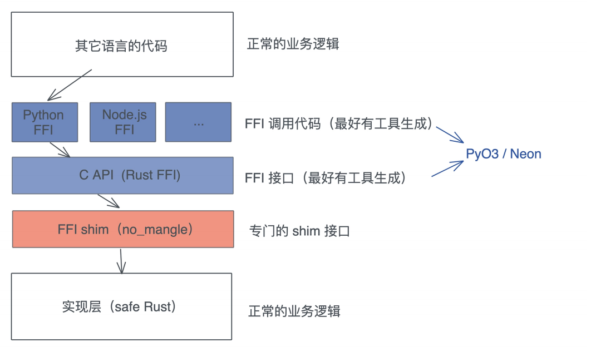

# 实操项目: 使用Pyo3开发Python3模块

上一节我们讲了FFI的基本操作, 今天就趁热打铁来做个实操项目, 体验一下如何把Rust优秀的生态介绍到Python/Node.js社区

由于社区里面已经有Pyo3和Neon这样的工具, 我们并不需要处理Rust代码兼容C ABI的细节, 这些工具就可以直接处理, 所以, 我们今天会主要撰写FFI shim这一层代码:



另外, Pyo3和Neon的基本操作都是一样的, 你会用一个, 另一个的使用也就很容易理解了, 这一讲我们以Pyo3为例

那么, 做个什么库给Python呢?

我觉得Python社区可以内嵌在程序中的搜索引擎, 目前还是一块短板, 我所知道的whoosh已经很多年没有更新了, pylucene需要再Python里运行一个JVM, 总是让人有种说不出的不舒服, 虽然Nodejs的flexsearch看起来不错, 但整体来说, 这两个社区都需要有更强大的搜索引擎

Rust下, 内嵌式的搜索引擎有tantivy, 我们就使用它来提供搜索引擎的功能

不过, tanvity的接口比较复杂, 今天的主题也不是学习如何使用一个搜索引擎的接口, 所以我做了个基于tanvity的crate xunumi提供一套非常简单的接口, 我们的目标就是: 为这些接口提供对应Python接口, 并且让使用起来的感觉和Python一致

下面是xunmi用Rust调用的例子:

```rust
use std::{str::FromStr, thread, time::Duration};
use xunmi::*;
fn main() {
    // 可以通过 yaml 格式的配置文件加载定义好的 schema
    let config = IndexConfig::from_str(include_str!("../fixtures/config.yml"))
    // 打开或者创建 index
    let indexer = Indexer::open_or_create(config).unwrap();
    // 要 index 的数据，可以是 xml / yaml / json
    let content = include_str!("../fixtures/wiki_00.xml");
    // 我们使用的 wikipedia dump 是 xml 格式的，所以 InputType::Xml
    // 这里，wikipedia 的数据结构 id 是字符串，但 index 的 schema 里是 u64
    // wikipedia 里没有 content 字段，节点的内容（$value）相当于 content
    // 所以我们需要对数据定义一些格式转换
    let config = InputConfig::new(
        InputType::Xml,
        vec![("$value".into(), "content".into())],
        vec![("id".into(), (ValueType::String, ValueType::Number))],
    );
    // 获得 index 的 updater，用于更新 index
    let mut updater = indexer.get_updater();
    // 你可以使用多个 updater 在不同上下文更新同一个 index
    let mut updater1 = indexer.get_updater();
    // 可以通过 add / update 来更新 index，add 直接添加，update 会删除已有的 doc
    // 然后添加新的
    updater.update(content, &config).unwrap();
    // 你可以添加多组数据，最后统一 commit
    updater.commit().unwrap();
    // 在其他上下文下更新 index
    thread::spawn(move || {
        let config = InputConfig::new(InputType::Yaml, vec![], vec![]);
        let text = include_str!("../fixtures/test.yml");
        updater1.update(text, &config).unwrap();
        updater1.commit().unwrap();
    });
    // indexer 默认会自动在每次 commit 后重新加载，但这会有上百毫秒的延迟
    // 在这个例子里我们会等一段时间再查询
    while indexer.num_docs() == 0 {
        thread::sleep(Duration::from_millis(100));
    }
    println!("total: {}", indexer.num_docs());
    // 你可以提供查询来获取搜索结果
    let result = indexer.search("历史", &["title", "content"], 5, 0).unwrap();
    for (score, doc) in result.iter() {
        // 因为 schema 里 content 只索引不存储，所以输出里没有 content
        println!("score: {}, doc: {:?}", score, doc);
    }
}
```

以下是索引的配置文件的样子:

```yml
path: /tmp/searcher_index # 索引路径
schema: # 索引的 schema，对于文本，使用 CANG_JIE 做中文分词
	name: id
	type: u64
	options:
		indexed: true
		fast: single
		stored: true
	name: url
	type: text
	options:
		indexing: ~
		stored: true
	name: title
	type: text
	options:
		indexing:
		record: position
		tokenizer: CANG_JIE
		stored: true
	name: content
	type: text
	options:
		indexing:
		record: position
		tokenizer: CANG_JIE
		stored: false # 对于 content，我们只索引，不存储
text_lang:
	chinese: true # 如果是 true，自动做繁体到简体的转换
writer_memory: 100000000
```

目标是. 使用Pyo3让Rust代码可以这样在Python中使用

首先创建项目xunmi-py, 在toml文件中添加如下内容:

```rust
[package]
name = "xunmi-py"
version = "0.1.0"
edition = "2021"

[lib]
name = "xunmi_py"
crate-type = ["cdylib"]

[dependencies]
pyo3 = { version = "0.23.3", features = ["extension-module"] }
serde_json = "1.0.133"
xunmi = "0.2.1"

[build-dependencies]
pyo3-build-config = "0.23.3"
```

要定义好lib的名字和类型, lib的名字, 我们就定义成xunmi, 这样在Python中import的时候就用这个名称; crate-type是cdylib, 我们需要pyo3-build-config这个crate来做编译时的一些简单处理(macOS需要)

## 准备工作

接下来在写代码之前, 还要做一些准备工作, 主要是build脚本和Makefile, 让我们能方便的生成Python库

创建build.rs并输入

```rust
fn main() {
    println!("cargo:rerun-if-changed=build.rs");
    pyo3_build_config::add_extension_module_link_args();
}
```

它会在编译的时候添加一些编译选项, 如果你不想用build.rs来额外处理, 也可以创建`.cargo/config`然后添加:

```
[target.x86_64-apple-darwin]
rustflags = [
	"-C", "link-arg=-undefined",
	"-C", "link-arg=dynamic_lookup",
]
```

二者的作用是等价的

然后我们创建一个目录xunmi, 在创建`xunmi/_init_.py`填入:

```python
from .xunmi import *
```

最后创建一个Makefile, 填入:

```makefile
# 乳沟你的BUILD_DIR不同, 可以make BUILD_DIR=<your-dir>
BUILD_DIR := C:\Users\28304\Desktop\rust-basics\04_进阶篇\code\xunmi-py\lib

SRCS := ${wildcard src/*.rs} Cargo.toml
NAME = xunmi
TARGET = lib${NAME}
BUILD_FILE = ${BUILD_DIR}/${TARGET}.dylib
BUILD_FILE1 = ${BUILD_DIR}/${TARGET}.so
TARGET_FILE = ${NAME}/${NAME}.so

all: ${TARGET_FILE}

test: ${TARGET_FILE}
	python3 -m pytest

$(TARGET_FILE): $(BUILD_FILE1)
	@cp &(BUILD_FILE1) $(TARGET_FILE)

$(BUILD_FILE1): $(SRCS)
	@cargo build --release
	@mv $(BUILD_FILE) $(BUILD_FILE1) || true

PHONY: test all
```

这个Makefile可以帮我们自动化一些工作, 基本上, 就是把编译出来的.dylib或者.so拷贝到xunmi目录下, 被python使用

## 撰写代码

接下来就是如何撰写FFI shim代码了, Pyo3为我们提供了一系列的宏, 可以很方便的把Rust的数据结构, 函数, 数据结构的方法, 以及错误类型, 映射成Python的类, 函数, 类的方法, 以及异常, 我们一个个看:

### 将Rust struct注册为Python class

之前我们简单介绍过函数是如何被引入到pymodule中的

```rust
use pyo3::{exceptions, prelude::*};
#[pyfunction]
pub fn example_sql() -> PyResult<String> {
    Ok(queryer::example_sql())
}
#[pyfunction]
pub fn query(sql: &str, output: Option<&str>) -> PyResult<String> {
    let rt = tokio::runtime::Runtime::new().unwrap();
    let data = rt.block_on(async { queryer::query(sql).await.unwrap() });
    match output {
        Some("csv") | None => Ok(data.to_csv().unwrap()),
        Some(v) => Err(exceptions::PyTypeError::new_err(format!(
            "Output type {} not supported",
            v
        ))),
    }
}
#[pymodule]
fn queryer_py(_py: Python, m: &PyModule) -> PyResult<()> {
    m.add_function(wrap_pyfunction!(query, m)?)?;
    m.add_function(wrap_pyfunction!(example_sql, m)?)?;
    Ok(())
}
```

使用了`#[pymodule]`宏, 来提供python module入口函数, 它负责注册整个module下的类和函数, 通过m.add_function可以注册函数, 之后在Python里就可以这么调用

```rust
import queryer_py
queryer_py.query("select * from file:///test.csv")
```

不过我们今日要做的事情远比之前的使用要复杂, 比如说这两门语言中如何传递数据, 让Python类可以使用Rust的方法等, 所以需要注册一些类以及对应的类方法

看上文中的使用截图中的一些代码:

```python
from xunmi import *
indexer = Indexer("./fixtures/config.yml")
updater = indexer.get_updater()
f = open("./fixtures/wiki_00.xml")
data = f.read()
f.close()
input_config = InputConfig("xml", [("$value", "content")], [("id", ("string",
                                                                    updater.update(data, input_config)
                                                                    updater.commit()
                                                                    result = indexer search("历史" ["title" "content"] 5 0)
```

你会发现, 我们需要注册Indexer, IndexUpdater和InputConfig这三个类, 它们都有自己的成员函数, 其中Indexer和InputConfig还要有类的构造函数

但是因为xunmi是xunmi-py外部引入的一个crate, 我们无法直接动xunmi的数据结构, 把这几个类注册进去, 怎么办? 我们需要封装一下

```rust
use pyo3::{exceptions, prelude::*};
use xunmi::{self as x};

#[pyclass]
pub struct Indexer(x::Indexer);

#[pyclass]
pub struct InputConfig(x::IndexConfig);

#[pyclass]
pub struct IndexUpdater(x::IndexUpdater);
```

这里有个小技巧, 可以把xunmi的命名空间临时改变x, 这样xunmi自己的结构用x::引用, 就不会有命名冲突了

有了这三个定义, 我们就可以通过m.add_class把他们引入到模块中了:

```rust
#[pymodule]
fn xunmi_py(_py: Python, m: &Bound<'_, PyModule>) -> PyResult<()> {
    m.add_class::<Indexer>()?;
    m.add_class::<InputConfig>()?;
    m.add_class::<IndexUpdater>()?;
    Ok(())
}
```

注意, 这里的函数名要和crate lib name一致, 如果这你没有定义的lib name, 默认会使用crate name, 我们为了区别, crate name使用了xunmi-py, 所以在前面在Cargo.toml中会单独声明lib name

### 把struct的方法暴露给class的方法

注册好Python的类, 继续写功能上的实现, 基本上是shim代码, 也就是把xunmi里对应的数据结构的方法暴露给Python, 先看个简单的, IndexUpdater的实现

```rust
#[pymethods]
impl IndexUpdater {
    pub fn add(&mut self, input: &str, config: &InputConfig) -> PyResult<()> {
        Ok(self.0.add(input, &config.0).map_err(to_pyerr)?)
    }

    pub fn update(&mut self, input: &str, config: &InputConfig) -> PyResult<()> {
        Ok(self.0.update(input, &config.0).map_err(to_pyerr)?)
    }

    pub fn commit(&mut self) -> PyResult<()> {
        Ok(self.0.commit().map_err(to_pyerr)?)
    }

    pub fn clear(&mut self) -> PyResult<()> {
        Ok(self.0.clear().map_err(to_py_err)?)
    }
}
```

首先, 需要用`#[pymethods]`来包裹`impl IndexUpdater {}`, 这样里面所有的pub方法都可以在Python侧使用, 我们暴露了add / update / commit / clear这几个方法, 方法的签名正常撰写就可以了, Rust的基本类型都能通过Pyo3对应到Python, 使用到的InputConfig之前也注册成Python class了

所以, 通过这些方法, 一个Python用户就可以轻松地在Python侧生成字符串, 生成InputConfig类, 然后传给update函数, 交给Rust侧处理, 比如这样

```rust
f = open("./fixtures/wiki_00.xml")
data = f.read()
f.close()
input_config = InputConfig("xml", [("$value", "content")], [("id", ("string",
updater.update(data, input_config)
```

### 错误处理

还记得上一讲强调的三个点吗, 在写FFI的时候要注意Rust的错误处理, 这里所有的函数如果要返回`Result<T, E>`, 需要使用`Python<T>`你原本的错误类型需要处理一下, 变成Python错误

我们可以用map_err处理, 其中to_pyerr的实现如下:

```rust
pub(crate) fn to_pyerr<E: ToString>(err: E) -> PyErr {
    exceptions::PyValueError::new_err(err.to_string())
}
```

通过使用Pyo3提供的PyValueError, 在Rust侧生成的err, 会被Pyo3转换成Python侧的异常, 比如我们在创建indexer时提供一个不存在config:

```bash
In [3]: indexer = Indexer("./fixtures/config.ymla")
---------------------------------------------------------------------------
ValueError Traceback (most recent call last)
<ipython-input-3-bde6b0e501ea> in <module>
----> 1 indexer = Indexer("./fixtures/config.ymla")
ValueError: No such file or directory (os error 2)
```

即使你再Rust侧使用了panic!, Pyo3也有很好的处理:

```bash
In [3]: indexer = Indexer("./fixtures/config.ymla")
---------------------------------------------------------------------------
PanicException Traceback (most recent call last)
<ipython-input-11-082d933e67e2> in <module>
----> 1 indexer = Indexer("./fixtures/config.ymla")
2 updater = indexer.get_updater()
PanicException: called `Result::unwrap()` on an `Err` value: Os { code: 2, kin
```

它也是在Python侧抛出一个异常

### 构造函数

接着看看Indexer怎么实现:

```rust
#[pymethods]
impl Indexer {
    // 创建或者载入index
    #[new]
    pub fn open_or_create(filename: &str) -> PyResult<Indexer> {
        let content = fs::read_to_string(filename).unwrap();
        let config = x::IndexConfig::from_str(&content).map_err(to_pyerr)?;
        let indexer = x::Indexer::open_or_create(config).map_err(to_pyerr)?;
        Ok(Indexer(indexer))
    }

    // 获取 updater
    pub fn search(
        &self,
        query: String,
        fields: Vec<String>,
        limit: usize,
        offset: Option<usize>,
    ) -> PyResult<Vec<(f32, String)>> {
        let default_fields: Vec<_> = fields.iter().map(|s| s.as_str()).collect();
        let data: Vec<_> = self
            .0
            .search(&query, &default_fields, limit, offset.unwrap_or(0))
            .map_err(to_pyerr)?
            .into_iter()
            .map(|(score, doc)| (score, serde_json::to_string(&doc).unwrap()))
            .collect();

        Ok(data)
    }

    // 重新加载index
    pub fn reload(&self) -> PyResult<()> {
        self.0.reload().map_err(to_pyerr)
    }
}
```

你看, 我们可以使用`#[new]`来标记要成为构造函数的方法, 所以在Python侧, 当你调用:

```python
indexer = Indexer("./fixtures/config.yml")
```

其实, 它在Rust侧就可以调用open_or_crate方法, 把某个用来构造数据结构的方法, 标记为一个构造函数, 可以让Python用户感觉用起来更加自然

### 缺省参数

最后来看看缺省参数的实现, Python支持缺省参数, 但Rust不支持缺省参数, 相当于传给Rust一个None, Rust侧就可以根据None来使用缺省值, 比如下面InputConfig的实现:

```rust
#[pymethods]
impl IndexConfig {
    #[new]
    fn new(
        input_type: String,
        mapping: Option<Vec<(String, String)>>,
        conversion: Option<Vec<(String, (String, String))>>,
    ) -> PyResult<Self> {
        let input_type = match input_type.as_ref() {
            "yaml" | "yml" => x::InputType::Yaml,
            "json" => x::InputType::Json,
            "xml" => x::InputType::Xml,
            _ => return Err(exceptions::PyValueError::new_err("Invalid input type")),
        };

        let conversion = conversion
            .unwrap_or_default()
            .into_iter()
            .filter_map(|(k, (t1, t2))| {
                let t = match (t1.as_ref(), t2.as_ref()) {
                    ("string", "number") => (x::ValueType::String, x::ValueType::Number),
                    ("number", "string") => (x::ValueType::Number, x::ValueType::String),
                };

                Some((k, t))
            })
            .collect::<Vec<_>>();

        Ok(Self(x::IndexConfig::new(
            input_type,
            mapping.unwrap_or_default(),
            conversion,
        )))
    }
}
```

这段代码就是典型的shim代码, 它就是把接口包装成更简单的形式提供共Python, 然后内部做转换适配原本的接口

在Python侧, 的那个mapping或者conversion不需要时, 可以不提供, 这里我们使用unwrap_or_default来得到缺省值(对`Vec<T>`来说就是`vec![]`), 这样在Python侧这么调用都是合法的

```rust
input_config = InputConfig("xml", [("$value", "content")], [("id", ("string",
input_config = InputConfig("xml", [("$value", "content")])
input_config = InputConfig("xml")
```

## 完整代码

```rust
use std::{fs, str::FromStr, vec};

use pyo3::{exceptions, prelude::*};
use xunmi::{self as x, IndexConfig};

pub(crate) fn to_pyerr<E: ToString>(err: E) -> PyErr {
    exceptions::PyValueError::new_err(err.to_string())
}

#[pyclass]
pub struct Indexer(x::Indexer);

#[pymethods]
impl Indexer {
    // 创建或者载入index
    #[new]
    pub fn open_or_create(filename: &str) -> PyResult<Indexer> {
        let content = fs::read_to_string(filename).unwrap();
        let config = x::IndexConfig::from_str(&content).map_err(to_pyerr)?;
        let indexer = x::Indexer::open_or_create(config).map_err(to_pyerr)?;
        Ok(Indexer(indexer))
    }

    // 获取 updater
    pub fn search(
        &self,
        query: String,
        fields: Vec<String>,
        limit: usize,
        offset: Option<usize>,
    ) -> PyResult<Vec<(f32, String)>> {
        let default_fields: Vec<_> = fields.iter().map(|s| s.as_str()).collect();
        let data: Vec<_> = self
            .0
            .search(&query, &default_fields, limit, offset.unwrap_or(0))
            .map_err(to_pyerr)?
            .into_iter()
            .map(|(score, doc)| (score, serde_json::to_string(&doc).unwrap()))
            .collect();

        Ok(data)
    }

    // 重新加载index
    pub fn reload(&self) -> PyResult<()> {
        self.0.reload().map_err(to_pyerr)
    }
}

#[pyclass]
pub struct InputConfig(x::IndexConfig);

#[pymethods]
impl InputConfig {
    #[new]
    fn new(
        input_type: String,
        mapping: Option<Vec<(String, String)>>,
        conversion: Option<Vec<(String, (String, String))>>,
    ) -> PyResult<Self> {
        let input_type = match input_type.as_ref() {
            "yaml" | "yml" => x::InputType::Yaml,
            "json" => x::InputType::Json,
            "xml" => x::InputType::Xml,
            _ => return Err(exceptions::PyValueError::new_err("Invalid input type")),
        };

        let conversion = conversion
            .unwrap_or_default()
            .into_iter()
            .filter_map(|(k, (t1, t2))| {
                let t = match (t1.as_ref(), t2.as_ref()) {
                    ("string", "number") => (x::ValueType::String, x::ValueType::Number),
                    ("number", "string") => (x::ValueType::Number, x::ValueType::String),
                };

                Some((k, t))
            })
            .collect::<Vec<_>>();

        Ok(Self(x::IndexConfig::new(
            input_type,
            mapping.unwrap_or_default(),
            conversion,
        )))
    }
}

#[pyclass]
pub struct IndexUpdater(x::IndexUpdater);

#[pymethods]
impl IndexUpdater {
    pub fn add(&mut self, input: &str, config: &InputConfig) -> PyResult<()> {
        Ok(self.0.add(input, &config.0).map_err(to_pyerr)?)
    }

    pub fn update(&mut self, input: &str, config: &InputConfig) -> PyResult<()> {
        Ok(self.0.update(input, &config.0).map_err(to_pyerr)?)
    }

    pub fn commit(&mut self) -> PyResult<()> {
        Ok(self.0.commit().map_err(to_pyerr)?)
    }

    pub fn clear(&mut self) -> PyResult<()> {
        Ok(self.0.clear().map_err(to_pyerr)?)
    }
}

#[pymodule]
fn xunmi_py(_py: Python, m: &Bound<'_, PyModule>) -> PyResult<()> {
    m.add_class::<Indexer>()?;
    m.add_class::<InputConfig>()?;
    m.add_class::<IndexUpdater>()?;
    Ok(())
}
```

整体的代码除了使用一些Pyo3提供的宏, 没有什么特别之处, 就是把xunmi crate的结构包装了一下, 然后把它们呈现在pymodule中

你可以去这门课的 GitHub repo 里，下载可以用于测试的 fixtures，以及 Jupyter Notebook（index_wiki.ipynb）。

如果要测试 Python 代码，请运行 make，这样会编译出一个 release 版本的 .so 放在xunmi 目录下，之后你就可以在 ipython 或者 jupyter-lab 里 from xunmi import *来使用了。当然，你也可以使用之前介绍的 maturin 来测试和发布。

### one more thing

作为一个Python老手, 你可能会问, 如果在Python侧, 我么传入*args或者**kwargs怎么办? Pyo3提供了对PyTuple / PyDict类型, 以及相应的宏

```rust
use pyo3::types::{PyDict, PyTuple};
#[pyclass]
struct MyClass {}
#[pymethods]
impl MyClass {
    #[staticmethod]
    #[args(kwargs = "**")]
    fn test1(kwargs: Option<&PyDict>) -> PyResult<()> {
        if let Some(kwargs) = kwargs {
            for kwarg in kwargs {
                println!("{:?}", kwarg);
            }
        } else {
            println!("kwargs is none");
        }
        Ok(())
    }
    #[staticmethod]
    #[args(args = "*")]
    fn test2(args: &PyTuple) -> PyResult<()> {
        for arg in args {
            println!("{:?}", arg);
        }
        Ok(())
    }
}
```

## 小结

Pyo3是一恶搞非常成熟的Python和Rust互操作的库, 很多Rust的库都是通过Pyo3被介绍到Python社区的, 如果你是一名Python开发者, 不妨把高性能的库用Rust实现, 

这一讲我们对Pyo3的使用也仅仅是冰山一角, Pyo3还允许你在Rust下调用Python代码

比如你可以提供一个库给Python, 让Python调用这个库的能力, 在需要的时候, 这个库还可以接受一个来自Python的闭包, 让Python用户享受到Rust库的高性能之外, 还可以拥有足够的灵活性, 我们之前使用过的polars就有不少这样的Rust和Python的深度交互

