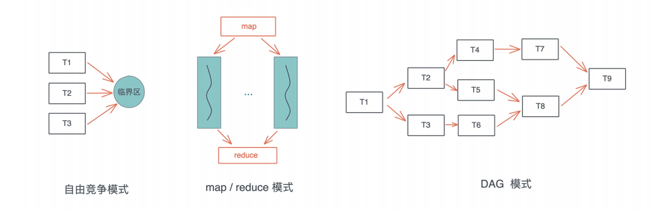
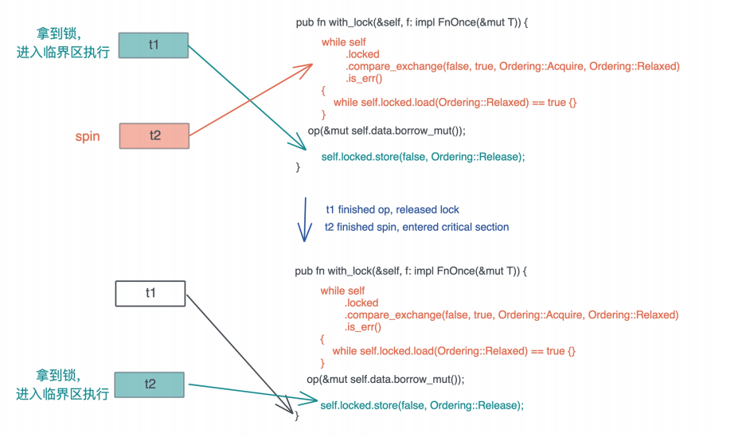
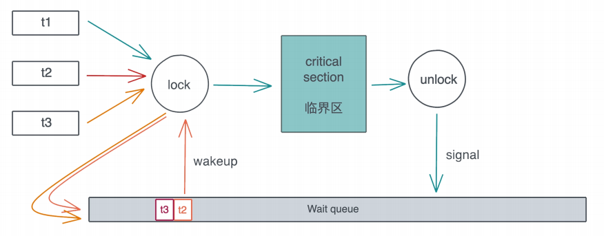

# 并发处理: 从atomics到Channel, Rust都提供了什么工具? (上)

有很多人分不清并发和并行的概念, Rob Pike, Golang的创始人之一, 对此有很精辟的直观的解释:

> Concurrency is about dealing with lots of hings at once. Parallelish is about doing lots of things at once

并发是一种同时处理多件事情的能力, 并行是一种同时执行很多事情的手段

我们把要做的事情放在多个线程, 或者多个异步任务中处理, 这是并发的能力, 再多核多CPU的机器上同时运行这些线程或者异步任务, 是并行的手段, 可以说, 并发是为并行赋能, 当我们具备了并发的能力, 并行就是水到渠成的事情

其实之前已经涉及了很多并发相关的内容, 比如用std::thread来创建线程, 用std::sync下的并发原语(Mutex)来处理并发过程中的同步问题, 用Send / Sync trait来保证并发的安全等等

在处理并发的过程中, 难点并不在于如何从创建多个线程来分配工作, 在于如何在这些并发的任务中进行同步, 我们来看并发状态下几种常见的工作模式: 自由竞争模式, map/reduce模式, DAG模式



在自由竞争模式下, 多个并发任务会竞争同一个临界区的访问权, 任务之间和何时, 以何种方式去访问临界区, 是不确定的, 或者说是最为灵活的, 只要在进入临界区获得独占访问即可

在自由竞争的基础上, 我们可以限制并发的同步模式, 典型的有map / reduce模式和DAG模式, map / reduce模式, 把工作打散, 按照相同的处理完成后, 在按照一定的顺序将结果组织起来; DAG模式, 把工作切成不想交, 有依赖的子任务, 然后按照依赖关系并发执行

这三种基本模式组合起来, 可以处理非常复杂的并发场景, 所以当我们 处理复杂问题的时候, 应该先理清其脉络, 用分治的思想把问题拆解成正交的子问题, 然后组合合适的并发模式来处理这些子问题

在这些并发模式背后, 都有哪些并发原语可以为我们所用呢, 这两讲会重点讲解和深入五个概念Atomic, Mutex, Condvar, Channel和Actor model, 我们先讲前两个

## Atomic

Atomic是所有并发原语的基础, 它为并发任务的同步奠定了坚实的基础

谈到同步, 相信你首先会想到所, 所以在具体介绍atomic之前, 我们从最基本的锁该如何实现讲起, 自由竞争模式下, 我们需要用互斥锁来保护某个临界区, 使进入临界区的任务拥有独占访问的权限

为了简便起见, 在获取这把所的时候, 如果获取不到, 就一直死循环, 直到拿到锁为止:

```rust
use core::fmt;
use std::{
    cell::{Ref, RefCell},
    sync::Arc,
    thread,
};

struct Lock<T> {
    locked: RefCell<bool>,
    data: RefCell<T>,
}

impl<T> fmt::Debug for Lock<T>
where
    T: fmt::Debug,
{
    fn fmt(&self, f: &mut std::fmt::Formatter<'_>) -> std::fmt::Result {
        write!(f, "Lock<{:?}>", self.data.borrow())
    }
}

// SAFETY: 我们确信Lock<T>很安全, 可以在多个线程中共享
unsafe impl<T> Sync for Lock<T> {}

impl<T> Lock<T> {
    pub fn new(data: T) -> Self {
        Self {
            data: RefCell::new(data),
            locked: RefCell::new(false),
        }
    }

    pub fn lock(&self, op: impl FnOnce(&mut T)) {
        // 如果没拿到所就一值spin
        while *self.locked.borrow() != false {} // **1

        // 拿到, 赶紧加锁
        *self.locked.borrow_mut() = true; // **2

        // 开始干活
        op(&mut self.data.borrow_mut()); // **3

        // 解锁
        *self.locked.borrow_mut() = false; // **4
    }
}

fn main() {
    let data = Arc::new(Lock::new(0));

    let data1 = data.clone();

    let t1 = thread::spawn(move || {
        data1.lock(|v| *v += 10);
    });

    let data2 = data.clone();
    let t2 = thread::spawn(move || {
        data2.lock(|v| *v *= 10);
    });

    t1.join().unwrap();
    t2.join().unwrap();

    println!("data: {:?}", data.data.borrow());
}
```

这段代码模拟了Mutex的实现, 它的核心部分是lock方法

我们之前说过, Mutex在调用lock后, 会得到一个MutexGuard的RAII结构, 这里为了简便起见, 要求调用者传入一个闭包, 来处理加锁的事务, 在lock方法里, 拿不到锁的并发任务会一直spin, 拿到锁的任务可以干活, 干完活就解锁, 这样之前的spin的任务会竞争到所, 进入临界区

这样的实现看上去问题不大, 但是你细想, 它有好几个问题:

1. 在多核的情况下, `**1`和`**2`之间, 有可能其他的线程也碰巧spin结束, 把locked修改, 这样存在多个线程拿到这把锁, 破坏了任何线程都有独占访问的保证
2. 即便在单核的情况下`**1`和`**2`之间, 也可能因为操作系统的科强展示调度, 导致问题1发生
3. 如今的编译器会最大程度优化生成的指令, 如果操作系统之间没有依赖关系, 可能会生成乱序的机器码, 比如`**3`被优化放在`**1`之前, 从而破坏了这个lock的保证
4. 即便编译器不做乱序处理, CPU也会最大程度做指令的乱序执行, 让流水线的效率最高, 同样也会发生3的问题

所以, 我们实现的锁的行为是未定义的, 可能大部分事件如我所愿, 但会随机出现奇奇怪怪的行为, 一旦这样的事情发生, bug可能会以各种不同面貌出现在系统的各个角落, 而且这样的不过几乎无解的, 因为它很难稳定实现, 表现行为很不一致, 甚至只在某个CPU下实现

这里在强调一下unsafe代码需要足够的严谨, 需要非常有经验的工程师去审查, 这段代码之所以破快了并发安全性, 是因为我们错误的认为: `Lock<T>`实现Sync, 是安全的

为了解决上面这段代码的问题, 我们必须在CPU层面做一些保证, 让某些操作称为原子操作

最基础的保证是: 可以通过一条指令读取某个内存地址, 判断其值是否等于某个前置值, 如果相等, 将其修改为新的值, 这就是Compare-adn-swap操作, 简称CAS, 它是操作系统的几乎所有原语的基石, 使得我们能实现一个可以正常工作的锁

所以刚才的代码, 我们可以吧一开始的循环改成:

```rust
while self
.locked
.compare_exchange(false, true, Ordering::AcqRel, Ordering::Relaxed)
.is_err()
{}
```

这句话的意思是: 如果locked当前值是false, 就将其改成true, 这整个操作在一条指令里完成, 不会比其他线程打断或者修改; 如果locked的当前值不是false, 那么就会返回错误, 我们会再次不停的spin, 直到前置条件得到满足, 这里compare_exchange是Rust提供的CAS操作, 它会被编译成CPU的对应CAS指令

这句话执行成功后, locked必然会被改变为true, 我们成功拿到锁, 而任何其他线程都会在这句话上spin

同时在释放锁的时候, 相应的需要atomic的版本, 而非直接复制成false

```rust
self.locked.store(false, Ordering::Release);
```

当然, 为了配合这样的改动, 我们还需要把locked从bool改成AtomicBool, 在Rust里, std::sync::atomic有大量的atomic数据结构, 对应各种基础结构, 我们看使用了AtomicBool的新实现

```rust
use core::fmt;
use std::{
    cell::RefCell,
    sync::{
        atomic::{self, AtomicBool, Ordering},
        Arc,
    },
    thread,
};

struct Lock<T> {
    locked: AtomicBool,
    data: RefCell<T>,
}

impl<T> fmt::Debug for Lock<T>
where
    T: fmt::Debug,
{
    fn fmt(&self, f: &mut std::fmt::Formatter<'_>) -> std::fmt::Result {
        write!(f, "Lock<{:?}>", self.data.borrow())
    }
}

// SAFETY: 我们确信Lock<T>很安全, 可以在多个线程中共享
unsafe impl<T> Sync for Lock<T> {}

impl<T> Lock<T> {
    pub fn new(data: T) -> Self {
        Self {
            data: RefCell::new(data),
            locked: AtomicBool::new(false),
        }
    }

    pub fn lock(&self, op: impl FnOnce(&mut T)) {
        // 如果没拿到所就一值spin
        while self
            .locked
            .compare_exchange(false, true, Ordering::AcqRel, Ordering::Relaxed)
            .is_err()
        {}

        // 开始干活
        op(&mut self.data.borrow_mut()); // **3

        // 解锁
        self.locked.store(false, Ordering::Release);
    }
}

fn main() {
    let data = Arc::new(Lock::new(0));

    let data1 = data.clone();

    let t1 = thread::spawn(move || {
        data1.lock(|v| *v += 10);
    });

    let data2 = data.clone();
    let t2 = thread::spawn(move || {
        data2.lock(|v| *v *= 10);
    });

    t1.join().unwrap();
    t2.join().unwrap();

    println!("data: {:?}", data.data.borrow());
}
```

可以看到, 通过使用compare_exchange, 规避了1和2面临的问题, 但对于编译器/CPU自动优化先关的3和4, 我们还需要额外处理, 这就是这两个函数里额外的两个和Ordering有关的奇怪参数

如果你查看atomic文档, 可以看到Ordering是一个enum:

```rust
pub enum Ordering {
    Relaxed,
    Release,
    Acquire,
    AcqRel,
    SeqCst,
}
```

文档里解释几种Ordering的用途, 我们来稍稍拓展一下:

- Relaxed, 这是宽松的规则, 它对编译器和CPU不做任何限制, 可以乱序执行
- Release, 当我们写入数据的时候, 如果用了Release order那么:
  - 对于当前线程, 任何读取或者写入操作都不能被乱序排在这个store之后, 也就是说, 在上面的例子中, CPU或者编译器不能把`**3`挪到`**4`之后执行
  - 对于其他线程, 如果使用了Acquire来读取这个atomic的数据, 那么它们看到的是修改后的结果, 上面代码我们在compare_exchange里使用Acquire来读取, 所以能保证读到最新的值
- 而Acquire是我们读取数据的时候,  如果用了Acquire order, 那么:
  - 对于当前线程, 任何读取或者写入的操作都不能乱序排在这个读取之前, 在上面的例子中, CPU或者编译器不能把`**3`挪到`**1`之前执行
  - 对于其他线程, 如果使用Release来修改数据, 那么, 修改的值对当前线程可见
- AcqRel是Acquire和Release, 同时拥有Acquire和Release的保证, 这个一般用在fetch_xxx上, 比如你要对一个atomic自增1, 你希望这个操作之前和操作之后的读取或者写入操作不会被乱序, 并且操作的结果对其他线程可见
- SeqCst是最严格的ordering, 除了AcqRel的保证外, 它还保证了所有线程看到的所有SeqCst操作的顺序是一致的

因为CAS和ordering都是系统级的操作, 所以这里描述的Ordering的用途在各种语言中都大同小异, 对于Rust来说, 它的atomic原语继承于C++, 如果Rust的文档让你看起来云里雾里, 你可以去看看C++

其实上面获取锁的spin过程性能不太好, 更好的方式是这样处理一下:

```rust
while self
.locked
.compare_exchange(false, true, Ordering::Acquire, Ordering::Relaxed)
.is_err()
{
    // 性能优化: compare_exchange需要独占访问, 当拿不到锁时, 我们先不停检测locked状态, 直到其unlocked后, 在尝试拿锁
    while self.locked.load(Ordering::Relaxed) == true {}
}
```

这一这里我们在while loop里, 又嵌入了一个loop, 这是因为CAS是个代码比较高的操作, 它需要获得对应内存的独占访问(exclusive access), 我们希望失败的时候只是简单读取淘米出的状态, 只有符合条件的时候再去做独占访问, 进行CAS, 看上去多做了一层循环, 实际代码效率更高

以下是两个线程同步的过程, 一开始t1拿到锁, t2 spin, 之后t1释放锁, t2进入到临界区执行:



讲到这里, 相信你对atomic以及背后的CAS有初步的了解了, 那么atomic除了做其他并发原语, 还有什么作用?

我个人用的最多是做各种lock-free的数据结构, 比如需要一个全局的ID生成器, 当然可以使用UUID这样的模块来生成唯一的ID, 但如果我们同时需要这个ID是有序的, 那么AtomicUszie就是最好的选择

你可以用fetch_add来增加这个ID, 而fetch_add返回的结果就可以用于当前的ID, 这样不需要加锁, 就得到了一个在多线程中安全使用的ID生成器

另外, atomic还可以用于记录系统中各种metrics, 比如一个简单的in-memory Metrics模块:

```rust
use std::{
    collections::HashMap,
    sync::atomic::{AtomicUsize, Ordering},
};

// server statistics
pub struct Metrics(HashMap<&'static str, AtomicUsize>);

impl Metrics {
    pub fn new(names: &[&'static str]) -> Self {
        let mut metrics: HashMap<&'static str, AtomicUsize> = HashMap::new();
        for name in names {
            metrics.insert(name, AtomicUsize::new(0));
        }
        Self(metrics)
    }

    pub fn inc(&self, name: &'static str) {
        if let Some(m) = self.0.get(name) {
            m.fetch_add(1, Ordering::Relaxed);
        }
    }

    pub fn add(&self, name: &'static str, val: usize) {
        if let Some(m) = self.0.get(name) {
            m.fetch_add(val, Ordering::Relaxed);
        }
    }

    pub fn dec(&self, name: &'static str, val: usize) {
        if let Some(m) = self.0.get(&name) {
            m.fetch_sub(1, Ordering::Relaxed);
        }
    }

    pub fn snapshot(&self) -> Vec<(&'static str, usize)> {
        self.0
            .iter()
            .map(|(k, v)| (*k, v.load(Ordering::Relaxed)))
            .collect()
    }
}
```

它允许你初始化一个全局metrics, 然后在程序的任何地方, 无锁的操作响应的metrics:

```rust
use std::{
    collections::HashMap,
    sync::atomic::{AtomicUsize, Ordering},
};

use lazy_static::lazy_static;

lazy_static! {
    pub(crate) static ref METRICS: Metrics = Metrics::new(&[
        "topics",
        "clients",
        "peers",
        "broadcasts",
        "servers",
        "states",
        "subscribers",
    ]);
}

// server statistics
pub struct Metrics(HashMap<&'static str, AtomicUsize>);

impl Metrics {
    pub fn new(names: &[&'static str]) -> Self {
        let mut metrics: HashMap<&'static str, AtomicUsize> = HashMap::new();
        for name in names {
            metrics.insert(name, AtomicUsize::new(0));
        }
        Self(metrics)
    }

    pub fn inc(&self, name: &'static str) {
        if let Some(m) = self.0.get(name) {
            m.fetch_add(1, Ordering::Relaxed);
        }
    }

    pub fn add(&self, name: &'static str, val: usize) {
        if let Some(m) = self.0.get(name) {
            m.fetch_add(val, Ordering::Relaxed);
        }
    }

    pub fn dec(&self, name: &'static str, val: usize) {
        if let Some(m) = self.0.get(&name) {
            m.fetch_sub(1, Ordering::Relaxed);
        }
    }

    pub fn snapshot(&self) -> Vec<(&'static str, usize)> {
        self.0
            .iter()
            .map(|(k, v)| (*k, v.load(Ordering::Relaxed)))
            .collect()
    }
}

fn main() {
    METRICS.inc("topics");
    METRICS.inc("topics");
    METRICS.inc("subscribers");
    METRICS.inc("subscribers");
    METRICS.inc("subscribers");
    METRICS.inc("topics");
    METRICS.inc("subscribers");
    println!("{:?}", METRICS.snapshot());
}
```

## Mutex

Atomic虽然可以处理自由竞争模式下的加锁的需求, 但毕竟用起来不那么方便, 我们需要更高层的并发原语, 来保证软件系统控制U盾讴歌线程对同一个共享资源的访问, 使得每个线程在访问共享资源的时候, 可以独占或者互斥(mutual exclusive assess)

我们知道, 对于一个共享资源, 如果所有线程只做读操作, 那么无需互斥, 大家随时可以访问, 很多immutable language(如Erlang / Elixir)做了语言层面的只读操作, 确保了并发环境下的无锁操作, 这牺牲了一些效率(常见的list / hashmap需要使用了persistent data structure), 额外做了不少内存拷贝, 换来了并发控制下的简单轻灵

然而, 一旦有任何一个或者多个线程要修改共享资源, 不但写着之间要互斥, 读写之间也需要互斥,毕竟如果读写之间不互斥的话, 读者轻则读到脏数据, 重则会读到已经破坏的数据, 导致crash, 比如读者读到链表里的一个节点, 而写着把这个节点的内存释放掉了, 如果不做互斥访问, 系统一定会崩溃

所以操作系统提供了用来解决这种读写互斥问题的基本工具; Mutex

其实上文中, 为了展示atomic, 我们制作了非常粗糙简单的SpinLock, 就可以看做是一个广义的Mutex, SpinLock, SpinLock顾名思义, 就是线程通过CPU空转(spin, 就像前面的while loop)忙等(busy wait), 来等待某个临界区可用的一种锁

然而, 这种通过SpinLock做互斥的实现方式有使用场景限制: 如果受保护的临界区太大, 那么整体的性能会急剧下降, CPU忙等, 浪费资源还不干事实, 不适合作为一种通用的处理方法

更通用的解决方案是: 当多个线程竞争同一个Mutex时, 获得锁的线程得到临界区的访问, 其他线程被挂起, 放入该Mutex上的一个等待队列里, 当获得锁的线程完成工作, 退出临界区, Mutex会给等待队列发一个信号, 把队列中的第一个线程唤醒, 于是这个线程可以进行后续的访问, 整个过程如下:



我们前面也讲过, 线程的上下文切换代价很大, 所以频繁的将线程挂起在唤醒, 会降低整个系统的效率, 所以很多Mutex具体的实现会将SpinLock(确切的说是spin wrat)额线程的挂起结合使用: 线程的lock请求如果拿不到会先尝试spin一会, 然后在挂起添加到等待队列, Rust下的parking_lot就是这样实现的

当然, 这样实现会带来公平性的问题: 如果新来的线程恰巧在spin的过程中拿到了所, 而当前等待队列还有其他线程在等锁, 那么等待的锁只能继续等待下去, 这不符合FIFO, 不适合哪些需要严格按照先来后到排队的使用场景, 为此, parking_lot提供了fairmutex

Mutex实现了依赖于CPU的atomic, 你可以把Mutex想象成一个粒度更大的atomic, 只不过这个atomic无法由CPU保证, 而是通过软件算法来实现

置于操作系统中另一个概念信号量(semaphore), 你可以认为是Mutex更通用的表现形式, 比如在新冠疫情下, 图书馆要控制同时在馆内的人数, 如果满了, 其他人就必须排队, 出来一个才能再进一个, 这里如果总人数限制为1, 就是Mutex, 如果大于1, 就是semaphore

## 小结

今天我们学习了两个基本的并发原语Atomic和Mutex, Atomic是一切并发同步的基础, 通过CPU提供特殊的CAS指令, 操作系统和应用软件可以构建更加高层的并发原语, 比如SpinLock和Mutex

SpinLock和Mutex最大的不同是, 使用SpinLock, 线程在忙等, 而使用Mutex lock. 线程等待所的时候会被调度出去, 等锁可用的时候在调度回来

听上去SpinLock似乎相率很低, 其实不是, 这要具体看锁的临界区大小, 如果临界区要执行的代码很少, 那么Mutex lock带来的上下文切换(context switch)相比, SpinLock是值得的, 在Linux Kernel中, 很多时候哦我们只能使用SpinLock

