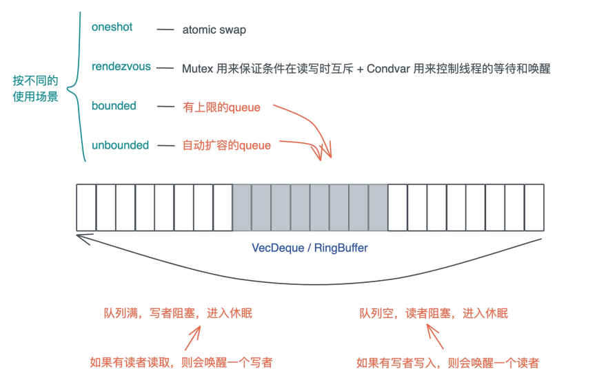

# 并发处理: 从atomics到Channel, Rust都提供了什么工具? (下)

对于并发状态下这三种常见的工作模式: 自由竞争模式, map / reduce模式, DAG模式, 我们的难点是如何在这些并发的任务中进行同步, atomic / Mutex解决了自由竞争模式下并发任务的同步问题, 也能够很好的解决map / reduce模式下的同步问题, 因此此时同步只能发生在map / reduce两个解决


然后, 它们没有解决一个更高层次的问题, 也就是DAG模式: 如果这种访问需要按照一定的顺序进行或者前后有依赖, 该怎么做?

这个问题是典型场景是生产者 - 消费者模式: 从生产者生产出来内容后, 需要有机制通知消费者可以消费, 比如socket上有数据了, 通知处理线程来处理的数据, 处理完成之后, 在通过socket收发的线程发送数据

## Condvar

所以操作系统还提供了Condvar, Condvar有两种状态:

- 等待(wait): 线程在队列中等待, 直到满足某个条件
- 通知(notify); 当condvar的条件满足时, 当前线程通知其他等待的线程可以被唤醒, 通知可以是单个通知, 也可以是多个通知, 甚至是广播(通知所有人)

在实践中, Condvar往往和Mutex一起使用: Mutex用于保证条件在读写时互斥, Condvar用于控制线程的等待和唤醒, 我们来看一个例子:

```rust
use std::{
    sync::{Arc, Condvar, Mutex},
    thread,
    time::Duration,
};

fn main() {
    let pair = Arc::new((Mutex::new(false), Condvar::new()));

    let pair2 = Arc::clone(&pair);

    thread::spawn(move || {
        let (lock, cvar) = &*pair2;
        let mut started = lock.lock().unwrap();
        *started = true;
        eprintln!("I'm a happy worker!");
        // 通知主线程
        cvar.notify_one();
        loop {
            thread::sleep(Duration::from_secs(1));
            println!("working...");
        }
    });

    // 等待线程的通知
    let (lock, cvar) = &*pair;
    let mut started = lock.lock().unwrap();
    while !*started {
        started = cvar.wait(started).unwrap();
    }
    eprintln!("Worker started!");
}
```

这段代码通过condvar, 我们实现了worker线程在执行到一定阶段后通过主线程, 然后主线程在做一些事情

这里我们使用了一个Mutex作为互斥条件, 然后在cvar.wait中传入这个Mutex, 这个接口需要一个MutexGuard, 以便于知道需要唤醒那个Mutex下等待的线程

```rust
pub fn wait<'a, T>(
    &self,
    guard: MutexGuard<'a, T>
) -> LockResult<MutexGuard<'a, T>>
```

## Channel

但是用Mutex和Condvar来处理复杂的DAG并发模式会比较吃力, 所以Rust还提供了各种各样的Channel用于处理并发任务之间的通讯

由于Golang不遗余力的推广, Channel可能是最广为人知的并发手段, 相对于Mutex, Channel的抽象程度更高, 接口最为直观, 使用起来的心理负担也没那么大, 使用Mutex时, 你需要很小心的避免死锁, 控制临界区的大小, 放置一切可能发生的意外

虽然在Rust里, 我们可以无畏并发(Fearless concurrentcy), 当代码编译通过, 绝大多数的并发问题都可以避免, 但性能上的问题, 逻辑上的死锁还需要开发者照料

Channel把锁封装在队列写入和读取的小块内存内, 然后把读者和写着完全分离, 使得读写读取数据和写着写入数据, 对开发者而言, 除了潜在的上下文切换外, 完全和锁无关, 就像访问一个本地队列一样, 所以对于大部分的开发问题, 我们都可以用Channel或者类似的思想来处理(比如actor model)

Channel在具体实现的时候, 根据不同的使用场景, 会选择不同的工具, Rust提供了一下四种Channel:

- oneshot: 这可能是最简单的Channel, 写着就只发一次数据, 而读者也只读一次, 这种只读一次性的, 多个线程间的同步可以用oneshot channel完成, 由于oneshot特殊的用途, 实现的时候可以直接用atomic shot来完成
- rendezvous: 很多时候, 我们只需要通过Channel来控制线程中的异步, 并不需要发送数据, rendezvous channel是channel size为0的一种特殊情况
  - 这种情况下, 我们用Mutex + Condvar实现就可以了, 在具体实现中, randezvous channel其实也就是Mutex + Condvar的一个包装
- bounded: bounded channel有一个队列, 但队列有上限, 一旦队列写满了, 写着也需要被挂起等待, 当阻塞发生后, 读者一旦读取数据, channel内部就会使用Condvar的notify_one通知写者, 唤醒某个写者使其能够继续写入
  - 因此实现中, 一般会用到Mutex + Condvar + VecDeque来实现; 如果不用Condvar, 可以直接使用thread::park + thread::notify来完成; 如果不用VecDeque, 也可以使用双向链表或者其他的ring buffer的实现
- unbounded: queue没有上限, 如果写满了, 就自动扩容, 我们知道, Rust的很多数据结构如Vec, VecDeque都是自动扩容的, unbounded和bounded相比, 除了不阻塞写者, 其他实现都很类似

所以这些channel类似, 同步和异步的实现思路大同小异, 主要的去呗在于挂起 / 唤醒的对象, 在同步的世界里, 挂起 / 唤醒的对象是线程; 而异步额世界里, 是粒度很小的task



根据Channel读者和写者的数量, Channel又可以分为:

- SPSC(Single-Producer Single-Consumer): 单生产者, 单消费者, 最简单, 可以不依赖于Mutex, 只用atomics就可以实现
- SPMC(Single-Producer Multi-Consumer): 单生产者, 多消费者, 需要在消费者这侧读取时加锁
- MPSC(Multi-Producer Single-Consumer): 多生产者, 单消费者, 需要在生产者这侧写入时加锁
- MPMC(Multi-Producer Multi-Consumer): 多生产者, 多消费者, 需要在生产者或者消费者读取时加锁

在众多Channel类型中, 使用最广的是MPSC channel, 多生产者, 单消费者, 因为往往我们希望通过单消费者来保证, 用于处理消息的数据结构由独占的写访问


比如在xunmi的实现中, index writer内部是一个多线程的实现, 但在使用的时候, 我们需要用到它的可写引用

如果要能够在各种上下文中使用index writer, 我们就不得不将其用`Arc<Mutex<T>>`包裹起来, 但这样在索引大量数据时效率很低, 所以我们可以用MPSC channel, 让各种上下文都把数据发送给单一的线程, 使用index writer索引, 这样就避免了锁:

```rust
pub struct IndexInner {
    index: Index,
    reader: IndexReader,
    config: IndexConfig,
    updater: Sender<Input>,
}
pub struct IndexUpdater {
    sender: Sender<Input>,
    t2s: bool,
    schema: Schema,
}
impl Indexer {
    // 打开或者创建一个 index
    pub fn open_or_create(config: IndexConfig) -> Result<Self> {
        let schema = config.schema.clone();
        let index = if let Some(dir) = &config.path {
            fs::create_dir_all(dir)?;
            let dir = MmapDirectory::open(dir)?;
            Index::open_or_create(dir, schema.clone())?
        } else {
            Index::create_in_ram(schema.clone())
        };
        Self::set_tokenizer(&index, &config);
        let mut writer = index.writer(config.writer_memory)?;
        // 创建一个 unbounded MPSC channel
        let (s, r) = unbounded::<Input>();
        // 启动一个线程，从 channel 的 reader 中读取数据
        thread::spawn(move || {
            for input in r {
                // 然后用 index writer 处理这个 input
                if let Err(e) = input.process(&mut writer, &schema) {
                    warn!("Failed to process input. Error: {:?}", e);
                }
            }
        });
        // 把 channel 的 sender 部分存入 IndexInner 结构
        Self::new(index, config, s)
    }
    pub fn get_updater(&self) -> IndexUpdater {
        let t2s = TextLanguage::Chinese(true) == self.config.text_lang;
        // IndexUpdater 内部包含 channel 的 sender 部分
        // 由于是 MPSC channel，所以这里可以简单 clone 一下 sender
        // 这也意味着，我们可以创建任意多个 IndexUpdater 在不同上下文发送数据
        // 而数据最终都会通过 channel 给到上面创建的线程，由 index writer 处理
        IndexUpdater::new(self.updater.clone(), self.index.schema(), t2s)
    }
}
```

## Actor

最后我们简单介绍一些actor model, 它在业界主要的使用者是Erlang VM以及akka

actor是一种有效协程, 每个actor, 有自己的一个独立的, 轻量级的调用栈, 以及一个用来接收消息的消息队列(mailbox和message queue), 外界根actor打交道的唯一手段就是, 给它发送消息

Rust标准库没有actor的实现, 但是社区里有比较成熟的actix(大名鼎鼎的actix-web就是基于actix实现的), 以及bastion

下面是使用actix实现了一个DummyActor, 它可以接收一个InMsg, 返回一个OutMsg

```rust
use actix::prelude::*;
use anyhow::Result;

// actor可以处理的消息
#[derive(Message, Debug, Clone, PartialEq)]
#[rtype(result = "OutMsg")]
enum InMsg {
    Add((usize, usize)),
    Concat((String, String)),
}

#[derive(MessageResponse, Debug, Clone, PartialEq)]
enum OutMsg {
    Num(usize),
    Str(String),
}

// Actor
struct DummyActor;

impl Actor for DummyActor {
    type Context = Context<Self>;
}

// 实现处理InMsg的Handler trait
impl Handler<InMsg> for DummyActor {
    type Result = OutMsg; // 返回的消息

    fn handle(&mut self, msg: InMsg, ctx: &mut Self::Context) -> Self::Result {
        match msg {
            InMsg::Add((a, b)) => OutMsg::Num(a + b),
            InMsg::Concat((mut s1, s2)) => {
                s1.push_str(&s2);
                OutMsg::Str(s1)
            }
        }
    }
}

#[actix::main]
async fn main() -> Result<()> {
    let addr = DummyActor.start();
    let res = addr.send(InMsg::Add((21, 21))).await?;
    let res1 = addr
        .send(InMsg::Concat(("hello, ".into(), "world".into())))
        .await?;
    println!("res: {res:?}, res1: {res1:?}");
    Ok(())
}
```

可以看到, 对DummyActor, 我们只需要实现Actor trait和`Handler<`InMsg>` trait

## 小结

我们总结一下各种并发原语的使用场景Atomic. Mutex, RwLock, Semaphore, Condvar, Channel, Actor

- Atomic在处理简单的原生类型时非常有用, 如果你可以通过AtomicXXX结构进行同步, 那么它们是最好的选择
- 当你的数据结构无法通过AtomicXXX进行同步, 但你有的确需要在多个先线程中共享数据, 那么Mutex / RwLock可以是一种选择, 不过你需要考虑锁的粒度, 粒度太大的Mutex / RwLock效率很低
-  如果你有N分资源可以供多个并发任务竞争使用, 那么Semaphore是一个很好的选择, 比如你要做一个DB连接池
- 当你需要在并发任务中通知, 协作的时候, Condvar提供了最基本的通知机制, 而Channel把这个通知机制进一步广泛的被展开, 于是你可以用Condvar进行点对点的同步, 用Channel做一对多, 多对一, 多对多的同步

所以当我们做大部分复杂的系统设计时, Channel往往是最强有力的武器, 除了可以让数据穿梭于各个线程之间, 它的接口还可以很优雅的和stream适配

如果说在整个后端系统架构时, 我们着眼的是: 有哪些服务, 服务和服务之间如何通讯, 数据如何流动, 服务和服务间如何同步; 那么在做某一个服务架构时, 着眼的是由哪些功能性的线程(异步任务), 它们之间的接口是什么样子, 数据如何流动, 如何同步

在这里Channel兼具接口, 同步和数据流三种功能, 所以说是最有力的武器

然而它不该是武器, 我们面临真实世界的并发问题是多样的, 解决方法也应该是多样的, 计算机科学家在过去几十年里不断探索, 构建了一系列的并发原语, 也说明了很难有一种银弹解决所有问题

就连Mutex本身, 在实践中还是根据不同的场景做不同的妥协, 因为这个世界就是这样, 没有完美的解决方案, 只有妥协出来的方案, 所以Channel不是银弹, actor model不是银弹, lock不是银弹

一门好的编程语言, 可以提供大部分场景下的最佳实践, 单不应该营造一种气氛, 只有某个最佳实践才是唯一方案

而Rust提供几乎你需要的所有解决方案, 并且并不鼓吹自己的优劣, 完全交由你按需选择. 我在用Rust撰写多线程应用的时候Channel依然是第一选择, 但我还是会在合适的地方使用Mutex. RwLock, Semaphore, Condvar, Atomic等工具, 而不是试图笨拙的使用Channel叠加Channel来应对所有场景

