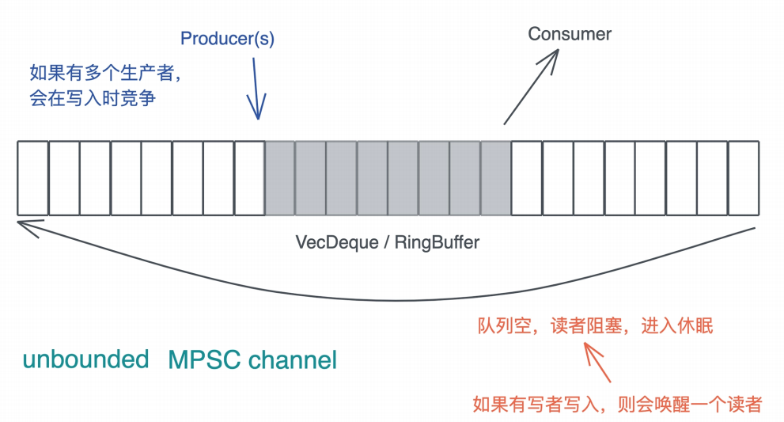

# 实操项目: 如何实现一个基本的MPSC channel

通过上两讲的学习, 相信你已经意识到, 虽然并发原语看上去是很底层, 很神秘的东西, 但实现起来也并不想想象中的困难, 尤其是在Rust下,. 我们用了几十行代码就实现了一个简单的SpinLock

你也许会觉得不太过瘾, 而且SpinLock也不是经常使用的并发原语, 那么今天, 我们试着实现一个简单的SpinLock

之前我们谈论了如何在搜索引擎的Indexer writer上使用MPSC channel: 要更新index的上下文有很多(可以是线程也可以是异步任务), 而IndexWriter只能是唯一的, 为了避免在访问IndexWriter时加锁, 我们可以使用MPSC channel, 在多个上下文中给channel发消息, 然后在唯一的拥有的, 为了避免在访问IndexWriter时加锁, 我们可以使用MPSC channel, 在多个上下文中给channel发消息, 然后在唯一拥有IndexWriter的线程中读取这些消息, 非常高效

来看看我们今天要实现的MPSC channel的基本功能, 为了简便起见, 我们只关心unbounded MPSC channel, 也就是说, 当队列容量不够时, 会自动扩容

## 测试驱动设计

之前我们会从需求的角度来设计接口和数据结构, 今天我们就换种方式, 完全站在使用者的角度上, 用使用实例和驱动接口和数据结构来设计