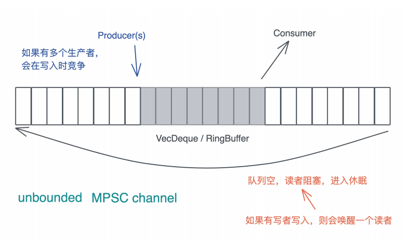

# 实操项目: 如何实现一个基本的MPSC channel?

通过之前的学习, 相信你已经意识到, 虽然并发原语看上去是很底层, 很神秘的东西, 但实现起来并不像想象中的困难, 尤其是在Rust下

你也许觉得不太过瘾, 而且SpinLock也不是经常使用的并发原语, 那么今天, 我们试着实现一个使用非常广泛的MPSC channel

之前我们谈论了如何在搜索引擎的Index writer上如何使用MPSC channel: 要更新index的上下文有很多(可以是线程也可以是异步任务), 而IndexWriter只能是唯一的, 为了避免在使用IndexWriter时加锁, 我们可以使用MPSC channel, 在多个上下文中给channel发消息, 然后在唯一拥有IndexWriter的线程读取这些消息, 非常高效

来看看今天要实现的MPSC channel的基本功能, 为了方便起见, 我们只关心unbounded MPSC channel, 也就是说, 在队列容量不够的时候, 会自动扩容, 任何时候生产者写入数据都不会阻塞, 但是当队列中没有数据的时候, 消费者会阻塞



## 测试驱动的设计

之前我们会从需求的角度来设计接口和数据结构, 今天我们就换种方式, 完全站在使用者的角度, 用使用实例(测试)来驱动接口和数据结构的设计

### 需求1

要实现刚才说的MPSC channel, 都有什么需求呢? 首先生产者可以产生数据, 消费者能够消费产生出来的数据, 也就是基本的send / recv, 我们以下面的单元测试1来描述这个需求

```rust
#[test]
fn channel_should_work() {
    let (mut s, mut r) =  unbounded();
    s.send("hello world!".to_string()).unwrap();
    let msg = recv().unwrap();
    assert_eq!(msg, "hello world!");
}
```

这里, 通过unbounded方法, 可以创建一个sender和一个receiver, sender有send方法, 可以发送数据, receiver有一个recv方法, 可以接受数据, 整体的接口, 我们设计和std::sync::mpsc保持一致, 避免使用者使用上的心智负担

为了实现这样一个接口, 需要什么样的数据结构呢? 首先生产者和消费者之间会共享一个队列, 可以使用VecDequeue, 显然这个队列在插入和取出数据时需要互斥, 所以需要Mutex来保护它, 所以我们大概可以得到这样一个结构:

```rust
pub struct Shared<T> {
    queue: Mutex<VecDeque<T>>,
}

pub struct Sender<T> {
    shared: Arc<Shared<T>>,
}

pub struct Receiver<T> {
    shared: Arc<Shared<T>>,
}
```

这样的数据结构应该可以满足单元测试1

### 需求2

由于需要的是MPSC, 所以我们允许多个sender往channel里发送数据, 用单元测试2来描述这个需求:

```rust
#[test]
fn multiple_senders_should_work() {
    let (mut s, mut r) = unbounded();
    let mut s1 = s.clone();
    let mut s2 = s.clone();
    let t = thread::spawn(move || {
        s.send(1).unwrap();
    });

    let t1 = thread::spawn(move || {
        s1.send(2).unwrap();
    });

    let t2 = thread::spawn(move || {
        s2.send(3).unwrap();
    });

    for handle in [t, t1, t2] {
        handle.join().unwrap();
    }

    let mut result = vec![r.recv().unwrap(), r.recv().unwrap(), r.recv().unwrap()];

    // 在这个测试数据里, 数据到达的顺序是不确定的 , 所以我们在排个序在assert
    result.sort();

    assert_eq!(result, vec![1, 2, 3]);
}
```

这个需求, 刚才的数据结构就可以满足, 只是Sender需要实现Clone trait, 不过我们在写这个测试的时候稍微有些别扭, 因为这一行代码有不断重复的代码

```rust
let mut result = vec![r.recv().unwrap(), r.recv().unwrap(), r.recv().unwrap()];
```

注意, 测试代码DRY也很重要, 我们之前强调过, 所以当写下这个测试的时候, 也许回想, 我们可否提供Iterator的实现, 这个想法稍后再说

### 需求3

接下来考虑当队列空的时候, receiver所在的线程会被阻塞这个需求, 那么如果对这个需求进行测试呢? 我们没有比较直观的方式来检测线程的状态

不过我们可以检测"线程是否退出"来间接判断线程是否被堵塞, 理由很简单, 如果线程没有继续工作, 又没有退出, 那么一定被阻塞住了, 阻塞之后我们继续发送数据, 消费者所在的线程被唤醒继续工作, 所以最终队列长度应该为0, 我们看单元测试3

```rust
#[test]
fn receiver_should_be_block_nothing_to_read() {
    let (mut s, r) = unbounded();
    let mut s1 = s.clone();
    thread::spawn(move || {
        for (idx, i) in r.into_iter().enumerate() {
            // 如果读到数据, 确保它和发送的数据一致
            assert_eq!(idx, i);
        }

        // 读不到应该休眠, 所以不会执行这一句, 执行到这一句说明逻辑出错
        assert!(false);
    });

    thread::spawn(move || {
        for i in 0..100_usize {
            s.send(i).unwrap();
        }
    });

    // 1ms足够让生产者发完100个消息, 消费者消费完100消息并阻塞
    thread::sleep(Duration::from_millis(1));

    // 再次发送数据, 唤醒消费者
    for i in 100..200_usize {
        s1.send(i).unwrap();
    }

    // 留点事件让receiver处理
    thread::sleep(Duration::from_millis(1));

    // 如果receiver被正常唤醒处理, 那么队列里的数据会被读完
    assert_eq!(s1.total_queued_items(), 0);
}
```

这个测试代码中, 我们假定receiver实现了Iterator, 还假定sender提供了一个方法total_queued_items, 这些可以在实现的时候在处理

你可以花一些时间看看这段代码, 想想其中的处理逻辑, 虽然代码很简单, 不难理解, 但是把一个完整的需求转换成合适的测试代码, 还是要破费些心思的

如果能支持队列为空时阻塞, 我们需要使用Condvar, 所以`Shared<T>`需要修改一下:

```rust
pub struct Shared<T> {
    queue: Mutex<VecDeque<T>>,
    available: Condvar,
}
```

这样当实现Receiver的recv方法后, 我们可以在读不到数据时阻塞线程:

```rust
// 拿到锁
let mut inner = self.sheared.queue.lock().unwrap();

// ...假设读不到数据
// 使用condvar和MutexGuard阻塞当前的线程
self.sheared.available.wait(inner);
```

### 需求4

顺序刚才多个sender想, 如果现在所有Sender都退出作用域, Receiver继续接收, 到没有数据可读了, 该怎么处理? 是不是应该产生一个错误, 让调用者知道, 现在channel的另一侧已经没有生产者了, 在读也读不出数据了?

我们来写单元测试4:

```rust
#[test]
fn last_sender_drop_should_err_when_receive() {
    let (s, mut r) = unbounded();
    let s1 = s.clone();
    let senders = [s, s1];
    let total = senders.len();

    // sender即用即抛
    for mut sender in senders {
        thread::spawn(move || {
            sender.send("hello").unwrap();
        })
        .join()
        .unwrap();
    }

    // 虽然没有sender了, 接收者依然可以接收已经在队列里的数据
    for _ in 0..total {
        r.recv().unwrap();
    }

    // 然而, 读取更多的数据会出错
    assert!(r.recv().is_err());
}
```

这个测试依旧很简单, 你可以想象一下, 使用什么样的数据结构可以达到这个谜底

首先, 每次Clone时, 要增加Sender的计数; 在Sender Drop的时候, 减少这个计数; 然后我们为Receiver提供一个方法total_senders, 来读取Sender的计数, 当计数为0, 且队列中没有数据可读时, recv方法就报错

有了这个思路, 你想一想, 这个计数器用什么数据结构呢? 用锁保护吗?

答案是atomics, 我们可以使用AtomicUsize, 所以Shared数据结构需要更新一下:

```rust
pub struct Shared<T> {
    queue: Mutex<VecDeque<T>>,
    available: Condvar,
    senders: AtomicUsize,
}
```

### 需求5

既然没有Sender了要报错, 那么如果没有Reciver了, Sender发送时是不是也应该错误返回? 这个需求和上面类似

```rust
#[test]
fn receiver_drop_should_err_when_send() {
    let (mut s1, mut s2) = {
        let (s, _) = unbounded();
        let s1 = s.clone();
        let s2 = s.clone();
        (s1, s2)
    };

    assert!(s1.send(1).is_err());
    assert!(s2.send(1).is_err());
}
```

这里哦我们创建一个channel, 产生两个Sender后便立即丢弃Receiver, 两个Sender在发送时会出错

同样, Shared数据结构要更新一下:

```rust
pub struct Shared<T> {
    queue: Mutex<VecDeque<T>>,
    available: Condvar,
    senders: AtomicUsize,
    receivers: AtomicUsize,
}
```

## 实现MPSC channel

现在写了五个单元测试, 我们已经把需求摸透了, 并且有了基本的接口和数据结构的设计, 接下来我们来写实现的代码

```rust
use anyhow::Result;
use std::{
    collections::VecDeque,
    sync::{atomic::AtomicUsize, Arc, Condvar, Mutex},
};

/// 发送者和接收者之间共享一个VecDequeue, 用Mutex互斥, 用Condvar通知
/// 同时还要记录有多少个senders和receivers
pub struct Shared<T> {
    queue: Mutex<VecDeque<T>>,
    available: Condvar,
    senders: AtomicUsize,
    receivers: AtomicUsize,
}

/// 发送者
pub struct Sender<T> {
    shared: Arc<Shared<T>>,
}

/// 接收者
pub struct Receiver<T> {
    shared: Arc<Shared<T>>,
}

impl<T> Sender<T> {
    pub fn send(&mut self, t: T) -> Result<()> {
        todo!()
    }

    pub fn total_receivers(&self) -> usize {
        todo!()
    }

    pub fn total_queued_items(&self) -> usize {
        todo!()
    }
}

impl<T> Receiver<T> {
    pub fn recv(&mut self) -> Result<T> {
        todo!()
    }

    pub fn total_senders(&self) -> usize {
        todo!()
    }
}

impl<T> Iterator for Receiver<T> {
    type Item = T;

    fn next(&mut self) -> Option<Self::Item> {
        todo!()
    }
}

/// 克隆sender
impl<T> Clone for Sender<T> {
    fn clone(&self) -> Self {
        todo!()
    }
}

/// Drop sender
impl<T> Drop for Sender<T> {
    fn drop(&mut self) {
        todo!()
    }
}

/// 创建一个unbounded channel
pub fn unbounded<T>() -> (Sender<T>, Receiver<T>) {
    todo!()
}

#[cfg(test)]
mod tests {
    use std::{
        thread::{self, spawn},
        time::Duration,
    };

    use super::*;

    #[test]
    fn channel_should_work() {
        let (mut s, mut r) = unbounded();
        s.send("hello world!".to_string()).unwrap();
        let msg = recv().unwrap();
        assert_eq!(msg, "hello world!");
    }

    #[test]
    fn multiple_senders_should_work() {
        let (mut s, mut r) = unbounded();
        let mut s1 = s.clone();
        let mut s2 = s.clone();
        let t = thread::spawn(move || {
            s.send(1).unwrap();
        });

        let t1 = thread::spawn(move || {
            s1.send(2).unwrap();
        });

        let t2 = thread::spawn(move || {
            s2.send(3).unwrap();
        });

        for handle in [t, t1, t2] {
            handle.join().unwrap();
        }

        let mut result = vec![r.recv().unwrap(), r.recv().unwrap(), r.recv().unwrap()];

        // 在这个测试数据里, 数据到达的顺序是不确定的 , 所以我们在排个序在assert
        result.sort();

        assert_eq!(result, vec![1, 2, 3]);
    }

    #[test]
    fn receiver_should_be_block_nothing_to_read() {
        let (mut s, r) = unbounded();
        let mut s1 = s.clone();
        thread::spawn(move || {
            for (idx, i) in r.into_iter().enumerate() {
                // 如果读到数据, 确保它和发送的数据一致
                assert_eq!(idx, i);
            }

            // 读不到应该休眠, 所以不会执行这一句, 执行到这一句说明逻辑出错
            assert!(false);
        });

        thread::spawn(move || {
            for i in 0..100_usize {
                s.send(i).unwrap();
            }
        });

        // 1ms足够让生产者发完100个消息, 消费者消费完100消息并阻塞
        thread::sleep(Duration::from_millis(1));

        // 再次发送数据, 唤醒消费者
        for i in 100..200_usize {
            s1.send(i).unwrap();
        }

        // 留点事件让receiver处理
        thread::sleep(Duration::from_millis(1));

        // 如果receiver被正常唤醒处理, 那么队列里的数据会被读完
        assert_eq!(s1.total_queued_items(), 0);
    }

    #[test]
    fn last_sender_drop_should_err_when_receive() {
        let (s, mut r) = unbounded();
        let s1 = s.clone();
        let senders = [s, s1];
        let total = senders.len();

        // sender即用即抛
        for mut sender in senders {
            thread::spawn(move || {
                sender.send("hello").unwrap();
            })
            .join()
            .unwrap();
        }

        // 虽然没有sender了, 接收者依然可以接收已经在队列里的数据
        for _ in 0..total {
            r.recv().unwrap();
        }

        // 然而, 读取更多的数据会出错
        assert!(r.recv().is_err());
    }

    #[test]
    fn receiver_drop_should_err_when_send() {
        let (mut s1, mut s2) = {
            let (s, _) = unbounded();
            let s1 = s.clone();
            let s2 = s.clone();
            (s1, s2)
        };

        assert!(s1.send(1).is_err());
        assert!(s2.send(1).is_err());
    }
}
```

### 创建unbounded channel

创建unbounded channel的接口很简单

```rust
/// 创建一个unbounded channel
pub fn unbounded<T>() -> (Sender<T>, Receiver<T>) {
    let shared = Shared::default();
    let shared = Arc::new(shared);
    (
        Sender {
            shared: shared.clone(),
        },
        Receiver { shared },
    )
}

const INITIAL_SIZE: usize = 32;
impl<T> Default for Shared<T> {
    fn default() -> Self {
        Self {
            queue: Mutex::new(VecDeque::with_capacity(INITIAL_SIZE)),
            available: Condvar::new(),
            senders: AtomicUsize::new(1),
            receivers: AtomicUsize::new(1),
        }
    }
}
```

因为这里使用default创建`Shared<T>`结构, 所以我们需要为其实现Default, 创建时候我们有一个生产者和一个消费者

### 实现消费者

对于消费者, 我们主要需要实现recv方法

在recv中, 如果队列里有数据, 那么直接返回; 如果没有数据, 且所有生产者都离开了, 我们就返回错误; 如果没有数据, 但还有生产者, 我们阻塞消费者线程:

```rust
impl<T> Receiver<T> {
    pub fn recv(&mut self) -> Result<T> {
        // 拿到队列的锁
        let mut inner = self.shared.queue.lock().unwrap();
        loop {
            match inner.pop_front() {
                // 读到数据返回, 锁就释放
                Some(t) => return Ok(t),
                // 读不到数据, 且已经没有生产者, 释放锁并返回错误
                None if self.total_senders() == 0 => return Err(anyhow!("no sender left")),
                // 读不到锁, 把锁提交给available Condvar, 它会释放瘦ing挂起线程, 等待notify
                None => {
                    // 当Condvar被唤醒后返回MutexGuard, 我们可以loop回去拿数据
                    inner = self
                        .shared
                        .available
                        .wait(inner)
                        .map_err(|_| anyhow!("lock poisoned"))?;
                }
            }
        }
    }

    pub fn total_senders(&self) -> usize {
        self.shared.senders.load(Ordering::SeqCst)
    }
}
```

注意看这里的Condvar的使用

在wait方法里, 它接收一个MutexGuard, 然后释放这个Mutex, 挂起线程, 等得到通知后, 它会在湖区所, 得到一个MutexGuard, 返回所以这里是:

```rust
inner = self.shared.available.wait(inner).map_err(|_| anyhow!("lock poisoned")
```

因为recv会返回一个值, 所以阻塞回来之后, 我们应该循环回去拿数据, 这是为什么这段逻辑要被loop包裹, 我们前面被设计过: 当发送者发送数据时, 应该通知被阻塞的消费者, 所以在实现Sender的send时, 需要做相应的notify处理

记得要处理消费者的drop

```rust
impl<T> Drop for Receiver<T> {
    fn drop(&mut self) {
        self.shared.receivers.fetch_sub(1, Ordering::AcqRel);
    }
}
```

消费者开时, 将receivers减一

### 实现生产者

首先在没有消费者的情况下, 应该报错, 正常应该使用thiserror定义自己的错误, 不过这里为了简化代码, 就使用anyhow!宏产生一个adhoc的错误, 如果消费者孩子, 那么我们获取VecDeque的锁, 把数据压入:

```rust
impl<T> Sender<T> {
    pub fn send(&mut self, t: T) -> Result<()> {
        // 如果没有消费者, 写入时出错
        if self.total_receivers() == 0 {
            return Err(anyhow!("no receiver left"));
        }

        // 加锁, 访问VecDequeue, 压入数据, 然后立即释放锁
        let was_empty = {
            let mut inner = self.shared.queue.lock().unwrap();
            let empty = inner.is_empty();
            inner.push_back(t);
            empty
        };

        // 通知任意一个被挂起等待的消费者有数据
        if was_empty {
            self.shared.available.notify_one();
        }

        Ok(())
    }

    pub fn total_receivers(&self) -> usize {
        self.shared.receivers.load(Ordering::SeqCst)
    }

    pub fn total_queued_items(&self) -> usize {
        self.shared.queue.lock().unwrap().len()
    }
}
```


这里我们获取total_receivers时, 使用了Ordering::SeqCst, 保证所有线程看到同样的顺序的对receivers的操作, 这个值是最新的值

在压入数据的时, 需要判断一下之前的队列是否为空, 因为队列为空的时候, 我们需要使用notify_one来唤醒消费者, 这个非常重要, 如果没有处理的话, 会导致消费者阻塞后无法复原接收数据

由于我们可以有多个生产者, 所以允许它clone

```rust
impl<T> Clone for Sender<T> {
    fn clone(&self) -> Self {
        self.shared.senders.fetch_add(1, Ordering::AcqRel);

        Self {
            shared: Arc::clone(&self.shared),
        }
    }
}
```

实现Clone trait的方法很简单, 但记得要把shared.senders加1, 使其保持和当前的senders的数量一致

当然, 在drop的时候我们也要维护shared.senders使其减一

```rust
impl<T> Drop for Sender<T> {
    fn drop(&mut self) {
        self.shared.senders.fetch_sub(1, Ordering::AcqRel);
    }
}
```

### 其他果农鞥

目前还缺乏Receiver的Iterator的实现, 这个很简单, 就是在next里调用rect方法, Rust提供了支持在Option / Result之间很方便的转化函数, 所以这里我们可以直接通过ok来将Result转换成Option:

```rust
impl<T> Iterator for Receiver<T> {
    type Item = T;

    fn next(&mut self) -> Option<Self::Item> {
        self.recv().ok()
    }
}
```

目前所有需要实现的代码都实现完毕, cargo test测试一下

但是有一个问题, Sender和Drop的实现似乎有点问题, 如果Receiver被阻塞, 而此刻所有的Sender都走了, 那么Receiver就没有人唤醒, 会来带资源的泄露, 这是一个很边边的问题, 所以之前的测试没有覆盖到

我们设计一个场景来让这个问题暴露

```rust
#[test]
fn receiver_shall_be_notified_when_all_senders_exit() {
    let (s, mut r) = unbounded::<usize>();
    // 用于两个线程同步
    let (mut sender, mut receiver) = unbounded::<usize>();

    let t1 = thread::spawn(move || {
        // 保证r.recv()咸鱼t2的drop执行
        sender.send(0).unwrap();
        assert!(r.recv().is_err());
    });

    thread::spawn(move || {
        receiver.recv().unwrap();
        drop(s);
    });

    t1.join().unwrap();
}
```

这里我们创建了两个线程t1和t2, 分别让它们处理消费者和生产你这, t1读取数据, 此时没有数据, 所以会阻塞, 而t2直接把生产者drop掉, 所以此刻如果没有人唤醒t1, 那么t1.join会一直等待, 因为t1一直没U退出

所以, 为了保证一定是t1`r.recv`限制导致阻塞, t2在drop(s)吗我们用另一个channel来控制两个线程的执行顺序, 这是一种很通用的做法

运行cargo test之后, 测试被泽色, 这是因为, t1没有机会得到唤醒, 所以这个测试停在这里不懂了

要修复这个问题, 我们需要妥善的处理Sender的Drop

```rust
/// Drop sender
impl<T> Drop for Sender<T> {
    fn drop(&mut self) {
        let old = self.shared.senders.fetch_sub(1, Ordering::AcqRel);
        // sender走光了, 唤醒receiver读取数据(如果队列中还有的话), 读不到就出错
        if old <= 1 {
            // 因为我们实现的是MPSC, receiver只有一个, 所以notify_all等价于notify_one
            self.shared.available.notify_all();
        }
    }
}
```

这里如果减一之前, 旧的senders的数量小于等于一, 意味着现在最后一个Sender要离开了, 不管怎么样我们都要唤醒Receive, 所以这里使用了notify_all, 如果Receiver之前已经阻塞, 此刻就能被唤醒, 修改完成, cargo test一切正常

## 性能优化

从功能上来说, 目前我们的MPSC unbounded channel没有太多的问题, 可以应用在任何需要MPSC channel的场景, 然后每次读写都需要获取所, 虽然锁的粒度很小, 但还是让整体的性能打了折扣, 有没有可能优化锁

之前我们讲到, 优化锁的手段无非是减小临界区的大小, 让每次加锁的时间很短, 这样冲突的几率就变小 , 另外就是降低加锁的频率, 对于消费者来说, 如果我们一次性把队列中的所有数据缓存起来, 以后在需要的时候从缓存中读取, 这样可以大大减轻系哦啊费和加锁的频率

顺序这个思路, 我们可以在Receiver的结构中放一个cache

```rust
/// 接收者
pub struct Receiver<T> {
    shared: Arc<Shared<T>>,
    cache: VecDeque<T>,
}
```

如果你之前有C语言的开发经验, 也许会想, 何必把queue中的数据全部读出来, 存入Receiver的cache呢? 这样效率太低, 如果能够直接把swap两个结构的指针, 这样即便队列中有再多的数据, 也是O(1)的操作

别亦, Rust中有类似的`std::mem::swap`方法

```rust
use std::mem;
fn main() {
    let mut x = "hello world".to_string();
    let mut y = "goodbye world".to_string();
    mem::swap(&mut x, &mut y);
    assert_eq!("goodbye world", x);
    assert_eq!("hello world", y);
}
```

了解了swap方法, 我们看看如何修改Receiver的recv方法来提升性能

```rust
pub fn recv(&mut self) -> Result<T> {
    // 无锁 fast path
    if let Some(t) = self.cache.pop_front() {
        return Ok(t);
    }

    // 拿到队列的锁
    let mut inner = self.shared.queue.lock().unwrap();
    loop {
        match inner.pop_front() {
            // 读到数据返回, 锁就释放
            Some(t) => {
                // 如果当前队列中还有数据, 那么就把消费者自身缓存的队列和共享队列swap
                // 这样以后在读取, 就可以从self.queue中无锁读取
                if !inner.is_empty() {
                    std::mem::swap(&mut self.cache, &mut inner);
                }

                return Ok(t);
            }
            // 读不到数据, 且已经没有生产者, 释放锁并返回错误
            None if self.total_senders() == 0 => return Err(anyhow!("no sender left")),
            // 读不到锁, 把锁提交给available Condvar, 它会释放瘦ing挂起线程, 等待notify
            None => {
                // 当Condvar被唤醒后返回MutexGuard, 我们可以loop回去拿数据
                inner = self
                .shared
                .available
                .wait(inner)
                .map_err(|_| anyhow!("lock poisoned"))?;
            }
        }
    }
}
```

当cache中有数据的时候, 总是从cache中读取; 当cache中没有, 我们拿到队列的锁, 读取一个数据, 然后看看队列是否还有数据, 有的话, 就swap cache和queue, 然后返回之前读取的数据

我们在为这个优化写个测试

```rust
#[test]
fn channel_fast_path_should_work() {
    let (mut s, mut r) = unbounded();
    for i in 0..10_usize {
        s.send(i).unwrap();
    }

    assert!(r.cache.is_empty());

    // 读取一个数据, 此时应该会导致swap, cache中有数据
    assert_eq!(0, r.recv().unwrap());

    // 还有9个数据在cache中
    assert_eq!(r.cache.len(), 9);

    // 在queue中没有数据了
    assert_eq!(s.total_queued_items(), 0);

    // 从cache中读取剩下的数据
    for (idx, i) in r.into_iter().take(9).enumerate() {
        assert_eq!(idx + 1, i);
    }
}
```

## 小结

今天研究了atomics和Condvar结合VecDequeue来创建一个MPSC unbounded channel

不同于以往的实现, 这一个项目我们完全顺着需求写测试, 然后在写测试的过程中进行数据结构和接口的设计, 和普通的TDD不同的是, 我们先一口气把主要需求涉及的行为用测试来表述, 然后通过这个表述, 构建合适的接口, 以及能够运行这个接口的数据结构

在开发产品的时候, 这也是一种非常有效的手段, 可以让我们通过测试来完善设计, 最终得到一个能够让测试编译通过的, 完全没有实现代码, 只有接口的版本, 之后我们在一个个接口的实现, 全部实现完成之后, 运行测试, 看看是否出问题

在学习这一讲的时候, 你可以多多关注构建测试用例的技巧, 之前的课程中, 反复强调过单元测试的重要性

不要小看测试代码, 有时候构建测试代码比撰写功能代码还要烧脑, 但你当你有了扎实的单元测试覆盖后, 在做重构, 比如最后我们做和性能相关的重构, 就变得轻松多了, 因为只要cargo test通过, 起码这个重构没有引起任何回归问题

当然, 重构没有引入回归问题, 并不意味着完全没有问题, 我们还需要考虑撰写新的测试, 重构带来的改动

