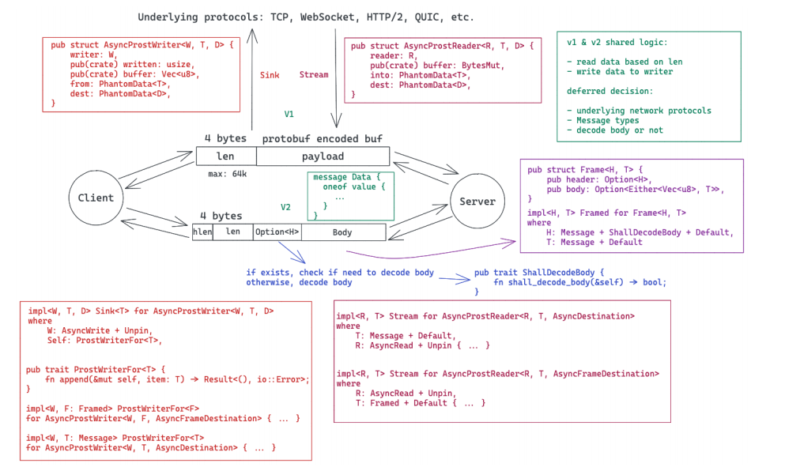
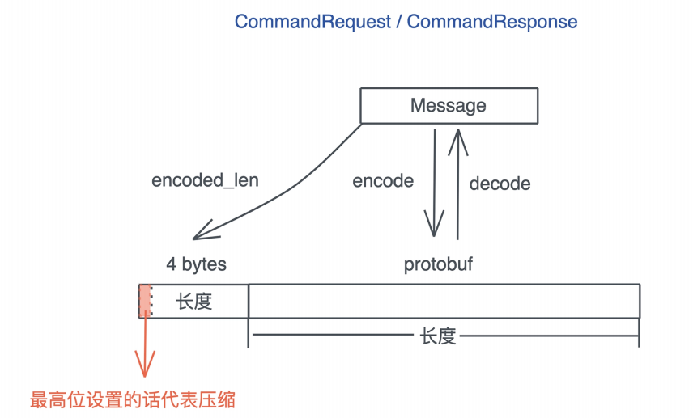

# 阶段实操: 构建一个简单的KV Server - 网络处理

经历了基础篇和进阶篇中的构建和优化, 到现在我们的KV Server核心功能已经比较完善了, 不知道你与没有注意, 之前一直在使用的一个神秘的库async-prost库, 我们神奇的完成了TCP frame的封包和解包, 是怎么完成的

async-prost是仿照Jonhoo的async-bincode做的一个处理protobuf frame的库, 它可以和各种网络协议适配, 包括TCP / WebSocket / HTTP2等, 由于考虑通用性, 它的抽象级别更高, 用了大量的泛型参数, 主流程如下图:



主要的思路就是在序列化数据的时候, 添加一个头部的frame的长度, 反序列化的时候先读出头部, 获得长度, 在读取相应的数据

今天的挑战是在上一次完成KV Server的基础上, 试着不依赖async-prost, 自己处理封包和解包的逻辑, 如果你掌握了这个能力, 配合protobuf, 就可以设计出任何可以承载实际业务的协议了

## 如何定义协议的Frame?

protobuf帮我们解决了协议消息如何定义的问题, 然而一个消息和另一个消息如何区分是个伤脑筋的问题, 我们需要定义合适的分隔符

分隔符+消息数据, 就是一个Frame, 之前我们见过如何界定一个frame

很多基于TCP的协议会使用`\r\n`做分隔符, 比如FTP; 也有使用消息长度的做分隔符的, 比如gRPC; 还有混用两者的, 比如Redis的RESP; 更加复杂的如HTTP, header之间使用`\r\n`分隔, header / body之间使用`\r\n\t\n`, header中会提供body的长度等等

`\r\n`这样的分隔符, 适合协议报文是ASCII数据; 而通过长度进行分隔适合协议报文是二进制数据, 我们的KV Server承载的是protobuf是二进制, 所以在payload之前放一个长度, 来作为frame的分割

这个长度取什么大小呢? 如果使用两个字节, 那么payload最大是64k; 如果使用4个字节, payload可以到达4G, 一般的应用取四个字节就足够了, 如果你想要更灵活些, 也可以使用varint

tokio有个tokio-util库, 已经帮我们处理了和frame相关的封包解包的主要需求, 包括LineDelimited(处理`\r\n`分隔符)和LengthDelimited(处理长度分割符), 我们可以使用它的LengthDelimitedCodec尝试一下

```rust
[package]
name = "kv"
version = "0.1.0"
edition = "2021"

[dependencies]
bytes = "1" # 高效处理网络 buffer 的库
dashmap = "6.1.0" # 并发 HashMap
http = "1.2" # 我们使用 HTTP status code 所以引入这个类型库
prost = "0.9" # 处理 protobuf 的代码
rocksdb = "0.22.0"
sled = "0.34.7"
thiserror = "2.0.6" # 错误定义和处理
tracing = "0.1" # 日志处理
update = "0.0.0"

[dev-dependencies]
anyhow = "1" # 错误处理
async-prost = "0.3" # 支持把 protobuf 封装成 TCP frame
futures = "0.3" # 提供 Stream trait
tempfile = "3.14.0"
tokio = { version = "1", features = ["rt", "rt-multi-thread", "io-util", "macros", "net" ] } # 异步网络库
tokio-util = { version = "0.7.13", features = ["codec"] }
tracing-subscriber = "0.3" # 日志处理

[build-dependencies]
prost-build = "0.9" # 
```

然后创建`examples/server_with_codec.rs`文件, 添加如下代码:

```rust
use anyhow::Result;
use futures::{SinkExt, StreamExt};
use kv::{CommandRequest, MemTable, Service, ServiceInner};
use prost::Message;
use tokio::net::TcpListener;
use tokio_util::codec::{Framed, LengthDelimitedCodec};
use tracing::info;

#[tokio::main]
async fn main() -> Result<()> {
    tracing_subscriber::fmt::init();

    let service: Service = ServiceInner::new(MemTable::new()).into();
    let addr = "127.0.0.1:9527";
    let listener = TcpListener::bind(addr).await?;
    info!("Start listening on {addr}");

    loop {
        let (stream, addr) = listener.accept().await?;
        info!("Client {addr:?} connected");
        let svc = service.clone();

        tokio::spawn(async move {
            let mut stream = Framed::new(stream, LengthDelimitedCodec::new());
            while let Some(Ok(mut buf)) = stream.next().await {
                let cmd = CommandRequest::decode(&buf[..]).unwrap();
                info!("Got a new command: {cmd:?}");
                let res = svc.execute(cmd);
                buf.clear();
                res.encode(&mut buf).unwrap();
                stream.send(buf.freeze()).await.unwrap();
            }
            info!("Client {addr:?} disconnected");
        });
    }
}
```

你可以对比一下它和之前的`examples/server.rs`的差别, 主要改动了和这一行

```rust
// let mut stream = AsyncProstStream::<_, CommandRequest, CommandResponse, _>:
let mut stream = Framed::new(stream, LengthDelimitedCodec::new());
```

你是不是有些疑惑, 为什么客户端没做什么修改也能和服务器通信? 那是因为在目前的使用场景下, 使用AsyncProst的客户端兼容LengthDelimitCodec

## 如何撰写Frame的代码?

LengthDelimitedCodec非常好用, 它的代码也并不复杂, 非常建议你有空研究一下, 既然这一讲主要围绕网络开发来讲, 那么哦我们也来查实一下撰写字节的对Frame处理的代码把

按照前面的分析, 我们在protobuf payload前加一个四个字节的长度, 这样对端读取数据的时候, 可以先读四个数据, 然后根据读到的长度, 进一步满足这个长度的数据, 之后就可以用相应的数据结构解包了

为了更贴近实际, 我们把四字节长度的最高位拿出来作为是否压缩的信号, 如果设置了, 代表后续的payload是gzip压缩过的protobuf, 否则直接是protobuf:



按照惯例, 还是先来定义这个逻辑的trait

```rust
use bytes::BytesMut;
use prost::Message;

use crate::KvError;

pub trait FrameCoder
where
    Self: Message + Sized + Default,
{
    /// 把一个Message encode成一个frame
    fn encode_frame(&self, buf: &mut BytesMut) -> Result<(), KvError>;

    /// 把一个完成的frame decode成一个Message
    fn decode_frame(buf: &mut BytesMut) -> Result<Self, KvError>;
}
```

定义了两个方法

- encode_frame可以把诸如CommandRequest这样的消息封装成一个frame, 写入传进来的BytesMut
- decode_frame可以把收到的一个完整的, 放在BytesMut中的数据, 封装成诸如CommandRequest这样的消息

如果要实现这个trait, Self需要实现了prost::Message, 大小是固定的, 并且实现了Default(prost的需求)

好我们在写实现代码, 首先创建`src/network`目录, 添加文件

因为要处理gzip压缩, 还需要在toml文件中引入flate2, 因为今天这一讲引入了网络相关的操作主句结构, 我们需要把tokio从dev-dependencies移动到dependencies里, 为了简单起见, 就用full features

```toml
[package]
name = "kv"
version = "0.1.0"
edition = "2021"

[dependencies]
bytes = "1" # 高效处理网络 buffer 的库
dashmap = "6.1.0" # 并发 HashMap
flate2 = "1.0.35"
http = "1.2" # 我们使用 HTTP status code 所以引入这个类型库
prost = "0.9" # 处理 protobuf 的代码
sled = "0.34.7"
thiserror = "2.0.6" # 错误定义和处理
tokio = { version = "1", features = ["full"] }
tracing = "0.1" # 日志处理
update = "0.0.0"
tracing-subscriber = "0.3" # 日志处理
anyhow = "1" # 错误处理

[dev-dependencies]
async-prost = "0.3" # 支持把 protobuf 封装成 TCP frame
futures = "0.3" # 提供 Stream trait
tempfile = "3.14.0"
tokio-util = { version = "0.7.13", features = ["codec"] }

[build-dependencies]
prost-build = "0.9" # 
```

然后在`src/network/frame.rs`中添加实现代码

```rust
use std::io::{Read, Write};

use bytes::{Buf, BufMut, BytesMut};
use flate2::{read::GzDecoder, write::GzEncoder, Compression};
use prost::Message;
use tracing::debug;

use crate::{CommandRequest, CommandResponse, KvError};

/// 长度整个占用4个字节
pub const LEN_LEN: usize = 4;

/// 长度占31bit, 所以最大的frame是2G
pub const MAX_FRAME: usize = 2 * 1024 * 1024 * 1024;

/// 如果payload超过1436字节 就压缩
pub const COMPRESSION_LIMIT: usize = 1436;

/// 代表压缩的bit(整个4字节的最高位)
pub const COMPRESSION_BIT: usize = 1 << 31;

pub trait FrameCoder
where
    Self: Message + Sized + Default,
{
    /// 把一个Message encode成一个frame
    fn encode_frame(&self, buf: &mut BytesMut) -> Result<(), KvError> {
        let size = self.encoded_len();

        if size > MAX_FRAME {
            return Err(KvError::FrameError);
        }

        // 我们先写入长度, 如果需要压缩, 在重写压缩后的长度
        buf.put_u32(size as _);

        if size > COMPRESSION_LIMIT {
            let mut buf1 = Vec::with_capacity(size);
            self.encode(&mut buf1)?;

            // BytesMut支持逻辑上的split(之后还能unsplit)
            // 所以我们先把长度中4字节长度, 清除
            let payload = buf.split_off(LEN_LEN);
            buf.clear();

            // 处理gzip压缩, 具体可以参考flate2文档
            let mut encoder = GzEncoder::new(payload.writer(), Compression::default());
            encoder.write_all(&buf1[..])?;

            // 压缩完成后, 从gzip encode中吧BytesMut在拿回来
            let payload = encoder.finish()?.into_inner();
            debug!("Encode a frame: size: {}({})", size, payload.len());

            // 写入压缩后的长度
            buf.put_u32((payload.len() | COMPRESSION_BIT) as _);

            // 把BytesMut在合并回来
            buf.unsplit(payload);

            Ok(())
        } else {
            self.encode(buf)?;
            Ok(())
        }
    }

    /// 把一个完成的frame decode成一个Message
    fn decode_frame(buf: &mut BytesMut) -> Result<Self, KvError> {
        // 先取四个字节
        let header = buf.get_u32() as usize;
        let (len, compressed) = decode_header(header);
        debug!("Got a frame: msg len {}, compressed {}", len, compressed);

        if compressed {
            // 解压缩
            let mut decoder = GzDecoder::new(&buf[..len]);
            let mut buf1 = Vec::with_capacity(len * 2);
            decoder.read_to_end(&mut buf1)?;
            buf.advance(len);

            // decode成相应详细
            Ok(Self::decode(&buf1[..buf1.len()])?)
        } else {
            let msg = Self::decode(&buf[..len])?;
            buf.advance(len);
            Ok(msg)
        }
    }
}

impl FrameCoder for CommandRequest {}

impl FrameCoder for CommandResponse {}

pub fn decode_header(header: usize) -> (usize, bool) {
    let len = header & !COMPRESSION_BIT;
    let compressed = header & COMPRESSION_BIT == COMPRESSION_BIT;
    (len, compressed)
}
```

这段代码本身不难理解, 我们直接为FrameCoder提供了缺省实现, 然后CommandRequest / CommandResponse做了空实现, 其中使用了之前介绍过的bytes库里的BytesMut, 以及新引入的GzEncoder / GzDecoder, 最后还写了一个辅助函数decode_header, 让decode_frame的代码更直观一些

如果你有些疑惑为什么COMPRESSION_LIMIT设成1436?

这是因为以太网的MTU是1500, 除去IP头20字节, TCP头20字节, 还剩下1460; 一般TCP包会包含一些Option(比如timestamp), IP包也可能包含, 所以我们预留20字节; 在减去4字节的长度就是1436, 不用分片的最大消息长度, 如果大于这个, 很可能会导致分片, 我们就干脆压缩一下

现在CommandRequest / CommandResponse就可以做frame级别的处理了, 我们写一些测试验证是否可以工作, 还是在这个文件中, 添加测试代码

```rust
#[cfg(test)]
mod tests {
    use super::*;
    use crate::Value;
    use bytes::Bytes;

    #[test]
    fn command_request_encode_decode_should_work() {
        let mut buf = BytesMut::new();

        let cmd = CommandRequest::new_hdel("t1", "k1");

        cmd.encode_frame(&mut buf).unwrap();

        // 最高位没设置
        assert_eq!(is_compressed(&buf), false);

        let cmd1 = CommandRequest::decode_frame(&mut buf).unwrap();
        assert_eq!(cmd, cmd1);
    }

    #[test]
    fn command_response_encode_decode_should_work() {
        let mut buf = BytesMut::new();

        let values: Vec<Value> = vec![1.into(), "hello".into(), b"data".into()];

        let res: CommandResponse = values.into();

        res.encode_frame(&mut buf).unwrap();

        // 最高位长度没设置
        assert!(!is_compressed(&buf));

        let res1 = CommandResponse::decode_frame(&mut buf).unwrap();

        assert_eq!(res, res1);
    }

    fn is_compressed(data: &[u8]) -> bool {
        if let [v] = data[..1] {
            v >> 7 == 1
        } else {
            false
        }
    }
}
```

这个测试代码里面有从`[u8; N]`到Value`(b"data".into())`以及从Bytes到Value的转换, 所以我们需要在`src/pb/mod.rs`里添加From trait的相应实现

```rust
impl<const N: usize> From<&[u8; N]> for Value {
    fn from(buf: &[u8; N]) -> Self {
        Bytes::copy_from_slice(&buf[..]).into()
    }
}
impl From<Bytes> for Value {
    fn from(buf: Bytes) -> Self {
        Self {
            value: Some(value::Value::Binary(buf)),
        }
    }
}
```

运行cargo test, 所有测试都可以通过

到这里, 我们就完成了Frame的序列化(encode_frame)和反序列化(decode_frame), 并且用测试确保了它的正确性, 做网络开发的是哦户, 要尽可能的实现逻辑和IO的分离, 这样有助于可测试性以及应对IO层的变更, 目前这个代码没有触及任何的socket IO相关的内存, 只是纯逻辑, 接下来我们要将它和哦我们用于处理服务器客户端的TcpStream练习起来

再进一步写网络相关的代码之前, 还有一个问题需要解决: docode_frame函数使用的BytesMut, 是如何从socket里拿出来的, 显然先读四个字节, 取出长度N, 然后在读N个字节, 这个细节和frame关系很大, 所以还需要在`src/network/frame.rs`里写个辅助函数read_frame

