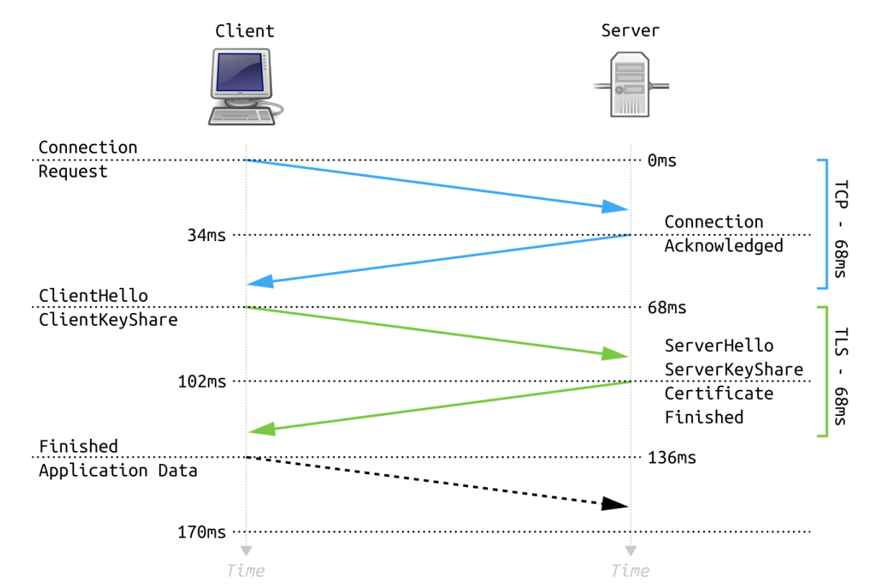
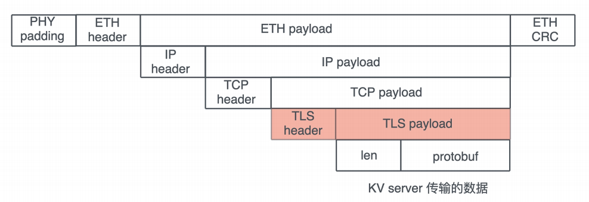

# 阶段实操: 构建一个简单的KV Server - 网络安全

上一节我们完成了KV Server整个网络部分的构建, 而安全是网络密不可分的组成部分, 在构建应用程序的时候, 一定要把网络安全考虑进去, 当然如果不考虑机智的性能, 我们可以使用诸如gRPC这样的系统, 在提供良好性能的基础还是那个, 它还通过TLS保证了安全性

那么, 当我们的应用架构在TCP上时, 如何使用TLS来保证客户端和服务端之间的安全性呢?

## 生成x509整数

想要使用TLS, 我们首先需要x509整数, TLS需要x509整数让客户端验证服务器是否是一个受信的服务器, 甚至服务器验证客户端, 确认对方是一个受信的客服端

为了方便测试, 我们要有能力生成自己的CA证书, 服务端证书, 甚至是客户端证书, 证书的生成细节我们就不详细介绍了,  有一个certify的库, 可以用来生成各种证书

```toml
[dev-dependencies]
...
certify = "0.3"
...
```

然后在根目录下常见fixtures目录存放证书, 在创建`examples/gen_cert.rs`文件, 添加一下代码

```rust
use tokio::fs;

use anyhow::{Ok, Result};
use certify::{generate_ca, generate_cert, load_ca, CertType, CA};

struct CertPem {
    cert_type: CertType,
    cert: String,
    key: String,
}

#[tokio::main]
async fn main() -> Result<()> {
    let pem = create_ca()?;
    gen_files(&pem).await?;
    let ca = load_ca(&pem.cert, &pem.key)?;
    let pem = create_cert(&ca, &["kvserver.acme.inc"], "Acme KV server", false)?;
    gen_files(&pem).await?;
    let pem = create_cert(&ca, &[], "awesome-device-id", true)?;
    gen_files(&pem).await?;
    Ok(())
}

fn create_ca() -> Result<CertPem> {
    let (cert, key) = generate_ca(
        &["acme.inc"],
        "CN",
        "Acme Inc.",
        "Acme CA.",
        None,
        Some(10 * 365),
    )?;
    Ok(CertPem {
        cert_type: CertType::CA,
        cert,
        key,
    })
}

fn create_cert(ca: &CA, domains: &[&str], cn: &str, is_client: bool) -> Result<CertPem> {
    let (days, cert_type) = if is_client {
        (Some(365), CertType::Client)
    } else {
        (Some(5 * 365), CertType::Server)
    };

    let (cert, key) = generate_cert(ca, domains, "CN", "Acme Inc.", cn, None, is_client, days)?;

    Ok(CertPem {
        cert_type,
        cert,
        key,
    })
}

async fn gen_files(pem: &CertPem) -> Result<()> {
    let name = match pem.cert_type {
        CertType::Client => "client",
        CertType::Server => "server",
        CertType::CA => "ca",
    };

    fs::write(format!("fixtures/{name}.cert"), pem.cert.as_bytes()).await?;
    fs::write(format!("fixtures/{name}.ket"), pem.key.as_bytes()).await?;
    Ok(())
}
```

这个代码很简单, 它生成了一个CA证书, 然后在生成服务器和客户端的证书, 全部存入刚创建的fixtures. 你需要运行这个文件, 带阿米我们会在测试中用到这些证书和密钥

## 在KV Server中使用TLS

TLS是目前最主要的应用层协议, 被广泛用于保护架构在TCP之上的, 比如MySQL, HTTP等协议, 一个网络应用, 即使是在内网使用, 如果没有安全协议来保护, 都是很危险的

下图展示了客户端和服务器进行TLS握手的过程:



对于KV Server来说, 使用TLS之后, 整个协议的数据封装如下图所示:



所以我们今天要做的就是在上一讲的基础上, 添加TLS支持, 使得KV Server的客户端服务器之间的通讯被严格保护起来, 确保最大程度上的安全, 免遭第三方的偷窥, 篡改以及仿造

 估计很多人一听TLS或者SSL, 就头皮发麻, 因为之前跟openssl打交道有过很多不好的经历, openssl的代码库太复杂, API不友好, 编译链接都很费劲

不过在Rust下使用TLS的体验还是很不错的, Rust对openssl有何不错的封装, 也有不依赖openssl用Rust撰写的rustls, tokio进一步提供了符合tokio生态圈的tls支持, 有openssl版本和rustls版本可选

我们今天就用tokio-rustls来撰写TLS的支持, 乡音你在实现过程中可以看到, 在引用程序中加入TLS协议来保护网络层, 是多么轻松的一件事

现在toml中添加tokio-rustls依赖

然后创建`src/network/tls.rs`文件, 撰写如下代码:

```rust
use std::{io::Cursor, sync::Arc};

use tokio::io::{AsyncRead, AsyncWrite};
use tokio_rustls::rustls::{internal::pemfile, Certificate, ClientConfig, ServerConfig};
use tokio_rustls::rustls::{AllowAnyAuthenticatedClient, NoClientAuth, PrivateKey, RootCertStore};
use tokio_rustls::webpki::DNSNameRef;
use tokio_rustls::TlsConnector;
use tokio_rustls::{
    client::TlsStream as ClientTlsStream, server::TlsStream as ServerTlsStream, TlsAcceptor,
};

use crate::KvError;

/// KV Server自己的ALPN(Application-Layer Protocol Negotiation)
const ALPN_KV: &str = "kv";

/// 存放TLS ServerConfig并提供方法accept把底层的协议转换成TLS
#[derive(Clone)]
pub struct TlsServerAcceptor {
    inner: Arc<ServerConfig>,
}

/// 存放TLS Client并提供方法connect把底层协议转换成TLS
#[derive(Clone)]
pub struct TlsClientConnector {
    pub config: Arc<ClientConfig>,
    pub domain: Arc<String>,
}

impl TlsClientConnector {
    /// 加载client cert / CA cert, 生成ClientConfig
    pub fn new(
        domain: impl Into<String>,
        identity: Option<(&str, &str)>,
        server_ca: Option<&str>,
    ) -> Result<Self, KvError> {
        let mut config = ClientConfig::new();

        // 如果有客户端证书, 加载
        if let Some((cert, key)) = identity {
            let certs = load_certs(cert)?;
            let key = load_key(key)?;
            // config.set
        }

        // 记载本地信任的根证书链
        config.root_store = match rustls_native_certs::load_native_certs() {
            Ok(store) | Err((Some(store), _)) => store,
            Err((None, error)) => return Err(error.into()),
        };

        // 如果有签署服务器的CA证书, 则加载它, 这样服务器证书不咋根证书链
        // 但是这个CA证书能验证它
        if let Some(cert) = server_ca {
            let mut buf = Cursor::new(cert);
            config.root_store.add_pem_file(&mut buf).unwrap();
        }

        Ok(Self {
            config: Arc::new(config),
            domain: Arc::new(domain.into()),
        })
    }

    /// 触发TLS协议, 把底层的stream 转换成TLS stream
    pub async fn connect<S>(&self, stream: S) -> Result<ClientTlsStream<S>, KvError>
    where
        S: AsyncRead + AsyncWrite + Unpin + Send,
    {
        let dns = DNSNameRef::try_from_ascii_str(self.domain.as_str())
            .map_err(|_| KvError::Internal("Internal DNS name".into()))?;

        let stream = TlsConnector::from(self.config.clone())
            .connect(dns, stream)
            .await?;

        Ok(stream)
    }
}

impl TlsServerAcceptor {
    /// 加载 server cert / CA cert，生成 ServerConfig
    pub fn new(cert: &str, key: &str, client_ca: Option<&str>) -> Result<Self, KvError> {
        let certs = load_certs(cert)?;
        let key = load_key(key)?;

        let mut config = match client_ca {
            None => ServerConfig::new(NoClientAuth::new()),
            Some(cert) => {
                // 如果客户端是某个CA证书签发的, 则把这个CA证书加载到信任链中
                let mut cert = Cursor::new(cert);
                let mut client_root_cert_store = RootCertStore::empty();
                client_root_cert_store
                    .add_pem_file(&mut cert)
                    .map_err(|_| KvError::CertifcateParseError("CA", "cert"))?;
                let client_auth = AllowAnyAuthenticatedClient::new(client_root_cert_store);
                ServerConfig::new(client_auth)
            }
        };

        // 加载服务器证书
        config
            .set_single_cert(certs, key)
            .map_err(|_| KvError::CertifcateParseError("server", "cert"))?;
        config.set_protocols(&[Vec::from(ALPN_KV)]);

        Ok(Self {
            inner: Arc::new(config),
        })
    }

    /// 触发 TLS 协议，把底层的 stream 转换成 TLS stream
    pub async fn accept<S>(&self, stream: S) -> Result<ServerTlsStream<S>, KvError>
    where
        S: AsyncRead + AsyncWrite + Unpin + Send,
    {
        let acceptor = TlsAcceptor::from(self.inner.clone());
        Ok(acceptor.accept(stream).await?)
    }
}

fn load_certs(cert: &str) -> Result<Vec<Certificate>, KvError> {
    let mut cert = Cursor::new(cert);
    pemfile::certs(&mut cert).map_err(|_| KvError::CertifcateParseError("server", "cert"))
}

fn load_key(key: &str) -> Result<PrivateKey, KvError> {
    let mut cursor = Cursor::new(key);

    // 先尝试使用PKCS8加载私钥
    if let Ok(mut keys) = pemfile::pkcs8_private_keys(&mut cursor) {
        if !keys.is_empty() {
            return Ok(keys.remove(0));
        }
    }

    // 在尝试加载RSA key
    cursor.set_position(0);
    if let Ok(mut keys) = pemfile::rsa_private_keys(&mut cursor) {
        if !keys.is_empty() {
            return Ok(keys.remove(0));
        }
    }

    // 不支持的私钥类型
    Err(KvError::CertifcateParseError("private", "key"))
}
```

这个代码创建了两个数据结构TlsServerAcceptor / TlsClientConnector, 它的主要作用是根据提的整数, 来生成tokio-tls需要的ServerConfig / ClientConfig

因为TLS需要验证证书CA, 所以还需要加载CA证书, 虽然平时在做Web开发的时候, 我们都只实用唵服务器证书, 但其实TLS是双向验证, 服务器也可以验证客户端的整数是否是它认识的CA签发的

然后处理完config后, 这段代码的核心逻辑其实就是客户端的connect方法和服务器的Accept方法, 它们都接受一个的stream, 

```rust
/// 触发 TLS 协议，把底层的 stream 转换成 TLS stream
pub async fn connect<S>(&self, stream: S) -> Result<ClientTlsStream<S>, KvError>
where
    S: AsyncRead + AsyncWrite + Unpin + Send,
{
    let dns = DNSNameRef::try_from_ascii_str(self.domain.as_str())
        .map_err(|_| KvError::Internal("Invalid DNS name".into()))?;

    let stream = TlsConnector::from(self.config.clone())
        .connect(dns, stream)
        .await?;

    Ok(stream)
}

/// 触发 TLS 协议，把底层的 stream 转换成 TLS stream
pub async fn accept<S>(&self, stream: S) -> Result<ServerTlsStream<S>, KvError>
where
    S: AsyncRead + AsyncWrite + Unpin + Send,
{
    let acceptor = TlsAcceptor::from(self.inner.clone());
    Ok(acceptor.accept(stream).await?)
}
```

在使用TlsConnector或者TlsAcceptor处理完connect / accept之后, 我们得到一个TlsStream,它也满足AsyncRead + AsyncWrite + Unpin + Send, 后续的操作再其上完成了

我们写下测试代码

```rust
#[cfg(test)]
pub mod tls_utils {
    use crate::{KvError, TlsClientConnector, TlsServerAcceptor};

    const CA_CERT: &str = include_str!("../../fixtures/ca.cert");
    const CLIENT_CERT: &str = include_str!("../../fixtures/client.cert");
    const CLIENT_KEY: &str = include_str!("../../fixtures/client.key");
    const SERVER_CERT: &str = include_str!("../../fixtures/server.cert");
    const SERVER_KEY: &str = include_str!("../../fixtures/server.key");

    pub fn tls_connector(client_cert: bool) -> Result<TlsClientConnector, KvError> {
        let ca = Some(CA_CERT);
        let client_identity = Some((CLIENT_CERT, CLIENT_KEY));

        match client_cert {
            false => TlsClientConnector::new("kvserver.acme.inc", None, ca),
            true => TlsClientConnector::new("kvserver.acme.inc", client_identity, ca),
        }
    }

    pub fn tls_acceptor(client_cert: bool) -> Result<TlsServerAcceptor, KvError> {
        let ca = Some(CA_CERT);
        match client_cert {
            true => TlsServerAcceptor::new(SERVER_CERT, SERVER_KEY, ca),
            false => TlsServerAcceptor::new(SERVER_CERT, SERVER_KEY, None),
        }
    }
}

#[cfg(test)]
mod tests {
    use super::tls_utils::tls_acceptor;
    use crate::network::tls::tls_utils::tls_connector;
    use anyhow::Result;
    use std::net::SocketAddr;
    use std::sync::Arc;
    use tokio::{
        io::{AsyncReadExt, AsyncWriteExt},
        net::{TcpListener, TcpStream},
    };

    #[tokio::test]
    async fn tls_should_work() -> Result<()> {
        let addr = start_server(false).await?;
        let connector = tls_connector(false)?;
        let stream = TcpStream::connect(addr).await?;
        let mut stream = connector.connect(stream).await?;
        stream.write_all(b"hello world!").await?;
        let mut buf = [0; 12];
        stream.read_exact(&mut buf).await?;
        assert_eq!(&buf, b"hello world!");

        Ok(())
    }

    #[tokio::test]
    async fn tls_with_client_cert_should_work() -> Result<()> {
        let addr = start_server(true).await?;
        let connector = tls_connector(true)?;
        let stream = TcpStream::connect(addr).await?;
        let mut stream = connector.connect(stream).await?;
        stream.write_all(b"hello world!").await?;
        let mut buf = [0; 12];
        stream.read_exact(&mut buf).await?;
        assert_eq!(&buf, b"hello world!");

        Ok(())
    }

    #[tokio::test]
    async fn tls_with_bad_domain_should_not_work() -> Result<()> {
        let addr = start_server(false).await?;

        let mut connector = tls_connector(false)?;
        connector.domain = Arc::new("kvserver1.acme.inc".into());
        let stream = TcpStream::connect(addr).await?;
        let result = connector.connect(stream).await;

        assert!(result.is_err());

        Ok(())
    }

    async fn start_server(client_cert: bool) -> Result<SocketAddr> {
        let acceptor = tls_acceptor(client_cert)?;

        let echo = TcpListener::bind("127.0.0.1:0").await.unwrap();
        let addr = echo.local_addr().unwrap();

        tokio::spawn(async move {
            let (stream, _) = echo.accept().await.unwrap();
            let mut stream = acceptor.accept(stream).await.unwrap();
            let mut buf = [0; 12];
            stream.read_exact(&mut buf).await.unwrap();
            stream.write_all(&buf).await.unwrap();
        });

        Ok(addr)
    }
}
```

这段测试代码使用了include_str宏, 在编译器把问价你还在成字符串放在RODATA端, 我们测试了三种情况: 标准的TLS练剑, 带有客户端证书的TLS连接, 以及客户端提供错误的域名的情况

## 让KV client / server支持TLS

由于我们一路上以来良好的接口设计, 尤其是ProstClientStream / ProstServerStream都接受泛型参数, 使得TLS带阿米可以无缝接入, 比如客户端

```rust
// 新加的代码
let connector = TlsClientConnector::new("kvserver.acme.inc", None, Some(ca_cert))?;

let stream = TcpStream::connect(addr).await?;

// 新加的代码
let stream = connector.connect(stream).await?;

let mut client = ProstClientStream::new(stream);
```

仅仅需要把传给ProstClientStream的stream, 从TcpStream换成生成的TlsStream, 就无缝支持了TLS

**server**

```rust
use anyhow::Result;
use kv::{MemTable, ProstServerStream, Service, ServiceInner};
use tokio::net::TcpListener;
use tracing::info;

#[tokio::main]
async fn main() -> Result<()> {
    tracing_subscriber::fmt::init();
    let addr = "127.0.0.1:9527";

    // 以后从配置文件取
    let server_cert = include_str!("../fixtures/server.cert");
    let server_key = include_str!("../fixtures/server.key");

    let acceptor = TlsServerAcceptor::new(server_cert, server_key, None)?;
    let service: Service = ServiceInner::new(MemTable::new()).into();
    let listener = TcpListener::bind(addr).await?;
    info!("Start listening on {}", addr);
    loop {
        let tls = acceptor.clone();
        let (stream, addr) = listener.accept().await?;
        info!("Client {:?} connected", addr);
        let stream = tls.accept(stream).await?;
        let stream = ProstServerStream::new(stream, service.clone());
        tokio::spawn(async move { stream.process().await });
    }
}
```

**client**

```rust
use anyhow::Result;
use kv::{CommandRequest, ProstClientStream, TlsClientConnector};
use tokio::net::TcpStream;
use tracing::info;

#[tokio::main]
async fn main() -> Result<()> {
    tracing_subscriber::fmt::init();

    let ca_cert = include_str!("../fixtures/client.cert");

    let addr = "127.0.0.1:9527";

    let connector = TlsClientConnector::new("kvserver.acme.inc", None, Some(ca_cert))?;
    let stream = TcpStream::connect(addr).await?;
    let stream = connector.connect(stream).await?;

    let mut client = ProstClientStream::new(stream);

    // HSET
    let cmd = CommandRequest::new_hset("table1", "hello", "world".to_string().into());

    // 发送命令
    let data = client.execute(cmd).await?;

    info!("Got response {data:?}");

    Ok(())
}
```

现在我们的KV Server已经具备了足够的安全性, 以后等我们使用配置文件, 就可以根据配置文件读取证书的私钥, 这样可以在部署的时候, 才从vault中获取私钥, 既保证了灵活性, 又能保证系统自身的安全

## 小结

网路安全是开发网络相关的应用程序中非常重要的一环, 虽然KV Serve这样的服务基本上会运行在雨大努努受控的网络环境中,不会对internet提供服务, 然而云端内部的安全性也不容有失, 你不希望数据来流动的过程中被篡改

TLS很好的解决了安全性的问题, 可以保证整个传输过程中的机密性和完整性, 如果使用客户端证书的话, 还可以做一定程度上的客户端合法性验证, 比如你可以在云端为所有有权访问KV Server的客户端签发客户端证书, 这样只要客户端的私钥不泄露, 就只有拥有证书的客户端才能访问KV Server

