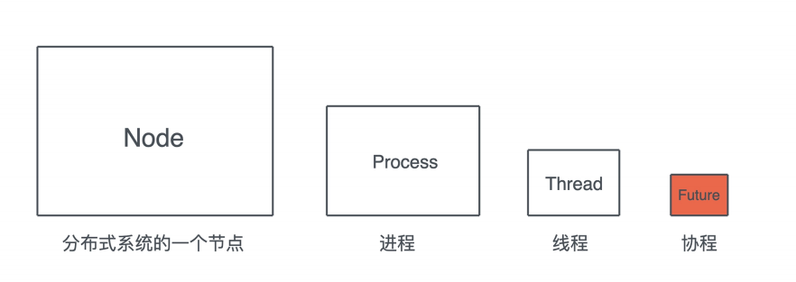
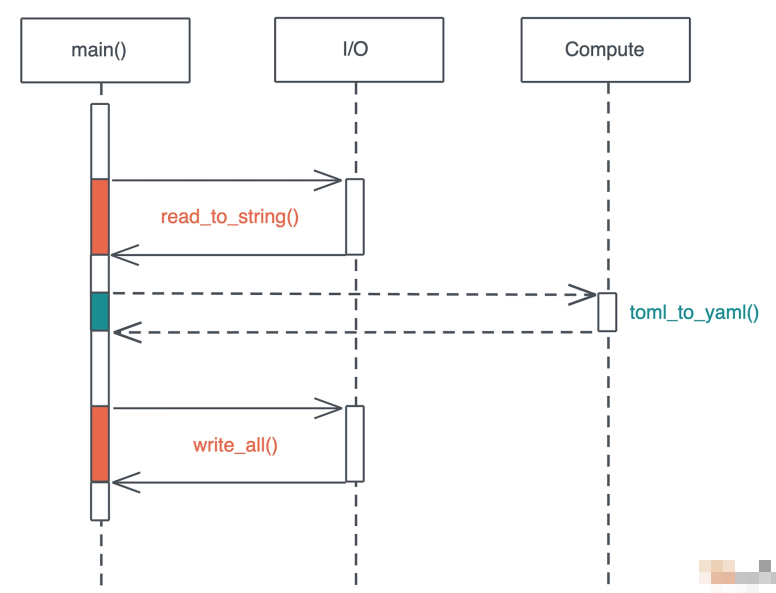
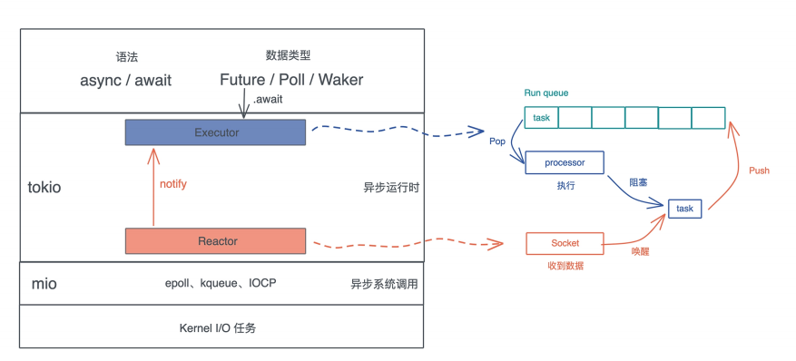

# 异步处理: Future是什么? 它和async/await是什么关系?

通过前面的学习, 我们对并发处理, 尤其是常用的并发原语, 有了一个比较清晰的认识, 并发原语是并发任务之间同步的手段, 今天我们要学习的Future以及在更高层次上处理Future的async/await, 是产生和运行并发任务的手段

它的粒度从大到小如图所示:



在之前的课程中, 我们大量引用了线程这种并发工具, 在KV Server的构建过程中, 也通过async/await用了了Future这样的无栈协程

其实Rust的Future跟JavaScript的Promise非常类似

如果你熟悉JavaScript, 应该熟悉Promise的概念, 它代表了在未来才能得到结果的值, Promise一般存在三个状态

- 初始状态, Promise还未执行
- 等待(pending)状态, Promise已经运行, 但还未结束
- 结束状态, Promise成功解析出一个值, 或者执行失败

只不过JavaScript的Promise和线程类似, 一旦创建就开始执行, 对Promise await只是为了等待并获取解析出来的值; 而Rust的Future, 只有在主动await后才开始执行

讲到这里你也看出来, 谈Future的时候, 我们总会谈到async/await, 一般而言, async定义了一个可以并发执行的任务, 而await则触发这个任务的并发执行, 大多数语言, 包含Rust, async/await都是一个语法糖, 它们使用状态机将Promise/Future这样的结构包装起来进行处理

这一讲我们先把内部实现放在一边, 主要聊Future/async/await的基本概念和使用方法, 之后我们再来介绍它们的原理

## 为什么需要Future

首先, 谈一谈为什么需要Future这样的并发结构

在Future出现之前, 我们的Rust代码都是同步的, 也就是说, 当你执行一个函数, CPU处理完函数中的每一个指令才会返回, 如果这个函数里有I/O操作, 实际上, 操作系统会把函数和对应的线程挂起, 直到IO操作的完成, 才恢复这个线程, 并从挂起的位置继续执行下去

这个模型非常简单直观, 代码是一行行执行下去的, 开发者并不需要考虑哪些操作会阻塞, 哪些不会, 只关心它的业务逻辑就好

 然后随着CPU技术的不断发展, 新世纪应用软件的主要矛盾不再是CPU算力不足, 而是过于充沛的CPU算力和提升缓慢的IO速度之间的矛盾, 如果有大量的IO操作, 你的程序大部分时间并没有在运算, 而是不断的IO

我们来看一个例子:

```rust
use anyhow::Result;
use serde_yaml::Value;
use std::fs;
fn main() -> Result<()> {
    // 读取 Cargo.toml，IO 操作 1
    let content1 = fs::read_to_string("./Cargo.toml")?;
    // 读取 Cargo.lock，IO 操作 2
    let content2 = fs::read_to_string("./Cargo.lock")?;
    // 计算
    let yaml1 = toml2yaml(&content1)?;
    let yaml2 = toml2yaml(&content2)?;
    // 写入 /tmp/Cargo.yml，IO 操作 3
    fs::write("/tmp/Cargo.yml", &yaml1)?;
    // 写入 /tmp/Cargo.lock，IO 操作 4
    fs::write("/tmp/Cargo.lock", &yaml2)?;
    // 打印
    println!("{}", yaml1);
    println!("{}", yaml2);
    Ok(())
}
fn toml2yaml(content: &str) -> Result<String> {
    let value: Value = toml::from_str(&content)?;
    Ok(serde_yaml::to_string(&value)?)
}
```

这段代码读取Cargo.toml和Cargo.lock将其转换成yaml, 在分别写入到/tmp下

虽然说这段代码并没有问题, 但性能有很大的问题, 在读Cargo.toml的时候, 整个主线程被阻塞, 直到Cargo.toml读完, 才能继续下一个待处理文件, 整个主线程, 只有在运行toml2yaml的时间片内, 才真正的执行计算任务, 之前的读取文件以及之后的写入文件, CPU都在闲置



当然, 你会辩解, 在读文件的过程中, 我们不得不等待, 因为toml2yaml函数的执行有赖于读取文件的结果, 但是这里还有很大的CPU浪费: 我们读完第一个文件才开始读第二个文件, 有没有可能两个文件同时读取呢? 

这并不难, 我们就把文件读取和写入的操作放入单独的线程中执行

```rust
use anyhow::{anyhow, Result};
use serde_yaml::Value;
use std::{
    fs,
    thread::{self, JoinHandle},
};
/// 包装一下 JoinHandle，这样可以提供额外的方法
struct MyJoinHandle<T>(JoinHandle<Result<T>>);
impl<T> MyJoinHandle<T> {
    /// 等待 thread 执行完（类似 await）
    pub fn thread_await(self) -> Result<T> {
        self.0.join().map_err(|_| anyhow!("failed"))?
    }
}
fn main() -> Result<()> {
    // 读取 Cargo.toml，IO 操作 1
    let t1 = thread_read("./Cargo.toml");
    // 读取 Cargo.lock，IO 操作 2
    let t2 = thread_read("./Cargo.lock");
    let content1 = t1.thread_await()?;
    let content2 = t2.thread_await()?;
    // 计算
    let yaml1 = toml2yaml(&content1)?;
    let yaml2 = toml2yaml(&content2)?;
    // 写入 /tmp/Cargo.yml，IO 操作 3
    let t3 = thread_write("/tmp/Cargo.yml", yaml1);
    // 写入 /tmp/Cargo.lock，IO 操作 4
    let t4 = thread_write("/tmp/Cargo.lock", yaml2);
    let yaml1 = t3.thread_await()?;
    let yaml2 = t4.thread_await()?;
    fs::write("/tmp/Cargo.yml", &yaml1)?;
    fs::write("/tmp/Cargo.lock", &yaml2)?;
    // 打印
    println!("{}", yaml1);
    println!("{}", yaml2);
    Ok(())
}
fn thread_read(filename: &'static str) -> MyJoinHandle<String> {
    let handle = thread::spawn(move || {
        let s = fs::read_to_string(filename)?;
        Ok::<_, anyhow::Error>(s)
    });
    MyJoinHandle(handle)
}
fn thread_write(filename: &'static str, content: String) -> MyJoinHandle<String>{
    let handle = thread::spawn(move || {
        fs::write(filename, &content)?;
        Ok::<_, anyhow::Error>(content)
    });
    MyJoinHandle(handle)
}
fn toml2yaml(content: &str) -> Result<String> {
    let value: Value = toml::from_str(&content)?;
    Ok(serde_yaml::to_string(&value)?)
}
```

这样, 读取或者写入多个文件的执行过程并发执行, 是等待的时间大大缩减

但是, 如果同时读取100个文件呢? 显然创建100个线程来做这样的事情不是一个好主意, 在操作系统中, 线程的数量是有限的, 创建/阻塞/唤醒/销毁线程, 都设计不少动作, 每个线程都会被分配一个不小的调用栈, 所以从CPU和内存的角度来看, 创建过多的线程会大大增加系统的开销

其实, 绝大多数的操作系统对I/O操作提供了非阻塞的操作, 也就是说, 你可以发起一个读取的指令, 自己处理类似的EWOULCBLOCK这样的错误码, 来更好在同一个线程中处理多个文件的IO, 而不是依赖操作系统通过调度来帮助完成这件事

不过这样就意味着, 你需要定义合适的数据结构来追踪每个文件的读取, 在用户态进行相应的调度, 阻塞等待IO的数据结构的运行, 让没有等待IO的数据结构得到机会使用CPU, 以及当IO操作后, 恢复等待的IO的数据结构的运行等等, 这样的操作粒度更小, 可以最大程度的利用CPU资源, 这就是类似Future这样的并发结构的主要用途

然而如果这样处理, 我们需要在用户态做很多事情, 包括处理IO任务的事件通知, 创建Future, 合理的调度Future, 这些事情统统交给开发者做显然是不合理的, 所以Rust提供了相应处理手段async/await: async来更方便的生成Future, await来触发Future的调度和执行

我们看看, 同样的任务, 如何用async/await更高效的处理:

```rust
use anyhow::Result;
use serde_yaml::Value;
use tokio::{fs, try_join};

#[tokio::main]
async fn main() -> Result<()> {
    // 读取Cargo.toml
    let f1 = fs::read_to_string("../Cargo.toml");
    // 读取Cargo.lock
    let f2 = fs::read_to_string("../Cargo.lock");

    let (content1, content2) = try_join!(f1, f2)?;

    // 计算
    let yaml1 = toml2yaml(&content1)?;
    let yaml2 = toml2yaml(&content2)?;

    // 写入/tml/Cargo.yml
    let f3 = fs::write("/tmp/Cargo.yaml", &yaml1);
    // 写入/tml/Cargo.lock
    let f4 = fs::write("/tmp/Cargo.lock", &yaml2);
    try_join!(f3, f4)?;

    println!("{yaml1:?}");
    println!("{yaml2:?}");

    Ok(())
}

fn toml2yaml(content: &str) -> Result<String> {
    let value: Value = toml::from_str(&content)?;
    Ok(serde_yaml::to_string(&value)?)
}
```

在这段代码中, 我们使用了tokio::fs, 而不是std::fs, tokio::fs的文件操作都会返回一个Future, 然后可以join这些Future, 得到它们运行后的结果, join / try_join是用来轮询多个Future的宏,  它会一次处理每个Future, 遇到阻塞就处理下一个, 直到所有的Future产生结果

整个等待文件读取的时间是`max(time_for_file1, time_for_file2)`, 性能和使用线程的版本机会一致, 但是消耗的资源要少的很多

建议你好好对比一下这三个版本, 写一写运行一下, 感受它们的逻辑处理, 主要在最后的async版本中, 哦我们不能把代码写成这样:

```rust
// 读取 Cargo.toml，IO 操作 1
let content1 = fs::read_to_string("./Cargo.toml").await?;
// 读取 Cargo.lock，IO 操作 2
let content1 = fs::read_to_string("./Cargo.lock").await?;
```

这样写的话, 和第一版同步的版本没有什么区别, 因为await会运行Future直到Future执行结束之后, 所以依旧先读取Cargo.toml, 在读取Cargo.lock, 并没有达到并发的效果

## 深入了解

了解了Future在软件中的重要性, 我们来深入研究一下Future/async/await

在前面撰写代码的过程中, 不知道你有没有发现, 异步函数(async fn)的返回值是一个奇奇怪怪的`impl Future<Output>`的结构

我们知道, 一般会用impl关键字为数据结构实现triat, 也就是说在impl关键字后面的东西是一个trait, 显然Future是一个trait, 并且还有一个关联类型Output

来看一个Future的定义:

```rust
pub trait Future {
    type Output;
    fn poll(self: Pin<&mut Self>, cx: &mut Context<'_>) -> Poll<Self::Output>;
}

pub enum Poll<T> {
    Ready(T),
    Pending,
}
```

除了Output外, 它还有一个poll方法, 这个方法返回`Poll<Self::Output>`, 而Poll是个enum, 包含了Ready和Pending两个状态, 显然当Future返回Pending状态时, 活还没有干完, 但干不下去了, 需要阻塞一阵子, 等某个事件将其唤醒; 当Future返回Ready状态时, Future对应的值已经得到, 此时可以返回了

你看, 这样一个简单的数据结构, 就托起了庞大的Rust异步async/await处理生态

回到async fn的返回值我们接着说, 显然它是一个impl Future, 那么如果给我们一个普通的函数返回`impl Future<Output>`, 它的行为和async fn是不是一致呢? 来写个简单的实验:

```rust
use futures::executor::block_on;
use std::future::Future;

#[tokio::main]
async fn main() {
    let name1 = "Nyh".to_string();
    let name2 = "Lili".to_string();

    say_hello1(&name1).await;
    say_hello2(&name2).await;

    // Future除了可以使用await来执行外, 还可以直接用executor执行
    block_on(say_hello1(&name1));
    block_on(say_hello2(&name2));
}

async fn say_hello1(name: &str) -> usize {
    println!("Hello {name}");
    42
}

fn say_hello2<'fut>(name: &'fut str) -> impl Future<Output = usize> + 'fut {
    async move {
        println!("Hello {name}");
        42
    }
}
```

运行这段代码你会发现, say_hello1和say_hello2是等价的, 二者都可以使用await来执行, 也可以将其提供给一个executor来执行

这里我们见到了一个新的名字: executor

## 什么是executor?

你可以把executor大致想象成一个Future的调度器, 对于县城来说, 操作系统负责调度; 但操作系统不回去调度用户态的协程(比如Future), 所以任何使用了协程来处理并发的程序, 都需要有一个executor来负责协程的调度

很多在语言层面的支持协程的编程语言, 比如Golang/Erlang, 都自带一个用户态的调度器, Rust虽然也提供Future这样的协程, 但它在语言层面并不提供executor, 把要不要使用executor的自主权交给了开发者, 当我们的代码中不需要使用协程的时候, 不需要引入任何运行时, 而需要使用协程时, 可以在生态系统中选择最合适的我们引用的executor

常见的executor有:

- futures库自带很简单的executor, 上面的代码就使用了它的block_on函数
- tokio提供了executor, 当使用了`#[tokio::main]`时, 就隐含引入了tokio的executor
- async-std提供的executor和tokio类似
- smol提供async-executor, 主要提供了block_on

注意上面的代码中我们混用了`#[tokio::main]`和`futures::executor::block_on`, 这只是为了展示Future使用的不同方式, 在正式的代码中, 不建议混用不同的executor, 会降低程序的性能, 还可能引发奇怪的问题

当我们谈到executor, 就不得不提reactor, 它俩都是Reactor Pattern的组成部分, 作为构建高性能事件驱动系统的很典型的模式, Reactor pattern它包含三部分:

- task: 待处理任务, 任务可以被打断, 并且把控制权交给executor, 等待之后的调度
- executor: 一个调度器, 维护等待运行的任务(ready queue), 以及被阻塞的任务(wait queue)
- reactor: 维护事件队列, 当事件来临时, 通知executor唤醒某个任务等待运行

## 怎么用Future做异步处理?

理解了Reactor pattern后, Rust使用Future做异步处理的整个结构就清晰了, 我们以tokio为例子: async/await提供语法层面的支持, Future是异步任务的数据结构, 当fut.await时, executor就会调度并执行它

tokio的调度器会运行在多个线程上, 运行线程自己的ready queue上的任务(Future), 如果没有就去别的线程的调度器上偷一些过来执行, 当某个任务无法在继续取得进展, 此时Future运行的结果是Poll::Pending, 那么调度器会挂起任务, 并设置好合适的唤醒任务(Waker), 等待被ractor唤醒

而reactor会利用操作系统提供额异步IO, 比如epoll/kqueue/IOCP, 来监听操作系统的IO事件, 当遇到满足条件的事件时, 就会调用Waker.wake唤醒被挂起的Future, 这个Future会取到ready queue等待执行

整个流程如下:



我们以具体的代码示例来进一步理解这个过程:

```rust
use anyhow::Result;
use futures::{SinkExt, StreamExt};
use tokio::net::TcpListener;
use tokio_util::codec::{Framed, LinesCodec};

#[tokio::main]
async fn main() -> Result<()> {
    let addr = "0.0.0.0:8000";
    let listener = TcpListener::bind(addr).await?;
    println!("listener to :{addr}");
    loop {
        let (stream, addr) = listener.accept().await?;
        println!("Accepted :{addr}");
        tokio::spawn(async move {
            // 使用LinesCodec把TCP数据切成一行行字符串处理
            let frame = Framed::new(stream, LinesCodec::new());
            // split成writer和reader
            let (mut w, mut r) = frame.split();

            for line in r.next().await {
                // 每读到一行就价格前缀返回
                w.send(format!("I got: {}", line?)).await?;
            }

            Ok::<_, anyhow::Error>(())
        });
    }
}
```

这是一个简单的TCP服务器, 服务器每收到一个客户端的请求, 就会用tokio::spawn创建一个异步任务, 放入executor中执行, 这个异步任务接收客户端发来的按行分隔(分隔符是`\r\n`)的数据帧, 服务器每收到一行, 就价格前缀把内容也按行发回给客户端

你可以用telnet和这个服务器交互

```bash
❯ telnet localhost 8080
Trying 127.0.0.1...
Connected to localhost.
Escape character is '^]'.
hello
I got: hello
Connection closed by foreign host.
```

假设们在客户端输入了很大一行信息, 服务器在做r.next().await在执行的时候, 收不完一行的数据, 因而这个Future返回Poll::Pending,此时他被挂起, 当后续客户端的数据到达的时候, reactor会知道这个socket上又有数据了, 于是找到socket对应的Future, 将其唤醒, 继续接收数据

这样反复下去, 在Rust下使用异步处理时意见非常重要的事情, 除了几乎你可能不太熟悉的概念, 比如今天的讲到用于创建Future的async关键字, 用于执行和等待Future回字形完毕的await关键字, 以及用于调度Future执行的运行时`[tokio::main]外, 整体的代码和使用线程处理的代码完全一致, 所以它的上手难度非常低, 很容易使用

## 使用Future的注意事项

目前哦我们已经基本明白了Future运行的基本原理, 也可以在程序的不同部分自如的使用Future/async/await, 在使用的时候, 有一些不容易注意到的坑需要我们妥善的处理

### 计算密集型任务

当你要处理的任务是CPU密集型, 而非IO密集型, 更适合使用线程, 而非Future

这是因为Future的调度是协作式多任务, 也就是说除非Future主动放弃CPU, 不然它就会一值被执行, 直到运行结束

```rust
use anyhow::Result;
use std::time::Duration;
// 强制 tokio 只使用一个工作线程，这样 task 2 不会跑到其它线程执行
#[tokio::main(worker_threads = 1)]
async fn main() -> Result<()> {
    // 先开始执行 task 1 的话会阻塞，让 task 2 没有机会运行
    tokio::spawn(async move {
        eprintln!("task 1");
        // 试试把这句注释掉看看会产生什么结果
        // tokio::time::sleep(Duration::from_millis(1)).await;
        loop {}
    });
    tokio::spawn(async move {
        eprintln!("task 2");
    });
    tokio::time::sleep(Duration::from_millis(1)).await;
    Ok(())
}
```

task1里有一个死循环, 你可以把它想象成执行时间很长但又不包括IO处理的代码, 运行这段代码, 你会发现, task2没有机会得到执行, 这是task1不执行结束, 或者不让出CPU, task2没有机会被调度

如果你的确需要tokio下运行运算量很大的代码, 那么最好使用yield来主动让出CPU, 比如tokio::task::yield_now, 这样可以避免某个计算密集型的任务饿死其他任务

### 异步代码中妥善使用

大部分时候, 标准库中的Mutex可以用在异步代码中, 而且这是推荐的写法, 然而标准库的MutexGuard不能安全的跨越await, 所以我们需要获得锁之后, 执行异步操作, 比如使用tokio自带的Mutex:

```rust
use anyhow::Result;
use std::{sync::Arc, time::Duration};
use tokio::sync::Mutex;
struct DB;
impl DB {
    // 假装在 commit 数据
    async fn commit(&mut self) -> Result<usize> {
        Ok(42)
    }
}
#[tokio::main]
async fn main() -> Result<()> {
    let db1 = Arc::new(Mutex::new(DB));
    let db2 = Arc::clone(&db1);
    tokio::spawn(async move {
        let mut db = db1.lock().await;
        // 因为拿到的 MutexGuard 要跨越 await，所以不能用 std::sync::Mutex
        // 只能用 tokio::sync::Mutex
        let affected = db.commit().await?;
        println!("db1: Total affected rows: {}", affected);
        Ok::<_, anyhow::Error>(())
    });
    tokio::spawn(async move {
        let mut db = db2.lock().await;
        let affected = db.commit().await?;
        println!("db2: Total affected rows: {}", affected);
        Ok::<_, anyhow::Error>(())
    });
    // 让两个 task 有机会执行完
    tokio::time::sleep(Duration::from_millis(1)).await;
    Ok(())
}
```

这里例子模拟了数据库的异步commit操作, 如果哦我们需要在多个tokio task中使用这个DB, 需要使用`Arc<Mutex<DB>>`, 然而db.lock拿到锁后, 我们需要运行db.commit().await, 这是一个异步操作

前面讲过因为tokio实现了work-stealing调度, Future有可能在不同的线程中执行, 普通的MutexGuard编译直接就会出错, 所有需要使用tokio的Mutex, 更多信息可以看文档

在这个例子中, 我们又见识了Rust编译器的伟大之处: 如果一件事他觉得你不嫩过, 会通过编译器错误阻止你, 而不是任由编译通过, 然后让程序在运行过程中听天由命, 让你无休止的和捉摸不定的并发不过斗争

### 使用channel做同步

在一个复杂的应用程序中, 会兼有计算密集型和IO密集型任务, 前面说了, 要避免在tokio这样的异步运行时中运行大量计算密集型的任务, 一来效率不高, 二来还容易饿死其他任务

所以, 一般做法是我们使用channel来在线程和future两者之间做同步:

```rust
use std::thread;
use anyhow::Result;
use blake3::Hasher;
use futures::{SinkExt, StreamExt};
use rayon::prelude::*;
use tokio::{
    net::TcpListener,
    sync::{mpsc, oneshot},
};
use tokio_util::codec::{Framed, LinesCodec};
pub const PREFIX_ZERO: &[u8] = &[0, 0, 0];
#[tokio::main]
async fn main() -> Result<()> {
    let addr = "0.0.0.0:8080";
    let listener = TcpListener::bind(addr).await?;
    println!("listen to: {}", addr);
    // 创建 tokio task 和 thread 之间的 channel
    let (sender, mut receiver) = mpsc::unbounded_channel::<(String, oneshot::S
        // 使用 thread 处理计算密集型任务
        thread::spawn(move || {
            // 读取从 tokio task 过来的 msg，注意这里用的是 blocking_recv，而非 await
            while let Some((line, reply)) = receiver.blocking_recv() {
                // 计算 pow
                let result = match pow(&line) {
                    Some((hash, nonce)) => format!("hash: {}, once: {}", hash, non
                        None => "Not found".to_string(),
                    };
                    // 把计算结果从 oneshot channel 里发回
                    if let Err(e) = reply.send(result) {
                        println!("Failed to send: {}", e);
                    }
                }
            });
            // 使用 tokio task 处理 IO 密集型任务
            loop {
                let (stream, addr) = listener.accept().await?;
                println!("Accepted: {:?}", addr);
                let sender1 = sender.clone();
                tokio::spawn(async move {
                    // 使用 LinesCodec 把 TCP 数据切成一行行字符串处理
                    let framed = Framed::new(stream, LinesCodec::new());
                    // split 成 writer 和 reader
                    let (mut w, mut r) = framed.split();
                    for line in r.next().await {
                        // 为每个消息创建一个 oneshot channel，用于发送回复
                        let (reply, reply_receiver) = oneshot::channel();
                        sender1.send((line?, reply))?;
                        // 接收 pow 计算完成后的 hash 和 nonce
                        if let Ok(v) = reply_receiver.await {
                            w.send(format!("Pow calculated: {}", v)).await?;
                        }
                    }
                    Ok::<_, anyhow::Error>(())
                });
            }
        }
        // 使用 rayon 并发计算 u32 空间下所有 nonce，直到找到有头 N 个 0 的哈希
        pub fn pow(s: &str) -> Option<(String, u32)> {
            let hasher = blake3_base_hash(s.as_bytes());
            let nonce = (0..u32::MAX).into_par_iter().find_any(|n| {
                let hash = blake3_hash(hasher.clone(), n).as_bytes().to_vec();
                &hash[..PREFIX_ZERO.len()] == PREFIX_ZERO
            });
            nonce.map(|n| {
                let hash = blake3_hash(hasher, &n).to_hex().to_string();
                (hash, n)
            })
        }
        // 计算携带 nonce 后的哈希
        fn blake3_hash(mut hasher: blake3::Hasher, nonce: &u32) -> blake3::Hash {
            hasher.update(&nonce.to_be_bytes()[..]);
            hasher.finalize()
        }
        // 计算数据的哈希
        fn blake3_base_hash(data: &[u8]) -> Hasher {
            let mut hasher = Hasher::new();
            hasher.update(data);
            hasher
        }
```

在这个例子中, 我们使用了之前撰写的TCP server, 只不过是, 客户端输入过来的一行文字, 会被计算出一个Pow的哈希: 调整nonce, 不断计算哈希, 知道哈希的头三个字节全是为止, 服务器要返回计算好的哈希和获得该哈希的nonce, 这是一个典型的计算密集型任务, 所以我们需要使用线程来处理它

而在tokio task和thread间使用channel进行同步, 我们使用了一个unbounded MPSC channel从tokio task侧王thread侧发送消息, 每条消息都附带一个oneshot channel用于thread侧王tokio task侧发送数据

## 小结

通过拆解async fn有点奇怪的返回值结构, 我们学习了Reactor pattern, 大致了解了tokio如何通过executor和reactor共同作用, 完成Future的调度, 执行, 阻塞, 以及唤醒, 这是一个完整的循环, 知道Future返回`Poll::Ready(T)`

在学习Future的使用时, 估计你也发现了, 我们可以对比线程来学习, 看一看到下列代码的结构多么相似:

```rust
fn thread_async() -> JoinHandle<usize> {
    thread::spawn(move || {
        println!("hello thread!");
        42
    })
}
fn task_async() -> impl Future<Output = usize> {
    async move {
        println!("hello async!");
        42
    }
}
```

在使用Future时, 主要有三点注意:

1. 我们要避免在异步任务中处理大量的计算密集型工作
2. 在使用Mutex等同步原语的时, 要注意标准库中的MutexGuard无法跨域.await, 所有此时要使用对异步友好的Mutex, 如tokio::sync::Mutex
3. 如果要在多线程和异步任务之间同步, 可以使用channel

今天为了帮助深入理解, 我们写了很多代码, 每一段你都可以多读即便, 把他们都搞懂, 最好直接自己写出来, 这样你对Future才会有更深的理解