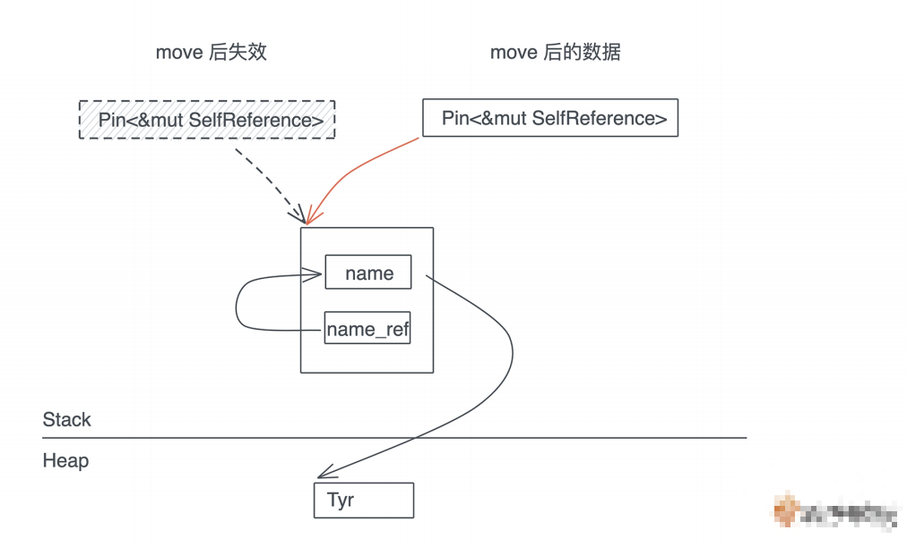
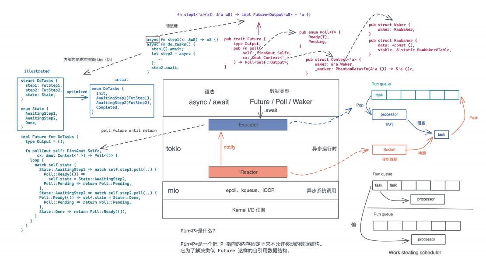

# 异步处理: async/await内部是怎么实现的?

学完上一讲, 我们对Future和async/await的基本概念有一个比较扎实的理解了, 知道在什么情况下该使用Future, 什么情况下该使用Thread, 以及executor和reactor是怎么联动最终让Future得到了一个结果

然而, 我们并不清楚为什么async fn或者async block就能够产生Future, 也并不明白Future是怎么被executor处理的, 今天哦我们就继续深入下去, 看看async/await这两个关键字究竟施了什么魔法, 能让一切如此简单有如此自然的运转起来

提前说明一下, 我们会继续围绕着Future这个简约却又不简单的结构, 来探讨一些原理性的问题, 主要是Context和Pin

```rust
pub trait Future {
    type Output;
    fn poll(self: Pin<&mut Self>, cx: &mut Context<'_>) -> Poll<Self::Output>;
}
```

这堂课的内容即便没有完全搞懂, 也不影响你继续使用async/await

### Waker的调用机制

先来看这个接口的Context是个什么东西

上一节我们简单讲过executor是通过poll方法来让Future继续往下执行, 如果调用Weaker.wake把Future唤醒, 这个Waker是哪里的呢?

其实, 它隐含在Context中:

```rust
pub struct Context<'a> {
    waker: &'a Waker,
    _marker: PhantomData<fn(&'a ()) -> &'a ()>,
}
```

所以, Context就是Waker的一个封装

如果你去看Waker的定义和相关的代码, 会发现它非常的抽象, 内部使用了一个vtable来运行各种各样的waker的行为:

```rust
pub struct RawWakerVTable {
    clone: unsafe fn(*copnst ()) -> RawWakerm
    wake: unsafe fn(*const ()),
    wake_by_ref: unsafe fn(*const ()),
    drop: unsafe fn(*const ()),
}
```

这种手工生成vtable的做法, 我们之前阅读bytes的源码已经见识过了, 它可以最大程度的兼顾效率和灵活性

Rust自身并不提供异步运行时, 它只在标准库中规定了一些基本的接口, 至于怎么实现, 可以由各个运行时自行决定, 所以在标准库中, 你只会看到这些接口的定义, 以及高层接口的实现, 比如Waker下的wake方法, 只是调用了vtable里的wake而已:

```rust
impl Waker {
    /// Wake up the task associated with this `Waker`.
    #[inline]
    pub fn wake(self) {
        // The actual wakeup call is delegated through a virtual function call
        // to the implementation which is defined by the executor.
        let wake = self.waker.vtable.wake;
        let data = self.waker.data;
        // Don't call `drop` -- the waker will be consumed by `wake`.
        crate::mem::forget(self);
        // SAFETY: This is safe because `Waker::from_raw` is the only way
        // to initialize `wake` and `data` requiring the user to acknowledge
        // that the contract of `RawWaker` is upheld.
        unsafe { (wake)(data) };
    }
    ...
}
```

如果你想要顺藤摸瓜找到vtable是这么设置的, 却发现一切线索都悄无声息的中断了, 那是因为, 具体的实现并不在标准库中, 而是在第三方的异步运行时里, 比如tokio

不过, 虽然我们开发的时候使用tokio, 但是阅读和理解代码的时候, 建议看futures库, 比如waker vtable的定义, futures库还有一个简单的executor, 也非常适合进一步通过代码理解executor的原理

## async究竟生成了什么?

我们接下来看Pin, 这是一个奇怪的数据结构, 正常的数据结构都是直接使用self/&self/&mut self, 可视poll却使用了`Pin<&mut self>`, 为什么?

为了讲明白Pin, 我们的往前追踪异步, 看看产生Future的一个async block/fn内部进行生成什么样的代码? 

```rust
async fn write_hello_file_async(name: &str) -> anyhow::Result<()> {
    let mut file = fs::File::create(name).await?;
    file.write_all(b"hello world!").await?;
    Ok(())
}
```

首先它创建一个文件, 然后往这个文件里写入hello world, 这两个函数有两个await, 创建文件的时候会异步创建, 写入文件的时候会异步写入, 最终整个函数对外返回一个Future

我们知道executor处理Future时, 会不断地调用poll方法, 于是上面那句实际上相当于:

```rust
match write_hello_file_async.poll(cx) {
    Poll::Ready(result) => return result,
    Poll::Pending => return Poll::Pending,
}
```

这就是单个await的处理方法, 那更加复杂的, 一个函数中有若干个await, 那该如何处理呢? 以前面write_hello_file_async函数的内部实现为例, 显然我们只有处理完create, 才能处理write_all, 所以应该是类似这样的代码:

```rust
let fut = fs::File::create(name);
match fut.poll(cx) {
    Poll::Ready(Ok(file)) => {
        let fut = file.write_all(b"hello world");
        match fut.poll(cx) {
            Poll::Ready(result) => return result,
            Poll::Pending =< return Poll::Pending,
        }
    },
    Poll::Pending => return Poll;:Pending,
}
```

但是前面说过, async函数返回的是一个Future, 所以还是需要把这样的代码封装在一个Future的实现李, 对外提供出去, 因此我们需要实现一个数据结构, 把内部的状态保存起来, 并未这个数据结构实现Future, 比如:

```rust
enum WriteHelloFile {
    // 初始阶段，用户提供文件名
    Init(String),
    // 等待文件创建，此时需要保存 Future 以便多次调用
    // 这是伪代码，impl Future 不能用在这里
    AwaitingCreate(impl Future<Output = Result<fs::File, std::io::Error>>),
    // 等待文件写入，此时需要保存 Future 以便多次调用
    AwaitingWrite(impl Future<Output = Result<(), std::io::Error>>),
    // Future 处理完毕
    Done,
}
impl WriteHelloFile {
    pub fn new(name: impl Into<String>) -> Self {
        Self::Init(name.into())
    }
}
impl Future for WriteHelloFile {
    type Output = Result<(), std::io::Error>;
    fn poll(self: Pin<&mut Self>, cx: &mut Context<'_>) -> Poll<Self::Output>
    todo!()
}
}
fn write_hello_file_async(name: &str) -> WriteHelloFile {
    WriteHelloFile::new(name)
}
```

这样, 我们就把刚才的write_hello_file_async异步函数, 转换成了一个返回WriteHelloFile Future的函数, 来看看这个Future如何实现:

```rust
impl Future for WriteHelloFile {
    type Output = Result<(), std::io::Error>;
    fn poll(self: Pin<&mut Self>, cx: &mut Context<'_>) -> Poll<Self::Output>{
        let this = self.get_mut();
        loop {
            match this {
                // 如果状态是 Init，那么就生成 create Future，把状态切换到 AwaitingC
                WriteHelloFile::Init(name) => {
                    let fut = fs::File::create(name);
                    *self = WriteHelloFile::AwaitingCreate(fut);
                }
                // 如果状态是 AwaitingCreate，那么 poll create Future
                // 如果返回 Poll::Ready(Ok(_))，那么创建 write Future
                // 并把状态切换到 Awaiting
                WriteHelloFile::AwaitingCreate(fut) => match fut.poll(cx) {
                    Poll::Ready(Ok(file)) => {
                        let fut = file.write_all(b"hello world!");
                        *self = WriteHelloFile::AwaitingWrite(fut);
                    }
                    Poll::Ready(Err(e)) => return Poll::Ready(Err(e)),
                    Poll::Pending => return Poll::Pending,
                },
                // 如果状态是 AwaitingWrite，那么 poll write Future
                // 如果返回 Poll::Ready(_)，那么状态切换到 Done，整个 Future 执行成功
                WriteHelloFile::AwaitingWrite(fut) => match fut.poll(cx) {
                    Poll::Ready(result) => {
                        *self = WriteHelloFile::Done;
                        return Poll::Ready(result);
                    }
                    Poll::Pending => return Poll::Pending,
                },
                // 整个 Future 已经执行完毕
                WriteHelloFile::Done => return Poll::Ready(Ok(())),
            }
        }
    }
}
```

这个Future完整实现的内部结构, 其实就是一个状态机的迁移

这段伪代码和之前异步函数是等价的:

```rust
async fn write_hello_file_async(name: &str) -> anyhow::Result<()> {
    let mut file = fs::File::create(name).await?;
    file.write_all(b"hello world!").await?;
    Ok(())
}
```

Rust在编译async fn或者async block, 就会生成类似的状态机实现, 你可以看到看似简单的异步处理, 内部隐藏着一套并不太难理解, 但写起来很生硬很啰嗦的状态机管理代码

搞明白这个问题, 回到Pin, 刚才我们胡搜学状态机代码的过程, 能帮你理解为什么会需要Pin这个问题

## 为什么需要Pin?

在上面实现Future的状态机中, 我们引用了file这样一个局部变量:

```rust
WriteHelloFile::AwaitingCreate(fut) => match fut.poll(cx) {
    Poll::Ready(Ok(file)) => {
        let fut = file.write_all(b"hello world!");
        *self = WriteHelloFile::AwaitingWrite(fut);
    }
    Poll::Ready(Err(e)) => return Poll::Ready(Err(e)),
    Poll::Pending => return Poll::Pending,
}
```

这个代码是有问题的, file被fut引用, 但file会在这个作用域被丢弃, 所有我们需要把它保存在数据结构中:

```rust
enum WriteHelloFile {
    // 初始阶段，用户提供文件名
    Init(String),
    // 等待文件创建，此时需要保存 Future 以便多次调用
    AwaitingCreate(impl Future<Output = Result<fs::File, std::io::Error>>),
    // 等待文件写入，此时需要保存 Future 以便多次调用
    AwaitingWrite(AwaitingWriteData),
    // Future 处理完毕
    Done,
}
struct AwaitingWriteData {
    fut: impl Future<Output = Result<(), std::io::Error>>,
    file: fs::File,
}
```

可以生成一个AwaitingWriteData数据结构, 把file和fut都放进去, 然后在WriteHelloFile中引用它, 此时在同一个数据结构内部, fut指向了对file的引用, 这样的数据结构, 叫自引用结构(Self-Referential Structure)

自引用结构由一个很大的问题: 一旦它被移动, 原本的指针就会指向旧的地址


所以需要有某种机制来保证这种情况不会发生, Pin就是为了这个目的而设计的数据结构, 我们可以Pin住一个指向Future的指针, 看文档中Pin的声明:

```rust
pub struct Pin<P> {
    pointer: P,
}
impl<P: Deref> Deref for Pin<P> {
    type Target = P::Target;
    fn deref(&self) -> &P::Target {
        Pin::get_ref(Pin::as_ref(self))
    }
}
impl<P: DerefMut<Target: Unpin>> DerefMut for Pin<P> {
    fn deref_mut(&mut self) -> &mut P::Target {
        Pin::get_mut(Pin::as_mut(self))
    }
}
```

Pin拿住的是一个可以解引用成T的指针类型P, 而不是直接那原本的类型T, 所以对于Pin而言, 你看到的都是`Pin<Box<T>>`, `Pin<&mut T>`, 但不会是`Pin<T>`, 因为Pin的目的是, 把T的内存位置锁住, 从而避免移动后自引用类型带来的引用失效问题


这样的数据结构就可以正常访问, 但是你无法直接拿到原本的数据结构进而移动它

## 自引用数据结构

当然, 自引用数据结构并非只在异步代码里出现, 只不过异步代码在内部生成用状态机表述Future时, 很容易产生自引用结构, 我们看一个和Future无关的例子:

```rust
#[derive(Debug)]
struct SelfReference {
    name: String,
    // 在初始化后指向 name
    name_ptr: *const String,
}
impl SelfReference {
    pub fn new(name: impl Into<String>) -> Self {
        SelfReference {
            name: name.into(),
            name_ptr: std::ptr::null(),
        }
    }
    pub fn init(&mut self) {
        self.name_ptr = &self.name as *const String;
    }
    pub fn print_name(&self) {
        println!(
            "struct {:p}: (name: {:p} name_ptr: {:p}), name: {}, name_ref: {}"
            self,
            &self.name,
            self.name_ptr,
            self.name,
            // 在使用 ptr 是需要 unsafe
            // SAFETY: 这里 name_ptr 潜在不安全，会指向旧的位置
            unsafe { &*self.name_ptr },
        );
    }
}
fn main() {
    let data = move_creates_issue();
    println!("data: {:?}", data);
    // 如果把下面这句注释掉，程序运行会直接 segment error
    // data.print_name();
    print!("\\n");
    mem_swap_creates_issue();
}
fn move_creates_issue() -> SelfReference {
    let mut data = SelfReference::new("Tyr");
    data.init();
    // 不 move，一切正常
    data.print_name();
    let data = move_it(data);
    // move 之后，name_ref 指向的位置是已经失效的地址
    // 只不过现在 move 前的地址还没被回收挪作它用
    data.print_name();
    data
}
fn mem_swap_creates_issue() {
    let mut data1 = SelfReference::new("Tyr");
    data1.init();
    let mut data2 = SelfReference::new("Lindsey");
    data2.init();
    data1.print_name();
    data2.print_name();
    std::mem::swap(&mut data1, &mut data2);
    data1.print_name();
    data2.print_name();
}
fn move_it(data: SelfReference) -> SelfReference {
    data
}
```

我们创建了一个自引用结构SelfReference, 它里面的name_ref指向了name, 正常使用它的时候, 没有任何问题, 但一旦对这个结构做move操作, name_ref指向的位置还是会move前的name地址, 这就引发了问题


同样的, 如果我们使用std::mem::swap也会出现类似的问题, 一旦swap, 两个数据的内容交换, 然而, 由于name_ref指向的地址是还是旧的, 所以整个指针体系都混乱了:


可以看到swap之后, name_ref指向的内容确实和name不一样了, 这就是自引用结构带来的问题

你也许会奇怪, 不是说move也会出问题吗? 为什么第二行打印name_ref还是指向了Tyr? 这是因为move之后, 之前的内存失效, 但是内存地址还没有被挪作它用, 所以还能正常显示Tyr, 这样的内存访问是不安全的, 如果你把main中这句代码注释掉, 程序就会crash

```rust
fn main() {
    let data = move_creates_issue();
    println!("data: {:?}", data);
    // 如果把下面这句注释掉，程序运行会直接 segment error
    // data.print_name();
    print!("\\n");
    mem_swap_creates_issue();
}
```

现在你应该了解到在Rust下, 自引用类型带来的危害了吧

所以Pin的出现, 对解决这类问题很关键, 如果你视图移动被Pin住的数据结构, 要么编译器会通过编译错误阻止你; 要么你强行使用unsafe Rust, 自己负责其安全性, 我们来看Pin后如何避免移动带来的问题:

```rust
use std::{marker::PhantomPinned, pin::Pin};
#[derive(Debug)]
struct SelfReference {
    name: String,
    // 在初始化后指向 name
    name_ptr: *const String,
    // PhantomPinned 占位符
    _marker: PhantomPinned,
}
impl SelfReference {
    pub fn new(name: impl Into<String>) -> Self {
        SelfReference {
            name: name.into(),
            name_ptr: std::ptr::null(),
            _marker: PhantomPinned,
        }
    }
    pub fn init(self: Pin<&mut Self>) {
        let name_ptr = &self.name as *const String;
        // SAFETY: 这里并不会把任何数据从 &mut SelfReference 中移走
        let this = unsafe { self.get_unchecked_mut() };
        this.name_ptr = name_ptr;
    }
    pub fn print_name(self: Pin<&Self>) {
        println!(
            "struct {:p}: (name: {:p} name_ptr: {:p}), name: {}, name_ref: {}"
            self,
            &self.name,
            self.name_ptr,
            self.name,
            // 在使用 ptr 是需要 unsafe
            // SAFETY: 因为数据不会移动，所以这里 name_ptr 是安全的
            unsafe { &*self.name_ptr },
        );
    }
}
fn main() {
    move_creates_issue();
}
fn move_creates_issue() {
    let mut data = SelfReference::new("Tyr");
    let mut data = unsafe { Pin::new_unchecked(&mut data) };
    SelfReference::init(data.as_mut());
    // 不 move，一切正常
    data.as_ref().print_name();
    // 现在只能拿到 pinned 后的数据，所以 move 不了之前
    move_pinned(data.as_mut());
    println!("{:?} ({:p})", data, &data);
    // 你无法拿回 Pin 之前的 SelfReference 结构，所以调用不了 move_it
    // move_it(data);
}
fn move_pinned(data: Pin<&mut SelfReference>) {
    println!("{:?} ({:p})", data, &data);
}
#[allow(dead_code)]
fn move_it(data: SelfReference) {
    println!("{:?} ({:p})", data, &data);
}
```

由于数据结构被包裹在Pin内部, 所以在函数传递的时候, 变化的只是指向data的Pin:



学习了Pin, 不知道你有没有向其Unpin

## 那么, Unpin是做什么的?

现在我们在介绍主要的系统trait时, 曾经体积Unpin这个market trait

```rust
pub auto trait Unpin {}
```

Pin时为了让某个数据结构无法合法的移动, 而Unpin则相当于声明数据结构是可以移动的, 它的作用类似于Send / Sync, 通过类型约束来告诉编译器那些行为是合法的, 那些不是

在Rust中, 绝大多数的数据结构都是可以移动的, 所以它们都自动实现了Unpin, 即便这些结构被Pin包裹, 它们依旧可以进行移动, 比如:

```rust
use std::mem;
use std::pin::Pin;
let mut string = "this".to_string();
let mut pinned_string = Pin::new(&mut string);
// We need a mutable reference to call `mem::replace`.
// We can obtain such a reference by (implicitly) invoking `Pin::deref_mut`,
// but that is only possible because `String` implements `Unpin`.
mem::replace(&mut *pinned string, "other".to string());
```

当我们不希望一个数据结构被移动, 可以使用!Unpin, 在Rust里, 实现了!Unpin的除了内部结构(Future), 主要就是PhantomPinned

```rust
pub struct PhantomPinned;
impl !Unpin for PhantomPinned {}
```

所以如果你希望你的数据结构不能被移动, 可以为其添加PhantomPinned字段来隐式声明!Unpin

当数据结构满足UnPin时, 创建Pin以及使用Pin(主要是DerefMut)都可以使用安全接口, 否则需要使用unsafe接口

```rust
// 如果实现了 Unpin，可以通过安全接口创建和进行 DerefMut
impl<P: Deref<Target: Unpin>> Pin<P> {
    pub const fn new(pointer: P) -> Pin<P> {
        // SAFETY: the value pointed to is `Unpin`, and so has no requirements
        // around pinning.
        unsafe { Pin::new_unchecked(pointer) }
    }
    pub const fn into_inner(pin: Pin<P>) -> P {
        pin.pointer
    }
}
impl<P: DerefMut<Target: Unpin>> DerefMut for Pin<P> {
    fn deref_mut(&mut self) -> &mut P::Target {
        Pin::get_mut(Pin::as_mut(self))
    }
}

// 如果没有实现 Unpin，只能通过 unsafe 接口创建，不能使用 DerefMut
impl<P: Deref> Pin<P> {
    pub const unsafe fn new_unchecked(pointer: P) -> Pin<P> {
        Pin { pointer }
    }
    pub const unsafe fn into_inner_unchecked(pin: Pin<P>) -> P {
        pin.pointer
    }
}
```

## async产生的Future究竟是什么类型?

现在我们对Future的接口有了完整的认识, 也知道async关键字的背后都发生了什么事情:

```rust
pub trait Future [
    type Output;
    fn poll(self: Pin<&mut Self>, cx: &mut Context<'_>) -> Poll<Self::Output>;
]
```

那么当你写一个async fn或者使用一个async block时, 究竟得到了一个什么类型的数据呢?

```rust
let fut = async { 42 };
```

你肯定觉得是`impl Future<Output = i32>`

对但是impl Future不是一个具体的类型, 我们说过, 它相当于`T: Future`, 那么这个T究竟是什么呢?

```rust
fn main() {
    let fut = async { 42 };
    println!("type of fut is: {}", get_type_name(&fut));
}
fn get_type_name<T>(_: &T) -> &'static str {
    std::any::type_name::<T>()
}
```

```bash
type of fut is: core::future::from_generator::GenFuture<xxx::main::{{closure}}
```

实现Future trait的是一个叫GenFuture的结构, 它内部有一个闭包, 

我们来看GenFuture的定义(感兴趣的可以在Rust源码中搜索from_generator), 也可以看到它是一个泛型结构, 内部数据T要满足Generator trait

```rust
struct GenFuture<T: Generator<ResumeTy, Yield = ()>>(T);
pub trait Generator<R = ()> {
    type Yield;
    type Return;
    fn resume(
        self: Pin<&mut Self>,
        arg: R
    ) -> GeneratorState<Self::Yield, Self::Return>;
}
```

Generator是一个Rust nightly的一个triat, 它是这样使用的:

```rust
#![feature(generators, generator_trait)]
use std::ops::{Generator, GeneratorState};
use std::pin::Pin;
fn main() {
    let mut generator = || {
        yield 1;
        return "foo"
    };
    match Pin::new(&mut generator).resume(()) {
        GeneratorState::Yielded(1) => {}
        _ => panic!("unexpected return from resume"),
    }
    match Pin::new(&mut generator).resume(()) {
        GeneratorState::Complete("foo") => {}
        _ => panic!("unexpected return from resume"),
    }
}
```

可以看到, 如果你创建一个闭包, 里面有yield关键字, 就会得到一个Generator, 如果你在Python中使用过yield, 二者其实非常相似

## 小结

这一讲我们深入的探讨了Future接口各个部分Context, Pin/Unpin的含义, 以及async/await这样漂亮接口下的产生什么样子的代码



并发任务运行在Future这样的协程上, async/await是产生运行和运行并发任务的手段, async定义一个可以并发执行的Future任务, await触发这个任务并发执行, 具体来说

当我们使用async关键字的时候, 它会产生一个impl Future的结果, 对于一个async block或者async fn来说, 内部的每个await都会被编译器捕捉, 并成功返回Future的poll方法的内部状态机的一个状态

Rust的Future需要异步运行时来运行Future, 以tokio为例, 它的executor会从run queue中取出Future进行poll, 当poll返回Pendinig时, 这个Future会被挂起, 直到reactor得到了某个事件, 唤醒这个Future, 将其添加回run queue等待下次执行

tokio一般会在每个物理线程(或者CPU core)下运行一个线程, 每个线程有自己的run queue来处理Future, 为了提供最大的吞吐量, tokio实现了work stealing scheduler, 这样当某个线程下没有可执行的Future, 它会从其他线程的run queue中偷一个执行

