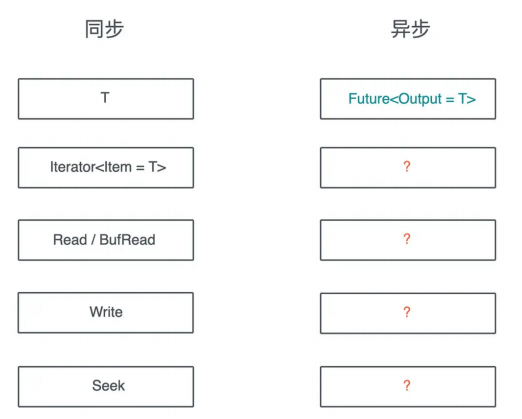
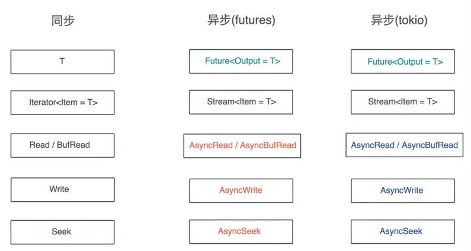
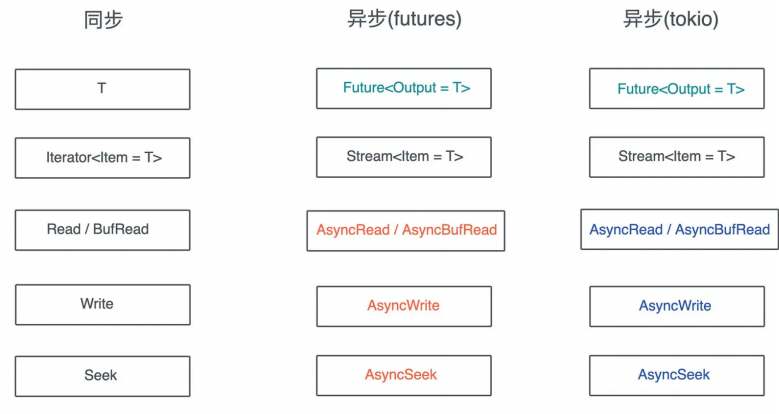

# 异步处理: 如何处理异步IO?

前面两讲我们学习了异步处理的基本功能和原理(Future/async/await), 但是还没有正式介绍在具体场合下该用哪些工具来处理异步IO, 不过再讲trait的时候, 已经了解和使用过一些处理同步IO的结构和trait

今天我们就对比同步IO来学习异步IO, 毕竟在学习某个新知识的时候, 如果能够和头脑中已有的知识联系起来, 大脑神经元之间的连接就会被激活, 学习的效果会事半功倍

回忆一下同步的环境都有哪些结构和trait的? 首先单个值可以用类型T表述, 一组织可以用Iterator trait表述; 同步IO, 我们有标准的Read/Write/Seek trait, 顾名思义, Read/Write是进行IO的读写, 而Seek是在IO中前后移动当前的位置

那么异步呢? 我们已经学习到, 对于单个的, 在未来某个时刻会得到的值, 可以用Future来表示:



但还不知道一组未来才能得到的值改用什么trait来表述, 也不知道异步的Read/Write该是什么样子的, 今天我们就来聊聊这些重要的异步数据类型

## Stream trait

首先来了解一下 Iterator子异步环境下的表兄弟: Stream

我们知道, 对于Iterator, 可以不断调用其next方法, 获得新的值, 知道Iterator返回None, Iterator是阻塞式返回数据的, 每次调用next, 必然独占CPU直到得到一个结果, 而异步的Stream是非阻塞的, 在等待的过程中会空出CPU做其他事情

不过和Future已经在标准库稳定下来不同, Stream trait目前还能子nightly版本使用, 一般跟Stream打交道, 我们会使用Futures库, 来对比Iterator和Stream的定义

```rust
pub trait Iterator {
    type Item;
    fn next(&mut self) -> Option<Self::Item>;
    fn size_hint(&self) -> (usize, Option<usize>) { ... }
    fn map<B, F>(self, f: F) -> Map<Self, F> where F: FnMut(Self::Item) -> B {}
    ... // 还有 67 个方法
}
pub trait Stream {
    type Item;
    fn poll_next(self: Pin<&mut Self>, cx: &mut Context<'_>) -> Poll<Option<S
    fn size_hint(&self) -> (usize, Option<usize>) { ... }
}
pub trait StreamExt: Stream {
    fn next(&mut self) -> Next<'_, Self> where Self: Unpin { ... }
    fn map<T, F>(self, f: F) -> Map<Self, F> where F: FnMut(Self::Item) -> T {}
    ... // 还有 41 个方法
}
```

可以看到, Iteratore把所有方法都放在Iterator trait中, 而Stream需要开发者实现的基本方法何有缺省实现的衍生方法区别开, 放在不同的trait中, 比如map

实现Stream的时候, 和Iterator类似, 你需要提供Item类型, 这是每次拿出来一个值的时候, 值的类型; 此外还有poll_next方法, 它长得和Future的poll方法很像, 和Iterator版本的next的作用类似

然而, poll_next方法调用起来不方便, 我们需要自己处理Poll状态, 所以StreamExt提供了next方法, 返回了一个实现了Future trait的Next结构, 这样我们就可以直接通过stream.next.await来获取下一个值了, 来看看next方法以及Next结构的实现:

```rust
pub trait StreamExt: Stream {
    fn next(&mut self) -> Next<'_, Self> where Self: Unpin {
        assert_future::<Option<Self::Item>, _>(Next::new(self))
    }
}
// next 返回了 Next 结构
pub struct Next<'a, St: ?Sized> {
    stream: &'a mut St,
}
// 如果 Stream Unpin 那么 Next 也是 Unpin
impl<St: ?Sized + Unpin> Unpin for Next<'_, St> {}
impl<'a, St: ?Sized + Stream + Unpin> Next<'a, St> {
    pub(super) fn new(stream: &'a mut St) -> Self {
        Self { stream }
    }
}
// Next 实现了 Future，每次 poll() 实际上就是从 stream 中 poll_next()
impl<St: ?Sized + Stream + Unpin> Future for Next<'_, St> {
    type Output = Option<St::Item>;
    fn poll(mut self: Pin<&mut Self>, cx: &mut Context<'_>) -> Poll<Self::Output> {
        self.stream.poll_next_unpin(cx)
    }
}
```

看个小例子:

```rust
use futures::prelude::*;

#[tokio::main]
async fn main() {
    let mut st = stream::iter(1..10)
        .filter(|x| future::ready(x % 2 == 0))
        .map(|x| x * x);

    while let Some(x) = st.next().await {
        println!("Got item: {x}");
    }
}
```

我们使用stream::iter生成了一个Stream, 并对其进行filter/map操作, 最后遍历整个stream, 把获得的数据打印出来, 从使用的角度来看, Stream和Iterator也很相似, 可以对比的使用

## 生成Stream

futures库提供了一些基本的生成Stream的方法, 除了上面用到的iter方法,还有:

- empty: 生成一个空的Stream
- once: 生成一个只包含单个值的Stream
- pending: 生成一个不包含任何值, 值返回Poll::Pending的Stream
- repeat; 生成一个一致返回相同值的Stream
- repeat_with: 通过闭包函数无穷无尽的返回数据的Stream
- poll_fn: 通过一个发那会`Poll<Option<T>>`的闭包来产生Stream
- unfold: 通过初始值和返回Future的闭包来产生Stream

前几种产生Stream的方法都很好理解, 最后三种引入了闭包复杂一点, 我们分别使用它们来实现斐波那契数列, 对弈一下差异:

```rust
use std::task::Poll;

use futures::prelude::*;
use futures::stream::poll_fn;

#[tokio::main]
async fn main() {
    consume(fib().take(10)).await;
    consume(fib1(10)).await;
    // unfold产生的Unfold stream没有实现Unpin
    // 所以我们将其Pin<Box<T>>一下, 使其满足consume的接口
    consume(fib2(10).boxed()).await;
}

async fn consume(mut st: impl Stream<Item = i32> + Unpin) {
    while let Some(v) = st.next().await {
        println!("{v}");
    }
    println!("\\n");
}

// 使用repeat_with创建stream, 无法控制何时结束
fn fib() -> impl Stream<Item = i32> {
    let mut a = 1;
    let mut b = 1;
    stream::repeat_with(move || {
        let c = a + b;
        a = b;
        b = c;
        b
    })
}

// 使用poll_fn创建stream, 可以通过返回Poll::Ready(None)来结束
fn fib1(mut n: usize) -> impl Stream<Item = i32> {
    let mut a = 1;
    let mut b = 1;
    poll_fn(move |_cx| -> Poll<Option<i32>> {
        if n == 0 {
            return Poll::Ready(None);
        }

        n -= 1;
        let c = a + b;
        a = b;
        b = c;
        Poll::Ready(Some(b))
    })
}

fn fib2(n: usize) -> impl Stream<Item = i32> {
    stream::unfold((n, (1, 1)), |(mut n, (a, b))| async move {
        if n == 0 {
            None
        } else {
            n -= 1;
            let c = a + b;
            // c作为poll_next的返回值, (n, (a, b))作为state
            Some((c, (n, (b, c))))
        }
    })
}
```

值得注意的是, 使用unfold的时候, 同时使用了局部变量和Future, 所以生成的Stream没有实现Unpin,. 需要将其pin住, 怎么做呢?

`Pin<Box<T>>`是一种很简单的方法, 能将数据Pin在堆上, 我们可以使用StreamExt的boxed方法来生成一个`Pin<Box<T>>`

除了上面讲的方法, 我们还可以为一个数据结构实现Stream trait, 从而使其支持Stream

```rust
use futures::prelude::*;
use pin_project::pin_project;
use std::{
    pin::Pin,
    task::{Context, Poll},
};

use tokio::fs;

use tokio::io::{AsyncBufReadExt, AsyncRead, BufReader, Lines};

/// LineStream内部使用tokio::io::Lines
#[pin_project]
struct LineStream<R> {
    lines: Lines<BufReader<R>>,
}

impl<R: AsyncRead> LineStream<R> {
    /// 从BufReader创建一个LinesStream
    pub fn new(reader: BufReader<R>) -> Self {
        Self {
            lines: reader.lines(),
        }
    }
}

impl<R: AsyncRead> Stream for LineStream<R> {
    type Item = std::io::Result<String>;

    fn poll_next(self: std::pin::Pin<&mut Self>, cx: &mut Context<'_>) -> Poll<Option<Self::Item>> {
        self.project()
            .lines
            .poll_next_line(cx)
            .map(Result::transpose)
    }
}

#[tokio::main]
async fn main() -> std::io::Result<()> {
    let file = fs::File::open("Cargo.toml").await?;
    let reader = BufReader::new(file);
    let mut st = LineStream::new(reader);
    while let Some(Ok(line)) = st.next().await {
        println!("Got: {line}");
    }

    Ok(())
}
```

这段代码封装了Lines结构, 我们可以通过AsyncBufReadExt的lines方法, 把一个实现AsyncBufRead trait的reader转换成Lines

你也许注意到代码中的pin_project, 它提供了一些便利的宏, 方便我们操作数据结构需要被pin住的字段, 在数据结构中, 可以使用`#[pin]`来声明某个字段在使用的时候需要被封装为`Pin<T>`,  这样在调用的时候, 就可以使用`self.project().lines`得到一个`Pin<&mut Lines>`以便调用其poll_next_line方法, 这个方法的第一个参数是`Pin<&mut Lines>`

在lines这个数据结构内部, 异步的next_line方法可以读取下一行, 它实际上就是比较低阶的poll_next_line接口的一个封装

虽然Lines接口提供了next_line, 但是没有实现Stream, 所以我们无法像其他Stream那样同一用next方法获取下一行, 于是我们将其包裹在自己的LineStream下, 并且为LineStream实现了Stream方法

注意, 由于poll_next_line的结果是`Rusult<Option<T>>`, 而Stream的poll_next方法的结果是`Option<Result<T>>`, 所以我们需要使用Result方法的transpose来将二者对调, 这个transpose方法是一个很基础的方法, 非常实用

## 异步IO接口

在实现LineStream的时候, 我们遇到了两个异步IO接口: AsyncRead以及AsyncBufRead, 回到开头的那张图片, 相信你现在已经有了大致答案了吧: 所有同步的Read/Write/Seek trait, 前面加一个Async就构成了对应的异步IO接口

不过和Stream不同的是, 如果你对比futures下定义的IO trait以及tokio下定义的IO trait, 会发现它们都有各自的定义, 双方并未统一, 有些许差别:



比如futures下的AsyncRead的定义:

```rust
pub trait AsyncRead {
    fn poll_read(
        self: Pin<&mut Self>,
        cx: &mut Context<'_>,
        buf: &mut [u8]
    ) -> Poll<Result<usize, Error>>;
    unsafe fn initializer(&self) -> Initializer { ... }
    fn poll_read_vectored(
        self: Pin<&mut Self>,
        cx: &mut Context<'_>,
        bufs: &mut [IoSliceMut<'_>]
    ) -> Poll<Result<usize, Error>> { ... }
}
```

而tokio下的AsyncRead的定义:

```rust
pub trait AsyncRead {
    fn poll_read(
        self: Pin<&mut Self>,
        cx: &mut Context<'_>,
        buf: &mut ReadBuf<'_>
    ) -> Poll<Result<()>>;
}
```

我们看到不同之处: tokio的poll_read方法需要ReadBuf, 而futures的poll_read方法需要`&mut [u8]`, 此外futures的AsyncRead还多了两个缺省方法

在看看AsyncWrite, futures下的AsyncWrite接口如下:

```rust
pub trait AsyncWrite {
    fn poll_write(
        self: Pin<&mut Self>,
        cx: &mut Context<'_>,
        buf: &[u8]
    ) -> Poll<Result<usize, Error>>;
    fn poll_flush(
        self: Pin<&mut Self>,
        cx: &mut Context<'_>
    ) -> Poll<Result<(), Error>>;
    fn poll_close(
        self: Pin<&mut Self>,
        cx: &mut Context<'_>
    ) -> Poll<Result<(), Error>>;
    fn poll_write_vectored(
        self: Pin<&mut Self>,
        cx: &mut Context<'_>,
        bufs: &[IoSlice<'_>]
    ) -> Poll<Result<usize, Error>> { ... }
}
```

而tokio下的AsyncWrite的定义:

```rust
pub trait AsyncWrite {
    fn poll_write(
        self: Pin<&mut Self>,
        cx: &mut Context<'_>,
        buf: &[u8]
    ) -> Poll<Result<usize, Error>>;
    fn poll_flush(
        self: Pin<&mut Self>,
        cx: &mut Context<'_>
    ) -> Poll<Result<(), Error>>;
    fn poll_shutdown(
        self: Pin<&mut Self>,
        cx: &mut Context<'_>
    ) -> Poll<Result<(), Error>>;
    fn poll_write_vectored(
        self: Pin<&mut Self>,
        cx: &mut Context<'_>,
        bufs: &[IoSlice<'_>]
    ) -> Poll<Result<usize, Error>> { ... }
    fn is_write_vectored(&self) -> bool { ... }
}
```

可以看到, AsyncWrite二者的差距就只有poll_close和poll_shutdown命名上的分别,其他的异步IO接口我就不一一列举了, 你可以自己去看代码对比

## 异步IO接口的兼容性处理

为什么Rust的异步IO trait会有这样的分裂? 这是因为在tokio / futures库实现的早期, 社区还没有形成比较同一的异步IO trait, 不同的接口背后也有各自不同的考虑, 这种分裂就沿袭下来

所以我们使用tokio进行异步开发, 那么代码需要使用tokio::io下的异步IO trait, 也许未来等Async IO trait稳定并进入标准库后, tokio会更新自己的trait

虽然Rust的异步IO trait有这样的分裂, 你也不必过分担心, tokio-util提供了相应的Compat功能, 可以让你的数据结构在二者之间自如切换, 看一个使用yamux做多路复用的例子:

```rust
use anyhow::Result;
use futures::prelude::*;
use tokio::net::TcpListener;
use tokio_util::{
    codec::{Framed, LinesCodec},
    compat::{FuturesAsyncReadCompatExt, TokioAsyncReadCompatExt},
};
use tracing::info;
use yamux::{Config, Connection, Mode, WindowUpdateMode};
#[tokio::main]
async fn main() -> Result<()> {
    tracing_subscriber::fmt::init();
    let addr = "0.0.0.0:8080";
    let listener = TcpListener::bind(addr).await?;
    info!("Listening on: {:?}", addr);
    loop {
        let (stream, addr) = listener.accept().await?;
        info!("Accepted: {:?}", addr);
        let mut config = Config::default();
        config.set_window_update_mode(WindowUpdateMode::OnRead);
        // 使用 compat() 方法把 tokio AsyncRead/AsyncWrite 转换成 futures 对应的 t
        let conn = Connection::new(stream.compat(), config, Mode::Server);
        // Yamux ctrl stream 可以用来打开新的 stream
        let _ctrl = conn.control();
        tokio::spawn(
            yamux::into_stream(conn).try_for_each_concurrent(None, move |s| async {
                // 使用 compat() 方法把 futures AsyncRead/AsyncWrite 转换成 tokio
                let mut framed = Framed::new(s.compat(), LinesCodec::new());
                while let Some(Ok(line)) = framed.next().await {
                    println!("Got: {}", line);
                    framed
                    .send(format!("Hello! I got '{}'", line))
                    .await
                    .unwrap();
                }
                Ok(())
            }),
        );
    }
}
```

yamux是一个类似HTTP/2内部多路复用机制的协议, 可以让你在一个TCP连接上打开多个yamux stream, 而yamux stream之间并行工作, 互不干扰

yamux crate在实现的时候, 使用了futures下的异步IO接口, 但是当我们使用tokio Listener接受一个客户端, 得到对应的TcpStream时, 这个TcpStream使用的是tokio下的异步IO接口, 所以我们需要tokio_util::compat来协助接口的兼容

在代码中, 首先我们使用stream.compact生成一个Compat接口, 供yamux Connection使用

```rust
let conn = Connection::new(stream.compat(), config, Mode::Server);
```

之后, 拿到yamux connection下所有stream进行处理, 我们想用tokio的Frame和Codec一行行读取和写入, 也就需要把使用futures异步接口的yamux stream, 转换成tokio接口的数据结构, 这样可以用在Framed::new中

```rust
let mut framed = Framed::new(s.compat(), LinesCodec::new());
```

## 实现异步IO接口

异步IO主要应用在文件处理, 网络处理等场合, 而这些场合的数据结构都已经实现了对应的接口, 比如File或者TcpStream, 它们也已经实现了AsyncRead/AsyncWrite, 所以基本上, 我们不用自己实现异步IO接口, 只需要会用节可以了

不过有些情况, 我们可能会把已有的数据结构封装在自己的数据结构中, 此时也应该实现相应的异步IO接口

```rust
use anyhow::Result;
use pin_project::pin_project;
use tokio::{
    fs::File,
    io::{AsyncRead, AsyncReadExt},
};

#[pin_project]
struct FileWrapper {
    #[pin]
    file: File,
}

impl FileWrapper {
    pub async fn try_new(name: &str) -> Result<Self> {
        let file = File::open(name).await?;
        Ok(Self { file })
    }
}

impl AsyncRead for FileWrapper {
    fn poll_read(
        self: std::pin::Pin<&mut Self>,
        cx: &mut std::task::Context<'_>,
        buf: &mut tokio::io::ReadBuf<'_>,
    ) -> std::task::Poll<std::io::Result<()>> {
        self.project().file.poll_read(cx, buf)
    }
}

#[tokio::main]
async fn main() -> Result<()> {
    let mut file = FileWrapper::try_new("Cargo.toml").await?;
    let mut buffer = String::new();
    file.read_to_string(&mut buffer).await?;
    println!("buffer: {buffer}");
    Ok(())
}
```

这段代码封装了tokio::fs::File结构, 我们想读取内部的file字段, 但又不想把File暴露出去, 因此实现了AsyncRead trait

## Sink trait

在同步环境下往IO中发送连续的数据, 可以一次发送哦, 也可以使用Write trait多次发送, 使用起来没有什么麻烦; 但在异步IO下, 做同样的事情, 我们需要更方便的接口, 因此异步IO还有一个比较独特的Sink trait, 它是一个用于发送一系列异步值的接口

```rust
pub trait Sink<Item> {
    type Error;
    fn poll_ready(
        self: Pin<&mut Self>,
        cx: &mut Context<'_>
    ) -> Poll<Result<(), Self::Error>>;
    fn start_send(self: Pin<&mut Self>, item: Item) -> Result<(), Self::Error>
    fn poll_flush(
        self: Pin<&mut Self>,
        cx: &mut Context<'_>
    ) -> Poll<Result<(), Self::Error>>;
    fn poll_close(
        self: Pin<&mut Self>,
        cx: &mut Context<'_>
    ) -> Poll<Result<(), Self::Error>>;
}
pub trait SinkExt<Item>: Sink<Item> {
    ...
    fn send(&mut self, item: Item) -> Send<'_, Self, Item> where Self: Unpin {}
    ...
}
```

和Stream trait不同的是, Sink trait的Item是trait的泛型参数, 而不是关联类型, 一般而言, 当trait接受某个input, 应该使用泛型参数, 比如`Add<Rhs>`; 当它输出某个output, 那么应该使用关联类型, 比如Future, Stream. Iterator等

Item对于Sink来说是输入, 所以使用泛型参数是正确的选择, 因为这也意味着, 在发送端, 可以发送不同的数据结构

看上面的定义源码, Sink trait有四个方法:

- poll_ready: 用来准备Sink使其可以发送数据, 只有poll_ready返回, Poll::Ready(Ok(())), Sink才会开展后续的动作, poll_ready可以用来保证控制背压
- start_send: 开始发送数据到Sink, 但是start_send并不保证数据被发送完毕, 所以调用者需要调用poll_flush或者poll_close来保证完整发送
- poll_flush: 将任何尚未发送的数据flush到这个Sink
- poll_close: 将任何尚未发送的数据flush到这个Sink, 并关闭这个Sink

其中三个方法和Item无关, 这会导致, 如果有不同的输入类型有多个实现, SInk的poll_ready, poll_flush和poll_close可能会有重复代码, 所以我们一般在使用SInk的时候, 如果确实需要处理不同的数据类型, 可以使用enum将它们统一

我们就用一个简单的FIleSink的例子, 看看如何实现这些方法, tokio::fs下的File结构已经实现了AsyncRead/AsyncWirte, 我们只需要在Sink的几个方法中调用AsyncWrite的方法即可

```rust
use std::task::Poll;

use anyhow::Result;
use bytes::{BufMut, BytesMut};
use futures::{Sink, SinkExt};
use pin_project::pin_project;
use tokio::{fs::File, io::AsyncWrite};

#[pin_project]
struct FileSink {
    #[pin]
    file: File,
    buf: BytesMut,
}

impl FileSink {
    pub fn new(file: File) -> Self {
        Self {
            file,
            buf: BytesMut::new(),
        }
    }
}

impl Sink<&str> for FileSink {
    type Error = std::io::Error;

    fn poll_ready(
        self: std::pin::Pin<&mut Self>,
        cx: &mut std::task::Context<'_>,
    ) -> std::task::Poll<std::result::Result<(), Self::Error>> {
        Poll::Ready(Ok(()))
    }

    fn start_send(
        self: std::pin::Pin<&mut Self>,
        item: &str,
    ) -> std::result::Result<(), Self::Error> {
        let this = self.project();
        eprint!("{item}");
        this.buf.put(item.as_bytes());
        Ok(())
    }

    fn poll_flush(
        mut self: std::pin::Pin<&mut Self>,
        cx: &mut std::task::Context<'_>,
    ) -> Poll<std::result::Result<(), Self::Error>> {
        // 如果向project多次, 需要先把self reborrow一下
        let this = self.as_mut().project();
        let buf = this.buf.split_to(this.buf.len());
        if buf.is_empty() {
            return Poll::Ready(Ok(()));
        }

        // 写入文件
        if let Err(e) = futures::ready!(this.file.poll_write(cx, &buf[..])) {
            return Poll::Ready(Err(e));
        }

        // 刷新文件
        self.project().file.poll_flush(cx)
    }

    fn poll_close(
        self: std::pin::Pin<&mut Self>,
        cx: &mut std::task::Context<'_>,
    ) -> Poll<std::result::Result<(), Self::Error>> {
        let this = self.project();
        // 结束写入
        this.file.poll_shutdown(cx)
    }
}

#[tokio::main]
async fn main() -> Result<()> {
    let file_sink = FileSink::new(File::create("tmp/hello.txt").await?);
    // pin_mut可以吧变量pin住
    futures::pin_mut!(file_sink);
    file_sink.send("hello\\n").await?;
    file_sink.send("world\\n").await?;
    file_sink.send("Nyh\\n").await?;
    Ok(())
}
```

对于poll_ready方法, 直接返回Poll::Ready(Ok(()))

在strat_send方法中, 我们把传入的item, 写入FileSink的BytesMut中, 然后在poll_flush时, 我们拿到buf, 把已有的内容调用split_to, 得到一个包含所有未写入的文件的新bufffer, 这个buffer和self无关, 所以传入poll_write时, 不会有对self的引入问题

在写文件后, 我们再次调用pill_flush, 确保写入内容刷新到磁盘上, 最后poll_close是调用poll_shutdown关闭文件

这段代码虽然实现了SInk trait, 也展示了poll的几个方法, 但是这么简单一个问题, 处理起来很费劲, 有没有更简单的方法呢?

有的futures里提供了sink::unfold方法, 类似stream::unfold. 我们来重写上面的File Sink的例子:

```rust
use anyhow::Result;
use futures::prelude::*;
use tokio::{fs::File, io::AsyncWriteExt};
#[tokio::main]
async fn main() -> Result<()> {
    let file_sink = writer(File::create("/tmp/hello").await?);
    // pin_mut 可以把变量 pin 住
    futures::pin_mut!(file_sink);
    if let Err(_) = file_sink.send("hello\\n").await {
        println!("Error on send");
    }
    if let Err(_) = file_sink.send("world!\\n").await {
        println!("Error on send");
    }
    Ok(())
}
/// 使用 unfold 生成一个 Sink 数据结构
fn writer<'a>(file: File) -> impl Sink<&'a str> {
    sink::unfold(file, |mut file, line: &'a str| async move {
        file.write_all(line.as_bytes()).await?;
        eprint!("Received: {}", line);
        Ok::<_, std::io::Error>(file)
    })
}
```

可以看到, 通过unfold方法, 我们不需要撰写SInk的几个方法了, 而且可以在一个返回Future的闭包中来提供处理的逻辑, 这就意味着我们可以不使用poll_xxx这样的方法. 直接在闭包中提供这样的异步函数

```rust
file.write_all(line.as_bytes()).await?
```

## 小结

我们学习了异步IO相关的Stream/Sink trait, 以及和异步相关的AsyncRead和AsyncWrite等trait



在处理异步IO的时候, 底层的poll_xxx函数很难写, 因为它的约束很多, 好在有pin_project这个项目, 用宏帮助哦我们解决了很多关于Pin/Unpin的问题

一般情况下, 我们不太需要直接实现Stream/Sink/AsyncRead/AsyncWrite trait, 如果的确需要, 先看看有没有可以使用的辅助函数, 比如通过poll_fn / unfold创建Stream, 通过unfold创建Sink

