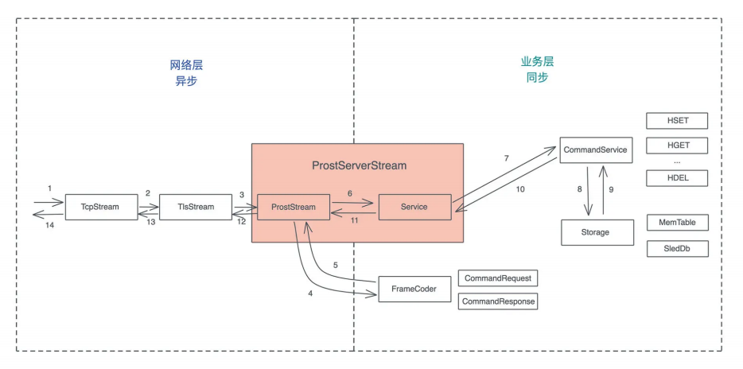
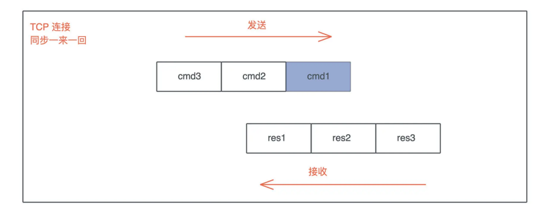
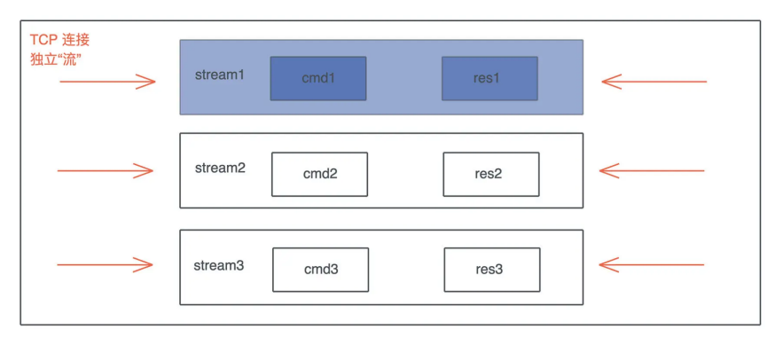
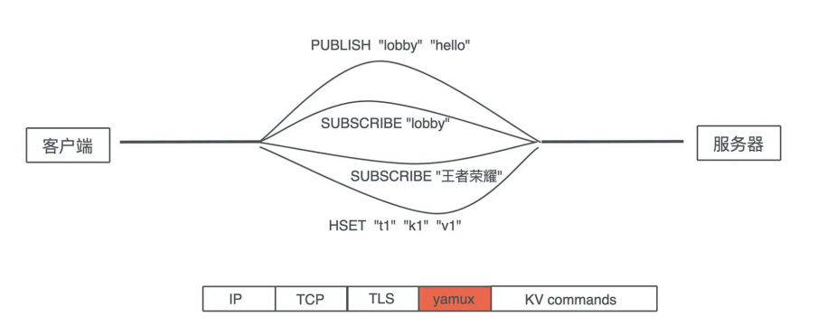
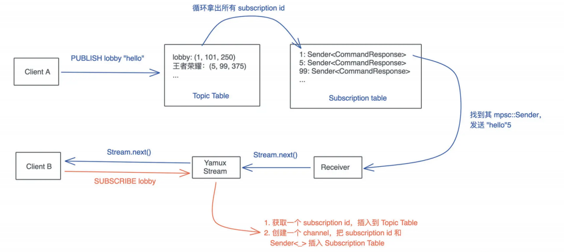

# 阶段实操: 构建一个简单的KV Server - 如何做大的重构?

在软件开发的过程中, 一开始设计的在精良, 也扛不住无缘无故的需求变更, 所以哦我们要妥善做架构设计, 让它能满足潜在的需求; 但也不能过渡设计, 让它去适应一些虚无缥缈的需求, 好的开发者, 要能够把握好这个度

到目前为止, 我们的KV Server已经羽翼丰满, 作为一个基本的KV存储够用了

我们来看看如何对一个已经成形的系统进行大的重构

## 现有架构分析

先简单回顾一下Redis对Pub/Sub的支持: 客户端可以发起SUBSCRIBE, PUBLISH和UNSUBSCRIBE, 如果客户端A和B SUBSCRIBE了一个叫lobby的主题, 客户端C往lobby里发了hello, A和B都将立即收到这个信息

使用起来是这个样子的:

```rust
A: SUBSCRIBE "lobby"
A: SUBSCRIBE "王者荣耀"
B: SUBSCRIBE "lobby"
C: PUBLISH "lobby" "hello"
// A/B 都收到 "hello"
B: UNSUBSCRIBE "lobby"
B: SUBSCRIBE "王者荣耀"
D: PUBLISH "lobby" "goodbye"
// 只有 A 收到 "goodbye"
C: PUBLISH "王者荣耀" "good game"
// A/B 都收到 "good game"
```

带着这个需求, 我们重新审视目前的架构:



要支持Pub/Sub. 现有架构有两个很大的问题

首先, CommandService是一个同步处理, 来一个命令, 立刻就能计算出一个值返回, 但现在来了一个SUBSCRIBE命令, 它期待的不是一个值, 而是未来可能产生若干个值, 我们讲过Stream代表未来可能产生的一系列值, 所以这里需要返回一个异步的Stream

因此, 我们要么牺牲CommandService这个trait来适应新的需求, 要么构建一个新的, 和CommandService trait, 来处理和Pub/Sub有关的命令

其次, 如果直接在TCP/TLS之上构建Pub/Sub的支持, 我们需要在Request和Response之间建立流的概念, 为什么呢?

之前我们协议运行模式是同步的, 一来一回:



但是如果继续采用这样的方式, 就会有应用层的head of line blocking(队头阻塞)问题, 一个SUBSCRIBE命令, 因为其返回结果不知道什么时候才结束, 会阻塞后续的所有命令, 所以我们需要在一个链接中, 划分出很多彼此独立的流, 让它们的收发不受影响



这种流式处理的典型协议是使用了多路复用的HTTP/2, 所以一种方案是我们可以吧KV Server构建在使用HTTP/2的gRPC上, 不过HTTP是个太过庞杂的协议, 对于KV Server这种性能非常重要的服务来说, 不必要的额外开销太多, 所以不太适合

另一种方式是使用yamux协议, 之前介绍过, 它是一个简单的, 和HTTP/2内部多路复用机制非常类似的协议, 如果使用它, 整个协议的交互看上去是这个样子的



Yamux社会不希望引入HTTP的繁文缛节(大量的头信息), 在TCP层做多路复用的场景, 今天就用他来支持我们索要实现的Pub/Sub

## 使用yamux做多路复用

Rust下有rust-yamux这个库, 来支持yamux, 初次之外, 我们还需要tokio-util, 它们提供了tokio下的trait和futures下的trait的兼容能力, 在Cargo.toml中引入它们

```toml
[dependencies]
...
tokio-util = { version = "0.6", features = ["compat"]} # tokio 和 futures 的兼容
...
yamux = "0.9" # yamux 多路复用支持
...
```

然后创建`src/network/multiplex.rs`, 添加如下代码:

```rust
use std::marker::PhantomData;

use futures::{future, Future, TryStreamExt};
use tokio::io::{AsyncRead, AsyncWrite};
use tokio_util::compat::{Compat, FuturesAsyncReadCompatExt, TokioAsyncReadCompatExt};
use yamux::{Config, Connection, ConnectionError, Control, Mode, WindowUpdateMode};

/// Yamux控制结构
pub struct YamuxCtrl<S> {
    /// yamux control, 用于创建新的stream
    ctrl: Control,
    _conn: PhantomData<S>,
}

impl<S> YamuxCtrl<S>
where
    S: AsyncRead + AsyncWrite + Unpin + Send + 'static,
{
    /// 创建yamux客户端
    pub fn new_client(stream: S, config: Option<Config>) -> Self {
        Self::new(stream, config, true, |_stream| future::ready(Ok(())))
    }

    /// 创建yamux服务端
    pub fn new_server<F, Fut>(stream: S, config: Option<Config>, f: F) -> Self
    where
        F: FnMut(yamux::Stream) -> Fut,
        F: Send + 'static,
        Fut: Future<Output = Result<(), ConnectionError>> + Send + 'static,
    {
        Self::new(stream, config, false, f)
    }

    /// 创建YamuxCtrl
    fn new<F, Fut>(stream: S, config: Option<Config>, is_client: bool, f: F) -> Self
    where
        F: FnMut(yamux::Stream) -> Fut,
        F: Send + 'static,
        Fut: Future<Output = Result<(), ConnectionError>> + Send + 'static,
    {
        let mode = if is_client {
            Mode::Client
        } else {
            Mode::Server
        };

        // 创建config
        let mut config = config.unwrap_or_default();
        config.set_window_update_mode(WindowUpdateMode::OnRead);

        // 创建config, yamux::Stream使用的是futures的trait所以需要compat()
        let conn = Connection::new(stream.compat(), config, mode);

        // 创建yamux ctrl
        let ctrl = conn.control();

        // pull所有stream下的数据
        tokio::spawn(yamux::into_stream(conn).try_for_each_concurrent(None, f));

        Self {
            ctrl,
            _conn: PhantomData::default(),
        }
    }

    /// 打开一个新的stream
    pub async fn open_stream(&mut self) -> Result<Compat<yamux::Stream>, ConnectionError> {
        let stream = self.ctrl.open_stream().await?;
        Ok(stream.compat())
    }
}
```

这段代码提供了Yamux的基本处理, 如果有些地方你看不明白, 比如WindowUpdateMode, yamux::into_stream等, 很正常, 需要看看yamux crate的文档和例子

这里 一个复杂的接口, 我们稍微解释一下:

```rust
pub fn new_server<F, Fut>(stream: S, config: Option<Config>, f: F) -> Self
where
F: FnMut(yamux::Stream) -> Fut,
F: Send + 'static,
Fut: Future<Output = Result<(), ConnectionError>> + Send + 'static,
{
    Self::new(stream, config, false, f)
}
```

它的意思是, 参数f是一个FnMut闭包, 接受一个yamux::Stream参数, 返回Future, 这样的结构我们之前见过, 之所以接口这么复杂, 是因为Rust还没有把async闭包稳定下来, 所以你想要些一个`async || {}`, 这是最佳的方式

写一段测试代码测试一下

```rust
#[cfg(test)]
mod tests {
    use std::net::SocketAddr;

    use tokio::net::{TcpListener, TcpStream};

    use anyhow::Result;
    use tokio_rustls::server;
    use tracing::warn;

    use crate::{
        assert_res_ok,
        tls_utils::{tls_acceptor, tls_connector},
        CommandRequest, KvError, MemTable, ProstClientStream, ProstServerStream, Service,
        ServiceInner, Storage, TlsServerAcceptor,
    };

    use super::*;
    #[tokio::test]
    async fn yamux_ctrl_client_server_should_work() -> Result<()> {
        // 创建使用了 TLS 的 yamux server
        let acceptor = tls_acceptor(false)?;
        let addr = start_yamux_server("127.0.0.1:0", acceptor, MemTable::new()).await?;

        let connector = tls_connector(false)?;
        let stream = TcpStream::connect(addr).await?;
        let stream = connector.connect(stream).await?;
        // 创建使用了 TLS 的 yamux client
        let mut ctrl = YamuxCtrl::new_client(stream, None);

        // 从 client ctrl 中打开一个新的 yamux stream
        let stream = ctrl.open_stream().await?;
        // 封装成 ProstClientStream
        let mut client = ProstClientStream::new(stream);

        let cmd = CommandRequest::new_hset("t1", "k1", "v1".into());
        client.execute(cmd).await.unwrap();

        let cmd = CommandRequest::new_hget("t1", "k1");
        let res = client.execute(cmd).await.unwrap();
        assert_res_ok(res, &["v1".into()], &[]);

        Ok(())
    }

    /// 创建 ymaux server
    pub async fn start_yamux_server<Store>(
        addr: &str,
        tls: TlsServerAcceptor,
        store: Store,
    ) -> Result<SocketAddr, KvError>
    where
        Store: Storage,
        Service: From<ServiceInner<Store>>,
    {
        let f = |stream, service: Service| {
            YamuxCtrl::new_server(stream, None, move |s| {
                let svc = service.clone();
                async move {
                    let stream = ProstServerStream::new(s.compat(), svc);
                    stream.process().await.unwrap();
                    Ok(())
                }
            });
        };
        start_server_with(addr, tls, store, f).await
    }

    pub async fn start_server_with<Store>(
        addr: &str,
        tls: TlsServerAcceptor,
        store: Store,
        f: impl Fn(server::TlsStream<TcpStream>, Service) + Send + Sync + 'static,
    ) -> Result<SocketAddr, KvError>
    where
        Store: Storage,
        Service: From<ServiceInner<Store>>,
    {
        let listener = TcpListener::bind(addr).await.unwrap();
        let addr = listener.local_addr().unwrap();
        let service: Service = ServiceInner::new(store).into();

        tokio::spawn(async move {
            loop {
                match listener.accept().await {
                    Ok((stream, _addr)) => match tls.accept(stream).await {
                        Ok(stream) => f(stream, service.clone()),
                        Err(e) => warn!("Failed to process TLS: {:?}", e),
                    },
                    Err(e) => warn!("Failed to process TCP: {:?}", e),
                }
            }
        });

        Ok(addr)
    }
}
```

可以看到, 经过简单的封装, yamux就很自然的融入到我们现有的架构中, 因为open_stream得到的是符合tokio AsyncRead / AsyncWrite的stream, 所以它可以直接配合ProstClientStream使用, 也就是说, 我们网络层又改动了一下, 但后面逻辑依然不用变

## 支持pub/sub

现在网络层已经支持yamux, 为对路复用打下了基础, 我们来看看pub/sub具体怎么实现

首先abi.proto加入新的几个命令:

```abi
// 来自客户端的命令请求
message CommandRequest {
	oneof request_data {
		...
		Subscribe subscribe = 10;
		Unsubscribe unsubscribe = 11;
		Publish publish = 12;
	}
}
// subscribe 到某个主题，任何发布到这个主题的数据都会被收到
// 成功后，第一个返回的 CommandResponse，我们返回一个唯一的 subscription id
message Subscribe { string topic = 1; }
// 取消对某个主题的订阅
message Unsubscribe {
	string topic = 1;
	uint32 id = 2;
}
// 发布数据到某个主题
message Publish {
	string topic = 1;
	repeated Value data = 2;
}
```

命令的响应我们不用改变, 当客户端Subscribe时, 返回的streamline的第一个值包含订阅ID, 这是一个全局唯一的ID, 这样客户端后续可以用Unsubscribe取消

## Pub/Sub如何设计?

我们可以用两张表: 一张Topic Table, 存放主题和对应的订阅列表; 一张Subscription Table, 存放订阅ID和channel的发送端

当SUBSCRIBE时, 我们获取一个订阅ID, 插入到Topic Table总, 然后在创建一个MPSC cahnnel, 把channel的发送端和订阅ID存入subscription table

这样当有人PUBLISH时, 可以从Topic table中找到对应的订阅ID的列表, 然后循环从subscription table中找到对应的Sender, 往里面写入数据, 此时, channel的Receiver端会得到数据, 这个数据被yamux stream poll到客户端

整个流程如下图所示:



有了个基本设计, 我们可以着手接口和数据结构的构建了

```rust
use std::sync::{
    atomic::{AtomicU32, Ordering},
    Arc,
};

use dashmap::{DashMap, DashSet};
use tokio::sync::mpsc;

use super::CommandResponse;

/// 下一个subscription id
static NEXT_ID: AtomicU32 = AtomicU32::new(1);

/// 获取下一个subscription id
fn get_subscription_id() -> u32 {
    NEXT_ID.fetch_add(1, Ordering::Relaxed)
}

pub trait Topic: Send + Sync + 'static {
    /// 订阅某个主题
    fn subscribe(self, name: String) -> mpsc::Receiver<Arc<CommandResponse>>;
    /// 取消对主题的订阅
    fn unsubscribe(self, name: String, id: u32);
    /// 往主题里发布一个数据
    fn publish(self, name: String, value: Arc<CommandResponse>);
}


/// 用于主题发布和订阅的数据结构
#[derive(Default)]
pub struct Broadcaster {
    /// 所有的主体列表
    topics: DashMap<String, DashSet<u32>>,
    /// 所有的订阅列表
    subscriptions: DashMap<u32, mpsc::Sender<Arc<CommandResponse>>>,
}
```

这里, subscription_id我们用一个AtomicU32来表述

对于这样一个全局唯一的ID, 很多同学喜欢使用UUID4来表述, 注意使用UUID的话, 存储时一定不要存它的字符串表现形式, 太浪费内存且每次都有额外的堆分配, 应该用它u128的表现形式

不过即便u128, 也比u32浪费很多空间, 假设某个主题M下有一个一万个订阅, 要往这个M里发送一条数据, 就意味着整个`DashSet<u32>`的一次拷贝, 乘上一万次, u32的话做40k内存的拷贝, 而u128要做160k拷贝, 这个性能上差距就很明显了

另外, 我们把CommandResponse封装进了一个Arc中农, 如果一条消息发送给一万个客户端, 那么我们不希望这条消息呗复制后, 再被发送, 而是直接发送同一份数据

这里对Pub/Sub的接口, 构建了一个Topic trait, 虽然目前我们只有Broadcaster会实现Topic trait, 但未来也许会换不同的实现方式, 所以抽象出Topic trait很有意义

## Pub/Sub的实现

我们来写代码, 创建`src/service/topic.rs`并填入:

```rust
use std::sync::{
    atomic::{AtomicU32, Ordering},
    Arc,
};

use dashmap::{DashMap, DashSet};
use tokio::sync::mpsc;
use tracing::{debug, info, warn};

use super::{CommandResponse, Value};

/// topic里最大存放的数据
const BROADCAST_CAPACITY: usize = 128;

/// 下一个subscription id
static NEXT_ID: AtomicU32 = AtomicU32::new(1);

/// 获取下一个subscription id
fn get_next_subscription_id() -> u32 {
    NEXT_ID.fetch_add(1, Ordering::Relaxed)
}

pub trait Topic: Send + Sync + 'static {
    /// 订阅某个主题
    fn subscribe(self, name: String) -> mpsc::Receiver<Arc<CommandResponse>>;
    /// 取消对主题的订阅
    fn unsubscribe(self, name: String, id: u32);
    /// 往主题里发布一个数据
    fn publish(self, name: String, value: Arc<CommandResponse>);
}

/// 用于主题发布和订阅的数据结构
#[derive(Default)]
pub struct Broadcaster {
    /// 所有的主体列表
    topics: DashMap<String, DashSet<u32>>,
    /// 所有的订阅列表
    subscriptions: DashMap<u32, mpsc::Sender<Arc<CommandResponse>>>,
}

impl Topic for Arc<Broadcaster> {
    fn subscribe(self, name: String) -> mpsc::Receiver<Arc<CommandResponse>> {
        let id = {
            let entry = self.topics.entry(name).or_default();
            let id = get_next_subscription_id();
            entry.value().insert(id);
            id
        };

        // 生成一个mpsc channel
        let (tx, rx) = mpsc::channel(BROADCAST_CAPACITY);

        let v: Value = (id as i64).into();

        // 立刻发送subscription id到rx
        let tx1 = tx.clone();

        tokio::spawn(async move {
            if let Err(e) = tx1.send(Arc::new(v.into())).await {
                // TODO: 这个很小概率发生, 但目前我们没有善后
                warn!("Failed to send subscription id: {id}, Error: {e:?}");
            }
        });

        // 把tx存入subscription table
        self.subscriptions.insert(id, tx);
        debug!("Subscription {id} is added");

        // 返回rx给网络处理的上下文
        rx
    }

    fn unsubscribe(self, name: String, id: u32) {
        if let Some(v) = self.topics.get_mut(&name) {
            // 在topics表里找到topic的subscription id, 删除
            v.remove(&id);

            // 如果这个topic为空, 则删除topic
            if v.is_empty() {
                info!("Topic {:?} is deleted", &name);
                drop(v);
                self.topics.remove(&name);
            }
        }

        debug!("Subscription {id} is removed!");
        // 在subscriptions表中同样删除
        self.subscriptions.remove(&id);
    }

    fn publish(self, name: String, value: Arc<CommandResponse>) {
        tokio::spawn(async move {
            match self.topics.get(&name) {
                Some(chan) => {
                    // 复制整个topic下所有的subscription id
                    // 这里我们每个id是u32, 乳沟有一个topic下有10k订阅, 复制的而成为
                    // 也就是40k堆内存(外加一些数据结构), 所以效率不算差
                    // 这也是为什么我们用NEXT_ID来控制subscription id的生成
                    let chan = chan.value().clone();

                    // 循环发送
                    for id in chan.into_iter() {
                        if let Some(tx) = self.subscriptions.get(&id) {
                            if let Err(e) = tx.send(value.clone()).await {
                                warn!("Publish to {id} failed! error: {e:?}");
                            }
                        }
                    }
                }
                None => {}
            }
        });
    }
}
```

这段代码就是Pub/Sub的核心功能了, 你可与对照这上面的设计图和代码中详细注释去理解, 我们来写一个测试确保它正常工作:

```rust
#[cfg(test)]
mod tests {
    use std::convert::TryInto;

    use tokio::sync::mpsc::Receiver;

    use crate::assert_res_ok;

    use super::*;

    #[tokio::test]
    async fn pub_sub_should_work() {
        let b = Arc::new(Broadcaster::default());
        let lobby = "lobby".to_string();

        // subscribe
        let mut stream1 = b.clone().subscribe(lobby.clone());
        let mut stream2 = b.clone().subscribe(lobby.clone());

        // publish
        let v: Value = "hello".into();
        b.clone().publish(lobby.clone(), Arc::new(v.clone().into()));

        // subscribers 应该能收到 publish 的数据
        let id1 = get_id(&mut stream1).await;
        let id2 = get_id(&mut stream2).await;

        assert!(id1 != id2);

        let res1 = stream1.recv().await.unwrap();
        let res2 = stream2.recv().await.unwrap();

        assert_eq!(res1, res2);
        assert_res_ok(&res1, &[v.clone()], &[]);

        // 如果 subscriber 取消订阅，则收不到新数据
        b.clone().unsubscribe(lobby.clone(), id1 as _);

        // publish
        let v: Value = "world".into();
        b.clone().publish(lobby.clone(), Arc::new(v.clone().into()));

        assert!(stream1.recv().await.is_none());
        let res2 = stream2.recv().await.unwrap();
        assert_res_ok(&res2, &[v.clone()], &[]);
    }

    pub async fn get_id(res: &mut Receiver<Arc<CommandResponse>>) -> u32 {
        let id: i64 = res.recv().await.unwrap().as_ref().try_into().unwrap();
        id as u32
    }
}
```

这个测试需要一系列新的改动, 比如assert_res_ok接口变化了, 哦我们需要添加新的TryFrom的支持等等

## 在处理流中引入Pub/Sub

再来看它和用户传入的CommandRequest如何发生关系, 我们之前设计了CommandService triat, 它虽然可以处理其他命令, 但对Pub/Sub相关的几个新命令无法处理, 因为接口没有任何Topic有关的参数

```rust
/// 对 Command 的处理的抽象
pub trait CommandService {
    /// 处理 Command，返回 Response
    fn execute(self, store: &impl Storage) -> CommandResponse;
}
```

如果直接修改这个接口, 对已有的代码非常不友好, 所以我们还是对比者创建一个新的trait:

```rust
use std::{pin::Pin, sync::Arc};

use futures::Stream;

use super::{topic::Topic, CommandResponse};

pub type StreamingResponse = Pin<Box<dyn Stream<Item = Arc<CommandResponse>> + Send>>;

pub trait TopicService {
    /// 处理Command, 返回Response
    fn execute<T>(self, chan: impl Topic) -> StreamingResponse;
}
```

因为Stream是一个trait, 在trait的方法里我们无法返回一个impl Stream, 所以用trait object: `Pin<Box<dyn Stream>>`

实现它很简单, 我们创建`src/service/topic_service.rs`然后添加

```rust
use std::{pin::Pin, sync::Arc};
use tokio_stream::wrappers::ReceiverStream;

use futures::{stream, Stream};

use super::{topic::Topic, CommandResponse, Publish, Subscribe, Unsubscribe};

pub type StreamingResponse = Pin<Box<dyn Stream<Item = Arc<CommandResponse>> + Send>>;

pub trait TopicService {
    /// 处理Command, 返回Response
    fn execute<T>(self, topic: impl Topic) -> StreamingResponse;
}

impl TopicService for Subscribe {
    fn execute<T>(self, topic: impl Topic) -> StreamingResponse {
        let rx = topic.subscribe(self.topic);
        Box::pin(ReceiverStream::new(rx))
    }
}

impl TopicService for Unsubscribe {
    fn execute<T>(self, topic: impl Topic) -> StreamingResponse {
        let res = match topic.unsubscribe(self.topic, self.id) {
            Ok(_) => CommandResponse::ok(),
            Err(e) => e.into(),
        };
        Box::pin(stream::once(async { Arc::new(res) }))
    }
}

impl TopicService for Publish {
    fn execute<T>(self, topic: impl Topic) -> StreamingResponse {
        topic.publish(self.topic, Arc::new(self.data.into()));
        Box::pin(stream::once(async { Arc::new(CommandResponse::ok()) }))
    }
}
```

我们使用了tokio-stream的wrapper把一个mpsc::Receive肉转换成ReceiverStream. 这样Subscribe的处理就能返回一个Stream, 对于Unsubscribe和Publish, 它们都返回单个值, 我们使用stream::once将其统一起来

同样的,. 要在`src/pb/mod.rs`中添加一些新的方法, 比如CommandResponse::ok,它返回一个状态码是ok的response

```rust
impl CommandResponse {
    pub fn ok() -> Self {
        let mut result = CommandResponse::default();
        result.status = StatusCode::OK.as_u16() as _;
        result
    }
}
```

接下来我们看`src/service/mod.rs`, 我们可以对应着原来的dispatch做一个dispatch_stream, 同样的已有的接口应该少动, 我们应该平行添加一个新的

```rust
/// 从 Request 中得到 Response，目前处理所有 HGET/HSET/HDEL/HEXIST
pub fn dispatch(cmd: CommandRequest, store: &impl Storage) -> CommandResponse
match cmd.request_data {
    Some(RequestData::Hget(param)) => param.execute(store),
    Some(RequestData::Hgetall(param)) => param.execute(store),
    Some(RequestData::Hmget(param)) => param.execute(store),
    Some(RequestData::Hset(param)) => param.execute(store),
    Some(RequestData::Hmset(param)) => param.execute(store),
    Some(RequestData::Hdel(param)) => param.execute(store),
    Some(RequestData::Hmdel(param)) => param.execute(store),
    Some(RequestData::Hexist(param)) => param.execute(store),
    Some(RequestData::Hmexist(param)) => param.execute(store),
    None => KvError::InvalidCommand("Request has no data".into()).into(),
    // 处理不了的返回一个啥都不包括的 Response，这样后续可以用 dispatch_stream 处理
    _ => CommandResponse::default(),
}
}
/// 从 Request 中得到 Response，目前处理所有 PUBLISH/SUBSCRIBE/UNSUBSCRIBE
pub fn dispatch_stream(cmd: CommandRequest, topic: impl Topic) -> StreamingResponse {
    match cmd.request_data {
        Some(RequestData::Publish(param)) => param.execute(topic),
        Some(RequestData::Subscribe(param)) => param.execute(topic),
        Some(RequestData::Unsubscribe(param)) => param.execute(topic),
        // 如果走到这里，就是代码逻辑的问题，直接 crash 出来
        _ => unreachable!(),
    }
}
```

为了使用这个新的接口, Service结构也需要响应改动

```rust
/// Service 数据结构
pub struct Service<Store = MemTable> {
    inner: Arc<ServiceInner<Store>>,
    broadcaster: Arc<Broadcaster>,
}
impl<Store> Clone for Service<Store> {
    fn clone(&self) -> Self {
        Self {
            inner: Arc::clone(&self.inner),
            broadcaster: Arc::clone(&self.broadcaster),
        }
    }
}
impl<Store: Storage> From<ServiceInner<Store>> for Service<Store> {
    fn from(inner: ServiceInner<Store>) -> Self {
        Self {
            inner: Arc::new(inner),
            broadcaster: Default::default(),
        }
    }
}
impl<Store: Storage> Service<Store> {
    pub fn execute(&self, cmd: CommandRequest) -> StreamingResponse {
        debug!("Got request: {:?}", cmd);
        self.inner.on_received.notify(&cmd);
        let mut res = dispatch(cmd, &self.inner.store);
        if res == CommandResponse::default() {
            dispatch_stream(cmd, Arc::clone(&self.broadcaster))
        } else {
            debug!("Executed response: {:?}", res);
            self.inner.on_executed.notify(&res);
            self.inner.on_before_send.notify(&mut res);
            if !self.inner.on_before_send.is_empty() {
                debug!("Modified response: {:?}", res);
            }
            Box::pin(stream::once(async { Arc::new(res) }))
        }
    }
}
```

这里, 为了处理Pub/Sub, 我们引入了一个破坏性的更新, execute方法的返回值编程了StreamingResponse, 这就意味着所有围绕着这个方法的调用包括测试, 都需要相应的更新, 这是迫不得已的, 不过通过构建和CommandServci/ dispatch平行的 TopicService / dispatch_stream, 我们已经让这个破坏性更新尽量可能处于高层, 否则改动更大

目前代码无法编译通过, 这是因为如下的代码, res现在是个stream, 我们需要处理一下:

```rust
let res = service.execute(CommandRequest::new_hget("t1", "k1"));
assert_res_ok(&res, &["v1".into()], &[]);
// 需要变更为读取 stream 里的一个值
let res = service.execute(CommandRequest::new_hget("t1", "k1"));
let data = res.next().await.unwrap();
assert_res_ok(&data, &["v1".into()], &[]);
```

当然, 这样的改动也意味着, 袁恩的而函数需要编程async

如果是个test, 需要使用`#[tokio::test]`, 当你改到`src/network/mod.rs`里ProstServerStream的process方法时, 会发现stream.send(data)时候, 我们目前的data是`Arc<CommandResponse>`

```rust
impl<S> ProstServerStream<S>
where
S: AsyncRead + AsyncWrite + Unpin + Send + 'static,
{
    ...
    pub async fn process(mut self) -> Result<(), KvError> {
        let stream = &mut self.inner;
        while let Some(Ok(cmd)) = stream.next().await {
            info!("Got a new command: {:?}", cmd);
            let mut res = self.service.execute(cmd);
            while let Some(data) = res.next().await {
                // 目前 data 是 Arc<CommandResponse>，
                // 所以我们 send 最好用 &CommandResponse
                stream.send(&data).await.unwrap();
            }
        }
        // info!("Client {:?} disconnected", self.addr);
        Ok(())
    }
}
```

所以哦我们还需要稍微改动一下`src/network/stream.rs`

```rust
// impl<S, In, Out> Sink<Out> for ProstStream<S, In, Out>
impl<S, In, Out> Sink<&Out> for ProstStream<S, In, Out>
```

这会引发一系列的改动, 你可以试着自己改一下

## 继续重构: 弥补设计上的小问题

现在看上去大功告成, 但你有每有注意, 我们在撰写`src/servcie/topic_service.rs`时, 没有写测试

我们来开始撰写测试代码, 我们就会思考: unsubscribe接口如果遇到不存在subscription, 要不要返回一个404? publish的时候遇到错误, 是不是意味着客户端非正常退出了? 我们要不要把它从subscription中移除掉?

```rust
#[cfg(test)]
mod tests {
    use super::*;
    use crate::{
        assert_res_error, assert_res_ok, dispatch_stream, service::topic::Broadcaster,
        CommandRequest,
    };
    use futures::StreamExt;
    use std::{convert::TryInto, time::Duration};
    use tokio::time;

    #[tokio::test]
    async fn dispatch_publish_should_work() {
        let topic = Arc::new(Broadcaster::default());
        let cmd = CommandRequest::new_publish("lobby", vec!["hello".into()]);
        let mut res = dispatch_stream(cmd, topic);
        let data = res.next().await.unwrap();
        assert_res_ok(&data, &[], &[]);
    }

    #[tokio::test]
    async fn dispatch_subscribe_should_work() {
        let topic = Arc::new(Broadcaster::default());
        let cmd = CommandRequest::new_subscribe("lobby");
        let mut res = dispatch_stream(cmd, topic);
        let id = get_id(&mut res).await;
        assert!(id > 0);
    }

    #[tokio::test]
    async fn dispatch_subscribe_abnormal_quit_should_be_removed_on_next_publish() {
        let topic = Arc::new(Broadcaster::default());
        let id = {
            let cmd = CommandRequest::new_subscribe("lobby");
            let mut res = dispatch_stream(cmd, topic.clone());
            let id = get_id(&mut res).await;
            drop(res);
            id as u32
        };

        // publish 时，这个 subscription 已经失效，所以会被删除
        let cmd = CommandRequest::new_publish("lobby", vec!["hello".into()]);
        dispatch_stream(cmd, topic.clone());
        time::sleep(Duration::from_millis(10)).await;

        // 如果再尝试删除，应该返回 KvError
        let result = topic.unsubscribe("lobby".into(), id);
        assert!(result.is_err());
    }

    #[tokio::test]
    async fn dispatch_unsubscribe_should_work() {
        let topic = Arc::new(Broadcaster::default());
        let cmd = CommandRequest::new_subscribe("lobby");
        let mut res = dispatch_stream(cmd, topic.clone());
        let id = get_id(&mut res).await;

        let cmd = CommandRequest::new_unsubscribe("lobby", id as _);
        let mut res = dispatch_stream(cmd, topic);
        let data = res.next().await.unwrap();

        assert_res_ok(&data, &[], &[]);
    }

    #[tokio::test]
    async fn dispatch_unsubscribe_random_id_should_error() {
        let topic = Arc::new(Broadcaster::default());

        let cmd = CommandRequest::new_unsubscribe("lobby", 9527);
        let mut res = dispatch_stream(cmd, topic);
        let data = res.next().await.unwrap();

        assert_res_error(&data, 404, "Not found: subscription 9527");
    }

    pub async fn get_id(res: &mut StreamingResponse) -> u32 {
        let id: i64 = res.next().await.unwrap().as_ref().try_into().unwrap();
        id as u32
    }
}
```

## 让客户端更好的使用新的接口

目前我们的ProstClientStream还是同一的execute方法

```rust
impl<S> ProstClientStream<S>
where
S: AsyncRead + AsyncWrite + Unpin + Send,
{
    ...
    pub async fn execute(&mut self, cmd: CommandRequest) -> Result<CommandResponse> {
        let stream = &mut self.inner;
        stream.send(&cmd).await?;
        match stream.next().await {
            Some(v) => v,
            None => Err(KvError::Internal("Didn't get any response".into())),
        }
    }
}
```

它并没有妥善处理SUBSCRIBE, 为了支持SUBSCRIBE, 我们需要两个接口: execute_unary和execute_streaming, 在`src/network/mod.rs`修改这个代码:

```rust
impl<S> ProstClientStream<S>
where
    S: AsyncRead + AsyncWrite + Unpin + Send,
{
    pub fn new(stream: S) -> Self {
        Self {
            inner: ProstStream::new(stream),
        }
    }

    pub async fn execute_unary(
        &mut self,
        cmd: &CommandRequest,
    ) -> Result<CommandResponse, KvError> {
        let stream = &mut self.inner;
        stream.send(cmd).await?;

        match stream.next().await {
            Some(v) => v,
            None => Err(KvError::Internal("Didn't get any response".into())),
        }
    }

    pub async fn execute_streaming(self, cmd: &CommandRequest) -> Result<StreamResult, KvError> {
        let mut stream = self.inner;

        stream.send(cmd).await?;
        stream.close().await?;

        StreamResult::new(stream).await
    }
}
```

注意, 因为execute_streaing里返回Box::pin(stream), 我们需要对ProstClientStream的S限制是`'static`, 否则编译器会抱怨, 这个改动会导致使用execute方法的测试都无法编译, 你可以试着修改掉它们

此外我们还创建了一个新的文件, `src/network/stream_result.rs`, 用来帮助客户端更好的使用execute_streaming接口

## 小结

当一个项目越来越复杂的时候, 且新家功能并不能很好的融入已有的系统时, 大的重构是不可避免的, 在重构的时候, 我们一定要首先弄清楚现有的流程和架构, 然后在思考如何重构, 这样对系统的侵入才是最小的

重构办会带来对现有测试的破坏, 在修改被破坏的测试时, 我们要注意不要变动原有测试的逻辑, 在做因为新功能添加导致的重构时, 如果伴随着大量测试的删除和大量新测试的添加, 那么说明要么原来的测试写的很有问题, 要么重构对原有系统的, 要么重构对原有系统的侵入性太强, 我们要避免这种情况发生

在架构和设计都相对不错的情况下, 撰写代码的中继目标是对使用者友好抽象, 所谓对使用者友好抽象, 是指让别人在使用我们的系统时, 不用想太多, 接口本身就是自解释的

