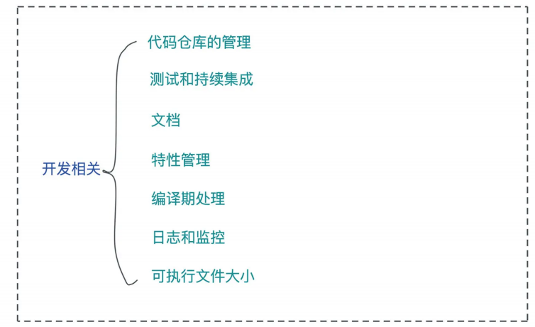
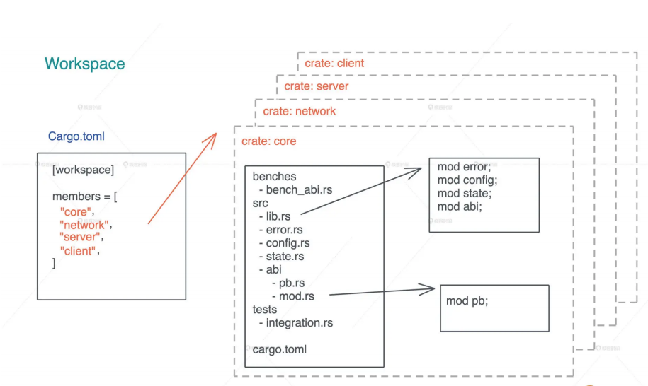
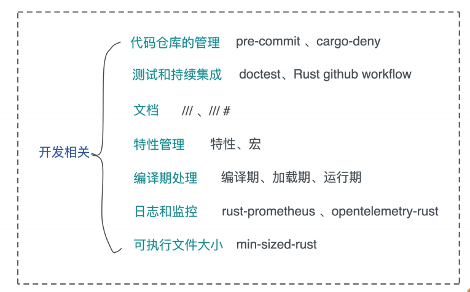
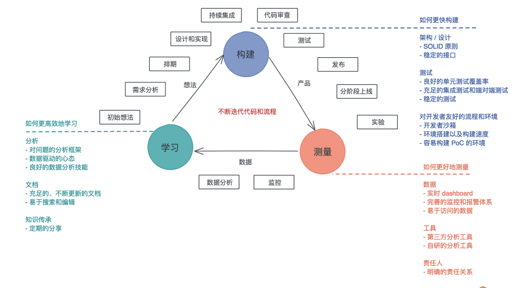

# 生产环境: 真实世界下的Rust项目包含哪些要素?

我们下来的内容, 会偏重了解真实的Rust应用环境, 看看如何用Rust构建复杂的软件系统

今天哦我们首先来学习真实世界下的一个Rust项目, 应该包含哪些要素, 主要介绍和开发阶段相关的内容, 包括: 代码仓库的管理, 测试和持续集成, 文档, 特性管理, 编译期处理, 日志和监控, 最后会顺便会介绍一下如何控制Rust代码编译出的可执行文件大小



## 代码仓库的管理

我们先从一个代码仓库的结构和管理入手, 之前介绍过, Rust支持workspace, 可以在一个workspace下放置多个crates



在构建应用程序或者服务的时候, 我们要尽量把各个模块划分清除, 然后用不同的crate实现它们, 这样一来增量编译的效率更高(没有改动的crate无需重新编译), 而来可以通过crate强制为模块划分边界, 明确公开的接口和私有接口

一般而言, 处理代码仓库的根目录下有一个README.md外, workspace下的每个crate也最好有README.md以及examples, 让使用者可以很清晰的理解如何使用这个crate, 如果你的项目构建过程不是简单通过cargo build完成的, 建议提供Makefile或者类似的脚本来自动化本地构建的流程

当我们往代码仓库里面提交代码的时候, 应该要在本地走以便基本的检查, 包括代码风格检查, 编译检查, 静态检查, 以及单元测试, 这样可以最大程度保证每个提交都是完备的, 没有基本错误的代码

如果你使用Git来管理代码仓库, 那么可以使用pre-commit hook,一般来说,我们不必字节撰写pre-commit hook脚本, 可以使用pre-commit这个工具, 下面是我在某个项目中使用的pre-commit配置, 供你参考:

```yaml
# .pre-commit-config.yaml
fail_fast: false
repos:
  - repo: https://github.com/pre-commit/pre-commit-hooks
    rev: v2.3.0
    hooks:
      - id: check-byte-order-marker
      - id: check-case-conflict
      - id: check-merge-conflict
      - id: check-symlinks
      - id: check-yaml
      - id: end-of-file-fixer
      - id: mixed-line-ending
      - id: trailing-whitespace
  - repo: https://github.com/psf/black
    rev: 19.3b0
    hooks:
      - id: black
  - repo: local
    hooks:
      - id: cargo-fmt
        name: cargo fmt
        description: Format files with rustfmt.
        entry: bash -c 'cargo fmt -- --check'
        language: rust
        files: \.rs$
        args: []
      # - id: cargo-deny
      #   name: cargo deny check
      #   description: Check cargo depencencies
      #   entry: bash -c 'cargo deny check'
      #   language: rust
      #   files: \.rs$
      #   args: []
      - id: cargo-check
        name: cargo check
        description: Check the package for errors.
        entry: bash -c 'cargo check --all'
        language: rust
        files: \.rs$
        pass_filenames: false
      - id: cargo-clippy
        name: cargo clippy
        description: Lint rust sources
        entry: bash -c 'cargo clippy --all-targets --all-features --tests --benches -- -D warnings'
        language: rust
        files: \.rs$
        pass_filenames: false
      - id: cargo-test
        name: cargo test
        description: unit test for the project
        entry: bash -c 'cargo test --all-features --all'
        language: rust
        files: \.rs$
        pass_filenames: false
```

你在根目录生成`.pre-commit-config.yaml`后, 运行pre-commit install, 以后git commit的时候就会自动做着一系列检查, 保证提交代码的最基本的正确性

除此之外, 你的代码仓库根目录下最好还声明一个deny.toml, 使用cargo-deny来确保你使用的第三那方依赖没有不该出现的授权(比如不适用任何GPL/APGL的代码), 没哟㐓的来源(比如不是来自某个fork的GitHub repo下的commit), 以及没有包含安全漏洞版本

cargo-deny对于生产环境下的代码非常重要, 因为现代软件依赖太多, 依赖过于庞杂, 靠人眼审查是很难查出问题的, 通过使用cargo-deny, 我们可以避免很多有风险的第三方库

## 测试和持续集成

在课程里, 我们不断的在项目中强调蒂娜元测试的重要性, 单元测试是软件质量保证的必要手段, 还是结构设计的和迭代的最佳辅助工具

良好的架构, 清晰的接口隔离, 必然会让单元测试变得容易直观; 而写起来别扭, 甚至感觉很难撰写的单元测试, 则是在告警你软件的架构或者设计出了问题: 要么是模块之间耦合性太强(状态纠缠不清), 要么是接口设计的很难使用

在Rust下撰写单元测试非常直观, 测试代码和模块代码放在同一个文件里, 很容易阅读和互相印证, 我们之前已经撰写过大量这类的单元测试

不过还有一种单元测试放在一起的, doctest, 如果你在学习这门课的过程中已经习惯了遇到问题就去看源代码的话, 会看到很多类似这样的doctest, 比如下面的HashMap::get方法doctest:

```rust
/// Returns a reference to the value corresponding to the key.
///
/// The key may be any borrowed form of the map's key type, but
/// [`Hash`] and [`Eq`] on the borrowed form *must* match those for
/// the key type.
///
/// # Examples
///
/// ```
/// use std::collections::HashMap;
///
/// let mut map = HashMap::new();
/// map.insert(1, "a");
/// assert_eq!(map.get(&1), Some(&"a"));
/// assert_eq!(map.get(&2), None);
/// ```
#[stable(feature = "rust1", since = "1.0.0")]
#[inline]
pub fn get<Q: ?Sized>(&self, k: &Q) -> Option<&V>
where
K: Borrow<Q>,
Q: Hash + Eq,
{
    self.base.get(k)
}
```

在之前的代码中, 虽然哦我们没有明确的介绍文档注释, 但相比你已经知道, 可以通过`///`来撰写数据结构, trait, 方法和函数的文档注释

这样的注释可以用markdown的格式撰写, 之后通过cargo doc, 编译成拉诶四你在docs.rs下看的文档, 其中markdown里的代码就会编译成doctest, 然后在cargo test中进行测试

除了单元测试, 我们往往还需要继承测试和性能测试, 在后续KV Server的实现过程中, 我们会引入集成测试来测试服务器的基本功能, 以及性能测试来测试pub/sub的性能, 这个在遇到的时候在详细介绍

在一个项目的早期, 引入持续集成非常有必要, 那怕还没没有全面的测试覆盖

如果说pre-commit是每个人提交代码的一道守卫, , 避免一些基本的额错误进入到代码库, 让大家在团队协作的时候做代码审阅是, 不至于还需要关注代码的格式; 那么持续集成就是在团队协作的过程中的一道守卫, 保证添加到PR里或者合并到master下的代码, 在特定的环境下, 也是没有问题的

如果你用Github来管理代码仓库, 可以使用github workflow来进行持续集成, 比如下面是一个最基本的Rust github workflow的定义

```rust
# build.yml
name: build

on:
  push:
    branches:
      - master
  pull_request:
    branches:
      - master

jobs:
  build-rust:
    strategy:
      matrix:
        platform: [ubuntu-latest]
    runs-on: ${{ matrix.platform }}
    steps:
      - uses: actions/checkout@v2
      - name: Cache cargo registry
        uses: actions/cache@v1
        with:
          path: ~/.cargo/registry
          key: ${{ runner.os }}-cargo-registry
      - name: Cache cargo index
        uses: actions/cache@v1
        with:
          path: ~/.cargo/git
          key: ${{ runner.os }}-cargo-index
      - name: Cache cargo build
        uses: actions/cache@v1
        with:
          path: target
          key: ${{ runner.os }}-cargo-build-target
      - name: Install stable
        uses: actions-rs/toolchain@v1
        with:
          profile: minimal
          toolchain: stable
          override: true
      - name: Check code format
        run: cargo fmt -- --check
      - name: Check the package for errors
        run: cargo check --all
      - name: Lint rust sources
        run: cargo clippy --all-targets --all-features --tests --benches -- -D warnings
      - name: Run tests
        run: cargo test --all-features -- --test-threads=1 --nocapture
      - name: Generate docs
        run: cargo doc --all-features --no-deps
```

我们会处理代码格式, 做最基本的静态检查, 单元测试和集成测试, 以及生成文档

## 文档

前面说了, Rust代码的文档注释可以用`///`来标注, 对于我们上一讲KV Server的代码, 可以运行cargo doc来生成对应的文档

注意, 在看cargo doc时. 不过你自己撰写的crate的文档会被生成, 所有在依赖中使用到的crate的文档也会一并生成, 所以你想在没有网络的情况下, 参考某些引用了crate的文档, 可以看本地生成文档

大多数的时候, 你只需要使用`///`来撰写文档就够用了, 不过如果你需要撰写crate级别的文档, 额就是会现在crate文档主页上的内容, 可以在lib.rs或者main.rs的开头用`//!`

如果你想强迫自己要撰写每个公共接口的的文档, 保持系统良好的文档覆盖, 那么可以使用`![deny(missing_docs)]`, 这样任何时候只要你忘记了撰写文档, 都会产生编译错误, 如果你觉得编译错误太严格, 可以用编译报警: `![warn(missing_docs)]`

在文档中撰写样例代码并保证这个样例代码可以正常运行非常重要, 因为使用者在看你的crate文档时, 往往贤惠参考你的样例代码, 了解接口如何使用, 大部分时候, 你的样例代码该怎么写怎么写, 但是在进行异步处理和错误处理的是偶, 需要稍微做一些额外工作

我们来看一个文档里异步的例子:

```rust
use std::task::Poll;
use futures::{prelude::*, stream::poll_fn};
/// fibnacci 算法
/// 示例：
/// ```
/// use futures::prelude::*;
/// use playground::fib; // playground crate 名字叫 playground
/// # futures::executor::block_on(async {
/// let mut st = fib(10);
/// assert_eq!(Some(2), st.next().await);
/// # });
/// ```
pub fn fib(mut n: usize) -> impl Stream<Item = i32> {
    let mut a = 1;
    let mut b = 1;
    poll_fn(move |_cx| -> Poll<Option<i32>> {
        if n == 0 {
            return Poll::Ready(None);
        }
        n -= 1;
        let c = a + b;
        a = b;
        b = c;
        Poll::Ready(Some(b))
    })
}
```

注意这段代码中的两句注释:

```rust
/// # futures::executor::block_on(async {
/// ...
/// # });
```

在`///`后面出现的`#`, 代表这句话不会出现在示例中, 但会出现在生成的测试代码中, 之所以要block_on, 是因为调用我们的代码的时候, 需要使用await, 所以需要使用异步运行时来运行它

实际上, 这个文档测试相当于:

```rust
fn main() {
    fn _doctest_main_xxx() {
        use futures::prelude::*;
        use playground::fib; // playground crate 名字叫 playground
        futures::executor::block_on(async {
            let mut st = fib(10);
            assert_eq!(Some(2), st.next().await);
        });
    }
    _doctest_main_xxx()
}
```

我们再来看一个文档中做错误处理的例子:

```rust
use std::io;
use std::fs;
/// 写入文件
/// 示例：
/// ```
/// use playground::write_file;
/// write_file("/tmp/dummy_test", "hello world")?;
/// # Ok::<_, std::io::Error>(())
/// ```
pub fn write_file(name: &str, contents: &str) -> Result<(), io::Error> {
    fs::write(name, contents)
}
```

这里例子中, 我们使用了?进行错误处理, 所以需要最后补一句`Ok::<_, io::Error>`;来明确返回的错误类型

如果你想了解更多有关Rust文档的内容, 可以看rustdoc book

## 特性管理

作为一门编译型语言, Rust支持条件编译

通过条件编译, 我们可以在同一个crate中支持不同的特性(feature), 以满足不同的需求, 比如reqwest, 它默认使用异步接口, 但如果你需要同步接口, 你可以使用它的blocking特性

在生产环境中合理的使用特性, 可以让crate的核心功能引入较少的依赖, 而只有在其中某个特性的时候, 才使用这些依赖, 这样可以最终编译出来的库或者可执行文件, 尽可能的小

如果你感兴趣的话可以看cargo book

## 编译期处理

在开发软件系统的时候, 我们需要考虑哪些事情需要放在编译期处理, 哪些事情放在加载期处理, 哪些事情放在运行期处理

有些事情, 我们不一定要放在运行期才进行处理, 可以在编译器就做一些预处理, 让数据能够以更好的形式在运行期被使用

比如在做中文繁简转换的时候, 我们预先把单子对照表从文件中读取出俩, 处理成Vec<(char, char)>, 然后生成bincode存入到可执行文件中, 我们看这个例子

```rust
use std::io::{self, BufRead};
use std::{env, fs::File, path::Path};
fn main() {
    // 如果 build.rs 或者繁简对照表文件变化，则重新编译
    println!("cargo:rerun-if-changed=build.rs");
    println!("cargo:rerun-if-changed=src/t2s.txt");
    // 生成 OUT_DIR/map.bin 供 lib.rs 访问
    let out_dir = env::var_os("OUT_DIR").unwrap();
    let out_file = Path::new(&out_dir).join("map.bin");
    let f = File::create(&out_file).unwrap();
    let v = get_kv("src/t2s.txt");
    bincode::serialize_into(f, &v).unwrap();
}
// 把 split 出来的 &str 转换成 char
fn s2c(s: &str) -> char {
    let mut chars = s.chars();
    let c = chars.next().unwrap();
    assert!(chars.next().is_none());
    assert!(c.len_utf8() == 3);
    c
}
// 读取文件，把每一行繁简对照的字符串转换成 Vec<(char, char)>
fn get_kv(filename: &str) -> Vec<(char, char)> {
    let f = File::open(filename).unwrap();
    let lines = io::BufReader::new(f).lines();
    let mut v = Vec::with_capacity(4096);
    for line in lines {
        let line = line.unwrap();
        let kv: Vec<_> = line.split(' ').collect();
        v.push((s2c(kv[0]), s2c(kv[1])));
    }
    v
}
```

通过这种方式, 我们在编译期额外花费了一些时间, 却让运行期的代码和工作大大简化

```rust
static MAP_DATA: &[u8] = include_bytes!(concat!(env!("OUT_DIR"), "/map.bin"));
lazy_static! {
    /// state machine for the translation
    static ref MAP: HashMap<char, char> = {
        let data: Vec<(char, char)> = bincode::deserialize(MAP_DATA).unwrap();
        data.into_iter().collect()
    };
    ...
}
```

## 日志和监控

我们目前撰写的项目, 都还只有少量的日志, 但对于生产环境下的项目来说, 这远远不够, 我们需要详尽的, 不同级别的日志

这样, 当系统在运行过程中出现问题时, 我们可以通过日志得到足够的线索, 从而找到问题的源头, 进而解决问题, 而且在一个分布式系统下, 我们往往还需要把收集到的日志集中起来, 进行过滤和查询

除了日志, 我们还需要收集系统的行为数据和性能指标, 来了解系统运行时的状态

Rust有不错的promethus的支持, 比如rust-prometheus可以帮助你方便的手机和发送各种指标; 而opentelemetry-rust更是除了支持prometheus外, 还支持很多其他商业/ 非商业的监控工具, 比如datadog, 比如jaeger

之后我们还会有一讲来让KV Server来更好的处理日志和监控, 并且用jaeger进行性能分析, 找到代码中的性能问题

## 可执行文件大小

最后, 我们来谈谈可执行文件的大小

绝大多数的使用场景, 我们使用哪个cargo build --release就够了, 生成release build可以用在生产环境下, 到哪有些情况, 比如侵入式环境, 或者用Rust构建提供给Android/IOS的包时, 需要可执行文件尽可能的小, 避免浪费文件或者网络流量

此时我们需要一些额外的手段来优化文件尺寸, 你可以参考mini-sized-rust提供的方法进行处理

## 小结

我们今天简略的讨论了一下, 把一个Rust项目真正应用在生产环境下, 需要考虑的诸多问题, 之后会围绕着KV Server来实践这一讲中我们聊到的问题:



做一个业余项目和做一个实际的要在生产环境下运行的项目有很大的不同, 业余项目我们主要关注的需求是不是得到了妥善的实现, 主要关注的是构建流程; 而在实际的项目中, 我们除了需要关注构建, 还有测量和学习完整的开发流程

看这张图, 一个项目的整体开发流程相信是你所熟悉, 包括初始想法, 需求分析, 排期, 设计和实现, 持续集成, 代码审查, 测试, 发布, 分阶段上线, 实验, 监控, 数据分析等部分, 我们把它贯穿到精益创业(Lean Startup)构建 - 测量- 学习(Build - Measure - Learn)的三个环节中


