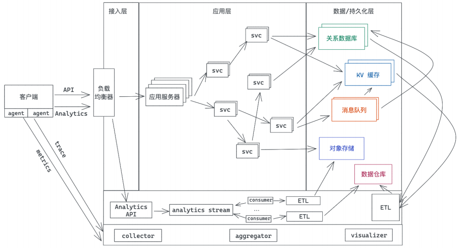

# 数据处理: 应用程序和数据如何打交道?

我们开发者无论是从事服务端的开发, 还是客户端的开发, 和数据打交道是必不可少的

对于客户端来说, 从服务端读取到数据, 往往需要做缓存(内存缓存或者SQLite缓存), 甚至需要本地存储(文件或者SQLite)

对于服务器来说, 跟数据打交道的场景就更加丰富了, 除了数据库和缓存外, 还有大量的文本数据的索引(比如搜索引擎), 实时的消息队列对数据做流式处理, 或者非实时的批理对数据仓库(data wareouse)中的海量数据就进行ETL(Extract, Transfrom and Load)



今天我们就来讲讲如何用Rust做数据处理, 主要讲两部分, 如何用Rust访问关系数据库, 以及如何用Rust对半结构化数据进行分析和处理, 希望通过学习这一讲的内容, 尤其是后半部分的内容, 能帮你打开眼界, 对数据处理有更加深刻的认识

## 访问关系数据库

作为互联网应用的最主要的数据存储和访问工具, 关系数据库, 是几乎没门编程语言都有良好支持的数据库类型

在Rust下, 有几乎所有主流关系数据库的驱动, 比如rust-postgres, rust-mysql-simple等, 不过一般我们不太会直接使用数据库的驱动来访问数据库, 因为那样会让应用过于耦合与某个数据库, 所以我们会使用ORM

Rust下有diesel这个非常成熟的ORM, 还有sea-orm这样的后起之秀, diesel不支持异步, 而sea-orm支持异步, 所以有理由相信, 随着sea-orm的不断程序, 会有越来越多的应用在sea-orm上构建

如果你觉得ORM太过笨重, 繁文缛节太多, 但又不想直接使用某个数据的驱动来访问数据, 那么你还可以用sqlx, sqlx提供了对多种数据的异步访问支持, 并且不使用DSL就可以对SQL query做编译时检查, 非常轻便; 它可以从数据库中直接查询出来一行数据, 也可以通过派生宏自行把行数据转换成对应的结构

今天, 我们就尝试使用sqlx处理用户注册和登陆两个非常常见的功能

## sqlx

构建下面的表结构来处理用户登陆信息:

```sql
CREATE TABLE IF NOT EXISTS users
(
    id INTEGER PRIMARY KEY NOT NULL,
    email VARCHAR UNIQUE NOT NULL,
    hashed_password VARCHAR NOT NULL
);
```

特别说明一下, 在数据库中存储用户信息需要非常谨慎, 尤其是涉及的敏感, 比如密码, 需要使用特定的哈希算法存储, OWASP对密码的存储有如下安全建议:

1. 若Argon2id可用, 那么使用Argon2id(需要目标及其至少有15MB内存)
2. 若Argon2id不可用, 那么使用bcrypt(算法至少迭代10次)
3. 之后再考虑scryp / PBKDF2

Argon2id是Argon2d和Argon2i的组合, Argon2d提供了强大的抗GPU破解能力, 但在特定的情况下容易遭受旁路攻击, 而Argon2i则可以防止旁路攻击, 但抗CPU破解稍弱, 所以只要是编程语言支持Argon2id, 那么它就是首选的密码哈希工具

Rust下有完善的password-hashes工具, 我们可以使用其中的argon2 crate, 用它来生成一个完整的, 包含所有参数的密码哈希长这个样子

```bash
$argon2id$v=19$m=4096,t=3,p=1$l7IEIWV7puJYJAZHyyut8A$OPxL09ODxp/xDQEnlG1NWdOsTr7RzuleBtiYQsnCyXY
```

这个字符串中包含了agon2id的版本(19), 使用的内存大小(4096k), 迭代次数(3次), 并行程度(1个线程), 以及base64编码的salt和hash

所以, 当新用户注册的时候, 我们使用argon2把传入的密码哈希一下, 存储到数据库中; 当用户使用email/password登录时, 我们通过email找到用户, 然后在通过argon2验证密码, 数据库的访问使用sqlx, 为了简单起见, 避免安装额外的数据, 就使用SQLite来存储数据(如果你本地有Mysql或者PostgreSQL, 可以自行替换相应的语句)

有了这个思路, 我们创建一个新项目, 添加相关的依赖

```toml
[package]
name = "_01_data_processing"
version = "0.1.0"
edition = "2021"

[dependencies]
anyhow = "1.0.95"
argon2 = "0.5.3"
lazy_static = "1.5.0"
rand_core = { version = "0.6.4", features = ["std"] }
sqlx = { version = "0.8.2", features = ["runtime-tokio-rustls", "sqlite"] }
tokio = { version = "1.42.0", features = ["full"] }
```

然后创建`examples/user.rs`填入文件, 你可以对照详细的注释来理解:

```rust
```

