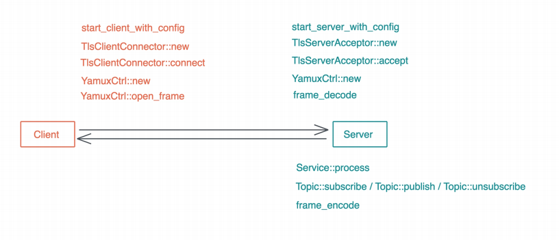

# 阶段实操: 构建一个简单的KV Server - 配置 / 监控 / CI / CD

终于我们来到了这个KV Server系列的终章, 虽然这是一个简单的KV Server, 它没哟U复杂的性能优化, 我们只用了依据unsafe; 也没有复杂的生命周期处理; 更没有支持集群的处理

然后, 如果你能够理解到目前位置的代码, 甚至能独立写出这样的代码, 那么你已经很棒了

今天我们就给KV Server收个尾, 结合之前梳理的实战中的Rust项目应该考虑的问题, 来聊一聊和生产环境相关的一些处理, 按流程触发, 主要讲五个方面: 配置, 集成测试, 性能测试, 测量和监控. CI/CD

## 配置

首先在Cargo.toml里添加serde和toml, 我们计划使用透明蓝做配置文件, serde用来处理配置的序列化和反序列化

```rust
use std::fs;

use serde::{Deserialize, Serialize};

use crate::KvError;

#[derive(Debug, Clone, Serialize, Deserialize, PartialEq)]
pub struct ServerConfig {
    pub general: GeneralConfig,
    pub storage: StorageConfig,
    pub tls: ServerTlsConfig,
}

#[derive(Debug, Clone, Serialize, Deserialize, PartialEq)]
pub struct ClientConfig {
    pub general: GeneralConfig,
    pub tls: ClientTlsConfig,
}

#[derive(Clone, Serialize, Debug, Deserialize, PartialEq)]
pub struct GeneralConfig {
    pub addr: String,
}

#[derive(Clone, Debug, Serialize, Deserialize, PartialEq)]
#[serde(tag = "type", content = "args")]
pub enum StorageConfig {
    MemTable,
    SledDb(String),
}

#[derive(Debug, Clone, Serialize, Deserialize, PartialEq)]
pub struct ServerTlsConfig {
    pub cert: String,
    pub key: String,
    pub ca: Option<String>,
}

#[derive(Debug, Clone, Serialize, Deserialize, PartialEq)]
pub struct ClientTlsConfig {
    pub domain: String,
    pub identity: Option<(String, String)>,
    pub ca: Option<String>,
}

impl ServerConfig {
    pub fn load(path: &str) -> Result<Self, KvError> {
        let config = fs::read_to_string(path)?;
        let config: Self = toml::from_str(&config)?;
        Ok(config)
    }
}

#[cfg(test)]
mod tests {
    use super::*;

    #[test]
    fn server_config_should_be_loaded() {
        let result: Result<ServerConfig, toml::de::Error> =
            toml::from_str(include_str!("../fixtures/server.conf"));
        assert!(result.is_ok());
    }

    #[test]
    fn client_config_should_be_loaded() {
        let result: Result<ClientConfig, toml::de::Error> =
            toml::from_str(include_str!("../fixtures/client.conf"));
        assert!(result.is_ok());
    }
}
use std::fs;

use serde::{Deserialize, Serialize};

use crate::KvError;

#[derive(Debug, Clone, Serialize, Deserialize, PartialEq)]
pub struct ServerConfig {
    pub general: GeneralConfig,
    pub storage: StorageConfig,
    pub tls: ServerTlsConfig,
}

#[derive(Debug, Clone, Serialize, Deserialize, PartialEq)]
pub struct ClientConfig {
    pub general: GeneralConfig,
    pub tls: ClientTlsConfig,
}

#[derive(Clone, Serialize, Debug, Deserialize, PartialEq)]
pub struct GeneralConfig {
    pub addr: String,
}

#[derive(Clone, Debug, Serialize, Deserialize, PartialEq)]
#[serde(tag = "type", content = "args")]
pub enum StorageConfig {
    MemTable,
    SledDb(String),
}

#[derive(Debug, Clone, Serialize, Deserialize, PartialEq)]
pub struct ServerTlsConfig {
    pub cert: String,
    pub key: String,
    pub ca: Option<String>,
}

#[derive(Debug, Clone, Serialize, Deserialize, PartialEq)]
pub struct ClientTlsConfig {
    pub domain: String,
    pub identity: Option<(String, String)>,
    pub ca: Option<String>,
}

impl ServerConfig {
    pub fn load(path: &str) -> Result<Self, KvError> {
        let config = fs::read_to_string(path)?;
        let config: Self = toml::from_str(&config)?;
        Ok(config)
    }
}

#[cfg(test)]
mod tests {
    use super::*;

    #[test]
    fn server_config_should_be_loaded() {
        let result: Result<ServerConfig, toml::de::Error> =
            toml::from_str(include_str!("../fixtures/server.conf"));
        assert!(result.is_ok());
    }

    #[test]
    fn client_config_should_be_loaded() {
        let result: Result<ClientConfig, toml::de::Error> =
            toml::from_str(include_str!("../fixtures/client.conf"));
        assert!(result.is_ok());
    }
}
```

你可以看到, 在Rust下, 有了serde的帮助, 处理任何已知格式的配置文件, 是多么容易的一件事情, 我们只需要定义数据结构, 并未数据结构使用Serialize/Deserialize派生宏, 就可以处理任何支持serde的数据结构

我还写了个examples/gen_config.rs, 用来生成配置文件

有了配置文件的支持, 就可以在lib.rs下写一些辅助函数, 让我们创建服务端和客户端更加简单:

```rust
mod config;
mod error;
mod network;
mod pb;
mod service;
mod storage;

pub use config::*;
pub use error::*;
pub use network::*;
pub use pb::*;
pub use service::*;
pub use storage::*;

use anyhow::Result;
use tokio::net::{TcpListener, TcpStream};
use tokio_rustls::client;
use tokio_util::compat::FuturesAsyncReadCompatExt;
use tracing::{info, instrument, span};

/// 通过配置创建KV服务器
pub async fn start_server_with_config(config: &ServerConfig) -> Result<()> {
    let acceptor =
        TlsServerAcceptor::new(&config.tls.cert, &config.tls.key, config.tls.ca.as_deref())?;

    let addr = &config.general.addr;

    match &config.storage {
        StorageConfig::MemTable => start_tls_server(addr, MemTable::new(), acceptor).await?,
        StorageConfig::SledDb(path) => start_tls_server(addr, SledDb::new(path), acceptor).await?,
    }

    Ok(())
}

/// 通过配置创建KV客户端
pub async fn start_client_with_config(
    config: &ClientConfig,
) -> Result<YamuxCtrl<client::TlsStream<TcpStream>>> {
    let addr = &config.general.addr;
    let tls = &config.tls;
    let identity = tls.identity.as_ref().map(|(c, k)| (c.as_str(), k.as_str()));
    let connector = TlsClientConnector::new(&tls.domain, identity, tls.ca.as_deref())?;
    let stream = TcpStream::connect(addr).await?;
    let stream = connector.connect(stream).await?;
    Ok(YamuxCtrl::new_client(stream, None))
}

async fn start_tls_server<Store: Storage + Send + 'static + std::marker::Sync>(
    addr: &str,
    store: Store,
    acceptor: TlsServerAcceptor,
) -> Result<()> {
    let service: Service<Store> = ServiceInner::new(store).into();
    let listener = TcpListener::bind(addr).await?;
    info!("Start listening on {addr}");

    loop {
        let tls = acceptor.clone();
        let (stream, addr) = listener.accept().await?;
        info!("Client {addr:?} connected");

        let svc = service.clone();
        tokio::spawn(async move {
            let stream = tls.accept(stream).await.unwrap();
            YamuxCtrl::new_server(stream, None, move |stream| {
                let svc1 = svc.clone();
                async move {
                    let stream = ProstServerStream::new(stream.compat(), svc1.clone());
                    stream.process().await.unwrap();
                    Ok(())
                }
            });
        });
    }
}
```

有了start_server_with_config和start_client_with_config这两个辅助函数, 我们就可以简化`src/client.rs`和`src/server.rs`的新代码:

```rust
use anyhow::Result;
use kv::{start_server_with_config, ServerConfig};

#[tokio::main]
async fn main() -> Result<()> {
    tracing_subscriber::fmt::init();
    let config: ServerConfig = toml::from_str(include_str!("../fixtures/client.conf"))?;
    start_server_with_config(&config).await?;
    Ok(())
}
```

可以看到, 整个代码简洁了很多, 在这个重构的过程中, 还有一些其他的改动

## 集成测试

之前哦我们写了很多测试, 但还没有写过一行集成测试, 今天就来写一个简单的集成测试, 确保客户端和服务器完整的交互正常

之前提到过在Rust中, 集成测试放在tests目录下, 每个测试是编译成独立的二进制文件, 所以我们先创建和src平行的tests目录, 然后在创建tests/server.rs, 填入以下代码:

```rust
use std::time::Duration;

use anyhow::Result;
use kv::{
    start_client_with_config, start_server_with_config, ClientConfig, CommandRequest,
    ProstClientStream, ServerConfig, StorageConfig,
};
use tokio::time;

#[tokio::test]
async fn yamux_server_client_full_tests() -> Result<()> {
    let addr = "127.0.0.1:10086";
    let mut config: ServerConfig = toml::from_str(include_str!("../fixtures/server.conf"))?;
    config.general.addr = addr.into();
    config.storage = StorageConfig::MemTable;

    // 启动服务
    tokio::spawn(async move {
        start_server_with_config(&config).await.unwrap();
    });

    time::sleep(Duration::from_millis(10)).await;
    let mut config: ClientConfig = toml::from_str(include_str!("../fixtures/client.conf"))?;
    config.general.addr = addr.into();

    let mut ctrl = start_client_with_config(&config).await.unwrap();
    let mut stream = ctrl.open_stream().await.unwrap();

    // 生成一个HSET命令
    let cmd = CommandRequest::new_hset("t1", "k1", "v1".into());
    stream.execute_unary(&cmd).await?;

    // 生成一个HGET命令
    let cmd = CommandRequest::new_hget("t1", "k1");
    let data = stream.execute_unary(&cmd).await?;

    assert_eq!(data.status, 200);
    assert_eq!(data.values, &["v1".into()]);

    Ok(())
}
```

可以看到, 继集成测试的写法和单元测试其实很类似, 只不过哦们我不需要在使用`#[cfg(test)]`来做条件编译

如果你的集成测试比较复杂, 需要比较多的辅助代码, 那么你还可以在tests下的cargo new出一个项目, 然后在那个项目李撰写辅助代码和测试代码, 如果你对此感兴趣, 可以看tonic的集成测试, 不过注意了, 集成测试和你的crate用同样的条件编译, 所以在集成测试中, 无法使用单元测试中构建的辅助代码

## 性能测试

在之前不断完善的KV Server的过程中, 你一定会好奇: 我们的KV Server性能究竟如何呢? 那么写一个关于Pub/Sub的性能测试

基本的想法是我们连上100个subscriber作为背景, 然后看publisher publish的速度

因为BROADCAST_CAPACITY有限, 是128, 当publisher速度太快, 而导致server不能及时王subscriber发送的时候, server接收client的速度就会降下来, 无法接收新的client, 整体的publish的速度机会降下来, 所以这个测试能够了解server处理publish的速度

为了确认这一点, 我们在start_tls_server函数中, 在process之前, 在加个100ms的延时, 人为减缓系统的处理速度

```rust
async move {
    let stream = ProstServerStream::new(stream.compat(), svc1.clone());
    // 延迟 100ms 处理
    time::sleep(Duration::from_millis(100)).await;
    stream.process().await.unwrap();
    Ok(())
}
```

现在可以写性能测试了

在Rust下, 哦我们可以用criterion库, 它可以处理基本的性能测试, 并生成漂亮的报告, 所以在Cargo.toml中加入:

```toml
[package]
name = "kv"
version = "0.1.0"
edition = "2021"

[[bin]]
name = "kvs"
path = "src/server.rs"

[[bin]]
name = "kvc"
path = "src/client.rs"

[dependencies]
bytes = "1"                                                # 高效处理网络 buffer 的库
dashmap = "6.1.0"                                          # 并发 HashMap
flate2 = "1.0.35"
http = "1.2"                                               # 我们使用 HTTP status code 所以引入这个类型库
prost = "0.9"                                              # 处理 protobuf 的代码
sled = "0.34.7"
thiserror = "2.0.6"                                        # 错误定义和处理
tokio = { version = "1", features = ["full"] }
tracing = "0.1"                                            # 日志处理
update = "0.0.0"
tracing-subscriber = "0.3"                                 # 日志处理
anyhow = "1"                                               # 错误处理
tokio-rustls = "0.22"
rustls-native-certs = "0.5"
futures = "0.3"                                            # 提供 Stream trait
yamux = "0.9"
tokio-util = { version = "0.7.13", features = ["compat"] }
tokio-stream = { version = "0.1", features = ["sync"] }    # 处理 stream
serde = { version = "1.0.216", features = ["derive"] }
toml = "0.8.19"

[dev-dependencies]
async-prost = "0.3"                                       # 支持把 protobuf 封装成 TCP frame
certify = "0.3"
criterion = { version = "0.5.1", features = ["async_futures", "async_tokio", "html_reports"] }
rand = "0.8.5"
tempfile = "3.14.0"
tokio-util = { version = "0.7.13", features = ["codec"] }

[build-dependencies]
prost-build = "0.9" #
```

最后这个bench section, 描述了性能测试的名字, 它对应benches目录下的同名文件

我们创建和src平级的benches, 然后创建benches/pubsub.rs, 添加如下代码:

```rust
use std::time::Duration;

use anyhow::Result;
use criterion::{criterion_group, criterion_main, Criterion};
use futures::StreamExt;
use kv::{
    start_client_with_config, start_server_with_config, ClientConfig, CommandRequest, ServerConfig,
    StorageConfig, YamuxCtrl,
};
use rand::seq::SliceRandom;
use tokio::{net::TcpStream, runtime::Builder, time};
use tokio_rustls::client::TlsStream;
use tracing::info;

async fn start_server() -> Result<()> {
    let addr = "127.0.0.1:9999";
    let mut config: ServerConfig = toml::from_str(include_str!("../fixtures/server.conf"))?;
    config.general.addr = addr.into();
    config.storage = StorageConfig::MemTable;

    tokio::spawn(async move {
        start_server_with_config(&config).await.unwrap();
    });

    Ok(())
}

async fn connect() -> Result<YamuxCtrl<TlsStream<TcpStream>>> {
    let addr = "127.0.0.1:9999";
    let mut config: ClientConfig = toml::from_str(include_str!("../fixtures/client.conf"))?;
    config.general.addr = addr.into();

    Ok(start_client_with_config(&config).await?)
}

async fn start_subscribers(topic: &'static str) -> Result<()> {
    let mut ctrl = connect().await?;
    let stream = ctrl.open_stream().await?;
    info!("C(subscriber): stream opened");
    let cmd = CommandRequest::new_subscribe(topic.to_string());
    tokio::spawn(async move {
        let mut stream = stream.execute_streaming(&cmd).await.unwrap();
        while let Some(Ok(data)) = stream.next().await {
            drop(data);
        }
    });

    Ok(())
}

async fn start_publishers(topic: &'static str, values: &'static [&'static str]) -> Result<()> {
    let mut rng = rand::thread_rng();
    let v = values.choose(&mut rng).unwrap();
    let mut ctrl = connect().await.unwrap();
    let mut stream = ctrl.open_stream().await.unwrap();
    info!("C(publisher): stream opened");

    let cmd = CommandRequest::new_publish(topic.to_string(), vec![(*v).into()]);
    stream.execute_unary(&cmd).await.unwrap();

    Ok(())
}

fn pubsub(c: &mut Criterion) {
    // tracing_subscriber::fmt::init();
    // 创建Tokio runtime
    let runtime = Builder::new_multi_thread()
        .worker_threads(4)
        .thread_name("pubsub")
        .enable_all()
        .build()
        .unwrap();
    let values = &["Hello", "Nyh", "Goodbye", "World"];
    let topic = "lobby";
    // 运行服务器和100个subscriber, 为测试准备
    runtime.block_on(async {
        eprint!("preparing server and subscribers");
        start_server().await.unwrap();
        time::sleep(Duration::from_millis(50)).await;
        for _ in 0..100 {
            start_subscribers(topic).await.unwrap();
            eprint!(".")
        }
        eprintln!("Done!");
    });

    c.bench_function("publishing", move |b| {
        b.to_async(&runtime)
            .iter(|| async { start_publishers(topic, values).await });
    });
}

criterion_group! {
  name = benches;
  config = Criterion::default().sample_size(10);
  targets = pubsub
}

criterion_main!(benches);
```

大部分代码很好理解, 就是创建服务器和客户端, 为测试做准备, 说一下这里面核心的benchmark代码:

```rust
c.bench_function("publishing", move |b| {
    b.to_async(&runtime)
    .iter(|| async { start_publishers(topic, values).await });
});
```

对于要测试的代码, 我们可以封装成一个函数进行测试, 这里因为要做async函数的测试, 需要使用runtime, 普通的函数不需要调用to_async, 对于更多有关criterion的用法, 可以参考它的文档

运行cargo bench后, 会见到如下打印

```bash
publishing              time:   [110.31 ms 111.69 ms 113.48 ms]
```

可与看到单个publish会见到如下打印, 好慢, 我们可以把之前的延时去掉, 再次测试:

```bash
publishing              time:   [1.6899 ms 1.7244 ms 1.7669 ms]
                        change: [-98.496% -98.446% -98.392%] (p = 0.00 < 0.05)
                        Performance has improved.
Found 1 outliers among 10 measurements (10.00%)
  1 (10.00%) high mild
```


## 测量和监控

工业界有句名言: 如果你无法测量, 那么你就无法改进(If you can't measure it, you can't improve it), 现在知道了kV Server性能有问题, 但并不知道问题出在哪里, 我们需要使用合适的测量方式

目前, 比较好的端到端的性能监控和测量工具是jaeger, 我们可以在KV Server/client侧收集监控信息, 发送给jaeger来查看服务器和客户端的整个处理流程中, 事件都花费到了哪里去了

之前我们在KV Server里使用的日志工具是tracing, 不过日志只是它的诸多功能之一, 他还能做instrument, 然后配合opentelemetry库, 然后我们就可以吧instrument的结果发送给jaeger了

在Cargo.toml文件中添加新的依赖:

```toml
[package]
name = "kv"
version = "0.1.0"
edition = "2021"

[[bin]]
name = "kvs"
path = "src/server.rs"

[[bin]]
name = "kvc"
path = "src/client.rs"

[dependencies]
bytes = "1"                                                             # 高效处理网络 buffer 的库
dashmap = "6.1.0"                                                       # 并发 HashMap
flate2 = "1.0.35"
http = "1.2"                                                            # 我们使用 HTTP status code 所以引入这个类型库
prost = "0.9"                                                           # 处理 protobuf 的代码
sled = "0.34.7"
thiserror = "2.0.6"                                                     # 错误定义和处理
tokio = { version = "1", features = ["full"] }
tracing = "0.1"                                                         # 日志处理
update = "0.0.0"
anyhow = "1"                                                            # 错误处理
tokio-rustls = "0.22"
rustls-native-certs = "0.5"
futures = "0.3"                                                         # 提供 Stream trait
yamux = "0.9"
tokio-util = { version = "0.7.13", features = ["compat"] }
tokio-stream = { version = "0.1", features = ["sync"] }                 # 处理 stream
serde = { version = "1.0.216", features = ["derive"] }
toml = "0.8.19"
opentelemetry-jaeger = "0.22.0"
tracing-appender = "0.2.3"
tracing-opentelemetry = "0.28.0"
tracing-subscriber = { version = "0.3", features = ["json", "chrono"] } # 日志处理

[dev-dependencies]
async-prost = "0.3" # 支持把 protobuf 封装成 TCP frame
certify = "0.3"
criterion = { version = "0.5.1", features = [
  "async_futures",
  "async_tokio",
  "html_reports",
] }
rand = "0.8.5"
tempfile = "3.14.0"
tokio-util = { version = "0.7.13", features = ["codec"] }

[build-dependencies]
prost-build = "0.9" #
```

有了这些依赖后, 在`benches/pubsub.rs`里, 我们可以在初始化tracing_subscriber时, 使用jaeger和opentelemetry tracer:

```rust
fn pubsub(c: &mut Criterion) {
    let tracer = opentelemetry_jaeger::new_pipeline()
    .with_service_name("kv-bench")
    .install_simple()
    .unwrap();
    let opentelemetry = tracing_opentelemetry::layer().with_tracer(tracer);
    tracing_subscriber::registry()
    .with(EnvFilter::from_default_env())
    .with(opentelemetry)
    .init();
    let root = span!(tracing::Level::INFO, "app_start", work_units = 2);
    let _enter = root.enter();
    // 创建 Tokio runtime
    ...
}
```

设置好tracing后, 就在系统的主流程上添加相应的instrument



注意instrument可以用不同的名称, 比如对于TlsConnector::new函数, 可以用`#[instrument(name = "tls_connector_new")], 这样的名字辨识度高一些

为主流程中的函数添加完instrument后, 你需要先打开一个窗口, 运行jaeger(需要docker)

```rust
docker run -d -p6831:6831/udp -p6832:6832/udp -p16686:16686 -p14268:14268 jaeger
```

然后带着RUST_LOG=info运行benchmark

## CI/CD

为了方便我们把CI/CD放在最后, 但CI/CD应该是在一开始的使用后就妥善设置的

先说CI把, 这个项目在一开始的是哦户就设置了github action, 每次commit都会运行

- 代码格式检查: cargo fmt
- 依赖检查license检查: cargo deny
- linting: cargo check 和 cargo clippy
- 单元测试和继承测试: cargo test
- 生成文档: cargo doc

github action的配置如下, 供你参考

```yaml
name: build

on:
  push:
    branches:
      - master
  pull_request:
    branches:
      - master

jobs:
  build-rust:
    strategy:
      matrix:
        platform: [ubuntu-latest]
    runs-on: ${{ matrix.platform }}
    steps:
      - uses: actions/checkout@v2
      - name: Cache cargo registry
        uses: actions/cache@v1
        with:
          path: ~/.cargo/registry
          key: ${{ runner.os }}-cargo-registry
      - name: Cache cargo index
        uses: actions/cache@v1
        with:
          path: ~/.cargo/git
          key: ${{ runner.os }}-cargo-index
      - name: Cache cargo build
        uses: actions/cache@v1
        with:
          path: target
          key: ${{ runner.os }}-cargo-build-target
      - name: Install stable
        uses: actions-rs/toolchain@v1
        with:
          profile: minimal
          toolchain: stable
          override: true
      - name: Check code format
        run: cargo fmt -- --check
      - name: Check the package for errors
        run: cargo check --all
      - name: Lint rust sources
        run: cargo clippy --all-targets --all-features --tests --benches -- -D warnings
      - name: Run tests
        run: cargo test --all-features -- --test-threads=1 --nocapture
      - name: Generate docs
        run: cargo doc --all-features --no-deps
```

除此之外, 我们还可以在每次push tag时做release

```yaml
name: release

on:
  push:
    tags:
      - "v*" # Push events to matching v*, i.e. v1.0, v20.15.10

jobs:
  build:
    name: Upload Release Asset
    runs-on: ${{ matrix.os }}
    strategy:
      matrix:
        os: [ubuntu-latest]
    steps:
      - name: Cache cargo registry
        uses: actions/cache@v1
        with:
          path: ~/.cargo/registry
          key: ${{ runner.os }}-cargo-registry
      - name: Cache cargo index
        uses: actions/cache@v1
        with:
          path: ~/.cargo/git
          key: ${{ runner.os }}-cargo-index
      - name: Cache cargo build
        uses: actions/cache@v1
        with:
          path: target
          key: ${{ runner.os }}-cargo-build-target
      - name: Checkout code
        uses: actions/checkout@v2
        with:
          token: ${{ secrets.GH_TOKEN }}
          submodules: recursive
      - name: Build project
        run: |
          make build-release
      - name: Create Release
        id: create_release
        uses: actions/create-release@v1
        env:
          GITHUB_TOKEN: ${{ secrets.GITHUB_TOKEN }}
        with:
          tag_name: ${{ github.ref }}
          release_name: Release ${{ github.ref }}
          draft: false
          prerelease: false
      - name: Upload asset
        id: upload-kv-asset
        uses: actions/upload-release-asset@v1
        env:
          GITHUB_TOKEN: ${{ secrets.GITHUB_TOKEN }}
        with:
          upload_url: ${{ steps.create_release.outputs.upload_url }}
          asset_path: ./target/release/kvs
          asset_name: kvs
          asset_content_type: application/octet-stream
      - name: Set env
        run: echo "RELEASE_VERSION=${GITHUB_REF#refs/*/}" >> $GITHUB_ENV
      - name: Deploy docs to gh-page
        uses: peaceiris/actions-gh-pages@v3
        with:
          github_token: ${{ secrets.GITHUB_TOKEN }}
          publish_dir: ./target/doc/simple_kv
          destination_dir: ${{ env.RELEASE_VERSION }}
```

这样, 每次push tag的时候, 都可以打包出来Linux的kvs版本

如果你不希望直接使用编译出来的二进制, 也可以打包成docker, 在Kubernetes下使用

在做CI的过程中, 我们也可以触发CD, 比如:

- PR merge到master, 在build完成后, 触发dev服务器的部署, 团队内部可以尝试
- 如果release tag包含alpha, 在build完成后, 触发beta服务器的部署, beta用户可以使用
- 正式的release tag会触发生产环境下的滚动升级, 升级覆盖到用户可以使用

一般来说, 没加企业都有自己的CI/CD工具链, 这里为了方便展示, 我们演示了如何使用github action对Rust代码左CI, 你可以按照自己的需求来处理

在刚才的action代码中, 还编译并上传了文档, 所以哦我们可以通过github pages很方便的访问文档

## 小结

我们的KV Server之旅就到此为止了

