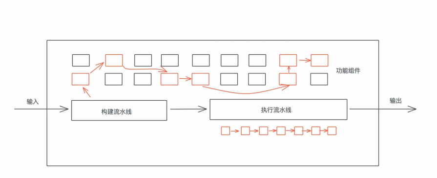

# 软件架构: 如何用Rust架构复杂系统?

对一个软件系统来说, 不同部门关心的侧重点不同, 产品, 运营和销售部门关心产品的功能, 测试部门关心产品的缺陷, 工程部门除了开发功能, 解决缺陷外, 还要不断的维护和优化系统的架构, 减少之前遗留的技术债

从长远来看, 缺陷和技术债对软件系统是负面的作用, 而功能和架构对软件系统是正面的作用

从是否对用户可见来说, 相比可见的功能和缺陷, 架构和技术债是不可见的, 它们往往会被公司的决策层以各种理由忽视, 尤其当它们的KPI/OKR上都不满了急功近利的数字, 每个季度或者每半个财年都是生死战(win or go home)的时候, 只要能实现功能性的中短期目标, 它们什么都可以牺牲, 不可见并且很难带来直接受收益的架构设计, 往往是最先被牺牲掉的

但架构以及架构相关的工作会带来长期的回报

因为平时哦我们往系统里添加的功能, 会不可避免的增加系统的缺陷, 潜在引入新的技术债, 以及扰乱原本稳定的架构, 这是一个熵增的过程, 缺陷会拖累功能的表现, 进一步恶化的系统中的技术债; 而计数债会延缓新功能的引入, 放大已有的和未来的缺陷, 并破坏现有的架构, 这样一直持续下去, 整个系统会进入到一个下降通道, 直到无以为继

为了避免这样的事情发生, 我们需要通过对架构进行维护性的工作, 来减少缺陷, 修复技术债, 改善功能, 最终将整个系统拉回到上升通道


在我看来, 软件系统是架构, 功能, 缺陷, 以及技术债之间的共同作用, 互相拉扯的一个结果

在一个项目的初期, 为了快速达到产品和时长的契合, 引入了技术债来最大程度的提高构建的速度, 是最佳选择, 但这并不意味着我们可以放弃架构的设计, 埋头码字

过去二十年的时间, 敏捷宣言和精益创业对软件社区的最大的负面影响就是, 一大堆外行或者并没有深刻理解软件功能的从业者, 过分追求速度, 过渡曲解MVP, 而忽视了从起点出发前, 必不可少的架构和设计功夫, 导致了大部分技术债实际上是架构和设计阶段的债务

但产品初期, 在方向并不明确的情况下, 我们如何架构系统呢?

类似瀑布模型那样的迭代方式, 在产品的初期花费了大量的精力做架构和设计, 往往会导致过渡设计, 引入了不必要的而麻烦和可能永远用不上的精妙结构; 但过分追求敏捷, 干了再说, 又会让技术债很快就积累到一个难以为继的地步

所以, 对于这样的场景, 我们应该采用渐进式的架构设计, 从MVP的去需求中寻找架构的核心要素, 构建一个原始但完整的数据结构, 然后围绕着核心要素演进


今天我们就来讲一讲怎么考虑架构设计, 以及如何用Rust构建出一些典型的架构风格, 希望你在学完这一讲最大的体会是: 做任何开发之前, 养成好的习惯, 首先要做必要的架构和设计

## 如何考虑架构设计?

架构设计是一个非常广泛的概念, 很难一言以蔽之, 在`Fundamentals of Software Architecture`一书中, 作者从四个维度来探讨架构, 分别是:

- Structure: 架构风格和结构, 比如MVVM, 微服务
- Characteristics: 架构的主要指标, 比如可伸缩性, 容错性, 性能
- Decisions: 架构的硬性规则, 比如服务调用只能通过接口完成
- Design Principles: 架构的设计原则, 比如优先使用消息通讯

可以对照下图来理解


## Structure架构的风格

首先是架构的风格, 实战课中我们一直在迭代的KV Server, 就采取了分城的结构, 把网络层, 业务层, 存储层分隔开


虽然最开始网络层长什么样子, 我们并不清楚, 但这种分成是的后来不断迭代的网络层的时候, 都不会影响到业务层

一个复杂的大型系统往往可以使用分治的原则处理, 之前展示过这样的图, 一个互联网应用的最基本, 最普遍的结构


从业务的大方向上, 我们可以进行分层处理, 每层又可以选择不同的架构, 比如微服务架构, 事件驱动架构, 管道结构等等, 然后拆分出来的每个组件内部又可以用分层, 比如把数据层, 业务层, 接口层分离, 这样一层层延展下去, 直到拆分出来的结果可以天为单位执行

在执行的过程中, 我们可以选取跟MVP有关的路径进行开发, 并在这个过程中不断审视架构的设计, 做相应的修改, 你如果回顾一下KV Server的演进过程, 从最初构造到这个几乎成型的版本, 就可以感受到一个一开始有一个完整但原始的架构, 然后围绕着核心演进的重要性

## Characteristics结构的主要指标

再来看架构的主要指标, 就像图中展示的那样, 一个系统有很多指标来衡量其成功, 包括但不限于: 高性能, 高可用, 可靠性, 可伸缩性, 安全性, 灵活性, 容错性, 自我修复性, 可读性等等;


不过, 这些指标并不是平等的关系, 不同的系统会有不同的优先级

对于KV Server来说, 我们关心系统的性能 / 安全性 / 可测性, 所以使用了最基本的in memory hashmap来保证查询的性能, 使用TCP + yamux来保证网络性能, 使用channel和dashmap来保证并发性能, 以及使用TLS来保证安全性, 同时一直注重接口的清晰和可测试性

可以看到, 一旦我们做出了架构指标上的决定, 那么进一步的设计会优先考虑这些指标的需求

## Decisions架构的硬性规则

在架构设计的过程中, 引入硬性约束或者原则非常重要, 它就像架构的基本法, 不可触碰, 很多时候, 当你引入了某个架构, 你也引入了这个结构所带来的约束, 比如微服务结构, 它的约束就是: 服务间的一切访问只能通过公开的接口完成, 任何服务间不能有私下的约定

这个现在看起来很容易理解的决定, 在差不多二十年前是振聋发聩的呐喊, 2002年, 亚马逊还是一家小公司, 贝佐斯还离首富差了几个比尔盖茨, 作为一个不是特别懂技术的MBA, 它撰写了一个划时代的备忘录, 并在亚马逊强制执行, 这个备忘录很简单, 看它的原文:


这个备忘录促成了AWS这个庞大的云服务帝国的诞生, 这个约束主要促成了三个要点: 独立的服务, 服务间只能通过接口调用, 服务的接口能被外部开发者调用

## Design Principles架构的设计原则

最后, 我们简单说说架构的设计原则, 和架构的硬性约束不同的是, 设计原则更多是推荐做法, 而非不可触碰的雷区, 我们在构建系统的时候, 要留有余地, 这样在开发和迭代的过程中, 才能根据情况选择合适的设计

比如对于KV Server来说, 推荐使用TCP / yamux来处理网络, 但并不是说gRPC甚至QUIC就不能使用; 推荐用二进制的protobuf来在客户端和服务器传输信息,  但在某些场景下, 如果基于文本的传输方式, 或者非protobuf的二进制传输方式更合适, 那么未来完全可以替换这部分的设计

## 如何用Rust构建典型的架构风格?

在复习一下刚才聊的架构设计的四个方面:

- Structure架构的风格和结构
- Characteristics架构的主要指标
- Decision架构的硬性规则
- Design Principles架构的设计原则

其中后三点架构的指标, 硬性规则, 设计原则, 和具体的项目关联度很大, 我们并没有模式化的工具来套用它, 但架构风格是由很多固定的套路的, 这些套路, 往往是在日积月累的软件开发事件中, 逐渐形成的

目前比较普遍使用的架构风格有, 分成结构, 流水线结构, 插件结构, 微服务结构, 事件驱动结构等

微服务结构相信大家比较熟悉, 这里就不赘述了; 事件驱动结构可以通过channel来实现, 我们在KV Server中构建的pub/sub就有了事件驱动的影子, 但一个高性能的事件驱动结构需要第三方的消息队列来提供支持, 比如kafka, nats等, 你可以自己去看他们各自推荐的时间驱动模型

不过不管你用何种分布式的架构, 最终每个服务内部的架构还是会使用分成结构, 流水线结构和插件结构, 我们这里就简单的讲讲这三者

## 分层结构

开头已经谈到了分层, 这是最朴素, 也是最实用的架构, 软件行业有一句至理名言是:

> All problems in computer science can be solved by another level of indirection.

这种使用分层来漂亮的解决问题的思路, 贯穿整个软件行业

操作系统是应用程序和硬件的中间层; 虚拟内存是线性内存和物理内存的中间层; 虚拟机是操作系统和裸机的中间层; 容器是应用程序和操作系统的中间层; IOS的OSI模型, 把网络划分为7层, 这让我们至今还受益于几十年前就设计出来的网络结构

分层, 意味着明确每一层的职责范围以及层与层之间接口, 一旦我们有明晰的层次划分, 以及硬性规定层与层之间只能通过公开接口调用, 且不能跨层调用, 那么系统就具备了很强的灵活性, 某层的内部实现可以完全被不同的实现来替换, 而不必担心上下游的影响

在Rust下, 我们可以用trait来进行接口的定义, 通过接口来分层, 就像KV Server展现的那样, 把网络层或者业务层各自的迭代不会影响对方的行为

## 流水线结构

大部分系统的处理流程都可以用流水线结构表述, 我们可以把处理流程中要素构建成一个个接口一致, 功能单一的组件, 然后根据不同的输入, 来选择合适的组件, 将它们组织为一个完整的流水线, 然后在依次执行

这样做的好处是, 在执行过程中, 我们不需要输入进行评判来决定执行什么代码, 要执行的代码已经包含在流水线中, 而流水线的搭建, 在编译期, 加载期就可以预处理好最常见的流程, 只有不那么常见的输入, 才需要运行时构建合适的流水线, 一旦一个新的流水线被构建出来, 还可以缓存它, 下一次就可以直接执行

我们来看一个流水线的典型结构:



这种结构在实战中非常有用, 比如Elixir下处理网络流程的Plug, 下图是我们之前处理区块链TX时设计的流水线结构:


流水线可以是架构级别的宏观流水线, 也可以是函数等级的微观流水线, 它最大的好处是通过组合不同的基本功能, 完成各种各样的复杂可变的需求, 就像乐高积木, 最基本的积木组件是有限的, 但是我们可以创建出无穷多的组合

使用Rust构建流水线结构并不复杂, 你可以利用enum/triat构造, 比如下面的实例:

```rust
use std::fmt;
pub use async_trait::async_trait;
pub type BoxedError = Box<dyn std::error::Error>;
/// rerun 超过 5 次，就视为失败
const MAX_RERUN: usize = 5;
/// plug 执行的结果
#[must_use]
pub enum PlugResult<Ctx> {
    Continue,
    Rerun,
    Terminate,
    NewPipe(Vec<Box<dyn Plug<Ctx>>>),
    Err(BoxedError),
}
/// plug trait，任何 pipeline 中的组件需要实现这个 trait
#[async_trait]
pub trait Plug<Ctx>: fmt::Display {
    async fn call(&self, ctx: &mut Ctx) -> PlugResult<Ctx>;
}
/// pipeline 结构
#[derive(Default)]
pub struct Pipeline<Ctx> {
    plugs: Vec<Box<dyn Plug<Ctx>>>,
    pos: usize,
    rerun: usize,
    executed: Vec<String>,
}
impl<Ctx> Pipeline<Ctx> {
    /// 创建一个新的 pipeline
    pub fn new(plugs: Vec<Box<dyn Plug<Ctx>>>) -> Self {
        Self {
            plugs,
            pos: 0,
            rerun: 0,
            executed: Vec::with_capacity(16),
        }
    }
    /// 执行整个 pipeline，要么执行完毕，要么出错
    pub async fn execute(&mut self, ctx: &mut Ctx) -> Result<(), BoxedError> {
        while self.pos < self.plugs.len() {
            self.add_execution_log();
            let plug = &self.plugs[self.pos];
            match plug.call(ctx).await {
                PlugResult::Continue => {
                    self.pos += 1;
                    self.rerun = 0;
                }
                PlugResult::Rerun => {
                    // pos 不往前走，重新执行现有组件，rerun 开始累加
                    self.rerun += 1;
                }
                PlugResult::Terminate => {
                    break;
                }
                PlugResult::NewPipe(v) => {
                    self.pos = 0;
                    self.rerun = 0;
                    self.plugs = v;
                }
                PlugResult::Err(e) => return Err(e),
            }
            // 如果 rerun 5 次，返回错误
            if self.rerun >= MAX_RERUN {
                return Err(anyhow::anyhow!("max rerun").into());
            }
        }
        Ok(())
    }
    pub fn get_execution_log(&self) -> &[String] {
        &self.executed
    }
    fn add_execution_log(&mut self) {
        self.executed.push(self.plugs[self.pos].to_string());
    }
}
```


## 插件(微内核)结构

插件结构也被称为微内核结构, 它可以让你的系统拥有一个足够的小核心, 然后围绕着这个核心以插件的方式注入新的功能

我们平时使用的VSCode就是典型的插件结构, 它的核心功能就是文本的编辑, 但通过各种插件, 它可以支持代码的语法高亮, 错误检查, 格式化等等功能

在构建插件的时候, 我们需要设计一套足够稳定的接口, 保证插件和核心之间的交互; 还需要设计一套注册机制, 让插件可以被注册进系统, 或者从系统中删除

在Rust下, 除了正常使用trait和trait object来构建插件机制, 在系统内部使用插件结构外, 还可以通过WebAssembly或者rhai这样的嵌入式脚本来允许第三方通过插件来拓展系统的能力


## 小结

结构是一个复杂的东西, 它充满了权衡, 我非常推崇Clojure创造者Rich Hickey的一句话, 大意是说: 你只有有了足够的替代方案, 才谈得上权衡

我们在做软件开发的时候, 不要着急上来就甩开膀子写代码, 要先让需求在大脑中沉淀, 思考这个需求和已有的哪些需求相关, 和我们见过的哪些系统类似, 然后再去思考都有什么样的方案, 它们的利弊什么

好的架构师了解足够多的架构风格, 所以不拘泥于某一种, 也不会手里拿着锤子, 看什么都是钉子, 好的架构师平时还有足够的阅读, 