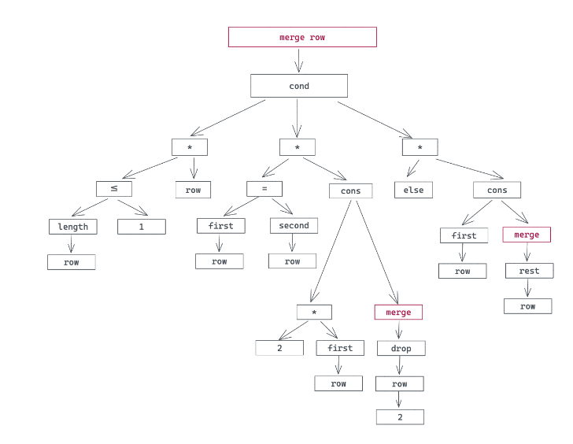

# 为什么我们需要宏编程的能力

我们今天来聊一聊如何使用宏, 如何构建宏之前, 我们首先要搞清楚为什么出现宏

## 为什么我们需要宏编程的能力

我们从设计非常独特的Lisp语言讲起, 在Lisp语言中有句话: 代码即数据, 数据即代码

如果你有一点Lisp相关的开发经验, 或者听说过任何一种Lisp方言, 你可能知道, 和普通编程语言不同的是, Lisp的语言直接把AST暴露给开发者, 开发者写的每一行代码, 其实就是在描述这段代码的AST

这个特点如果你没有太看明白, 我们结合一个实际的例子来理解, 这段代码是之前2048小游戏很火的时候, 用Lisp一种方言Racket撰写的2048实现片段

```lisp
; e.g. '(2 2 2 4 4 4 8) -> '(4 2 8 4 8)
(define (merge row)
  (cond [(<= (length row) 1) row]
        [(= (first row) (second row))
         (cons (* 2 (first row)) (merge (drop row 2)))]
        [else (cons (first row) (merge (rest row)))]))
```

这段代码的算法不太难理解, 给定一个row

- 如果它有一个值, 那么直接返回;
- 如果头的两个元素相等, 那么把第一个元素乘以2, 与头两个元素之后的所有元素merge的结果(此处有递归), 组成一个新的list返回
- 否则就把第一个元素和之后的所有元素merge的结果组成一个新的list返回(此处也是递归)

看看这段代码, 相信你只要花些耐心就可以写出对应的语法树:



你会发现, 撰写Lisp代码, 就相当于直接在描述语法树

从语法树的角度看, 编程语言其实也没有了不起的, 它操作和执行的数据结构不过就是这样一颗树, 就跟我们开发者平日里编程操作的各种数据结构一样

如果一门编程语言把它在解析的过程中产生的语法树暴露给开发者, 允许开发者对语法树进行检查和嫁接这样移花接木的处理, 那么这门语言就具备了元编程的能力

语言对这样的处理的限制越少, 元编程的能力就越强, 当然作为一枚硬币的反面, 语言就会过于灵活, 无法无天, 甚至反噬本身; 反之语言对开发者操作语法树的限制越多, 元编程的能力就越弱, 语言虽然丧失了灵活性, 但是更加规矩

Lisp语言, 作为元编程能力的天花板, 毫无保留的将语法树像数据结构一样暴露给开发者, 让开发者不光在编译器, 甚至是运行期, 都可以随意改变代码的行为, 这也是Lisp代码即数据, 数据即代码思路的直接体现

在黑客与画家这本书中PG引用了格林斯潘第十定律:

> 任何C或Fortran程序复杂到一定程度之后，都会包含一个临时开发的、只有一半功能的、不完全符合规格的、到处都是bug的、运行速度很慢的Common Lisp实现。

虽然这是Lisp用泵对其他语言的极尽嘲讽, 不过也说明了不争的事实: 一门这几的再精妙, 提供在丰富生态的语言, 在实际的使用场景中, 都不可避免的需要具备某种用代码生成代码的能力, 来减轻开发者不断撰写结构和模式相同的重复脚手架代码的需求

幸运的是, Rust这门语言提供了足够强大的宏编程能力, 让我们在需要的时候, 可以通过撰写宏来避免重复的脚手架代码, 同时Rust对宏的使用还有足够的限制, 在保证灵活性的前提下, 防止我们过渡使用让代码失控

那Rust到底提供了哪些宏呢?

